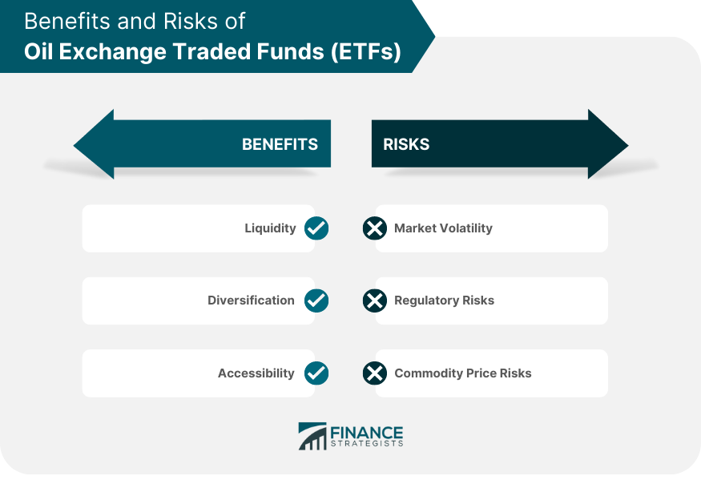

The world of investment has undergone significant transformation, driven in part by the emergence of digital trading platforms and pioneering financial instruments. A pivotal innovation in this landscape is the development of Oil ETFs (Exchange-Traded Funds), which have garnered considerable attention in the commodities market. These financial instruments provide investors with indirect exposure to the oil market, allowing engagement without the complexities involved in handling physical commodities. By aggregating oil-related assets such as stocks of oil companies or futures contracts, Oil ETFs enable a simplified approach to benefiting from oil market dynamics.

Concurrently, algorithmic trading has reshaped investment management by utilizing sophisticated computer algorithms to automate trading processes. This advancement has ushered in a new era of speed and precision in executing trades, creating a profound impact on investment strategies. The integration of algorithmic trading into the financial markets represents a groundbreaking shift, enhancing the efficiency and accuracy of trading decisions.



As we examine the intersection of Oil ETFs and algorithmic trading, it becomes evident that this convergence presents both challenges and opportunities for investors in an ever-evolving market environment. The growing interest in leveraging algorithmic strategies to optimize Oil ETF investments highlights a significant trend within the financial sector. However, navigating the complexities of these trends necessitates careful analysis and strategic planning to overcome the challenges posed by volatile markets and technological advancements.

In this article, we will be exploring these challenges and opportunities associated with investing in Oil ETFs, particularly as they relate to the dynamic landscape of algorithmic trading. Investors looking to capitalize on these advancements need to address a range of issues, from market volatility to the intricacies of algorithmic systems, to successfully position themselves within this complex market.

## Table of Contents

## Understanding Oil ETFs

An Oil ETF, or Exchange-Traded Fund, is a type of investment fund and exchange-traded product that primarily invests in stocks of companies operating within the oil industry or in oil futures contracts. These ETFs offer a convenient avenue for gaining exposure to the oil sector without the complexities inherent in handling physical commodities. By pooling assets related to the oil industry, such as stocks of oil companies or futures contracts, Oil ETFs provide investors with an aggregated investment product that reflects movements in the oil market.

One of the fundamental characteristics of Oil ETFs is their ability to track the price of [crude oil](/wiki/crude-oil) and sector indices. This feature simplifies access to the fluctuations of the oil market for both retail and institutional investors. Oil ETFs can track indices like the Bloomberg Brent Crude Subindex or the S&P Oil & Gas Exploration & Production Select Industry Index, offering a broad representation of market movements.

Investors often opt for Oil ETFs due to the [liquidity](/wiki/liquidity-risk-premium) they offer. ETFs trade on stock exchanges much like single stocks, allowing investors to buy and sell shares throughout the trading day at market prices. This liquidity enhances the flexibility of oil-related investments, contrasting with the more static nature of direct investments in futures contracts which can require holding positions until the contract's expiry.

Furthermore, Oil ETFs can provide cost benefits compared to directly investing in oil futures. Transaction fees associated with buying and selling oil futures can be higher due to brokerage fees and additional costs related to managing futures positions. In contrast, the transaction costs associated with Oil ETFs are generally lower, making them an attractive choice for investors aiming to maintain oil exposure with reduced expenses.

Overall, Oil ETFs offer a structured and efficient means for investors to gain exposure to the oil market, combining liquidity and cost-effectiveness with strategic access to oil price dynamics through various oil-related assets.

## The Intersection of Algorithmic Trading and ETFs

Algorithmic trading is revolutionizing investment strategies by leveraging computer algorithms to automate the trading process. This approach significantly enhances the speed and precision of executing trades. Within the context of Exchange-Traded Funds (ETFs), this innovation presents numerous benefits, given the inherent structure and liquidity of ETFs. These characteristics make ETFs highly suitable for the application of [algorithmic trading](/wiki/algorithmic-trading) strategies.

ETFs are structured to track indices and commodities, offering diversified exposure while allowing investors to trade on an exchange like a stock. The liquidity of ETFs ensures that they can be bought and sold with ease, which is critical for strategies that rely on the swift execution of trades. This liquidity, coupled with the transparent nature of [ETF](/wiki/etf-trading-strategies) pricing, offers a fertile ground for algorithmic trading.

Automated trading systems have the capability to analyze vast volumes of data, identify patterns, and execute trades with remarkable speed. These systems can process complex datasets, encompassing historical prices, trading volumes, and other indicators, to inform trading decisions. The immediate execution of trades based on algorithmic signals can provide a competitive advantage, especially in the volatile oil markets. For instance, an algorithm can detect a price anomaly in an oil ETF compared to its underlying commodities or related indices and execute trades before the market corrects these inefficiencies.

Algorithmic trading optimizes trade efficiency in ETFs by minimizing human error and deploying complex strategies that are responsive to current market conditions. Strategies could include high-frequency trading, which captures minute price changes over short timeframes, or market-neutral strategies, which aim to exploit relative price movements between assets. These strategies are deterministic and adhere strictly to pre-defined conditions. Consider a simple moving average crossover strategy, where an algorithm might buy an ETF when a short-term moving average surpasses a long-term moving average, signaling an upward trend.

The main advantage of using algorithms is their ability to continuously monitor the market and adjust positions as needed. Python, for instance, is popular in algorithmic trading due to its ease of use and the broad range of available libraries like NumPy for numerical computations and Pandas for data manipulation, which facilitate the development of trading algorithms.

Incorporating algorithmic trading with ETFs in the oil market, therefore, not only optimizes trading efficiencies but also mitigates risks associated with manual trading. It enables the execution of sophisticated strategies that adapt to dynamic market conditions, ultimately leading to improved investment outcomes.

## Investment Challenges of Oil ETFs

The oil market is known for its pronounced [volatility](/wiki/volatility-trading-strategies), shaped by a plethora of global factors. Geopolitical tensions often play a crucial role, with events such as conflicts and international sanctions directly impacting oil supply and consequently, prices. Investors must also contend with fluctuating supply-demand dynamics that can rapidly shift due to economic growth rates, technological advancements in energy efficiency, or regulatory changes that alter consumption patterns.

Environmental factors, such as natural disasters or policy shifts toward renewable energy, introduce additional layers of complexity. These multifaceted influences make it essential for investors in Oil ETFs to maintain a keen awareness of macroeconomic indicators. For example, GDP growth rates, inflation, and currency exchange rates can indirectly affect oil prices, warranting thorough analysis beyond the oil sector itself. Political climates must also be monitored, as changes in administration or energy policies can result in unforeseen price movements.

Market conditions specific to futures-based ETFs, like contango and backwardation, pose additional investment challenges. In contango situations, the future price of oil is higher than the spot price, potentially decreasing ETF yields due to the costs involved in rolling over contracts. Conversely, backwardation, where the futures price is lower than the spot price, might present an opportunity for higher returns, though it is often accompanied by different risks. Understanding these conditions is crucial for optimizing investment strategies in this space.

Algorithmic trading, while advantageous for executing trades efficiently, introduces its own set of challenges within the context of Oil ETFs. System malfunctions, whether due to hardware failures, network issues, or software bugs, can lead to significant financial losses. Furthermore, flash crashes, which are sudden market events triggered by automated trading, pose risks of rapid value declines, exacerbating market unpredictability. Successfully implementing algorithmic strategies requires advanced programming skills and a robust understanding of financial models. Coding proficiency, particularly in languages like Python, is essential for developing, testing, and deploying algorithms that can navigate the complex and fast-paced oil markets. Here is a simple example of setting up a basic risk management function in Python:

```python
def calculate_position_size(account_balance, risk_per_trade, stop_loss_distance):
    risk_amount = account_balance * risk_per_trade
    position_size = risk_amount / stop_loss_distance
    return position_size

# Example usage
account_balance = 100000  # Account balance in dollars
risk_per_trade = 0.02     # Risking 2% of the balance
stop_loss_distance = 5    # Stop loss distance in dollars

position_size = calculate_position_size(account_balance, risk_per_trade, stop_loss_distance)
print(f"Position size: {position_size} barrels")
```

In conclusion, while investing in Oil ETFs through algorithmic means provides opportunities for engaging with the oil market innovatively, it also demands a comprehensive understanding of the intricate challenges posed by market volatility, technical limitations, and the necessity for constant skill enhancement.

## Optimizing ETF Investments with Algorithmic Strategies

Algorithmic strategies have become pivotal in optimizing investments in Oil ETFs, particularly through the deployment of high-frequency trading ([HFT](/wiki/high-frequency-trading-strategies)). HFT strategies aim to capture minimal price variations that occur within extremely short timeframes, facilitating opportunities for potentially lucrative short-term trades. The rapid execution capabilities inherent in algorithmic systems allow traders to transact large volumes of Oil ETF shares at optimal moments based on microsecond changes in market conditions.

Advanced techniques, notably statistical [arbitrage](/wiki/arbitrage) and [machine learning](/wiki/machine-learning) models, serve a crucial role in enhancing trade profitability within this domain. Statistical arbitrage involves the use of quantitative methods to identify pricing inefficiencies between related oil derivatives or ETFs. By capitalizing on these discrepancies, traders can execute strategies that exploit mean-reverting tendencies in oil prices. Machine learning models, on the other hand, provide sophisticated tools for predicting price movements by analyzing extensive datasets, identifying patterns that may not be discernible through traditional analysis. Such models can be trained using historical price data, [volume](/wiki/volume-trading-strategy), and various macroeconomic indicators, enabling improved decision-making capabilities.

Python, a versatile programming language, offers a robust suite of tools for developing custom trading algorithms specifically for Oil ETFs. Libraries such as NumPy and pandas facilitate data manipulation and analysis, while machine learning frameworks like TensorFlow or scikit-learn enable the creation of predictive models. A Python script to execute a basic algorithmic strategy might look like the following: 

```python
import numpy as np
import pandas as pd
from sklearn.ensemble import RandomForestRegressor
from sklearn.model_selection import train_test_split

# Load historical ETF data
data = pd.read_csv('oil_etf_data.csv')
X = data[['feature1', 'feature2', 'feature3']]  # Define predictive features
y = data['price']

# Split the data
X_train, X_test, y_train, y_test = train_test_split(X, y, test_size=0.2, random_state=42)

# Initialize and train the model
model = RandomForestRegressor(n_estimators=100, random_state=42)
model.fit(X_train, y_train)

# Predict and derive trading signals
predictions = model.predict(X_test)
trading_signals = np.where(predictions > y_test.shift(1), 'Buy', 'Sell')
```

Such algorithms are designed to minimize the impact of emotional decision-making, offering a more systematic approach to trading. Importantly, they can be programmed to adhere to predefined criteria, evaluating trading decisions based on pure data-driven insights.

The continuous refinement and adaptation of these algorithms are critically important for achieving sustained investment success in the fluctuating oil markets. This involves regularly updating models with the latest market data, recalibrating parameters, and stress-testing strategies under various market scenarios. By doing so, investors and traders can maintain a competitive edge, ensuring that their investments in Oil ETFs remain aligned with ever-evolving market dynamics and technological advancements.

## Future Trends in ETF and Algo Trading Integration

The integration of [artificial intelligence](/wiki/ai-artificial-intelligence) (AI) and machine learning (ML) in algorithmic trading is significantly enhancing ETF investment strategies, allowing for more data-driven and precise decision-making processes. These technologies enable algorithms to analyze large datasets quickly, recognize complex patterns, and make informed predictions about market movements. For instance, machine learning models can employ techniques such as supervised learning to optimize prediction accuracy by training on historical data and refining their decision-making processes over time.

Personalization of trading algorithms represents a burgeoning trend, offering tailored investment approaches aligned with individual investor profiles. This customization can be achieved by incorporating investor-specific data, such as risk tolerance, investment goals, and time horizons, into trading algorithms. Considerations such as portfolio diversification and risk management are encoded within the algorithm’s logic, ensuring that the trading strategy aligns with the investor's objectives. The use of Python, with libraries such as pandas and scikit-learn, facilitates the development of these personalized algorithms.

```python
import pandas as pd
from sklearn.ensemble import RandomForestRegressor

# Sample data
data = pd.DataFrame({
    'feature1': [10, 20, 30],
    'feature2': [1.1, 1.3, 1.2],
    'target': [4.2, 5.1, 5.8]
})

# Algorithm to predict investment trends
X = data[['feature1', 'feature2']]
y = data['target']

model = RandomForestRegressor(n_estimators=100, random_state=42)
model.fit(X, y)

# Predicting future trends
future_data = pd.DataFrame({'feature1': [15], 'feature2': [1.25]})
prediction = model.predict(future_data)
print("Predicted future trend:", prediction)
```

The evolving regulatory landscape is another critical [factor](/wiki/factor-investing) shaping the future of ETF and algo trading integration. Regulations are increasingly aimed at ensuring transparency, improving market integrity, and protecting investors. These measures impact the manner in which algorithmic trades are executed, necessitating compliance and adaptability from investors and trading firms. For example, regulations may require more detailed reporting of algorithmic trading activities and impose restrictions on high-frequency trading practices to prevent market manipulation and ensure a fair trading environment.

Investors who keep abreast of technological advancements and regulatory updates will be strategically positioned to leverage future opportunities in Oil ETF trading. Staying informed allows investors to adapt to new trading technologies and comply with regulatory requirements, thereby reducing risk and enhancing potential returns. This proactive approach ensures that investors can effectively capitalize on the integration of AI and machine learning, positioning themselves for success in the dynamic landscape of Oil ETF trading.

## Conclusion

Oil ETFs offer a democratized pathway for investors to access the lucrative commodities sector, effectively leveraging the advancements in algorithmic trading. This intersection facilitates a more efficient and accessible approach to investing in oil markets but requires vigilant navigation of inherent challenges. The innovations provided by Oil ETFs and algorithmic trading deliver substantial opportunities, driving efficiency, precision, and informed decision-making in investment strategies.

Yet, these opportunities come with their own set of challenges that necessitate meticulous strategic planning. Investors must acknowledge the intricacies of algorithmic systems, such as the potential for system malfunctions and the demand for technological expertise. Moreover, the volatility of the oil market, driven by global geopolitical and economic dynamics, further complicates investment decisions.

For successful engagement with Oil ETFs, investors should embrace a mindset of continuous learning and adaptation. Understanding the intricacies of both ETFs and algorithmic trading is paramount. Investors can better align their strategies with market dynamics through persistent education and enhancement of their trading algorithms.

Staying informed about technological advancements and regulatory shifts will empower investors to efficiently exploit future opportunities while mitigating risks. By deeply comprehending the multifaceted nature of the ETF and algorithmic trading environments, investors position themselves advantageously to navigate this complex market landscape, maximizing potential returns while minimizing exposure to unforeseen market disruptions.

## References & Further Reading

[1]: Bergstra, J., Bardenet, R., Bengio, Y., & Kégl, B. (2011). ["Algorithms for Hyper-Parameter Optimization"](https://dl.acm.org/doi/10.5555/2986459.2986743). Advances in Neural Information Processing Systems 24.

[2]: ["Advances in Financial Machine Learning"](https://www.amazon.com/Advances-Financial-Machine-Learning-Marcos/dp/1119482089) by Marcos Lopez de Prado

[3]: ["Evidence-Based Technical Analysis: Applying the Scientific Method and Statistical Inference to Trading Signals"](https://www.amazon.com/Evidence-Based-Technical-Analysis-Scientific-Statistical/dp/0470008741) by David Aronson

[4]: ["Machine Learning for Algorithmic Trading"](https://github.com/stefan-jansen/machine-learning-for-trading) by Stefan Jansen

[5]: ["Quantitative Trading: How to Build Your Own Algorithmic Trading Business"](https://www.amazon.com/Quantitative-Trading-Build-Algorithmic-Business/dp/1119800064) by Ernest P. Chan