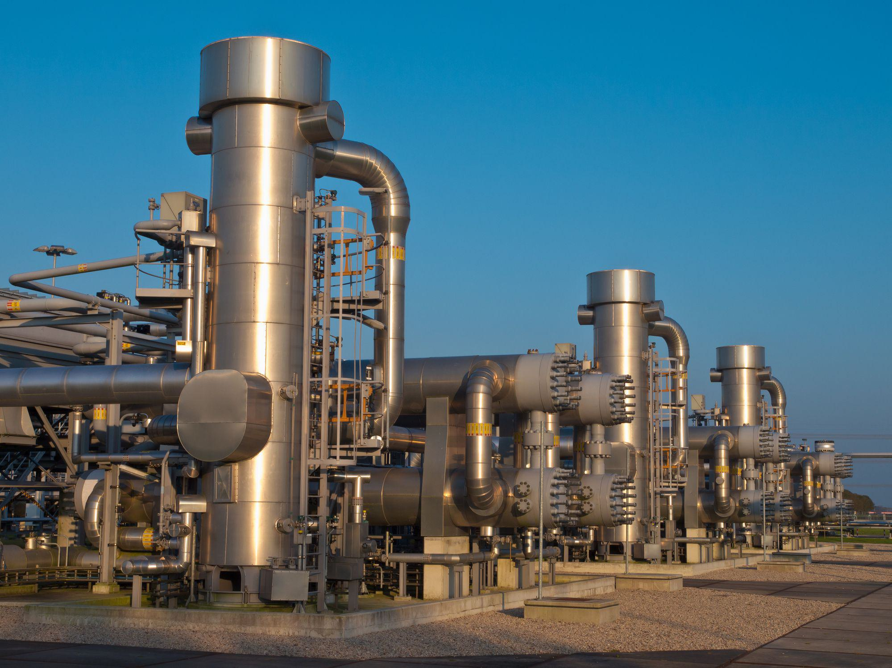

This article explores the intersection of oil field energy, petroleum extraction, and algorithmic trading, examining their roles in shaping the modern energy economy. Oil fields serve as vital sources of natural gas and crude oil, underpinning the global energy supply and influencing economic and geopolitical landscapes. Developments in technology have revolutionized both the extraction processes and the financial markets linked to energy trading, making this intersection increasingly relevant. 

The extraction of oil and gas from these fields is foundational to global energy infrastructure, where methods have evolved from traditional drilling to advanced technologies such as hydraulic fracturing and horizontal drilling. These innovations not only enhance extraction efficiency but also pose challenges in terms of environmental impact and resource management.



Simultaneously, the financial trading environment for these energy commodities has transformed with the advent of algorithmic trading. This approach leverages computer algorithms for executing trades, capitalizing on the high volatility and profit potential in energy markets. Rapid advancements in data analytics and machine learning bolster these trading strategies, allowing for the quick processing of vast amounts of market data to make informed decisions.

This convergence of traditional energy resource management with modern trading techniques highlights the dynamic nature of the sector. By analyzing the current trends, impacts, and future predictions, this article aims to provide a comprehensive understanding of how these domains interact, paving the way for continued innovation and strategic evolution in energy markets. As regulatory considerations and technological advancements continue to shape this intersection, maintaining a balance between effective resource management and cutting-edge trading strategies will be crucial for stakeholders in the energy economy.

## Table of Contents

## Understanding Oil Fields and Petroleum Extraction

An oil field is an area of land or seabed rich in petroleum deposits, from which natural gas and crude oil are extracted. These regions are pivotal for the global energy supply, contributing significantly to national and international economies. The geopolitical importance of oil fields cannot be underestimated, as control over these resources often translates to significant power on the global stage. Countries with abundant oil reserves, such as those in the Middle East, Russia, and North America, wield substantial influence over global energy markets. This strategic importance is reflected in the ongoing international negotiations and sometimes conflicts over access and ownership of these resources.

Extraction methods from oil fields have evolved significantly over time. Traditional drilling techniques involve the vertical penetration of the earth's surface to reach oil reserves. While this method has been the staple approach for many years, technological advancements have given rise to more sophisticated techniques such as horizontal drilling and hydraulic fracturing. Horizontal drilling allows for more extensive access to oil deposits by drilling parallel to the oil layers, significantly increasing the amount of oil that can be extracted from a single site. Hydraulic fracturing, commonly known as fracking, involves injecting high-pressure fluid into rock formations to create fractures, allowing oil and gas to flow more freely to the wellbore.

The establishment of productive and economically viable oil fields comes with several challenges and advancements. One major challenge is the geological complexity of oil reserves, which can make extraction difficult and costly. Additionally, environmental concerns regarding the impact of drilling and fracking, such as potential groundwater contamination and induced seismicity, are significant issues that the industry must address. Furthermore, with the depletion of easily accessible oil reserves, companies are compelled to explore more remote and technically challenging areas, such as ultra-deepwater sites and the Arctic.

Advancements in technology have played a crucial role in overcoming these challenges, making oil extraction more efficient and safer. Innovations in 3D seismic imaging, for example, allow for more precise mapping of underground oil reserves, reducing the risks associated with drilling. Enhanced oil recovery (EOR) techniques, such as gas injection and thermal recovery, are also employed to maximize extraction from existing fields.

The dynamics of oil field development and petroleum extraction continue to evolve, driven by technological innovation and economic imperatives. The interplay between energy demands, environmental considerations, and geopolitical factors will shape the future landscape of this critical industry.

## Algorithmic Trading in the Energy Sector

Algorithmic trading encompasses the use of computer algorithms to facilitate trading in financial markets, allowing for rapid and precise execution of transactions. This technology is particularly effective in the energy sector, where it capitalizes on the inherent [volatility](/wiki/volatility-trading-strategies) of energy commodities such as [crude oil](/wiki/crude-oil) and natural gas.

The application of [algorithmic trading](/wiki/algorithmic-trading) in energy markets is characterized by several key strategies, each designed to exploit different market phenomena:

1. **Statistical Arbitrage**: This strategy involves analyzing statistical relationships between various energy commodity prices to identify and capitalize on price discrepancies. By employing statistical models, traders can predict the likelihood of price convergence or divergence and make trades accordingly. For instance, if the price of crude oil exhibits a strong correlation with natural gas prices, an algorithm might execute trades based on deviations from this expected statistical norm.

2. **Momentum Trading**: Algorithms are programmed to identify and act on trends in commodity prices. By analyzing historical price data, these systems can gauge the market's momentum, buying assets expected to rise in value and selling those anticipated to decrease. This approach assumes that assets which have performed well will continue to do so, at least in the short term.

3. **Machine Learning Models**: Advancements in machine learning have enabled the development of complex trading algorithms that improve over time. These models can analyze vast datasets to uncover patterns and correlations that are not immediately apparent through traditional analysis. For example, machine learning can be used to forecast oil price movements by considering numerous factors such as geopolitical events, supply chain disruptions, and market sentiment.

The integration of data analytics and real-time market processing plays a crucial role in enhancing trading decisions. Algorithms leverage high-frequency data feeds and advanced analytics to make informed decisions, often in fractions of a second. This capability allows traders to respond swiftly to market changes, adjusting positions to optimize profits or mitigate losses.

Consider the following Python code snippet that illustrates a simple algorithm for [momentum](/wiki/momentum) trading:

```python
import numpy as np
import pandas as pd

# Fetching historical price data for a hypothetical energy commodity
def fetch_price_data():
    # In practice, this function would retrieve data from a financial data provider
    dates = pd.date_range(start='2023-01-01', end='2023-10-01', freq='D')
    prices = np.random.lognormal(mean=0, sigma=0.01, size=len(dates)) * 100
    return pd.Series(data=prices, index=dates, name='Price')

# Calculate momentum
def calculate_momentum(prices, window=14):
    return prices.pct_change(periods=window)

# Generate trade signals based on momentum
def generate_trade_signals(momentum):
    signals = pd.Series(index=momentum.index)
    signals[momentum > 0] = 'Buy'
    signals[momentum <= 0] = 'Sell'
    return signals

price_data = fetch_price_data()
momentum = calculate_momentum(price_data)
trade_signals = generate_trade_signals(momentum)
```

This example illustrates the foundational components of an algorithmic trading system: data retrieval, analysis, and action based on predefined criteria.

Overall, algorithmic trading represents a paradigm shift in how energy commodities are traded, emphasizing speed, accuracy, and data-driven decision-making. Its ability to process massive datasets and execute transactions in real-time makes it an indispensable tool in the energy sector's dynamic markets.

## Impacts and Trends of Algo Trading in Energy Markets

Algorithmic trading has transformed energy markets, allowing for rapid and precise decision-making processes, which holds particular importance due to the inherent volatility of energy commodities like oil and gas. The deployment of computer algorithms to execute trades bridges the gap between traditional trading practices and modern technology, offering numerous benefits and challenges.

**Advantages of Algorithmic Systems**

One primary advantage of algorithmic trading is its capacity to manage risks and optimize trading strategies. By utilizing vast datasets, algorithms can identify patterns and predict price movements, enabling traders to preemptively adjust their strategies to capitalize on potential market shifts. Algorithms excel at assessing risk-return scenarios and can dynamically allocate assets to minimize exposure and maximize profitability. A common strategy used is statistical [arbitrage](/wiki/arbitrage), which exploits pricing inefficiencies across different markets or financial instruments to secure risk-free profits. Algorithms can process this information in real-time, adjusting positions faster than any human trader could.

Additionally, the use of advanced techniques such as [machine learning](/wiki/machine-learning) and [artificial intelligence](/wiki/ai-artificial-intelligence) allows for continuous learning and improvement of trading models. These models can evaluate numerous factors simultaneously, integrating historical data with real-time market inputs to refine predictions and adjust trading strategies accordingly. 

**Challenges**

However, algorithmic trading in energy markets is not devoid of challenges. One notable issue is the risk of market manipulation. Algorithms, if improperly designed, may contribute to phenomena like "flash crashes", where misguided trades executed at lightning speed can cause significant market disruptions. The complexity of trading algorithms also raises concerns about transparency and accountability, as tracing decisions back to specific inputs or triggers can be ambiguous.

Regulatory concerns accompany these challenges. Increasing scrutiny is placed on algorithmic trading practices to ensure that they comply with existing market regulations and do not foster inequality or manipulation. Regulations such as the Markets in Financial Instruments Directive II (MiFID II) provide frameworks for supervising trading activities, aiming to enhance market transparency and reduce systemic risk. MiFID II, implemented by the European Securities and Markets Authority (ESMA), mandates detailed reporting and monitoring of trading activities, compelling firms to maintain a high standard of conduct.

**Regulatory Oversight**

Regulatory bodies play a pivotal role in overseeing algorithmic trading activities to prevent abuses and ensure fair market operations. They are tasked with enforcing compliance, standardizing practices, and maintaining the integrity of financial markets through detailed guidelines, regular audits, and sanctions where necessary. As algorithmic trading continues to evolve, so too must regulatory approaches, adapting to new technologies and trading strategies while safeguarding market stability.

In conclusion, algorithmic trading has dramatically impacted energy markets by enhancing efficiency and precision in trade execution. Yet, it poses challenges, primarily around regulatory compliance and the risks inherent to automated decision-making processes. As technology advances, balancing innovation with oversight will remain crucial to harness the full potential of algorithmic trading in the energy sector.

## Conclusion

The convergence of traditional oil reserve management and modern algorithmic trading is fundamentally reshaping the energy sector. Oil fields, long established as significant assets in global energy supply, are now interacting in novel ways with advanced financial trading technologies. As both fields evolve, it is crucial for stakeholders to adapt to technological advancements and adhere to regulatory frameworks to maintain a competitive edge.

The integration of artificial intelligence (AI) and machine learning (ML) into trading systems offers significant enhancements in trading efficiency. These technologies facilitate the processing of vast data volumes, enabling real-time analysis and decision-making that can lead to optimized trading strategies. AI and ML models, for example, can forecast market trends based on historical data and current economic indicators, thereby providing traders with insights that were previously inaccessible.

However, as technology increasingly influences the energy markets, a balance must be struck between resource management and innovative trading techniques. The anticipated future trends suggest a continued interdependence between the physical realities of oil reserve management and the virtual strategies of algorithmic trading. This balancing act will require ongoing innovation in both sectors to ensure resources are managed sustainably while maximizing economic gains through advanced trading methodologies.

In conclusion, the energy sector stands at the cusp of a transformative era where the intersection of traditional resource management and cutting-edge trading technologies is poised to redefine industry dynamics. This evolution underscores the importance of harnessing technological advancements responsibly and within the bounds of regulatory requirements. Looking ahead, the sector will need to embrace these changes to thrive in an increasingly data-driven and technologically sophisticated landscape.

## References & Further Reading

Geman, H. (2005). _Commodities and Commodity Derivatives_. This book offers insights into the trading of commodities and financial derivatives. It covers pricing strategies, risk management, and the unique aspects of commodity trading, providing a foundational understanding that is crucial for participants in energy markets. It serves as a valuable resource for understanding how the complexities of commodity markets intersect with financial trading.

Lopez de Prado, M. (2018). _Advances in Financial Machine Learning_. This work presents cutting-edge techniques in machine learning applied to finance, influencing modern algorithmic trading strategies. The application of these machine learning models in the energy sector helps in optimizing trading strategies by analyzing large sets of data to identify trends and patterns that human traders might overlook.

The European Securities and Markets Authority (ESMA) offers guidelines and regulatory frameworks essential for maintaining market integrity. The introduction of MiFID II has significantly impacted algorithmic trading by enforcing stricter transparency and reporting standards, thereby reducing risks associated with high-frequency trading and market manipulation.

International Energy Agency (IEA). _World Energy Outlook 2021_. This publication provides comprehensive analyses of global energy market trends, including oil and gas forecasts. It highlights the significant geopolitical and economic roles of oil fields and projects future energy dynamics. Understanding these trends is crucial for stakeholders aiming to align their trading and resource management strategies with evolving global energy policies.