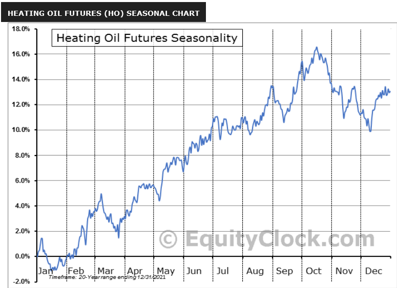

Commodity markets, where commodities such as oil, gold, and agricultural products are bought and sold, play a pivotal role in the global economy by influencing the prices of goods and services worldwide. Among these, oil stands out as a significant commodity, serving as a crucial energy source and raw material for various industries. The oil market's scale and impact make it a primary focus in commodity trading, particularly in the futures market.

Oil futures are contracts for the purchase or sale of oil at a predetermined price on a specific future date. These instruments are critical for price discovery and risk management, enabling producers and consumers to hedge against price volatility. The oil futures market provides a platform for hedgers—typically companies looking to stabilize operational costs—and speculators who seek to profit from price fluctuations.



In recent years, the rise of algorithmic trading has transformed the landscape of oil futures trading. Algorithmic trading involves the use of computer programs to execute trades based on pre-set criteria at speeds and volumes human traders cannot match. This technological advancement has significantly influenced oil futures trading by increasing the speed, accuracy, and efficiency of transactions. Algorithms can process large volumes of data quickly, identifying patterns and executing trades in milliseconds, thus enhancing market liquidity and reducing transaction costs.

The integration of algorithmic trading in commodity markets underscores a shift towards more technologically driven practices. Its impact on oil futures trading is profound, as it influences pricing, trading volumes, and market volatility. As algorithms become more sophisticated, incorporating artificial intelligence and machine learning, their ability to predict market movements and adapt to changes continues to evolve.

Understanding the significance of oil in the global economy and the role of algorithmic trading presents a comprehensive view of current commodity markets. Algorithmic trading's increasing prominence marks a transformative period in trading practices, reshaping how futures markets operate and challenging traditional trading methodologies.

## Table of Contents

## Understanding Oil Futures

Oil futures are standardized contracts traded on commodity exchanges that obligate the buyer to purchase, or the seller to sell, a specific quantity of oil at a predetermined price on a future date. These contracts serve as essential instruments in the global commodities market, allowing participants to hedge against risks and speculate on price movements. 

### Mechanics of Oil Futures Contracts

Oil futures contracts are characterized by their standardized features, which include the quantity of oil per contract (typically 1,000 barrels), the grade and quality specifications, the delivery location, and critical terms like settlement dates and pricing mechanisms. The settlement date, also referred to as the expiry date, is when the contract is either settled through physical delivery of the commodity or via cash settlement, depending on the terms and the trading platform in use.

The pricing of oil futures is influenced by numerous factors, such as current supply and demand dynamics, geopolitical developments, and macroeconomic indicators. The futures price reflects the market's expectation of the asset's value at the contract's expiration, often incorporating interest rates, storage costs (known as the cost of [carry](/wiki/carry-trading)), and convenience yields. 

Mathematically, the futures price $F$ can be expressed in the simple cost of carry model as:
$$
F = S \times e^{(r + c - y)t}
$$
where:
- $F$ is the futures price,
- $S$ is the spot price of oil,
- $r$ is the risk-free interest rate,
- $c$ represents the storage costs,
- $y$ is the convenience yield, and
- $t$ is the time to maturity of the futures contract.

### The Role of Speculators and Hedgers

Participants in the oil futures market include both speculators and hedgers. Speculators aim to profit from fluctuations in oil prices. They engage in buying or selling futures contracts based on their forecast of future price movements, providing [liquidity](/wiki/liquidity-risk-premium) and increasing market efficiency through their activities.

Hedgers, on the other hand, use futures contracts to protect against adverse price movements. They are typically companies or entities directly involved in the production, distribution, or consumption of oil. For instance, an airline might purchase oil futures to lock in fuel costs, thus mitigating the risk of rising prices.

Both speculators and hedgers play vital roles in maintaining the balance and flow of the oil futures market. Speculators enhance market liquidity and price discovery, while hedgers contribute to stable economic planning for industries with exposure to oil prices. This intricate interplay helps smooth out price volatilities and ensures continuity in global energy supply and investment strategies.

## The Emergence of Algorithmic Trading

Technological advancements have significantly contributed to the rise of [algorithmic trading](/wiki/algorithmic-trading) in commodity markets, transforming the landscape of trading, particularly in oil futures. At the heart of this transformation is the development of high-speed computer systems and sophisticated algorithms that enable traders to execute orders at unprecedented speeds and volumes. The increased computational power allows for the processing of large datasets, facilitating complex analyses that are beyond human capabilities.

Algorithmic trading offers numerous advantages, predominantly in speed and efficiency. The ability to execute trades in milliseconds provides an edge in volatile markets where price fluctuations can occur rapidly. This efficiency reduces the cost of trading and minimizes the impact of human error. Algorithms can continuously scan markets, monitor prices, and execute trades based on pre-set criteria without fatigue or emotion, ensuring high-frequency trading becomes a realistic approach.

The evolution of algorithmic strategies has been substantial. Initially, algorithms were designed for simple tasks such as automated order execution or to reduce market impact using strategies like time-weighted average price (TWAP) or [volume](/wiki/volume-trading-strategy)-weighted average price (VWAP). As technology evolved, so did the complexity of these strategies. Advanced machine-learning algorithms have been integrated, allowing for predictive analytics and adaptive responses to market conditions.

Machine learning, a subset of [artificial intelligence](/wiki/ai-artificial-intelligence), enables the development of models that can learn from data and improve over time. These models can perform tasks such as statistical [arbitrage](/wiki/arbitrage), where algorithms identify and exploit price inefficiencies between correlated assets. Python, being a popular programming language in finance due to its simplicity and powerful libraries, is often used for developing these algorithms.

For example, a basic machine-learning model for trend prediction might involve:

```python
import numpy as np
from sklearn.linear_model import LinearRegression

# Dummy data representing past oil prices
prices = np.array([60, 61, 62, 63, 64, 65]).reshape(-1, 1)
days = np.array([1, 2, 3, 4, 5, 6]).reshape(-1, 1)

# Create a linear regression model
model = LinearRegression().fit(days, prices)

# Predict future prices
future_day = np.array([[7]])
predicted_price = model.predict(future_day)

print("Predicted Price for Day 7:", predicted_price)
```

In this example, the linear regression model is a simple approach to predicting price trends. More sophisticated models, such as those based on neural networks or support vector machines, are capable of handling complex nonlinear relationships in data, offering deeper insights and predictions.

Algorithmic trading's evolution from basic execution to sophisticated learning algorithms marks a significant shift. These advancements not only enhance trading efficiencies but also influence market dynamics, as algorithms interact in increasingly complex environments. The integration of advanced technologies continues to redefine the commodity trading landscape, particularly in oil futures, pushing the boundaries of what is achievable in financial markets.

## Key Strategies in Algorithmic Trading for Oil Futures

Algorithmic trading has revolutionized oil futures markets by employing precise and rapid strategies that have transformed traditional trading paradigms. Among the strategies employed, [statistical arbitrage](/wiki/statistical-arbitrage) and [momentum](/wiki/momentum) trading are widely used by traders to capitalize on market inefficiencies and trends.

Statistical arbitrage in oil futures involves exploiting price discrepancies between related instruments, often employing sophisticated mathematical models and statistical techniques. This strategy typically requires rigorous [backtesting](/wiki/backtesting) and relies on mean reversion principles; traders anticipate that the price discrepancy will correct over time, allowing them to profit from the convergence of prices. For instance, a common form of this strategy involves [pair trading](/wiki/pair-trading) where complementary futures contracts are traded simultaneously when a statistical anomaly is detected. The effectiveness of statistical arbitrage hinges on the ability to analyze vast datasets and execute trades quickly, making algorithmic trading platforms ideal for this purpose.

Momentum trading, on the other hand, leverages the continuation of existing market trends. Algorithmic systems are utilized to identify and capitalize on upward or downward trends by analyzing factors such as price movements and trading volume. By utilizing complex algorithms that can scan market data in real-time, traders are able to enter or [exit](/wiki/exit-strategy) positions before these trends reverse. A simple momentum trading strategy could be coded in Python as follows:

```python
import numpy as np

def moving_average(prices, window_size):
    return np.convolve(prices, np.ones(window_size)/window_size, mode='valid')

def momentum_strategy(prices, short_window, long_window):
    short_avg = moving_average(prices, short_window)
    long_avg = moving_average(prices, long_window)
    signals = np.where(short_avg > long_avg, 1, -1)
    return signals
```

Market-making strategies are another vital component in algorithmic trading, providing liquidity to oil futures markets. Firms deploy algorithms to maintain optimal bid-ask spreads by placing both buy and sell orders around the current market price. This practice not only facilitates smoother market operations but also enables market makers to earn profits from the spread over a large volume of trades. The role of market makers becomes increasingly critical during periods of high [volatility](/wiki/volatility-trading-strategies), as their presence ensures continuous trading and mitigates sharp price movements.

Emerging strategies have branched into sentiment analysis, which assesses market sentiment from social media, news articles, and other text sources using AI and [machine learning](/wiki/machine-learning). Sentiment analysis algorithms interpret qualitative data to predict market movements, exploiting the psychological aspects of trading. These strategies utilize natural language processing (NLP) to weigh the tone and context of vast amounts of information, offering traders additional insights besides fundamental or technical analysis. With advances in AI, these algorithms are increasingly adept at recognizing patterns and generating actionable insights efficiently, adding another layer of sophistication to trading strategies.

In summary, algorithmic strategies in oil futures trading have evolved significantly, leveraging statistical models, trend analyses, liquidity provision, and sentiment extraction from diverse data sources. These strategies illustrate the transformative impact of technology on trading, enhancing the accuracy and efficiency of trades in a complex market.

## Challenges and Regulatory Considerations

Algorithmic trading in the oil futures market presents a series of challenges that can affect traders, market stability, and regulatory frameworks. One of the primary challenges lies in the market's liquidity risk. Algorithmic trading can, at times, lead to shallow liquidity because algorithms can withdraw from the market faster than human traders, leading to sudden price swings. This swift withdrawal can be attributed to high-frequency trading algorithms that react to market signals at speeds beyond human capability, potentially causing flash crashes and increased volatility. 

Another significant challenge is the reliance on complex mathematical models and algorithms that may not fully account for unanticipated geopolitical events or supply and demand shocks. Oil futures markets are highly sensitive to global news, political instability, and changes in production quotas by major oil-producing countries. Algorithms might not be able to adjust quickly or adequately to such unpredictable events, leading to erroneous trades and potential financial losses.

Technical failures also pose a risk to algorithmic traders. These failures can come from glitches in trading platforms, network outages, or coding errors within the algorithms themselves. As trading algorithms become more complex, ensuring their robustness and reliability becomes increasingly difficult, requiring rigorous testing and continuous monitoring.

Regulatory bodies, such as the Commodity Futures Trading Commission (CFTC) in the United States and the Financial Conduct Authority (FCA) in the United Kingdom, play crucial roles in overseeing the algorithmic trading landscape. These organizations are tasked with ensuring that algorithmic trading practices do not undermine market integrity. The CFTC, for instance, has implemented rules aimed at reducing systemic risks and enhancing transparency within the futures markets. Initiatives like the Market Risk Advisory Committee (MRAC) seek to provide recommendations and foster dialogue between market participants and regulators to address emerging risks.

Similarly, the FCA has developed frameworks designed to monitor high-frequency trading and its effects on market fairness and stability. The FCA emphasizes the need for rigorous testing and validation of algorithms, ensuring that firms have robust risk management protocols.

Maintaining a regulatory balance is paramount. Regulations must encourage technological innovation by allowing room for advancements in algorithmic strategies while also ensuring that these innovations do not compromise market stability. This balance necessitates a continuous dialogue between regulators, traders, and technology developers. It also requires the implementation of adaptive regulatory measures capable of evolving alongside market innovations.

In conclusion, while algorithmic trading in oil futures has revolutionized market operations by enhancing speed and efficiency, it also introduces significant challenges and risks. Addressing these challenges requires comprehensive regulatory oversight that fosters innovation and ensures the integrity of the markets. Effective regulations and careful monitoring are essential to mitigate risks associated with algorithmic trading, promoting a stable and fair trading environment.

## The Future of Algorithmic Trading in Oil Futures

The future of algorithmic trading in oil futures is poised for significant transformation, driven by advancements in artificial intelligence (AI) and machine learning (ML) technologies. These technologies are expected to contribute to the evolution of more sophisticated trading systems, enabling faster and more efficient analysis of vast datasets to identify trading opportunities. AI-driven trading systems can enhance predictive accuracy by leveraging historical data, real-time market fluctuations, and [alternative data](/wiki/best-alternative-data) sources such as social media sentiment and geopolitical events.

The integration of AI in algorithmic trading will likely lead to the development of more adaptive and autonomous trading models, akin to [reinforcement learning](/wiki/reinforcement-learning) systems that improve decision-making over time through trial and error. These models can dynamically adjust strategies in response to changing market conditions, potentially increasing profitability and reducing risk.

Python's flexibility and extensive ML libraries, like TensorFlow and PyTorch, facilitate the development of these AI-driven algorithms. Here's a basic example of how Python can be used to implement a machine learning model for predicting oil futures prices:

```python
import pandas as pd
from sklearn.model_selection import train_test_split
from sklearn.ensemble import RandomForestRegressor
from sklearn.metrics import mean_squared_error

# Load your dataset
data = pd.read_csv('oil_futures_data.csv')

# Preprocess data: Assume 'price' is the target, and we're using a selection of features
features = data.drop(columns=['price'])
target = data['price']

# Split the data
X_train, X_test, y_train, y_test = train_test_split(features, target, test_size=0.2, random_state=42)

# Initialize and train the model
model = RandomForestRegressor(n_estimators=100, random_state=42)
model.fit(X_train, y_train)

# Predict and evaluate
predictions = model.predict(X_test)
mse = mean_squared_error(y_test, predictions)
print(f'Mean Squared Error: {mse}')
```

However, these technological advancements will have implications for market dynamics and investor behavior. Enhanced speed and precision in transactions could result in reduced market volatility and narrower bid-ask spreads. Conversely, the complexity and opacity of AI-driven systems may lead to unforeseen systemic risks and flash crashes, challenging market stability.

Regulatory bodies, such as the Commodity Futures Trading Commission (CFTC) in the U.S. and the Financial Conduct Authority (FCA) in the U.K., will increasingly focus on balancing innovation with market integrity. As algorithmic strategies evolve, these regulators may introduce new frameworks to monitor AI's impact on trading activities, ensuring transparent and fair markets.

The future landscape of algorithmic trading will be shaped by regulations that address issues like algorithm accountability and the ethical use of AI. Policies may require firms to implement robust risk management protocols and provide transparency in their algorithms' decision-making processes.

In conclusion, the trajectory of algorithmic trading in oil futures suggests a shift toward more AI-centric approaches, promising enhanced efficiency and efficacy. Nonetheless, the onus on regulatory bodies to adapt and enforce coherent policies will be critical in maintaining market integrity and investor confidence. Industry participants must stay informed and flexible to navigate these evolving dynamics effectively.

## Conclusion

In conclusion, the landscape of oil futures trading has undergone significant transformation with the advent and integration of algorithmic trading. This development marks a pivotal shift from traditional trading practices towards a technologically driven approach that emphasizes speed, efficiency, and precision. Algorithmic trading, harnessing advanced computing technologies and sophisticated algorithms, has considerably influenced how oil futures are bought and sold, enabling traders to execute complex strategies with remarkable speed.

One of the primary transformative roles of algorithmic trading lies in its ability to process vast amounts of data rapidly, thereby facilitating informed decision-making. This has empowered traders to capitalize on even the smallest market movements, optimizing their trading strategies for maximum gain. The use of algorithmic strategies, such as statistical arbitrage, momentum trading, and market-making, has not only enhanced liquidity but also contributed to greater transparency and reduced transaction costs in the oil futures market.

The ongoing evolution of algorithmic trading, particularly with the integration of artificial intelligence and machine learning, presents both opportunities and challenges. As these technologies progress, they offer promising prospects for more sophisticated and adaptive trading strategies. However, they also necessitate traders and investors to keep abreast of technological advancements and regulatory changes to maintain an edge and ensure compliance in a dynamic market environment.

For traders and investors in the oil futures market, continuous education and adaptation to emergent technologies and shifting market conditions are indispensable. As algorithmic trading continues to evolve, its impact will likely extend further, reshaping market dynamics and influencing investor behavior. Embracing the opportunities and addressing the challenges presented by these technologies will be crucial for sustained success in the oil futures market.

## References & Further Reading

[1]: Bergstra, J., Bardenet, R., Bengio, Y., & Kégl, B. (2011). ["Algorithms for Hyper-Parameter Optimization."](https://dl.acm.org/doi/10.5555/2986459.2986743) Advances in Neural Information Processing Systems 24.

[2]: ["Advances in Financial Machine Learning"](https://www.amazon.com/Advances-Financial-Machine-Learning-Marcos/dp/1119482089) by Marcos Lopez de Prado

[3]: ["Evidence-Based Technical Analysis: Applying the Scientific Method and Statistical Inference to Trading Signals"](https://www.amazon.com/Evidence-Based-Technical-Analysis-Scientific-Statistical/dp/0470008741) by David Aronson

[4]: ["Machine Learning for Algorithmic Trading"](https://github.com/stefan-jansen/machine-learning-for-trading) by Stefan Jansen

[5]: ["Quantitative Trading: How to Build Your Own Algorithmic Trading Business"](https://www.amazon.com/Quantitative-Trading-Build-Algorithmic-Business/dp/1119800064) by Ernest P. Chan