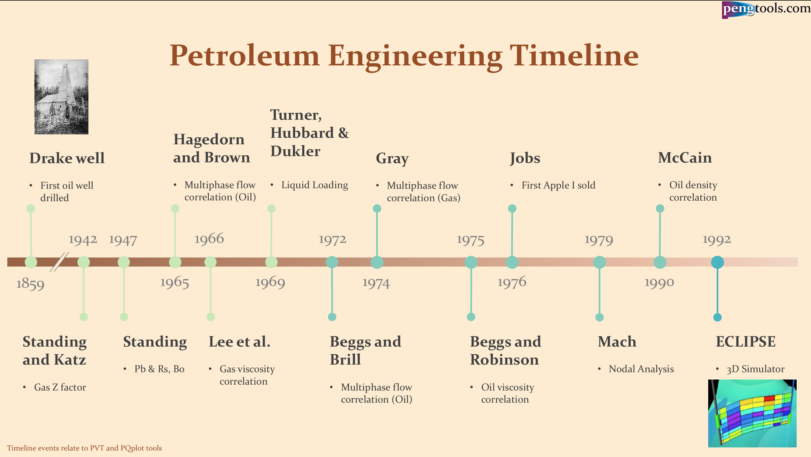

## Table of Contents

## What is the basic process of oil and gas production?

Oil and gas production starts with finding the oil and gas under the ground or under the sea. People use special machines to look deep into the earth. They find places where oil and gas might be hiding. Once they find a good spot, they drill a hole to reach the oil and gas. This is called exploration and drilling.

After drilling the hole, the oil and gas come up from the ground. This part is called extraction. The oil and gas are then moved through pipes to a place where they can be cleaned and separated. This place is called a processing facility. At the facility, they take out water and other things that are mixed with the oil and gas. After cleaning, the oil and gas are ready to be sent to people who need them.

Sometimes, the oil and gas need to be moved far away. They use big ships or long pipelines to transport them. This is called transportation. Once the oil and gas reach their destination, they can be used for many things, like making gasoline for cars or heating homes. This whole process from finding to using oil and gas is what we call oil and gas production.

## How long does it typically take to drill an oil or gas well?

Drilling an oil or gas well can take different amounts of time depending on many things. It usually takes between 1 to 3 months to drill a well. The time can change because of how deep the well needs to be, what kind of rock is underground, and if there are any problems while drilling. If the well is very deep or if the drilling team runs into hard rock, it might take longer.

Sometimes, the drilling can be faster if everything goes smoothly and the well is not too deep. But if there are issues like the drill getting stuck or if they need to fix the equipment, it can take more time. Also, the weather can affect how long it takes, especially if the well is being drilled offshore. Overall, it's hard to say exactly how long it will take because each well is different.

## What are the key stages in the lifecycle of an oil and gas field?

The lifecycle of an oil and gas field starts with exploration. This is when people look for oil and gas under the ground or under the sea. They use special machines to see deep into the earth and find places where oil and gas might be. If they find a good spot, they start drilling a well to reach the oil and gas. This stage can take a long time because they need to be sure they are drilling in the right place.

Once the well is drilled, the next stage is production. This is when the oil and gas are taken out of the ground. The oil and gas are then cleaned and separated from water and other things at a processing facility. After cleaning, they are ready to be sent to people who need them. This stage can last for many years, depending on how much oil and gas is in the field.

The final stage is called abandonment or decommissioning. When the oil and gas field is no longer producing enough, the wells are closed and the equipment is taken away. The area is cleaned up to make sure it is safe and does not harm the environment. This stage is important to make sure everything is left in good condition after the oil and gas are gone.

## What factors influence the timeline of oil and gas production?

Many things can change how long it takes to produce oil and gas. One big thing is how deep the oil or gas is under the ground. If it's very deep, it takes more time to drill the well. The kind of rock under the ground also matters. Some rocks are hard to drill through, which can slow things down. Problems during drilling, like the drill getting stuck or needing to fix equipment, can also make the process longer. Weather can affect the timeline too, especially if the drilling is happening offshore where storms can cause delays.

Another thing that influences the timeline is how much oil and gas is in the field. If there's a lot, the production stage can last for many years. But if there's not much, the field might be used up quickly. The technology used for drilling and extracting the oil and gas can also speed up or slow down the process. Newer technology can make things faster, but older equipment might take more time. Finally, rules and laws from the government can affect how long it takes to start and finish the production of oil and gas.

## How do exploration and appraisal phases affect the overall production timeline?

The exploration phase is when people look for oil and gas under the ground or under the sea. They use special machines to find the best spots to drill. This phase can take a long time because they need to be sure they are looking in the right places. If they find a good spot, they start drilling a well to see if there really is oil or gas there. The time spent on exploration can affect the overall production timeline because if it takes a long time to find the right spot, it delays when they can start drilling and producing oil and gas.

After exploration, the appraisal phase happens. This is when they drill more wells to learn more about how much oil and gas is in the field and how easy it will be to get it out. The appraisal phase helps them plan better for the production stage. If the appraisal phase finds a lot of oil and gas, it might speed up the production timeline because they know it's worth the effort. But if it takes a long time to do the appraisal or if they find less oil and gas than expected, it can slow down the overall production timeline. Both the exploration and appraisal phases are important and can make the whole process take more or less time.

## What is the average time from discovery to first oil or gas production?

The time from discovering oil or gas to starting production can vary a lot. On average, it can take about 5 to 10 years. This time includes finding the oil or gas, drilling wells to see how much is there, and planning how to get it out. Each step takes time because they need to be sure they are doing things right.

Sometimes, it can take longer if there are problems like hard rock to drill through or if they need special equipment. Other times, it can be faster if everything goes smoothly and they find a lot of oil or gas right away. The whole process depends on many things, but usually, it takes several years from discovery to first production.

## How do technological advancements impact oil and gas production timelines?

Technological advancements can make oil and gas production faster and easier. New tools and machines help people find oil and gas quicker. They can see deeper into the ground and find the best spots to drill. Special drilling equipment can go through hard rock faster, which means they can start getting oil and gas out sooner. Also, new technology helps them plan better and solve problems faster, so the whole process from finding to producing oil and gas can be shorter.

But sometimes, using new technology can take more time at first. People need to learn how to use the new tools and machines. They might need to train workers or bring in experts. Also, new technology can be expensive, so companies might need to spend more time planning and getting money before they can start using it. Once they get used to the new technology, though, it usually helps speed up the production timeline in the long run.

## What are the differences in production timelines between conventional and unconventional oil and gas resources?

Conventional oil and gas resources are easier to find and get out of the ground. They are in big pools under the earth, so it usually takes less time to start producing them. From finding the oil or gas to starting production, it can take about 5 to 10 years. This is because the wells are easier to drill and the oil and gas flow out more easily. The whole process is faster because they don't need special technology to get the oil and gas out.

Unconventional oil and gas resources, like shale oil and gas, are harder to get out. They are spread out in the rock, so it takes more time and special technology to produce them. It can take longer than 10 years from finding the oil or gas to starting production. They need to use methods like fracking to break the rock and let the oil and gas out. This makes the process slower and more complicated, but once they start, they can produce oil and gas for a long time.

## How do regulatory and environmental considerations influence project timelines in the oil and gas industry?

Regulatory and environmental considerations can make oil and gas projects take longer. Governments have rules that companies must follow to keep people and the environment safe. Before starting a project, companies need to get permits and do studies to show they will follow these rules. This can take a lot of time because they need to plan carefully and make sure everything is done right. If they don't follow the rules, they might have to stop work and fix things, which can delay the project even more.

Environmental concerns also play a big role. Companies need to do things like protect wildlife, reduce pollution, and clean up after they are done. This means they have to spend time and money on environmental plans and sometimes change how they do things to be safer for the environment. If there are problems or if people who care about the environment protest, it can slow down the project. Overall, these considerations are important but can make the timeline for oil and gas production longer.

## What are the challenges and strategies for managing delays in oil and gas production projects?

Managing delays in oil and gas production projects can be hard because there are many things that can go wrong. Problems like bad weather, equipment breaking, or not being able to get the right permits can all slow things down. Sometimes, they find less oil or gas than they thought, which means they have to change their plans. Also, if workers go on strike or if there are safety issues, it can take more time to fix these problems. All these things can make the project take longer than planned, and it can be hard to keep everything on track.

To deal with these delays, companies use different strategies. One way is to plan carefully from the start, thinking about what might go wrong and how to fix it. They might have backup plans and extra equipment ready, so if something breaks, they can fix it quickly. Another strategy is to work closely with the people who make the rules, so they can get permits faster. They also try to keep everyone safe and happy, so there are fewer strikes or safety issues. By being ready for problems and having good plans, companies can manage delays better and keep their projects moving forward.

## How do economic factors and market conditions affect the planning and execution of oil and gas production timelines?

Economic factors and market conditions can change how fast oil and gas companies plan and start their projects. If oil and gas prices are high, companies want to start producing quickly to make more money. They might speed up their plans and spend more money to get the oil and gas out faster. But if prices are low, companies might slow down or even stop their projects because they won't make as much money. Also, if it's hard to get money from banks or investors, it can take longer to start a project because they need money to buy equipment and pay workers.

Market conditions also affect how companies plan their production. If people need a lot of oil and gas, companies might try to produce more to meet the demand. They might drill more wells or use new technology to get the oil and gas out faster. But if there's not much demand, they might not rush to produce more. Sometimes, big events like wars or economic crises can change the market quickly, making companies change their plans. So, economic factors and market conditions play a big role in deciding how fast oil and gas projects move forward.

## What advanced techniques are used to optimize and accelerate oil and gas production timelines?

Advanced techniques help make oil and gas production faster and better. One way is using new technology like 3D seismic imaging. This helps people see deep into the ground and find the best spots for oil and gas. They can plan where to drill more accurately, which saves time. Another technique is horizontal drilling, where the drill goes sideways instead of just down. This lets them reach more oil and gas from one well, making the process quicker. Also, they use hydraulic fracturing, or fracking, to break rock and let oil and gas out faster.

Another way to speed things up is by using smart wells. These wells have special equipment that can change how oil and gas are taken out without stopping the well. This means they can keep producing even if something changes underground. Digital tools and data analytics also help. They can use computers to look at a lot of information and find the best ways to drill and produce. This makes planning and decision-making faster and more accurate. By using these advanced techniques, companies can get oil and gas out of the ground more quickly and efficiently.

## References & Further Reading

[1]: López de Prado, M. (2018). ["Advances in Financial Machine Learning."](https://books.google.com/books/about/Advances_in_Financial_Machine_Learning.html?id=oU9KDwAAQBAJ) Wiley.

[2]: Chan, E. P. (2009). ["Quantitative Trading: How to Build Your Own Algorithmic Trading Business."](https://github.com/ftvision/quant_trading_echan_book) Wiley.

[3]: Aronson, D. R. (2006). ["Evidence-Based Technical Analysis: Applying the Scientific Method and Statistical Inference to Trading Signals."](https://www.amazon.com/Evidence-Based-Technical-Analysis-Scientific-Statistical/dp/0470008741) Wiley.

[4]: Jansen, S. (2020). ["Machine Learning for Algorithmic Trading."](https://github.com/stefan-jansen/machine-learning-for-trading) Packt Publishing.

[5]: Bergstra, J., Bardenet, R., Bengio, Y., & Kégl, B. (2011). ["Algorithms for Hyper-Parameter Optimization."](https://dl.acm.org/doi/10.5555/2986459.2986743) Advances in Neural Information Processing Systems 24.