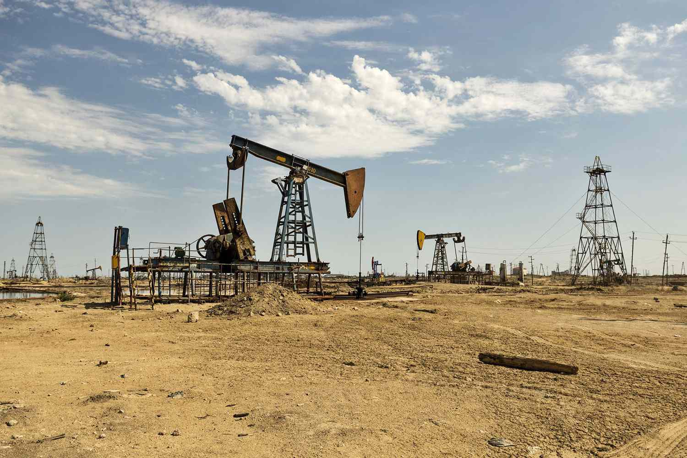

The concept of Oil Initially in Place (OIIP) constitutes an essential metric within the oil and gas industry, serving as a foundational tool for estimating the total volume of crude oil contained in a reservoir prior to any extraction activities. This metric provides vital insights which permit both investors and oil companies to accurately evaluate the potential size and economic feasibility of oil fields. A comprehensive understanding of OIIP enables stakeholders to make informed decisions regarding field development, effectively guiding investments and operational strategies.

Known also as Oil in Place (OIP), OIIP plays a significant role in the engineering and management of reservoirs. Proper estimation of OIIP is critical because it informs the design of recovery strategies and provides a benchmark for comparing the feasibilities of different extraction techniques. Accurate estimation involves assessing various reservoir characteristics such as area, thickness, porosity, oil saturation, and formation volume factor. The calculated estimate of OIIP provides companies with a basis for strategic planning and economic forecasting.



In contemporary financial markets, algorithmic trading has emerged as a powerful instrument for navigating the complexities associated with investing in oil reserves. Utilizing advanced algorithms and machine learning models, algorithmic trading facilitates data-driven decision-making and optimizes portfolio management. By analyzing market trends and prices, and incorporating vast datasets, algorithmic trading enables investors to respond swiftly and efficiently to market conditions, potentially improving investment outcomes. This article will explore the intricacies of OIIP, detailing its calculation methods, importance, and the innovative role of algorithmic trading in optimizing oil reserve investments.

## Table of Contents

## Understanding Oil Initially in Place (OIIP)

Oil Initially in Place (OIIP) represents the estimated total quantity of crude oil contained within a reservoir. This estimation is expressed under surface-level conditions, known as stock tank conditions. Unlike oil reserves, which quantify the amount of oil considered economically recoverable using current technology and under present conditions, OIIP measures the entire volume of crude in the reservoir, irrespective of recoverability.

Calculating OIIP involves several key reservoir properties: 

1. **Reservoir Area and Thickness**: These parameters define the physical dimensions of the reservoir. The volumetric calculation for OIIP can be represented as 
$$
\text{OIIP} = \text{Area} \times \text{Thickness} \times \phi \times S_o \times B_o
$$
where $\phi$ is porosity, $S_o$ is oil saturation, and $B_o$ is the formation volume factor.

2. **Porosity ($\phi$)**: Porosity measures the percentage of the rock that consists of voids or pores. It’s crucial for determining how much oil a reservoir can hold. Higher porosity indicates a greater capacity to store oil.

3. **Oil Saturation ($S_o$)**: This represents the fraction of the pore volume occupied by oil. It is an essential factor in assessing the oil storage capacity of a reservoir.

4. **Formation Volume Factor ($B_o$)**: A coefficient that quantifies the change in oil volume as it is brought from reservoir conditions to surface conditions. It accounts for volume changes due to pressure and temperature variations.

The accurate estimation of OIIP is pivotal in the oil industry. It forms the foundation for designing oil recovery strategies and evaluating the development potential of an oil field. A thorough understanding of OIIP assists in determining the viability and lifespan of extraction projects, ultimately guiding investment and operational decisions.

## Methods for Calculating OIIP

The estimation of Oil Initially in Place (OIIP) is critical for assessing a reservoir's potential. Several methods are employed to calculate OIIP, each with its distinct methodology and applicable scenarios.

The Volumetric Method is the most traditional approach, relying on static reservoir properties to estimate the initial oil [volume](/wiki/volume-trading-strategy). It considers parameters such as reservoir area ($A$), thickness ($h$), porosity ($\phi$), and oil saturation ($S_o$). The equation for OIIP in barrels using the Volumetric Method is expressed as:

$$

OIIP = 7758 \times A \times h \times \phi \times S_o \times \frac{1}{B_o} 
$$

where 7758 is a conversion factor from acre-feet to barrels, and $B_o$ is the formation volume factor, which accounts for the change in oil volume from reservoir to surface conditions. This method excels in new or unexplored fields where production data is not yet available, but its accuracy depends heavily on reliable geological and petrophysical data.

The Material Balance Method assesses OIIP using dynamic data, particularly reservoir pressure over time, adhering to the conservation of mass principle. This approach involves the general material balance equation:

$$
Np = \frac{(N \cdot Bti) - (N \cdot Btp) + (Et \cdot Bti)}{Bt}
$$

where $Np$ is the cumulative production, $N$ is the original oil in place, $Bti$ and $Btp$ are the initial and present formation volume factors, and $Et$ is the expansion factor. The Material Balance Method is apt for reservoirs with some production history as it provides insights into reservoir behavior and drive mechanisms. However, it requires accurate pressure data and an understanding of the reservoir's drive mechanisms to yield valid results.

Decline Curve Analysis is another dynamic method, primarily used in mature fields. It analyzes historical production rates to predict future production trends and infer OIIP. The basic premise relies on fitting a decline curve (exponential, hyperbolic, or harmonic) to past production data to extrapolate future performance. The Arps' formula for exponential decline, for example, is:

$$
q_t = q_i \cdot e^{-D \cdot t}
$$

where $q_t$ is the production rate at time $t$, $q_i$ is the initial production rate, and $D$ is the decline rate. This method is well-suited for fields with extensive production histories and is valued for its simplicity, though it can be less precise in complex reservoirs or changing operational conditions.

Each of these methods presents advantages and trade-offs. The Volumetric Method, while straightforward, relies heavily on static data, which can limit its accuracy. The Material Balance Method provides a deeper understanding of reservoir dynamics but requires substantial historical data. Decline Curve Analysis offers predictive insights for established fields but assumes consistent production trends. The choice of method thus significantly impacts the OIIP estimation, necessitating careful consideration of reservoir characteristics and data availability.

## Significance of OIIP in Oil Reserves

Oil Initially in Place (OIIP) is a critical parameter for oil reserves, as it serves as a basis for assessing an oil field's potential economic value. Estimating the OIIP allows oil companies to make informed decisions regarding the viability of developing specific fields and expand or diversify their assets. By understanding the total volume of [crude oil](/wiki/crude-oil) within a reservoir, investors can more accurately predict future revenue streams and assess the financial risks associated with extraction operations.

Crucially, OIIP delineates the total oil volume present, making it distinct from recoverable reserves that [factor](/wiki/factor-investing) in technological and economic constraints. The portion of OIIP that can be practically extracted is vital for strategic planning, informing companies which technological applications or advancements might be required to optimize recovery. For instance, if conventional extraction methods prove inadequate, enhanced oil recovery (EOR) techniques might be deployed to maximize output.

Furthermore, OIIP estimations allow companies to gauge the correlation between prospective extraction volumes and prevailing or projected market prices. This evaluation is crucial, as fluctuating oil prices can significantly impact the economic feasibility of drilling operations. Lower market prices may demand a reevaluation of extraction strategies, focusing on cost-effective technologies that ensure profit margins remain viable.

Estimating OIIP with precision is essential for effective reservoir management and optimization of recovery methods. As OIIP provides a fundamental baseline, it contributes to refining reservoir management strategies, facilitating decisions related to well placement, production scheduling, and investment in new technology. Optimal OIIP assessments can lead to enhanced recovery techniques that increase the efficiency and output of oil extraction processes, directly influencing the profitability and sustainability of oil wells. Embracing technological innovations to achieve accurate OIIP estimations offers oil companies a competitive edge in the evolving energy market landscape.

## Challenges and Technological Advancements in OIIP Estimation

Estimating Oil Initially in Place (OIIP) accurately is a complex task that faces several challenges, primarily due to uncertainties in reservoir properties such as porosity and permeability, as well as geological complexities. These factors can significantly affect the accuracy of OIIP calculations.

**Reservoir Properties Uncertainty**

Porosity, a measure of the void spaces in a rock, directly influences the storage capacity of a reservoir. However, porosity can vary significantly within a reservoir due to depositional and diagenetic processes, leading to potential inaccuracies in OIIP estimates. Similarly, permeability, the capability of the rock to transmit fluids, is another critical parameter often fraught with uncertainty. Variability in permeability directly affects the ease with which oil can be extracted, thus impacting recoverable reserves calculations.

**Geological Complexities**

Geological formations often possess intricate structures that compound estimation difficulties. Faults, fractures, and varying lithologies can significantly alter the flow paths and distribution of hydrocarbons within a reservoir. Such complexities necessitate sophisticated modeling techniques to approximate the actual conditions within the reservoir accurately.

**Technological Advancements**

Recent technological advancements are mitigating some of these challenges, enhancing the accuracy of OIIP estimation:

- **3D Reservoir Modeling and Enhanced Seismic Imaging**: The development of 3D reservoir modeling coupled with enhanced seismic imaging has significantly improved the spatial characterization of reservoirs. These technologies enable geologists and reservoir engineers to visualize subsurface structures with greater precision, improving the reliability of OIIP estimates. High-resolution seismic data can be integrated into reservoir models, allowing for better delineation of reservoir boundaries and heterogeneities.

- **Artificial Intelligence and Machine Learning**: AI and machine learning algorithms are playing an increasingly pivotal role in OIIP estimation. These technologies excel at analyzing large, complex datasets, such as those generated from seismic surveys and well logs. Machine learning models can be trained to predict reservoir properties by identifying patterns in the data that may not be initially apparent. For instance, neural networks can be employed to estimate porosity and permeability from seismic attributes, enhancing the predictive capability of reservoir models.

    ```python
    from sklearn.model_selection import train_test_split
    from sklearn.ensemble import RandomForestRegressor
    import numpy as np

    # Example dataset
    X = np.random.rand(100, 5)  # Features: seismic attributes
    y = np.random.rand(100)     # Target: reservoir property (e.g., porosity)

    # Split the data
    X_train, X_test, y_train, y_test = train_test_split(X, y, test_size=0.2, random_state=42)

    # Random Forest model
    model = RandomForestRegressor(n_estimators=100, random_state=42)
    model.fit(X_train, y_train)

    # Make predictions
    predictions = model.predict(X_test)
    ```

- **Petrophysical Analysis Improvements**: Technological progress in petrophysical analysis, including advanced logging tools and core sample analysis techniques, are providing more accurate data on reservoir characteristics. This deeper insight into rock properties enhances predictive models, allowing for more precise estimates of OIIP.

Overall, the combination of new technologies and analytical methods is transforming the accuracy and reliability of OIIP estimations, offering oil companies more substantial data to inform their exploration and extraction strategies. As these technologies continue to evolve, they hold the potential to further reduce uncertainties and improve decision-making in the oil industry.

## The Role of Algorithmic Trading in Oil Reserves

Algorithmic trading has revolutionized the way investors interact with oil reserves by utilizing sophisticated algorithms to automate trading decisions based on pre-defined criteria. This automation yields significant improvements in the efficiency and speed of trading processes, fundamentally altering traditional investment strategies. In the oil and gas sector, particularly concerning Oil Initially in Place (OIIP), [algorithmic trading](/wiki/algorithmic-trading) offers a robust mechanism to manage the intrinsic complexities and volatile nature of the market.

In the context of OIIP, algorithmic trading aids investors in optimizing their portfolios by analyzing intricate market trends and price [volatility](/wiki/volatility-trading-strategies). This is crucial for making informed decisions, especially in an environment where small fluctuations in oil prices can have substantial economic impacts. Algorithms are designed to process vast datasets, which include historical price data, geopolitical events, and supply-demand dynamics, to generate real-time trading signals.

The integration of Artificial Intelligence (AI) and Machine Learning (ML) in trading platforms further enhances the capability of algorithmic trading models. These technologies provide more precise modeling and predictions by continuously learning from new data and adapting to emerging patterns. Machine learning algorithms can identify non-linear relationships in data, often missed by traditional statistical models, thereby providing a competitive edge to traders. For instance, a supervised learning algorithm can be used to predict future oil prices based on training data that includes historical prices and external factors affecting oil supply.

```python
import pandas as pd
from sklearn.model_selection import train_test_split
from sklearn.ensemble import RandomForestRegressor

# Sample dataset
data = pd.read_csv('oil_price_data.csv')
X = data.drop('future_price', axis=1)
y = data['future_price']

# Split the dataset
X_train, X_test, y_train, y_test = train_test_split(X, y, test_size=0.2, random_state=42)

# Train a Random Forest model
model = RandomForestRegressor(n_estimators=100, random_state=42)
model.fit(X_train, y_train)

# Predict future prices
predictions = model.predict(X_test)
```

Algorithmic traders exploit large datasets and the use of sophisticated models to capitalize on events impacting oil prices and market conditions. By doing so, they accommodate short-term market movements and long-term strategic shifts. This is particularly beneficial during geopolitical events or unexpected disruptions in oil supply, where rapid response can differentiate between profit and loss.

Moreover, algorithmic trading reduces the emotional component associated with trading by adhering strictly to data-driven decisions, which is particularly advantageous in volatile markets like oil. As a result, investors are better equipped to navigate complexities using a structured and disciplined approach.

In summary, the role of algorithmic trading in oil reserves is indispensable. It provides a systematic approach to deal with market volatility and trends, offering investors tools to make more accurate and timely investment decisions, ultimately enhancing their capability to manage risk and maximize returns. As technology continues to evolve, the potential applications and benefits of algorithmic trading in the oil market are poised to grow further.

## Conclusion

Oil Initially in Place (OIIP) plays an essential role in the oil and gas sector, serving as a cornerstone for estimating reservoir capabilities and guiding development strategies. Accurate OIIP estimations are paramount for determining the potential output and sustainability of oil fields, thereby influencing both operational and financial decisions.

Progressions in technology, notably in algorithmic trading and data analysis, have revolutionized investment strategies within the oil market. These advancements enable more precise and data-driven approaches, allowing investors to better manage risk and optimize returns amidst fluctuating market conditions. For investors, a robust comprehension of OIIP and the utilization of algorithmic trading tools are invaluable. These tools facilitate informed decision-making by allowing for the real-time analysis of market trends, thereby enhancing the capability to predict and respond to market shifts swiftly.

The industry's future is poised to be shaped by the ongoing evolution of technology and trading strategies. As these continue to advance, they promise to further refine the methodologies used to optimize oil reserve investments. The integration of cutting-edge technology with traditional oil valuation concepts like OIIP will likely provide further opportunities for efficiency and profitability, underscoring the importance of these developments as central to the future landscape of the oil and gas industry.

## References & Further Reading

[1]: Ait-Sahalia, Y., & Saglam, M. (2013). ["High-Frequency Traders: Taking Advantage of Speed."](https://papers.ssrn.com/sol3/papers.cfm?abstract_id=2342011) Review of Financial Studies, 18(4), 1411-1457.

[2]: Bourgoyne, A. T., Chenevert, M. E., Millheim, K. K., & Young, F. S. (1986). ["Applied Drilling Engineering."](https://onepetro.org/books/book/32/Applied-Drilling-Engineering) Society of Petroleum Engineers.

[3]: Dake, L. P. (2001). ["Fundamentals of Reservoir Engineering."](https://www.sciencedirect.com/bookseries/developments-in-petroleum-science/vol/8/suppl/C) Elsevier Science B.V.

[4]: Jablonowski, C., Koetter, U., Pawlowski, E., & Rühland, E. (1992). ["Estimation of Oil and Gas Resources."](https://setac.onlinelibrary.wiley.com/doi/abs/10.1002/etc.1851) Energy Economics, 14(2), 119-127.

[5]: Lopez de Prado, M. (2018). ["Advances in Financial Machine Learning."](https://www.amazon.com/Advances-Financial-Machine-Learning-Marcos/dp/1119482089) Wiley.

[6]: Mishra, S., & Sharma, J. S. (2012). ["Intelligent Computing Techniques for the Economic Evaluation of Oil and Gas Resources."](https://www.sciencedirect.com/science/article/abs/pii/S1084804519302036) Proceedings of the International Conference on Soft Computing for Problem Solving, 425-433.

[7]: Watson, R. S., & Economides, M. J. (1996). ["Advanced Reservoir Engineering."](https://books.google.com/books/about/A_Practical_Companion_to_Reservoir_Stimu.html?id=Yw5YrBhOLFEC) Gulf Professional Publishing.