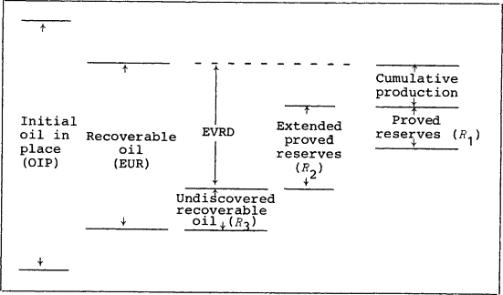

## Table of Contents

## What is Oil Initially In Place (OIIP)?

Oil Initially In Place (OIIP) is the total amount of oil that is present in a reservoir before any oil is taken out. It's like knowing how much oil is in a tank before you start using it. OIIP is important because it helps people in the oil industry figure out how much oil they might be able to get from a certain place.

To find out the OIIP, experts use different ways to measure and guess the size of the oil reservoir and the kind of rock it's in. They look at things like how big the area is, how thick the oil layer is, and what the rock is made of. This helps them make a good guess about how much oil is there, even though they can't see it directly.

## How is OIIP calculated?

To calculate Oil Initially In Place (OIIP), you need to know a few things about the oil reservoir. First, you measure the size of the area where the oil is. This is like figuring out how big a room is by measuring its length and width. Then, you find out how thick the layer of oil is. It's like knowing how deep a puddle is. You also need to know how much space the oil takes up in the rock, which is called porosity. Porosity is like how much water a sponge can hold.

Next, you need to know the saturation of the oil, which means how much of the space in the rock is filled with oil instead of water or gas. It's like knowing what part of a glass is filled with juice. Once you have all these pieces of information, you can use a special formula to calculate the OIIP. The formula is simple: you multiply the area of the reservoir by the thickness of the oil layer, then by the porosity, and finally by the oil saturation. This gives you the total amount of oil in the reservoir before any is taken out.

## Why is OIIP important in the oil and gas industry?

OIIP is very important in the oil and gas industry because it helps people understand how much oil is in a reservoir before they start drilling. This information is crucial for planning and making decisions about how to get the oil out. If a company knows there's a lot of oil in a place, they might decide to spend more money on drilling and building things there. On the other hand, if there's not much oil, they might choose to look for oil somewhere else.

Knowing the OIIP also helps companies guess how much money they might make from a reservoir. It's like knowing how many cookies are in a jar before you start eating them. This helps them plan their budget and decide if it's worth spending time and money on that particular oil field. In the end, understanding OIIP helps the oil and gas industry work better and make smarter choices.

## What is the difference between OIIP and reserves?

Oil Initially In Place (OIIP) and reserves are two different things in the oil and gas world. OIIP is the total amount of oil that is in a reservoir before anyone starts taking it out. It's like knowing how much juice is in a fruit before you squeeze it. OIIP helps people guess how much oil might be there, but it doesn't tell them how much they can actually get out.

Reserves, on the other hand, are the part of the OIIP that people think they can actually get out of the ground and use. It's like knowing how much juice you can really get from a fruit after squeezing it. Reserves are important because they help companies plan how much oil they can sell and make money from. So, OIIP is the total amount of oil, and reserves are the part of that oil that can be used.

## How does OIIP relate to recovery factor?

OIIP, or Oil Initially In Place, is the total amount of oil in a reservoir before any is taken out. The recovery factor is a number that tells us how much of that oil we can actually get out. It's like knowing how much juice you can squeeze from a fruit. If the recovery factor is high, it means we can get a lot of the oil out of the ground. If it's low, we can only get a little bit.

To find out how much oil we can recover, we multiply the OIIP by the recovery factor. For example, if a reservoir has 100 million barrels of OIIP and the recovery factor is 30%, we can expect to recover about 30 million barrels of oil. This helps oil companies plan how much oil they can sell and how much money they might make. Understanding the recovery factor and OIIP together is key to making smart choices in the oil and gas industry.

## What are the common methods used to estimate OIIP?

Estimating Oil Initially In Place (OIIP) involves using different methods to figure out how much oil is in a reservoir. One common way is called volumetric estimation. This method uses the size of the area where the oil is, how thick the oil layer is, and the kind of rock it's in to make a guess. It's like trying to find out how much water is in a swimming pool by measuring its length, width, and depth. Experts also need to know the porosity, which is how much space in the rock can hold oil, and the oil saturation, which is how much of that space is actually filled with oil. By putting all these pieces together, they can come up with a good estimate of the OIIP.

Another method is called material balance. This approach looks at how the pressure in the reservoir changes when oil is taken out. It's like checking how much air is left in a balloon as you let some of it out. By studying these changes, experts can figure out how much oil was there to begin with. This method is useful because it can be used while the oil is being taken out, giving a more up-to-date estimate. Both volumetric estimation and material balance help oil companies make better plans and decisions about how to get the oil out of the ground.

## How does the accuracy of OIIP estimates impact project economics?

The accuracy of OIIP estimates can make a big difference in how well an oil project does financially. If the estimate is too high, a company might spend a lot of money on drilling and other work, thinking there's a lot more oil than there really is. This can lead to a lot of wasted money and time. On the other hand, if the estimate is too low, the company might not invest enough in the project, missing out on the chance to make more money from the oil that's actually there.

Getting the OIIP estimate right helps companies plan better and make smarter choices. If they know the right amount of oil in the ground, they can figure out how much it will cost to get it out and how much money they might make from selling it. This helps them decide if the project is worth doing and how to manage their budget. In the end, a good OIIP estimate can make the difference between a successful project and one that loses money.

## What are the geological factors that influence OIIP?

Geological factors play a big role in how much oil is in a reservoir, which we call OIIP. The type of rock in the reservoir is very important. Some rocks, like sandstone or limestone, can hold a lot of oil because they have many tiny holes and spaces. These spaces are called porosity, and the more porosity a rock has, the more oil it can store. Another thing to think about is how the oil got into the rock in the first place. Oil comes from tiny plants and animals that lived a long time ago and got buried under layers of rock. Over millions of years, heat and pressure turned them into oil. The oil then moved through the rock until it got trapped in a place where it couldn't go any further.

The way the oil is spread out in the reservoir also matters. Sometimes oil is spread out evenly, but other times it's in different layers or pockets. This can make it harder to figure out how much oil is there. The size and shape of the reservoir are also important. A bigger reservoir can hold more oil, but if it's shaped in a way that makes it hard to get the oil out, it might not be as good as a smaller, easier-to-reach one. All these geological factors together help experts guess how much oil is in a reservoir, which is really important for planning how to get it out.

## How do reservoir characteristics affect OIIP calculations?

Reservoir characteristics are really important when figuring out how much oil is in a reservoir, which we call OIIP. One key thing to look at is the porosity of the rock. Porosity is like how much space in the rock can hold oil. If the rock has a lot of tiny holes and spaces, it can hold more oil. Another thing is the oil saturation, which is how much of those spaces are actually filled with oil instead of water or gas. If the oil saturation is high, it means more of the space in the rock is filled with oil, so there's more oil in the reservoir.

The thickness and size of the oil layer in the reservoir also matter a lot. If the oil layer is thick and covers a big area, there's more oil to be found. But it's not just about how much oil is there; it's also about how the oil is spread out. Sometimes the oil is in different layers or pockets, which can make it harder to figure out the total amount of oil. All these characteristics together help experts make a good guess about the OIIP, which is really important for planning how to get the oil out and how much money they might make from it.

## What role does technology play in improving OIIP estimates?

Technology helps a lot in making better guesses about how much oil is in a reservoir, which we call OIIP. One way technology helps is by using special tools to look at the reservoir without digging into it. For example, seismic imaging sends sound waves into the ground and listens to the echoes to create a picture of what's underground. This helps experts see the size and shape of the oil layer and the kind of rock it's in. Computers can then use this information to make more accurate calculations of the OIIP.

Another way technology helps is through advanced computer programs and simulations. These programs can take all the data from the reservoir and run different scenarios to see how much oil might be there. They can also help experts understand how the oil moves and how much they might be able to get out. By using these high-tech tools, companies can make better plans and decisions about drilling, which can save time and money and make the whole process more successful.

## How can changes in OIIP estimates affect investment decisions?

Changes in OIIP estimates can have a big impact on investment decisions in the oil and gas industry. If the estimate goes up, it means there might be more oil in the ground than people thought. This can make a project look more promising, so companies might decide to invest more money in drilling and other work. They might also think they can make more money from selling the oil, so they're more willing to spend on the project.

On the other hand, if the OIIP estimate goes down, it means there might be less oil than expected. This can make a project look less attractive, so companies might decide to cut back on their investments or even stop working on the project altogether. They might also worry about not making as much money as they hoped, so they'll be more careful about how much they spend. In the end, getting the OIIP estimate right is really important for making smart investment choices.

## What are the latest advancements in OIIP estimation techniques?

The latest advancements in OIIP estimation techniques have made it easier and more accurate to guess how much oil is in a reservoir. One big advancement is the use of better seismic imaging technology. This technology sends sound waves into the ground and listens to the echoes to create a detailed picture of what's underground. With newer, more powerful computers, these images can be even clearer, helping experts see the size, shape, and type of rock in the oil reservoir. This helps them make better guesses about how much oil might be there.

Another advancement is the use of advanced computer simulations and machine learning. These tools can take all the data from the reservoir and run different scenarios to see how much oil might be in different parts of the reservoir. Machine learning can help find patterns in the data that might be hard for people to see. This makes the OIIP estimates more accurate and helps companies plan better for drilling and other work. These new techniques are making a big difference in how the oil and gas industry figures out how much oil is in the ground.

## What are the methods for calculating OIIP?

The estimation of Oil Initially in Place (OIIP) is critical for assessing a reservoir's potential. Several methods are employed to calculate OIIP, each with its distinct methodology and applicable scenarios.

The Volumetric Method is the most traditional approach, relying on static reservoir properties to estimate the initial oil [volume](/wiki/volume-trading-strategy). It considers parameters such as reservoir area ($A$), thickness ($h$), porosity ($\phi$), and oil saturation ($S_o$). The equation for OIIP in barrels using the Volumetric Method is expressed as:

$$

OIIP = 7758 \times A \times h \times \phi \times S_o \times \frac{1}{B_o} 
$$

where 7758 is a conversion factor from acre-feet to barrels, and $B_o$ is the formation volume factor, which accounts for the change in oil volume from reservoir to surface conditions. This method excels in new or unexplored fields where production data is not yet available, but its accuracy depends heavily on reliable geological and petrophysical data.

The Material Balance Method assesses OIIP using dynamic data, particularly reservoir pressure over time, adhering to the conservation of mass principle. This approach involves the general material balance equation:

$$
Np = \frac{(N \cdot Bti) - (N \cdot Btp) + (Et \cdot Bti)}{Bt}
$$

where $Np$ is the cumulative production, $N$ is the original oil in place, $Bti$ and $Btp$ are the initial and present formation volume factors, and $Et$ is the expansion factor. The Material Balance Method is apt for reservoirs with some production history as it provides insights into reservoir behavior and drive mechanisms. However, it requires accurate pressure data and an understanding of the reservoir's drive mechanisms to yield valid results.

Decline Curve Analysis is another dynamic method, primarily used in mature fields. It analyzes historical production rates to predict future production trends and infer OIIP. The basic premise relies on fitting a decline curve (exponential, hyperbolic, or harmonic) to past production data to extrapolate future performance. The Arps' formula for exponential decline, for example, is:

$$
q_t = q_i \cdot e^{-D \cdot t}
$$

where $q_t$ is the production rate at time $t$, $q_i$ is the initial production rate, and $D$ is the decline rate. This method is well-suited for fields with extensive production histories and is valued for its simplicity, though it can be less precise in complex reservoirs or changing operational conditions.

Each of these methods presents advantages and trade-offs. The Volumetric Method, while straightforward, relies heavily on static data, which can limit its accuracy. The Material Balance Method provides a deeper understanding of reservoir dynamics but requires substantial historical data. Decline Curve Analysis offers predictive insights for established fields but assumes consistent production trends. The choice of method thus significantly impacts the OIIP estimation, necessitating careful consideration of reservoir characteristics and data availability.

## References & Further Reading

[1]: Ait-Sahalia, Y., & Saglam, M. (2013). ["High-Frequency Traders: Taking Advantage of Speed."](https://papers.ssrn.com/sol3/papers.cfm?abstract_id=2342011) Review of Financial Studies, 18(4), 1411-1457.

[2]: Bourgoyne, A. T., Chenevert, M. E., Millheim, K. K., & Young, F. S. (1986). ["Applied Drilling Engineering."](https://onepetro.org/books/book/32/Applied-Drilling-Engineering) Society of Petroleum Engineers.

[3]: Dake, L. P. (2001). ["Fundamentals of Reservoir Engineering."](https://www.sciencedirect.com/bookseries/developments-in-petroleum-science/vol/8/suppl/C) Elsevier Science B.V.

[4]: Jablonowski, C., Koetter, U., Pawlowski, E., & Rühland, E. (1992). ["Estimation of Oil and Gas Resources."](https://setac.onlinelibrary.wiley.com/doi/abs/10.1002/etc.1851) Energy Economics, 14(2), 119-127.

[5]: Lopez de Prado, M. (2018). ["Advances in Financial Machine Learning."](https://www.amazon.com/Advances-Financial-Machine-Learning-Marcos/dp/1119482089) Wiley.

[6]: Mishra, S., & Sharma, J. S. (2012). ["Intelligent Computing Techniques for the Economic Evaluation of Oil and Gas Resources."](https://www.sciencedirect.com/science/article/abs/pii/S1084804519302036) Proceedings of the International Conference on Soft Computing for Problem Solving, 425-433.

[7]: Watson, R. S., & Economides, M. J. (1996). ["Advanced Reservoir Engineering."](https://books.google.com/books/about/A_Practical_Companion_to_Reservoir_Stimu.html?id=Yw5YrBhOLFEC) Gulf Professional Publishing.