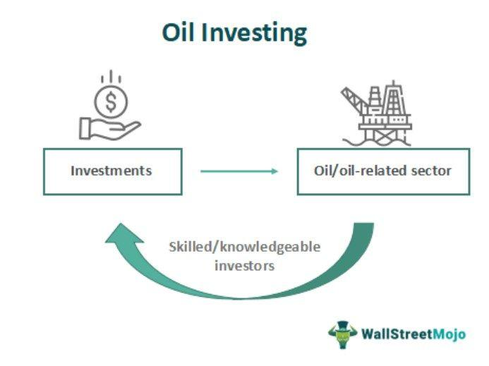

## Table of Contents

## What is oil investment and why is it important?

Oil investment involves putting money into the oil industry, which includes activities like exploring for oil, drilling, refining it into products like gasoline, and selling those products. People and companies invest in oil because it's a big part of the world's energy supply. Oil is used in cars, airplanes, and to make many things we use every day, like plastics and chemicals. When people invest in oil, they hope to make money as the demand for oil grows and its price goes up.

Oil investment is important for several reasons. First, it helps keep the oil industry running smoothly. Without investment, companies wouldn't have the money they need to find new oil sources or improve their technology. This could lead to less oil being available, which might cause prices to go up and affect the economy. Second, oil investments can be a good way for people to grow their savings. If the oil market does well, investors can earn a lot of money. However, it's also risky because oil prices can change a lot, and sometimes investments don't pay off.

## What are the differences between direct and indirect oil investments?

Direct oil investments mean you put your money straight into the oil business. This can be by buying part of an oil company, investing in a specific oil project, or even owning oil wells yourself. When you do this, you have more control over where your money goes and you might get bigger rewards if the oil project does well. But it's also riskier because if the project fails, you could lose a lot of money. Direct investments need a lot of knowledge about the oil industry, so they're usually for people who know a lot about oil and are okay with taking big risks.

Indirect oil investments are when you invest in things that are connected to the oil industry but not directly in oil itself. This can be by buying shares in big companies that make things from oil, like car companies or chemical makers, or by investing in oil-focused mutual funds or exchange-traded funds (ETFs). These investments spread your money out over many different companies or projects, which makes them less risky than direct investments. You might not make as much money as with direct investments, but it's easier to get started because you don't need to know as much about the oil business. Indirect investments are good for people who want to be part of the oil industry but don't want to take big risks.

## How can a beginner start investing in oil directly?

If you're a beginner and want to start investing in oil directly, the first thing you need to do is learn about the oil industry. This means understanding how oil is found, drilled, and sold. You can read books, take online courses, or even talk to people who work in the oil business. Once you feel like you know enough, you can start looking for opportunities. This might mean buying shares in a small oil company that's looking for new oil fields, or investing in a specific oil project. Remember, direct investments can be risky, so make sure you're ready to lose some money if things don't go well.

After you've done your research, you'll need to find a way to make your investment. You might need to work with a broker who can help you buy shares in an oil company or invest in a specific project. Some companies also let you invest directly through their websites. Before you put your money in, make sure you understand all the risks and have a plan for what you'll do if the price of oil goes down. It's also a good idea to start small, so you don't risk too much money at first. As you learn more and gain experience, you can think about making bigger investments.

## What are the risks associated with direct oil investments?

Direct oil investments can be risky because the price of oil can change a lot. If the price goes down, the value of your investment can drop too. Sometimes, oil companies have a hard time finding oil or it costs more than they thought to get it out of the ground. If that happens, they might not make money, and you could lose what you invested. Also, there are risks from things like oil spills or accidents that can cost a lot of money to fix and make people not want to buy from that company.

Another risk is that oil projects can take a long time to start making money. You might have to wait years before you see any return on your investment. During that time, other things can change, like new laws that make it harder for oil companies to do their work. Plus, more people are using renewable energy like wind and solar power, which might mean less demand for oil in the future. All these things can make direct oil investments risky, so it's important to think carefully before you put your money in.

## What types of indirect oil investments are available to investors?

Indirect oil investments let you put your money into things that are connected to the oil industry without directly buying oil or oil company shares. One way to do this is by investing in mutual funds or exchange-traded funds (ETFs) that focus on the energy sector. These funds own shares in many different oil and gas companies, so your money is spread out. This can make it less risky than putting all your money into one oil company. Another way is to buy shares in big companies that use oil to make their products, like car makers or chemical companies. These companies might do well if oil prices are low, because it costs them less to make things.

Another type of indirect oil investment is through real estate investment trusts (REITs) that own properties used by the oil industry, like pipelines or storage facilities. By investing in these REITs, you can earn money from the rent these properties make without having to own the oil itself. You can also look at investing in companies that provide services to the oil industry, like drilling equipment makers or engineering firms. These companies can be a good way to benefit from the oil industry without the big risks that come with direct oil investments.

## How do oil ETFs and mutual funds work as indirect investments?

Oil ETFs and mutual funds are ways to invest in the oil industry without buying oil or oil company shares directly. These funds collect money from many people and use it to buy a mix of different oil and gas company shares. When you buy into an ETF or mutual fund, you're actually buying a small piece of all those companies at once. This is good because it spreads out the risk. If one company does badly, it won't hurt your whole investment as much as if you had put all your money into that one company.

ETFs and mutual funds are managed by professionals who know a lot about the oil industry. They decide which companies to buy and when to sell them, trying to make the fund grow in value. You can buy and sell shares in these funds easily, just like you would buy and sell shares in a company. This makes it easier for you to get started with oil investments without needing to know everything about the oil business yourself. Just remember, even though they're less risky than direct investments, the value of these funds can still go up and down with the price of oil.

## What are the tax implications of investing in oil directly versus indirectly?

When you invest in oil directly, like buying shares in an oil company or investing in a specific oil project, the tax rules can be a bit complicated. If you make money from your investment, you might have to pay capital gains tax. This is a tax on the profit you make when you sell something for more than you paid for it. Sometimes, you can also get special tax breaks if you're investing in things like oil wells or drilling equipment. These tax breaks can lower how much tax you have to pay, but you need to know the rules well and maybe even talk to a tax expert to make sure you're doing everything right.

Investing in oil indirectly, like through ETFs or mutual funds, usually has simpler tax rules. When these funds make money, they often have to pay out some of it to the people who own shares in the fund. These payouts are called dividends, and you have to pay tax on them. The tax rate on dividends can be different from the tax rate on capital gains. Also, if you sell your shares in the fund for more than you paid, you'll have to pay capital gains tax on that profit too. The good thing about indirect investments is that the fund managers take care of a lot of the tax paperwork, so it's usually easier to handle than direct investments.

## How does geopolitical risk affect oil investments, both direct and indirect?

Geopolitical risk can really shake up oil investments. This happens when there's trouble in countries that make a lot of oil, like wars or new laws that change how oil companies can work. If these countries can't make as much oil because of the problems, the price of oil can go up a lot. For people who invest directly in oil, this can be good if they already own oil or oil company shares, because they can sell them for more money. But it's bad if they're trying to start a new oil project, because it might become too expensive or even impossible to do. 

Indirect oil investments, like ETFs or mutual funds, also feel the hit from geopolitical risks. These funds own shares in many different oil companies, so if oil prices go up because of trouble in oil-producing countries, the value of the fund can go up too. But if the trouble lasts a long time and oil prices stay high, it might make people use less oil or switch to other kinds of energy. This could hurt the oil companies in the long run, and then the value of the ETFs and mutual funds could go down. So, even though indirect investments spread out the risk, they're still affected by what's happening in the world.

## What role does oil futures trading play in direct oil investment strategies?

Oil futures trading is a way for people who invest directly in oil to make money by betting on what the price of oil will be in the future. When you buy an oil future, you're agreeing to buy oil at a certain price on a certain date. If you think the price of oil will go up, you can buy a future now and sell it later for more money. But if the price goes down, you could lose money. This makes oil futures trading a bit like gambling, but it can be a good way to make money if you know what you're doing.

Oil futures can also help people who invest in oil protect themselves from big changes in oil prices. If you own an oil company or have money in oil wells, you might be worried that the price of oil will drop and hurt your business. By selling oil futures, you can lock in a price for your oil now, even if you won't sell it until later. This can help you plan better and not lose as much money if the price of oil goes down. But futures trading is tricky and can be risky, so it's important to learn a lot about it before you start.

## How can investors use options to hedge their oil investments?

Investors can use options to protect their oil investments from big price changes. An option is like a bet on what the price of oil will do in the future. If you own oil or shares in an oil company, you might be worried that the price of oil will go down and hurt your investment. To protect yourself, you can buy a "put option." This gives you the right to sell oil at a certain price, even if the real price drops lower. If the price does go down, you can use the put option to sell your oil at the higher price you locked in, which helps you lose less money.

On the other hand, if you think the price of oil will go up, you can buy a "call option." This gives you the right to buy oil at a certain price, even if the real price goes higher. If the price does go up, you can use the call option to buy oil at the lower price you locked in, and then sell it at the higher market price to make more money. Using options like this can help you manage the risks of investing in oil, but it's important to understand how they work because they can be complicated and risky too.

## What advanced strategies can experts use to maximize returns from oil investments?

Experts can use a strategy called "swing trading" to make money from oil investments. Swing trading means buying and selling oil or oil company shares over a short time, like a few days or weeks. The idea is to find times when the price of oil is moving a lot and make quick trades to take advantage of these changes. Experts watch the news and other information to guess when the price will go up or down. If they think the price will go up soon, they buy oil or oil shares, and then sell them when the price does go up. If they think the price will go down, they might sell oil or oil shares they already own, or use options to bet on the price going down. This can be risky, but if they're good at guessing, they can make a lot of money.

Another advanced strategy is "diversification." This means spreading out their money over different kinds of oil investments, like oil wells, oil company shares, and oil ETFs. By doing this, experts can lower their risk because if one investment does badly, the others might do well and balance it out. They might also use a mix of direct and indirect investments. For example, they could invest directly in some oil projects and also buy shares in an oil ETF. This way, they can get the big rewards that come with direct investments but also have the safety of indirect investments. It takes a lot of knowledge and planning to do this right, but it can help experts make more money while keeping their risks under control.

## How do environmental regulations and the shift to renewable energy impact long-term oil investment strategies?

Environmental regulations can make oil investments harder and more expensive. Governments around the world are making new rules to stop oil companies from polluting the air and water. These rules can mean that oil companies have to spend a lot of money on new technology or pay fines if they break the rules. This can make it less profitable to invest in oil. If the rules get even stricter, it might become too expensive to drill for oil or run oil refineries, which would hurt the value of oil investments. So, people who invest in oil need to think about how these rules might change in the future and how that could affect their money.

The shift to renewable energy is also changing the oil industry. More and more people are using wind, solar, and electric power instead of oil. This means that in the future, there might be less demand for oil, which could make the price go down. People who invest in oil need to think about how fast the world is moving away from oil and how that could affect their investments. Some experts think it's a good idea to start investing in renewable energy too, to balance out the risks. This way, if oil becomes less popular, they can still make money from the new energy sources. It's a big change, but it's important for long-term oil investors to pay attention to it.

## References & Further Reading

[1]: Yergin, D. (2011). ["The Quest: Energy, Security, and the Remaking of the Modern World"](https://www.amazon.com/Quest-Energy-Security-Remaking-Modern/dp/0143121944). Penguin Books.

[2]: Black, F., & Scholes, M. (1973). ["The Pricing of Options and Corporate Liabilities."](https://www.cs.princeton.edu/courses/archive/fall09/cos323/papers/black_scholes73.pdf) Journal of Political Economy, 81(3), 637-654.

[3]: Hull, J. C. (2017). ["Options, Futures, and Other Derivatives."](https://www.semanticscholar.org/paper/Options%2C-Futures%2C-and-Other-Derivatives-Hull/89bdee500c8623864fc9eb7a471546aa713acc44) Pearson.

[4]: ["Dynamic Asset Pricing Theory"](https://resources.caih.jhu.edu/textbooks/Resources/_pdfs/Dynamic_Asset_Pricing_Theory_Third_Edition.pdf) by Darrell Duffie.

[5]: Watkins, G. C., & Streifel, S. (1998). ["World Crude Oil Supply: Evidence from a Comprehensive Monthly Data Set."](https://www.semanticscholar.org/paper/World-Crude-Oil-Resources%3A-Evidence-from-Estimating-Watkins-Streifel/de2e3dc4d151759df4de2bf26909db47f58a9efd) The World Bank. 

[6]: Aldridge, I. (2013). ["High-Frequency Trading: A Practical Guide to Algorithmic Strategies and Trading Systems."](https://books.google.com/books/about/High_Frequency_Trading.html?id=8QpIsVUMhmEC) Wiley.

[7]: Geman, H. (2005). ["Commodities and Commodity Derivatives: Modelling and Pricing for Agriculturals, Metals and Energy."](https://www.semanticscholar.org/paper/Commodities-and-Commodity-Derivatives%3A-Modelling-Geman/e20e4e93b7ef47399f0faf7a4a0c9d660763b850) Wiley.