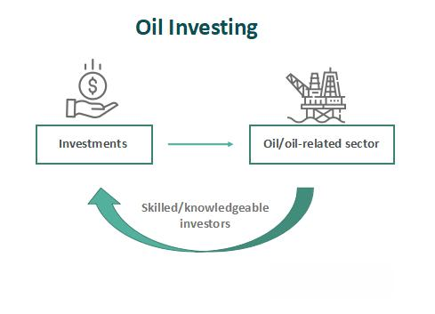

The global investment landscape is vast, offering myriad opportunities for potential returns. Among these, commodities such as oil stand out due to their inherent volatility and significant impact on the global economy. Investors looking to maximize their returns in the oil market must understand the distinction between direct and indirect investments. Direct investments involve ownership or stakes in physical oil assets or engaging directly with the futures market, while indirect investments offer exposure through financial instruments like mutual funds and exchange-traded funds (ETFs).

Trading oil requires a comprehensive understanding of the market's dynamics, including its high price volatility and associated risks. Factors influencing oil prices include geopolitical events, supply and demand dynamics, environmental policies, and economic indicators. Price volatility can lead to substantial gains but also significant losses, underscoring the importance of risk management strategies.

With advancements in technology, algorithmic trading has emerged as an essential component in oil trading strategies. By leveraging automated systems and algorithms, traders can process large volumes of market data to make split-second trading decisions. This approach optimizes investment returns by enhancing speed, efficiency, and accuracy, while reducing the likelihood of human error. Algorithmic trading also aids in navigating the complexities of oil trading by analyzing trends and responding to market signals, which can be beneficial in both direct and indirect investment strategies.

In conclusion, understanding these investment methods and utilizing algorithmic trading effectively can help investors optimize their returns in the dynamic oil market. As the landscape continues to evolve, staying informed and adaptable is crucial for sustainable success in oil investments.

## Table of Contents

## Direct Investment in Oil

Direct investment in oil markets involves acquiring physical assets or financial stakes that are directly linked to the oil industry. This can include direct ownership of oil wells or engaging in futures contracts. Understanding the specifics of these investments and the associated risks is crucial for investors seeking substantial returns in a volatile market environment.

Investors engaging in direct investments bear ownership-specific risks and must manage operational responsibilities inherent in physical commodity ownership. This includes handling the logistics of extraction, production, and potential changes in regulatory landscapes. As a direct investor, one must meticulously analyze the fluctuations in crude oil prices, as these are subject to volatile changes due to various factors like geopolitical tensions and shifts in global demand and supply dynamics. Political tensions in major oil-producing regions can lead to significant price volatility, thus impacting the potential return on investment.

The oil market requires significant capital and a high tolerance for risk. Substantial returns can be realized from direct investments, but they demand a deep understanding of market mechanisms and potential environmental regulations that may affect operations or costs. Operating in this space without due diligence can lead to significant financial exposure.

Investors focused on direct investment should also be proficient in the intricacies of [crude oil](/wiki/crude-oil) futures, options, and spot markets. Futures contracts are legal agreements to buy or sell a particular commodity asset at a predetermined price at a specified time in the future, allowing investors to hedge against possible adverse price movements. Understanding these derivatives is fundamental, as they enable the locking in of prices, thus providing a form of risk management in investment portfolios.

For example, an investor might engage in futures trading with a contract specifying the purchase of 1,000 barrels of oil at $70 per barrel set to expire in three months. If the market price at the time of expiration is $80 per barrel, the investor realizes a profit by purchasing oil below the market rate.

In conclusion, direct investment in oil can be lucrative but is accompanied by substantial risks and requires comprehensive knowledge and capital. Mastery of financial tools like futures and options, alongside awareness of global political and economic conditions, is crucial for navigating these investments successfully.

## Indirect Investment in Oil

Indirect investment in oil offers individuals a way to gain exposure to the energy sector without the direct ownership of physical commodities or assets such as oil wells or futures contracts. This approach is particularly attractive to investors who prefer diversification and aim to lower their risk profile.

One common method of indirect investment is through mutual funds focused on the oil industry. These funds pool resources from multiple investors and are managed by professionals who invest in a diversified portfolio of energy stocks. This diversification is beneficial as it minimizes the impact of [volatility](/wiki/volatility-trading-strategies) associated with any single company's performance or oil price changes.

Another option is Exchange-Traded Funds (ETFs), which are traded on stock exchanges like individual stocks. Commodity ETFs, in particular, track the price movements of oil or oil indexes. They offer a cost-effective and convenient way for investors to gain exposure without having to deal with the complexities of futures trading.

Exchange-Traded Notes (ETNs) also provide an avenue for indirect oil investment. Unlike ETFs, ETNs are debt instruments issued by financial institutions. They aim to mimic the price fluctuations of oil-related assets. However, ETNs are subject to the credit risk of the issuing bank, which adds a layer of risk not present in ETFs.

When investing in these vehicles, several factors must be considered. The quality of fund management plays a significant role in achieving successful returns. Investors should assess the track record and expertise of fund managers in navigating the oil sector's volatile market landscapes. 

Tracking errors also merit attention. This measure indicates how well an [ETF](/wiki/etf-trading-strategies) or mutual fund reflects its underlying benchmark index. A low tracking error means the fund closely follows the index, which is preferable for passive investors.

Expense ratios are another critical consideration. These fees, expressed as a percentage of the fund’s assets, can erode returns over time. Therefore, investors should compare expense ratios across similar funds to ensure they do not pay more than necessary for management and operational costs.

Overall, indirect investment in oil, through mutual funds, ETFs, and ETNs, offers a balanced approach, enabling investors to participate in the oil market without the significant capital and operational challenges associated with direct investment. It allows investors to benefit from the oil sector’s potential growth while managing risks through diversification and professional fund management.

## Algorithmic Trading in Oil Investment

Algorithmic trading in oil investment leverages automated systems to efficiently analyze market data and execute trades, significantly reducing the time and effort required in traditional trading practices. These algorithms are designed to interpret complex market signals and respond to price movements, thereby enhancing the speed and accuracy of trading operations. By minimizing human intervention, [algorithmic trading](/wiki/algorithmic-trading) helps decrease the risk of errors that might occur due to emotional or impulsive trading decisions, an invaluable aspect in managing the inherent volatility of oil markets.

One of the primary advantages of algorithmic trading is its ability to process vast amounts of data at speeds unmatched by human traders. This capability is crucial in volatile markets like oil, where rapid price changes demand quick decision-making. For instance, algorithms can be programmed to track specific market indicators, such as moving averages or Bollinger Bands, to trigger trades based on predefined conditions. 

However, traders must exercise caution regarding over-reliance on these automated systems. While they enhance efficiency and speed, there's an inherent risk of systemic failures or malfunctions, which can lead to significant financial losses. Additionally, the potential for market anomalies means that algorithms need constant refinement to adjust to changing market conditions and ensure their effectiveness.

Understanding market signals is crucial and involves the design and programming of algorithms to effectively respond to real-time data. For example, a mean-reversion algorithm might buy oil when its price is below a historical average and sell when above, expecting the price to return to its mean over time. This approach can capitalize on short-term discrepancies in oil prices while assuming a return to equilibrium.

Algorithmic trading is particularly effective when combined with strong market fundamentals in both direct and indirect oil investments. For direct investments, such as trading in futures contracts, algorithms can identify price patterns that offer profitable [arbitrage](/wiki/arbitrage) opportunities. In indirect investments, like oil-focused ETFs, algorithmic trading can optimize portfolio rebalancing and hedging strategies.

In conclusion, algorithmic trading provides a powerful tool for enhancing returns in oil investments by optimizing trading processes and managing risks associated with market volatility. Its integration into investment strategies necessitates a nuanced understanding of algorithmic architecture, market mechanics, and risk management to capitalize on its full potential safely and effectively.

## Combining Investment Strategies

Combining direct and indirect investment strategies in oil markets serves as a prudent approach towards achieving diversification and capitalizing on various market opportunities. This dual strategy allows investors to reap the benefits of indirect investments, such as mutual funds or ETFs, which provide stability and diversification while simultaneously pursuing the potentially higher returns associated with direct investments, like crude oil futures or physical assets.

Incorporating algorithmic trading into both strategies can enhance decision-making efficiency and improve profit margins. By utilizing algorithms to analyze market data, execute trades rapidly, and minimize human error, investors can more effectively manage the inherent volatility of oil markets. Algorithmic trading systems can be programmed to respond to specific market signals, efficiently integrating real-time data to optimize trade execution.

When devising an investment strategy, it is crucial to consider macroeconomic factors, such as geopolitical developments, OPEC policies, and global economic indicators, which can impact oil prices. Understanding market trends, such as seasonal demand shifts and technological advancements in renewable energy, can also guide investment decisions. This comprehensive analysis helps investors mitigate risk and align with emerging opportunities.

A mixed investment approach, blending direct and indirect strategies, offers the potential for robust portfolio growth while providing a safeguard against market downturns. By diversifying their investment avenues, investors can reduce exposure to individual asset risks and enhance the resilience of their portfolios. This balance between stability and high return potential is pivotal for sustainable success in the fluctuating landscape of oil investments. As market conditions evolve, continuously updating investment strategies and leveraging innovations, such as algorithmic trading, is essential for optimizing outcomes in this dynamic sector.

## Conclusion

Oil investment, whether through direct or indirect means, necessitates a comprehensive understanding of market dynamics and inherent risks. As the oil markets are characterized by notable price volatility due to geopolitical factors, supply-demand imbalances, and environmental regulations, investors must carefully assess their strategies in alignment with their risk tolerance, available capital, and expertise in the oil sector. A well-informed approach is crucial to navigate these complex markets effectively.

Algorithmic trading has emerged as a significant advancement in enhancing investment potential within the oil sector. By leveraging automated systems capable of analyzing vast amounts of market data and executing trades with increased speed and precision, investors can mitigate human errors and capitalize on fleeting market opportunities. This technological innovation has proven particularly valuable in managing the volatility and rapid price changes inherent in oil markets.

A successful investment strategy often involves balancing direct and indirect approaches. Direct investments, while potentially offering higher returns, require substantial capital and a higher risk appetite. Indirect investments, such as exchange-traded funds (ETFs) and mutual funds, provide diversification and reduced risk, catering to investors with lower risk tolerance. By integrating algorithmic trading across these strategies, investors can enhance decision-making efficiency and profit margins.

The dynamic nature of oil markets necessitates the continuous adaptation of investment strategies. Investors must remain vigilant of macroeconomic shifts, technological developments, and emerging trends to refine their approaches continuously. By doing so, they can maximize returns while safeguarding against potential downturns in the oil sector.

Sustainable success in oil investment hinges on ongoing education and adaptation to market innovations. As algorithmic trading and other technological advancements continue to evolve, investors need to stay informed and agile, ensuring their strategies are aligned with current market conditions. Engaging with new technologies and refining investment tactics will position investors favorably for long-term growth and resilience in the oil market.

## References & Further Reading

[1]: Yergin, D. (2011). ["The Quest: Energy, Security, and the Remaking of the Modern World"](https://www.amazon.com/Quest-Energy-Security-Remaking-Modern/dp/0143121944). Penguin Books.

[2]: Black, F., & Scholes, M. (1973). ["The Pricing of Options and Corporate Liabilities."](https://www.cs.princeton.edu/courses/archive/fall09/cos323/papers/black_scholes73.pdf) Journal of Political Economy, 81(3), 637-654.

[3]: Hull, J. C. (2017). ["Options, Futures, and Other Derivatives."](https://www.semanticscholar.org/paper/Options%2C-Futures%2C-and-Other-Derivatives-Hull/89bdee500c8623864fc9eb7a471546aa713acc44) Pearson.

[4]: ["Dynamic Asset Pricing Theory"](https://resources.caih.jhu.edu/textbooks/Resources/_pdfs/Dynamic_Asset_Pricing_Theory_Third_Edition.pdf) by Darrell Duffie.

[5]: Watkins, G. C., & Streifel, S. (1998). ["World Crude Oil Supply: Evidence from a Comprehensive Monthly Data Set."](https://www.semanticscholar.org/paper/World-Crude-Oil-Resources%3A-Evidence-from-Estimating-Watkins-Streifel/de2e3dc4d151759df4de2bf26909db47f58a9efd) The World Bank. 

[6]: Aldridge, I. (2013). ["High-Frequency Trading: A Practical Guide to Algorithmic Strategies and Trading Systems."](https://books.google.com/books/about/High_Frequency_Trading.html?id=8QpIsVUMhmEC) Wiley.

[7]: Geman, H. (2005). ["Commodities and Commodity Derivatives: Modelling and Pricing for Agriculturals, Metals and Energy."](https://www.semanticscholar.org/paper/Commodities-and-Commodity-Derivatives%3A-Modelling-Geman/e20e4e93b7ef47399f0faf7a4a0c9d660763b850) Wiley.