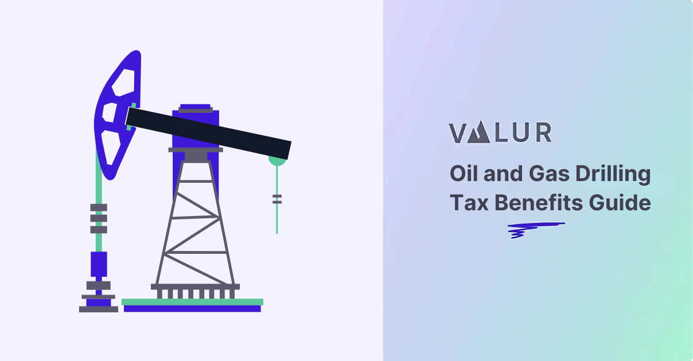

## Table of Contents

## What is oil investment and why is it important?

Oil investment involves putting money into the oil industry, which includes activities like exploring for oil, drilling, refining it into products like gasoline, and selling those products. People and companies invest in oil because it's a big part of the world's energy supply. Oil is used for transportation, heating homes, and making things like plastics and chemicals. When someone invests in oil, they might buy shares in oil companies, invest in oil exploration projects, or trade oil on the market.

Oil investment is important for several reasons. First, it helps keep the oil industry running smoothly. Without investment, oil companies wouldn't have the money they need to find new oil fields, build refineries, or develop new technologies. This could lead to less oil being available, which might cause prices to go up and affect the economy. Second, oil investments can be a way for people to make money. If the price of oil goes up, the value of oil investments usually goes up too. This can help investors grow their savings or earn income from their investments.

## How do tax incentives work in the context of oil investments?

Tax incentives for oil investments are special breaks or benefits that governments give to people or companies that invest in the oil industry. These incentives can lower the amount of taxes someone has to pay, making it more attractive to put money into oil projects. For example, if a company is exploring for new oil, the government might let them deduct some of their exploration costs from their taxes. This means the company pays less in taxes, which can help them afford to keep looking for oil.

These tax incentives are important because they encourage more investment in the oil industry. When companies and investors know they can save money on taxes, they might be more willing to take the risk of investing in oil. This can lead to more oil being found and produced, which can help keep energy prices stable and support the economy. However, tax incentives can also be controversial because they reduce government revenue and might favor the oil industry over other sectors.

## What are the different types of tax incentives available for oil investments?

There are several types of tax incentives for oil investments. One common type is the depletion allowance, which lets oil companies deduct a part of their income from oil and gas production. This is like saying, "You can keep some of your earnings because you're using up a natural resource." Another type is the intangible drilling costs (IDC) deduction, which allows companies to write off expenses like wages, fuel, and repairs that are needed for drilling but don't result in a physical asset. This can really help companies because they can deduct these costs right away instead of spreading them out over time.

There are also tax credits for certain activities in the oil industry. For example, there might be a credit for using new technology that helps the environment, like carbon capture and storage. This means the government gives companies money back for doing something good for the planet. Lastly, some governments offer reduced tax rates or tax holidays for oil projects in certain areas, like remote or challenging locations. This makes it more attractive for companies to invest in those areas because they'll pay less in taxes.

These incentives can make a big difference for oil companies and investors. They help lower the costs of finding and producing oil, which can make projects more profitable. But it's important to remember that these incentives also mean less money for the government, so they can be a topic of debate.

## How can beginners start investing in oil and take advantage of tax incentives?

Beginners can start investing in oil by buying shares in oil companies. You can do this through a brokerage account, which you can set up online. Look for companies that are involved in finding, drilling, or selling oil. Another way to invest is through oil-focused mutual funds or exchange-traded funds (ETFs). These funds hold a mix of different oil companies, which can spread out your risk. Once you have your investments, you might be able to take advantage of tax incentives. For example, if you invest in a company that's exploring for new oil, you might be able to deduct some of their exploration costs from your taxes. It's a good idea to talk to a tax professional to understand what incentives you can use.

Taking advantage of tax incentives can make your oil investments more profitable. One common incentive is the depletion allowance, which lets you deduct a part of your income from oil and gas production. Another is the intangible drilling costs (IDC) deduction, which allows you to write off certain expenses right away. Some governments also offer tax credits for using new, eco-friendly technology in the oil industry. To make the most of these incentives, keep good records of your investments and any related expenses. A tax advisor can help you figure out which incentives apply to you and how to claim them on your tax return.

## What are the risks associated with oil investments and how do tax incentives mitigate them?

Oil investments can be risky because the price of oil can go up and down a lot. If the price drops, the value of your investment might go down too. Also, finding new oil can be hard and expensive. Sometimes, companies spend a lot of money looking for oil but don't find any. This can make their stock price go down, which means your investment loses value. Another risk is that oil companies can have problems with the environment or with the law, which can hurt their business and your investment.

Tax incentives can help make these risks a bit smaller. For example, if you can deduct some of the costs of looking for oil from your taxes, it makes the investment less expensive. This means you might lose less money if the project doesn't work out. Also, if the government gives you a tax credit for using new technology, it can help the company make more money, which can make your investment more stable. But tax incentives don't take away all the risks. The price of oil can still go down, and finding oil can still be hard. So, it's important to think carefully about these risks before you invest.

## How do tax laws affect oil investment strategies?

Tax laws can change how people and companies decide to invest in oil. If the government gives good tax breaks, like letting you deduct the costs of looking for oil or giving you money back for using new technology, it can make oil investments more attractive. People might be more willing to take the risk of investing in oil if they know they can save money on taxes. This can lead to more money being put into the oil industry, which helps keep the industry growing.

On the other hand, if tax laws are not as friendly, it might make people think twice about investing in oil. If the government takes away some tax incentives or makes them less generous, the costs of investing in oil can go up. This might make oil investments less profitable, so people might choose to put their money into other things instead. So, tax laws can really affect how much money goes into the oil industry and how people plan their investments.

## What are the global differences in tax incentives for oil investments?

Different countries have different rules about tax incentives for oil investments. In the United States, for example, oil companies can get a break called the depletion allowance, which lets them deduct some of their income from oil and gas production. They can also write off certain drilling costs right away, which helps them save money. In Canada, there are tax credits for certain oil and gas activities, like exploring for new oil in tough places. These incentives make it more attractive for companies to invest in oil in these countries.

In other parts of the world, the tax incentives can be very different. Some countries in the Middle East, like Saudi Arabia, have low tax rates for oil companies, which encourages a lot of investment in oil there. In Norway, the government gives tax breaks for oil exploration but also has high taxes on oil profits, which is a different approach. These differences mean that oil companies and investors need to think carefully about where to put their money, based on the tax laws in each country.

## How have recent changes in tax legislation impacted oil investment opportunities?

Recent changes in tax laws have had a big impact on oil investment opportunities. In the United States, for example, the Tax Cuts and Jobs Act of 2017 changed some of the rules about how oil companies can deduct their costs. Before the change, companies could write off a lot of their drilling costs right away, but now they have to spread those costs out over time. This makes investing in oil a bit more expensive, so some people might be less interested in putting their money into oil projects.

In other countries, changes in tax laws have also affected oil investments. For instance, the UK has made changes to its tax regime to encourage more oil and gas exploration in the North Sea. They've offered new tax breaks for companies that invest in finding new oil fields. This makes it more attractive for companies to look for oil there. But, in places like Norway, the government has kept high taxes on oil profits, which might make some investors think twice about putting their money into oil projects there. So, depending on where you are, recent tax changes can make oil investments more or less appealing.

## What advanced strategies can experts use to maximize tax benefits from oil investments?

Experts can use advanced strategies to get the most out of tax benefits from oil investments. One way is to use something called "cost segregation." This means breaking down the costs of an oil project into different parts, like drilling equipment and land. By doing this, experts can take advantage of different tax rules for each part, which can help them save more money on taxes. Another strategy is to invest in oil projects that qualify for special tax credits, like those for using new technology that helps the environment. By choosing projects that get these credits, experts can lower their tax bill and make their investments more profitable.

Another advanced strategy is to use "tax loss harvesting." This means selling oil investments that have lost value to claim a tax loss, which can offset other income and lower the total taxes owed. Experts can then buy similar investments right away, so they stay invested in oil but still get the tax benefit. Also, experts might set up partnerships or joint ventures with other investors to share the costs and benefits of oil projects. This can help them spread out their risk and take advantage of more tax incentives. By using these strategies, experts can make their oil investments more tax-efficient and increase their overall returns.

## How do environmental regulations intersect with tax incentives in the oil industry?

Environmental regulations and tax incentives in the oil industry can work together or sometimes push in different directions. Governments often want oil companies to follow rules that help protect the environment, like reducing pollution or using cleaner technology. To encourage this, they might offer tax incentives, like giving companies money back if they use new technology that helps the environment. For example, a company might get a tax credit for using carbon capture and storage, which helps lower the amount of harmful gases in the air. These incentives can make it easier for oil companies to follow environmental rules because they can save money while doing good for the planet.

However, sometimes environmental regulations can make it harder for oil companies to take advantage of tax incentives. If the rules are very strict, it might cost a lot of money for companies to follow them. This can make some oil projects less profitable, even with tax breaks. For example, if a government says companies have to clean up oil spills in a certain way, it might be expensive to do that. Even if the company gets a tax break for using new technology, the cost of following the rules might still be too high. So, oil companies have to think carefully about how environmental regulations and tax incentives work together when they plan their investments.

## What role do government policies play in shaping tax incentives for oil investments?

Government policies are really important in deciding what tax incentives oil companies can get. When a government wants more oil to be found and produced, they might give tax breaks to make it cheaper for companies to do that. For example, they might let companies deduct the costs of looking for oil from their taxes. This makes it more attractive for companies to invest in oil because they can save money. Governments can also give tax credits for using new technology that helps the environment, like capturing carbon. These policies help guide what kinds of oil projects get done and where companies put their money.

Sometimes, government policies can change, and that can affect tax incentives too. If a new law makes it harder for oil companies to get tax breaks, they might not want to invest as much in oil. For example, if a government decides to take away some tax incentives or make them less generous, it can make oil projects more expensive. This might make companies look for other places to invest their money. So, the rules that governments set about taxes can really shape how much and where oil companies choose to invest.

## How can investors forecast future tax incentive changes in the oil sector?

Investors can forecast future tax incentive changes in the oil sector by keeping an eye on government policies and economic trends. Governments often change tax laws based on what's happening in the economy and what they want to achieve. For example, if a government wants to encourage more oil production, they might offer new tax breaks. Investors should read news about government plans and listen to what politicians are saying about the oil industry. They can also look at reports from experts who study tax laws and the oil sector. These reports can give clues about what might happen with tax incentives in the future.

Another way to forecast tax incentive changes is by watching what's happening in other countries. Sometimes, one country's tax changes can influence others. If a big oil-producing country like the United States changes its tax laws, other countries might do something similar. Investors should also pay attention to global events, like changes in oil prices or new environmental rules. These things can affect what governments decide to do about tax incentives. By staying informed and looking at these different factors, investors can make better guesses about future tax changes in the oil sector.

## References & Further Reading

[1]: Ross, S. A., Westerfield, R., & Jaffe, J. (2019). ["Corporate Finance"](https://www.amazon.com/Corporate-Modigliani-Professor-Financial-Economics/dp/1259918947). McGraw-Hill Education.

[2]: McMillan, L. G. (2004). ["Options as a Strategic Investment"](https://www.amazon.com/Options-Strategic-Investment-Lawrence-McMillan/dp/0735201978). New York Institute of Finance.

[3]: de Prado, M. L. (2018). ["Advances in Financial Machine Learning"](https://www.amazon.com/Advances-Financial-Machine-Learning-Marcos/dp/1119482089). Wiley.

[4]: Kleinman, G. (2013). ["Trading Commodities and Financial Futures: A Step-by-Step Guide to Mastering the Markets"](https://www.amazon.com/Trading-Commodities-Financial-Futures-Step/dp/0134087186). FT Press.

[5]: Aronson, D. R. (2007). ["Evidence-Based Technical Analysis: Applying the Scientific Method and Statistical Inference to Trading Signals"](https://onlinelibrary.wiley.com/doi/book/10.1002/9781118268315). Wiley.

[6]: Jansen, S. (2020). ["Machine Learning for Algorithmic Trading: Predictive Models to Extract Signals from Market and Alternative Data for Systematic Trading Strategies with Python"](https://github.com/stefan-jansen/machine-learning-for-trading). Packt Publishing.

[7]: ["The Basics of Oil and Gas Investing"](https://retailinvestor.org/the-basics-of-oil-and-gas-investing/) on Investopedia. 

[8]: Prud'homme, R., & Konstadakopulos, D. (1998). ["Handbook of Environmental Accounting"](https://www.taylorfrancis.com/books/edit/10.1201/9780203755709/foams-robert-prud-homme-saad-khan). Edward Elgar Publishing.