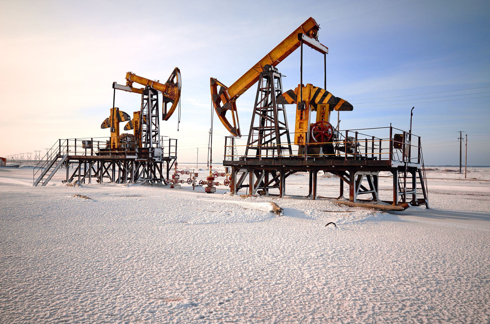

The oil industry is a cornerstone of the global economy, serving as a fundamental resource for transportation, energy, and a myriad of industrial applications. It is a complex and dynamic sector that significantly influences international trade and political relationships. Oil's pivotal role is underscored by its status as one of the most traded commodities, with the market's movements closely watched for signs of economic shifts.

Oil investment encapsulates a wide array of opportunities, ranging from individual stocks and futures contracts to exchange-traded funds (ETFs) and direct stakes in oil-producing companies. Each form of investment provides unique benefits and challenges. For instance, investing in oil stocks may offer shareholder dividends and capital appreciation, while futures contracts provide a more direct stake in the commodity's pricing trends. Similarly, ETFs provide diversified exposure to the oil sector, and direct investments can entail significant capital expenditures but offer potential substantial returns.



Incentives and tax breaks are crucial in promoting investments within the oil industry. Various governments offer fiscal advantages such as depletion allowances and intangible drilling cost deductions to encourage investment in domestic oil exploration and production. These incentives can substantially affect return on investment and are pivotal to strategic investment decisions. Understanding these financial aids is critical for investors seeking to maximize their portfolio's performance.

Algorithmic trading, or algo trading, has revolutionized commodity markets, including oil, by employing mathematical models and automated coding techniques to execute trades at optimal speeds and efficiency. This form of trading uses complex algorithms to analyze market data, predict price movements, and execute orders far quicker than human traders. Algo trading increases market liquidity and, when used effectively, can enhance gains from oil investments by capitalizing on market inefficiencies.

Combining the elements of oil investment options, fiscal incentives, and algo trading crafts a sophisticated investment strategy tailored for the modern market environment. These factors converge to form a comprehensive approach that maximizes investment potential while navigating the inherent risks associated with oil market volatility.

This article seeks to provide a detailed understanding of these pivotal components: oil investment, tax incentives, and algorithmic trading, as well as their synergistic effects on modern oil investment strategies. By exploring these interconnected dynamics, investors and stakeholders can gain insights into optimizing their approaches and positioning themselves advantageously in the evolving landscape of the oil industry.

## Table of Contents

## Understanding Oil Investment

Oil investment is a critical component of the global financial landscape, with a history that dates back to the 19th century when the first commercial oil well was drilled in Pennsylvania by Edwin Drake in 1859. This event marked the beginning of oil becoming a pivotal energy resource, influencing economies, industries, and geopolitical relations worldwide.

There are several avenues for investing in oil, each offering unique characteristics and appeal to different types of investors. The most common types include:

1. **Stocks**: Investors can purchase shares in companies that are involved in the exploration, production, refining, and distribution of oil. This equity investment allows investors to potentially benefit from both capital appreciation and dividend income, depending on the financial health and operations of the company.

2. **Futures**: These are financial contracts obligating the buyer to purchase, or the seller to sell, a particular commodity asset at a predetermined future date and price. Oil futures are a popular form of investment for those looking to hedge against price fluctuations or speculate on future price changes.

3. **Exchange-Traded Funds (ETFs)**: Oil ETFs invest in oil futures or stocks of oil companies, providing investors with a diversified exposure to the oil market. They are traded on major exchanges and are known for their liquidity and accessibility.

4. **Direct Investment**: This involves investing directly in oil projects or wells, often through limited partnerships. This type of investment is usually only accessible to accredited investors due to its complexity and risk.

Several factors influence oil prices and, consequently, investment returns. These factors include:

- **Supply and Demand**: The fundamental economic principles of supply and demand significantly impact oil prices. A surplus of supply or a shortage in demand can lead to price drops, while a deficit in supply or an increase in demand typically results in price increases.

- **Geopolitical Events**: Oil is a strategic resource, and geopolitical events such as wars, sanctions, and diplomatic tensions can disrupt supply channels or influence production levels, leading to price volatility.

- **OPEC Policies**: The Organization of the Petroleum Exporting Countries (OPEC) plays a vital role in the global oil market by coordinating production levels among member countries to influence prices.

- **Technological Advances**: Innovations such as hydraulic fracturing and deep-sea drilling have increased oil supply by making previously inaccessible reserves economically viable.

Investing in the oil industry comes with notable risks and rewards. The primary risk is the commodity's price [volatility](/wiki/volatility-trading-strategies), which can lead to significant losses if prices fall. However, investors can also experience substantial gains during periods of rising prices. Additionally, investing in oil can offer protection against inflation since energy prices typically rise with inflationary pressures. 

Geopolitical considerations are essential in oil investment strategies. Political instability in oil-producing regions can lead to disruptions in supply, thereby causing price spikes. Conversely, political decisions, such as moves towards renewable energy and carbon regulations, can decrease oil demand and impact investments negatively.

Understanding these factors is crucial for making informed investment decisions in the oil sector. Investors must consider the interplay between market dynamics, geopolitical events, and technological advancements to navigate the complex and often volatile oil market successfully.

## Incentives and Tax Breaks in the Oil Industry

Government incentives and tax breaks play a significant role in promoting investment in the oil industry. These incentives are designed to encourage exploration, development, and production activities, making investments in this sector more attractive and profitable. This section provides an overview of these governmental strategies, highlighting specific tax breaks and analyzing their influence on investment decisions.

### Overview of Government Incentives

Many governments around the world provide a range of incentives to stimulate investment in the oil sector. These can include direct subsidies, favorable tax regimes, and royalty reliefs. The primary goal is to enhance domestic energy security, create jobs, and stimulate economic growth. Such incentives often attract both domestic and foreign investors by reducing the financial risks associated with oil exploration and production.

### Specific Tax Breaks Available for Oil Investors

1. **Depletion Allowances**: A depletion allowance grants oil companies a tax deduction on the decline in value of their oil reserves. This is similar to depreciation deductions in other industries, except it applies to the extraction of natural resources. The IRS allows taxpayers to use either cost depletion or percentage depletion, with the latter enabling more substantial deductions based on a percentage of gross income from the resource.

2. **Intangible Drilling Costs (IDCs)**: These are costs associated with drilling and preparing wells for production that do not have a salvage value. U.S. tax laws permit companies to deduct IDCs immediately, rather than capitalizing them and deducting over time. This immediate deduction can significantly reduce taxable income in the year the costs are incurred, enhancing cash flow for further investments.

3. **Enhanced Oil Recovery Credits**: These credits are designed to encourage the extraction of oil from fields that are difficult to exploit using standard methods. Companies can claim this credit when using specific recovery methods, thus reducing their tax liability.

### Impact of Incentives on Investment Decisions and Profitability

Incentives and tax breaks significantly affect investment decisions by altering the financial calculus of potential projects. By lowering the overall tax burden, these incentives increase the potential profitability of oil projects. For instance, by allowing immediate deductions of intangible drilling costs, a project can achieve positive cash flow more quickly, making it more attractive to investors.

The ability to claim depletion allows investors to account for the diminishing supply of resources, mitigating harsh profit impacts as reserves deplete. Combined, these incentives reduce the financial risks associated with oil investments and can lead to increased capital inflows into the industry.

### Case Studies of Countries Incentivizing Oil Investments

1. **United States**: The U.S. offers significant tax advantages to oil and gas companies. The availability of IDCs and percentage depletion are seen as major incentives that have historically driven investment in domestic oil exploration and production.

2. **Canada**: Canada’s government provides investment tax credits and accelerated capital cost allowances to bolster oil and gas investments. This favorable tax treatment helps maintain competitiveness in the global oil market.

3. **Norway**: The Norwegian government not only taxes oil companies at high rates but also provides a system of rebates and credits for exploration activities. This structure is designed to promote continual exploration and ensure a stable supply of resources.

### Ethical Considerations Surrounding these Incentives

Despite the economic rationale behind incentives and tax breaks, they raise several ethical considerations. Critics argue that these benefits encourage continued reliance on fossil fuels, with significant implications for climate change. By making carbon-intensive projects more financially viable, such incentives could potentially delay the transition to renewable energy sources. Moreover, the disparity in taxation between traditional industries and the oil sector raises questions about fairness and economic equity.

Policymakers must balance the short-term economic benefits of promoting oil investments with the long-term imperative of sustainability. Adjusting or phasing out these incentives in favor of renewable energy could align public policy with global climate goals.

Overall, understanding the intricacies of government incentives and tax breaks is crucial for investors navigating the complex landscape of oil investments. These financial levers not only influence profitability but also have broader implications for the industry and the environment.

 to Algorithmic Trading in Oil Markets

Algorithmic trading, often referred to as algo trading, involves the use of computer algorithms to automate trading decisions and execute transactions at speeds and frequencies impossible for human traders. This method has seen significant growth since its inception in the 1970s with the adoption of electronic trading systems. By the 21st century, algo trading began to dominate global financial markets, accounting for a major proportion of trading volumes across various asset classes, including oil.

The transformation of oil trading and investment strategies through algo trading is profound. Traditional oil trading relied heavily on market sentiment, manual analysis, and decision-making processes that were time-consuming and prone to human error. Algorithmic trading, however, utilizes data-driven models and statistical tools to analyze market conditions, identify trading signals, and execute trades with minimal human intervention. This shift enhances the ability of traders to capitalize on short-term price movements, while concurrently managing risk more effectively.

Several technological advancements have propelled the growth of [algorithmic trading](/wiki/algorithmic-trading) in oil markets. Enhanced data processing capabilities, [machine learning](/wiki/machine-learning) algorithms, and access to vast amounts of real-time market data have collectively facilitated the development of sophisticated trading strategies. High-frequency trading ([HFT](/wiki/high-frequency-trading-strategies)) systems, a subset of algorithmic trading, exploit small price discrepancies with execution speeds measured in microseconds. Moreover, cloud computing and distributed ledger technologies have optimized the deployment and operational efficiency of these trading systems.

The advantages of algo trading in the oil industry are numerous. Speed and efficiency are principal benefits; algorithms can analyze multiple market indicators simultaneously and execute a large [volume](/wiki/volume-trading-strategy) of trades with unparalleled precision. Additionally, the automation of trading processes reduces transaction costs, mitigates human error, and enhances [liquidity](/wiki/liquidity-risk-premium) within the oil markets. For instance, quantitative models can be employed to predict [crude oil](/wiki/crude-oil) prices based on historical data, adopting strategies such as mean-reversion or trend-following to generate profits.

However, algorithmic trading is not without its risks and challenges. The complexity and opacity of trading algorithms can lead to systemic risks, such as flash crashes or liquidity shortages. Moreover, technical glitches or flaws within the algorithm can result in significant financial loss. Ethical concerns also arise regarding market manipulation and the potential for unfair trading advantages. Regulatory bodies, therefore, face the ongoing challenge of monitoring algorithmic trading practices to ensure market integrity and transparency.

In conclusion, algorithmic trading represents a groundbreaking evolution in the oil markets, rendering traditional trading methodologies increasingly obsolete. As technological innovations continue to advance, the influence of algorithmic strategies on oil investment is likely to expand, shaping the future landscape of financial markets.

## The Intersection of Tax Incentives and Algo Trading

The integration of algorithmic trading and tax incentives in the oil industry presents a sophisticated approach to maximizing investment returns. Algorithmic trading involves the use of computer algorithms to execute trades at high speeds and efficiencies, leveraging data-driven insights to optimize investment strategies. When coupled with tax incentives, such as depletion allowances and intangible drilling costs, this approach can significantly enhance profitability for investors in the oil market.

Algorithmic trading can optimize benefits from tax incentives by enabling precise timing and structuring of trades to capitalize on tax advantages. For instance, algorithms can be designed to recognize market conditions that favor certain tax treatments and execute trades accordingly. This precision allows investors to maximize returns while minimizing tax liabilities. For example, through the implementation of algorithms that account for tax positions and their implications on cash flow, investors can strategically balance their portfolios to maintain an optimal tax burden. Python, a versatile programming language, can be used for this purpose. The following pseudocode illustrates a simplified version of an algorithm that factors in tax implications:

```python
def optimize_tax_investment(portfolio, tax_incentives):
    for asset in portfolio:
        if asset.eligible_for_tax_break(tax_incentives):
            execute_trade(asset, strategy='max_tax_efficiency')

def execute_trade(asset, strategy):
    if strategy == 'max_tax_efficiency':
        # Implement trade execution logic here based on tax efficiency
        pass
```

The financial implications of this data-driven decision-making are profound. By utilizing algorithms that continuously analyze tax regulations and market data, firms are able to adjust their trading strategies dynamically, achieving a level of responsiveness that manual trading cannot match. This agility helps in optimizing cash flow management and enhancing return on investment.

Real-world examples illustrate the success of integrating these strategies. Notably, large financial institutions and trading firms have developed in-house algorithms that align investment decisions with available tax incentives. These organizations utilize extensive historical data and predictive analytics to inform trading activities, ensuring compliance with tax regulations while maximizing incentives.

However, the intersection of tax incentives and algorithmic trading introduces potential regulatory challenges. Regulators must ensure that the sophisticated use of algorithms does not exploit tax systems unfairly or unethically. This requires continuous monitoring and updating of tax policies to reflect the rapidly advancing technological landscape. The future outlook in this area suggests increasing scrutiny and potential policy adjustments to maintain fair market practices.

In conclusion, the synergy between algorithmic trading and tax incentives provides a powerful tool for oil investors aiming to optimize returns. As technology evolves, so will the strategies to integrate these elements, presenting both opportunities and challenges for market participants and regulators alike. Investors must remain vigilant and informed to harness these advancements effectively, while regulatory bodies must adapt to ensure equitable market conditions.

## The Future of Oil Investment: Trends and Predictions

Emerging trends in oil investment are increasingly shaped by advancements in technology and shifts in policy landscapes. Technological integration, particularly through algorithmic trading, is transforming how investors engage with the oil market. Algorithmic trading allows for rapid, data-driven decision-making, providing a competitive edge through speed and accuracy. As a result, it is expected to further dominate oil market strategies, optimizing returns and minimizing risk.

Policy changes, particularly those aimed at curbing climate change, are also influencing oil investment strategies. The global shift towards renewable energy sources is pressing traditional oil markets, prompting a reevaluation of long-term investment strategies in fossil fuels. As countries prioritize sustainable energy policies, these changes could lead to a reallocation of investments from oil to renewable energies, although oil will likely remain a significant energy source in the near term due to ongoing demand.

The evolving landscape of tax incentives reflects this shift towards sustainability. Governments have historically used tax incentives to stimulate investment in the oil sector, including benefits like depletion allowances and intangible drilling costs. However, there is an increasing emphasis on redirecting these incentives towards cleaner energy sources. This transition could reshape oil investment strategies, as businesses balance the diminishing returns from traditional tax breaks with emerging opportunities in sustainable energy investments.

Experts provide varied opinions on the long-term viability of oil investments. Some suggest that despite pressures from renewables, oil will remain crucial due to its entrenched role in global energy infrastructure and transportation. Others argue that continued investment in oil could face diminishing returns as renewable technologies become more economically viable and publicly supported. This divergent outlook underscores the importance for investors to stay informed and agile, adapting to the dynamic interplay between technological advancements, policy shifts, and market demands.

Ultimately, the future of oil investment will be driven by the integration of advanced trading technologies, the influence of policy reforms aimed at sustainability, and the relentless push towards renewable energy. Investors who can navigate these changes while balancing traditional strategies with innovative approaches will likely find the most success in this evolving landscape. Further research and analysis will be essential to understand and anticipate these complex dynamics.

## Conclusion

The intricate dynamics of the oil investment landscape have been shaped by a convergence of incentives, tax breaks, and the advent of algorithmic trading. Key points discussed in this article illustrate that the global oil industry remains a significant economic force, with various forms of investment available, from stocks and futures to direct investments. Investors must navigate a complex environment where factors such as geopolitical events, supply-demand dynamics, and policy shifts influence oil prices and, consequently, investment returns.

Government incentives and tax breaks, such as depletion allowances and intangible drilling costs, play a pivotal role in shaping investment decisions. These incentives not only enhance profitability for investors but also drive capital towards the oil industry. However, they raise ethical questions and call for careful consideration of their wider economic and environmental implications.

Algorithmic trading has markedly transformed oil trading strategies, offering benefits like speed and efficiency. Its integration with tax incentives presents a strategic advantage, allowing for optimized investment outcomes. Yet, this path is not without challenges, including potential regulatory hurdles that necessitate careful navigation.

Investors are encouraged to consider these elements in crafting their strategies. The synergy between tax breaks and advanced trading algorithms can provide a competitive edge, yet it requires a deep understanding of both the benefits and risks involved. As the world increasingly shifts towards renewable energy, the oil investment landscape will inevitably evolve. Identifying emerging trends and understanding the long-term implications of policy changes will be crucial for sustaining investment viability.

Further research could explore the nuanced impacts of global energy transitions on oil markets, and the potential for new trading technologies to reshape investment paradigms. As the industry continues to evolve, staying informed and adaptable is essential. The interplay between economic incentives, technological advancements, and policy developments will define the future of oil investments, making it critical for investors to maintain a well-informed perspective on these evolving factors.

## References & Further Reading

[1]: Ross, S. A., Westerfield, R., & Jaffe, J. (2019). ["Corporate Finance"](https://www.amazon.com/Corporate-Modigliani-Professor-Financial-Economics/dp/1259918947). McGraw-Hill Education.

[2]: McMillan, L. G. (2004). ["Options as a Strategic Investment"](https://www.amazon.com/Options-Strategic-Investment-Lawrence-McMillan/dp/0735201978). New York Institute of Finance.

[3]: de Prado, M. L. (2018). ["Advances in Financial Machine Learning"](https://www.amazon.com/Advances-Financial-Machine-Learning-Marcos/dp/1119482089). Wiley.

[4]: Kleinman, G. (2013). ["Trading Commodities and Financial Futures: A Step-by-Step Guide to Mastering the Markets"](https://www.amazon.com/Trading-Commodities-Financial-Futures-Step/dp/0134087186). FT Press.

[5]: Aronson, D. R. (2007). ["Evidence-Based Technical Analysis: Applying the Scientific Method and Statistical Inference to Trading Signals"](https://onlinelibrary.wiley.com/doi/book/10.1002/9781118268315). Wiley.

[6]: Jansen, S. (2020). ["Machine Learning for Algorithmic Trading: Predictive Models to Extract Signals from Market and Alternative Data for Systematic Trading Strategies with Python"](https://github.com/stefan-jansen/machine-learning-for-trading). Packt Publishing.

[7]: ["The Basics of Oil and Gas Investing"](https://retailinvestor.org/the-basics-of-oil-and-gas-investing/) on Investopedia. 

[8]: Prud'homme, R., & Konstadakopulos, D. (1998). ["Handbook of Environmental Accounting"](https://www.taylorfrancis.com/books/edit/10.1201/9780203755709/foams-robert-prud-homme-saad-khan). Edward Elgar Publishing.