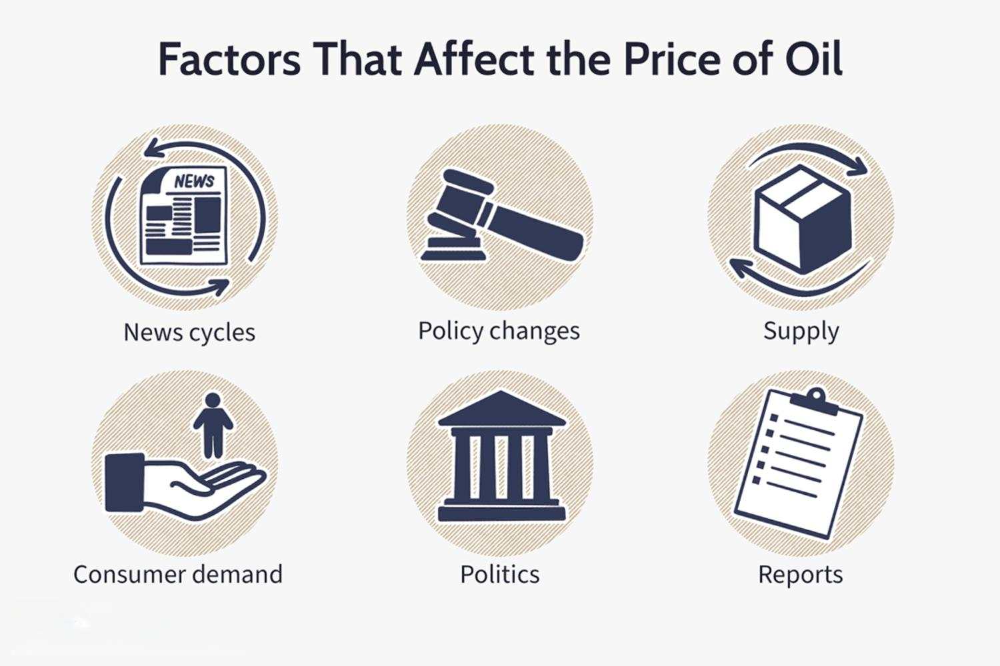

The global oil market is a volatile and complex financial arena shaped by a myriad of factors, including geopolitical tensions, climatic variations, and technological advancements. As the heartbeat of international trade and energy supply, the market experiences fluctuations driven by supply-demand dynamics, regulatory policies, and macroeconomic indicators. Traditionally dominated by manual trading methods, recent years have witnessed a significant transformation with the introduction of algorithmic trading and advanced technologies.

Algorithmic trading, which utilizes computer programs to execute trades based on predetermined criteria, has fundamentally reshaped investment practices within the oil sector. These sophisticated systems analyze vast datasets at remarkable speeds, enabling investors to make more informed decisions and capitalize on short-term market shifts. The adoption of machine learning and artificial intelligence further enhances the predictive capabilities of trading algorithms, offering a competitive edge in this fast-paced environment.

Investors, whether seasoned or new to the field, must recognize the importance of understanding these evolving components to successfully navigate oil investments. This article will explore current trends in the oil market, assess various investment strategies, and examine the impact of algorithmic trading on market dynamics.

By gaining insights into the intricacies of the oil markets and leveraging cutting-edge technologies, investors can more effectively manage risks and optimize their portfolios. Continuous learning and adaptation are essential as emerging technologies and strategies continue to redefine the investment landscape.

## Table of Contents

## Understanding the Oil Market

The oil market is shaped by a complex interplay of demand and supply dynamics, geopolitical factors, and technological innovations. These elements constantly influence oil prices, making them a subject of significant fluctuation. The demand for oil is predominantly driven by global economic activities, transportation needs, and industrial consumption. Conversely, supply is influenced by production levels, extraction technology, and geopolitical stability, particularly in oil-rich regions.

One of the pivotal organizations impacting oil prices is the Organization of the Petroleum Exporting Countries (OPEC). OPEC's production policies can lead to adjustments in supply that significantly impact global oil prices. Production cuts usually aim to increase prices, while increased production can lead to price decreases. For instance, if OPEC decides to reduce production by a certain number of barrels per day, this artificially constrains supply, potentially driving up prices if demand remains constant or increases.

Key players in the oil market include both major oil-producing countries like Saudi Arabia, Russia, and the United States, and significant oil companies such as ExxonMobil, Chevron, and Royal Dutch Shell. These entities have substantial influence over the production and distribution of oil. Understanding these players and their strategies is crucial for making informed investment decisions, as their actions can sway market conditions.

The oil market offers several investment vehicles through which investors can engage. One prominent method is through futures contracts, which are agreements to buy or sell oil at a predetermined price on a future date. Options also provide a means to speculate on price movements, offering the flexibility to buy or sell if certain conditions are met. Exchange-Traded Funds (ETFs) are another popular investment tool, allowing investors to buy shares that track the price of oil or an index of oil companies. These instruments enable diversification and are often considered less risky than direct investment in commodities.

In summary, the oil market is a dynamic environment influenced by various factors. Investors must consider demand and supply dynamics, geopolitical events, and technological changes when evaluating their strategies. Understanding the roles of significant market players and the various investment options available can provide a foundation for making informed decisions in this essential sector.

## Investment Strategies in the Oil Market

Investors in the oil market have various strategies to consider, each offering distinct avenues for potential profit and risk mitigation. A fundamental decision is whether to engage in direct investment by purchasing oil commodities themselves or to pursue indirect investment options such as oil-related stocks and mutual funds.

One popular indirect investment option is energy exchange-traded funds (ETFs), which provide a diversified approach to the oil industry. These ETFs are designed to track the performance of a basket of oil-related stocks, spreading risk across numerous companies rather than relying on the performance of a single entity. This diversification can be particularly beneficial in the oil market, which is subject to frequent [volatility](/wiki/volatility-trading-strategies) due to shifting supply-demand dynamics and geopolitical factors.

Hedging against inflation is another critical strategy for oil investors. Oil assets often serve as a hedge against inflation, as oil prices tend to rise when inflation accelerates. Including oil assets within a broader investment portfolio can help protect purchasing power in an inflationary environment by potentially offsetting the depreciating value of currency. This approach can be particularly appealing to investors seeking to preserve wealth over the long term.

However, effective risk management is essential in the oil market due to its inherently volatile nature. Investors must remain vigilant about potential geopolitical disruptions, such as conflict in oil-producing regions, which can lead to sudden price spikes or drops. Utilizing risk management strategies, investors might consider options contracts which allow them to set a predetermined price for buying or selling oil, thus offering protection against adverse price movements.

A continuous assessment of market conditions and adaptation to emerging trends is crucial. Incorporating advanced analytics and data-driven insights can enhance decision-making processes. For instance, leveraging [machine learning](/wiki/machine-learning) models to analyze historical price data and forecast future trends has become increasingly common among sophisticated investors.

In summary, the oil market offers diverse investment strategies, each with its unique set of risks and opportunities. By considering direct and indirect investment options, employing energy ETFs for diversification, and using oil assets as an inflation hedge, investors can better navigate the complexities of the market. Additionally, maintaining robust risk management practices and staying informed about geopolitical factors are vital to minimizing risks and maximizing potential returns.

## The Rise of Algorithmic Trading

Algorithmic trading is a method of executing orders using automated pre-programmed trading instructions accounting for variables such as time, price, and [volume](/wiki/volume-trading-strategy). It facilitates rapid trade execution, enabling investors to capitalize on market opportunities effectively. The core advantage of [algorithmic trading](/wiki/algorithmic-trading) lies in its capacity to process high volumes of data quickly, thereby enhancing decision-making efficiency compared to traditional trading methods. 

The advent of [artificial intelligence](/wiki/ai-artificial-intelligence) (AI) and machine learning has further augmented the capabilities of algorithmic trading systems. By leveraging machine learning algorithms, these systems can analyze vast datasets to identify patterns and predict future market trends. This predictive capability is particularly beneficial in volatile markets like [crude oil](/wiki/crude-oil), where the rapid fluctuation of prices demands swift and informed decision-making. Hence, investors equipped with advanced algorithms can better forecast price movements and react with agility, optimizing their profit margins.

In the oil market, various algorithmic trading strategies have been adopted by traders. One common technique is statistical [arbitrage](/wiki/arbitrage), which involves exploiting pricing inefficiencies between oil-related securities. For example, if an oil [ETF](/wiki/etf-trading-strategies) and a related oil futures contract become mispriced relative to one another, an algorithmic trading system can simultaneously sell the overpriced asset while buying the underpriced one, capitalizing on the spread.

Another strategy is mean reversion, which assumes that oil prices will revert to a long-term mean or average over time. Algorithms employing this strategy may analyze historical price data to identify deviances from the mean and execute trades anticipating a reversion to the average value. This strategy is particularly effective in a market characterized by frequent price oscillations, such as the oil market.

Momentum-based trading is also prevalent. This approach relies on the belief that asset prices, including crude oil, that have been moving strongly in one direction will continue to do so for a short period. Algorithms might track technical indicators such as moving averages or relative strength index (RSI) to determine and capitalize on these [momentum](/wiki/momentum) trends.

Despite its advantages, algorithmic trading is not devoid of challenges and implications for traders. High-frequency trading, a subset of algorithmic trading, can lead to market anomalies such as flash crashes due to the sheer speed and volume of trades being executed in milliseconds. Moreover, the prevalent use of algorithms intensifies competition, necessitating continuous advancements and optimizations in trading strategies to maintain an edge.

Algorithms require rigorous testing and continuous refinement; failures in algorithm design can lead to substantial financial losses. Thus, balancing algorithmic efficiency with risk management remains a critical consideration for traders in the oil market.

Overall, algorithmic trading emerges as a formidable force in the oil market, driven by the pursuit of efficiency and precision in trade executions. By embracing technological innovations, traders are better positioned to navigate the inherent volatility and complexity of oil investments, ensuring sustained profitability in a dynamic market landscape.

## Challenges and Risks

Algorithmic trading undeniably provides advantages in the oil market, particularly through its speed and efficiency. However, it carries inherent risks that require careful management. One of the primary concerns is technical failures. These can occur due to software bugs, unexpected market conditions, or infrastructure issues that disrupt communication between trading systems. An example of such a failure could be an algorithm making erroneous trades due to a misconfiguration or latency issues, leading to significant financial losses for traders.

Market anomalies also present a substantial risk in algorithmic trading. These anomalies occur when trading strategies do not behave as expected due to unforeseen market movements or high volatility, which is common in the oil market. Such events can trigger a cascade of automated reactions that exacerbate volatility, potentially destabilizing the market.

Regulatory concerns and ethical considerations must be addressed in algorithmic trading. High-frequency trading algorithms can produce an unfair advantage by executing trades at speeds unattainable by human traders. This can lead to regulatory scrutiny and ethical questions surrounding fairness and market manipulation. It’s crucial for regulatory bodies to constantly adapt and enforce rules that ensure fair trading practices while protecting market integrity.

Investors must actively monitor their algorithmic systems to minimize potential losses. Continuous performance assessment is essential, as is the ability to quickly intervene or adjust strategies when anomalies or technical failures occur. This proactive approach helps in identifying early signs of trouble and allows for swift corrective action.

Proper risk assessment is fundamental in mitigating risks associated with oil market investments. Diversification of strategies is a key element. By spreading investments across various strategies and instruments, traders can reduce exposure to specific risks. This diversification might involve using a mix of algorithmic and manual trading approaches, incorporating different asset classes, or employing strategies that perform well under varying market conditions.

In conclusion, while algorithmic trading offers significant benefits, navigating its challenges and risks is critical to preserving capital and achieving investment goals. A thoughtful balance between leveraging advanced technologies and maintaining rigorous oversight can aid in successfully tackling the complexities of the oil market.

## Conclusion

The oil market offers a wide array of both opportunities and challenges for investors who are willing to engage with this complex sector. A comprehensive understanding of market dynamics, investment strategies, and the applications of algorithmic trading is essential for making informed investment decisions. By mastering these components, investors can better navigate the fluctuations and intricacies inherent to the global oil market.

The investment landscape is continuously reshaped by emerging technologies and strategies. These advancements necessitate an ongoing commitment to learning and adaptation from investors, as keeping abreast of these developments can provide significant competitive advantages. Algorithmic trading, powered by machine learning and AI, exemplifies how technology is transforming traditional trading methodologies, allowing for more precise and data-driven decisions.

To optimize their oil market investments, investors should consider seeking guidance from financial experts who can offer specialized advice and insights. Leveraging data-driven tools and analytics can also be crucial in evaluating market trends and potential investment opportunities. This combined approach not only helps in managing risks but also enhances the potential for successful outcomes in oil market investments.

In conclusion, while the oil market presents its challenges, it also offers substantial rewards for those who are well-prepared and proactive in their investment strategies. Embracing technological innovations and maintaining a flexible, informed investment strategy can lead to long-term success in this volatile yet lucrative market.

## References & Further Reading

[1]: Oglend, A., & Sikveland, M. (2008). ["The volatility of oil prices and its impact on the economy."](https://www.jstor.org/stable/42629677) Journal of Economic Surveys.

[2]: Geman, H. (2005). ["Commodities and Commodity Derivatives: Modeling and Pricing for Agriculturals, Metals, and Energy."](https://www.wiley.com/en-us/Commodities+and+Commodity+Derivatives%3A+Modeling+and+Pricing+for+Agriculturals%2C+Metals+and+Energy-p-9780470012185) John Wiley & Sons.

[3]: Zhang, L., & Broadstock, D. C. (2017). ["The oil price and stock market nexus: A review of sixteen years of research."](https://www.sciencedirect.com/science/article/pii/S1544612320309983) Renewable and Sustainable Energy Reviews, 70.

[4]: ["Algorithmic and High-Frequency Trading"](https://www.cambridge.org/us/universitypress/subjects/mathematics/mathematical-finance/algorithmic-and-high-frequency-trading) by Álvaro Cartea, Sebastian Jaimungal, and José Penalva.

[5]: Kaminski, V. (2012). ["Energy Trading and Risk Management."](https://riskbooks.com/managing-energy-price-risk-4th-edition-1) Wiley Finance.

[6]: Irwin, S. H., & Sanders, D. R. (2012). ["Financialization and Structural Change in Commodity Futures Markets"](https://caia.org/sites/default/files/membersonly/Financialization_and_Structural_Change_in_Commodity_Future_Markets.pdf). Journal of Agricultural and Applied Economics.