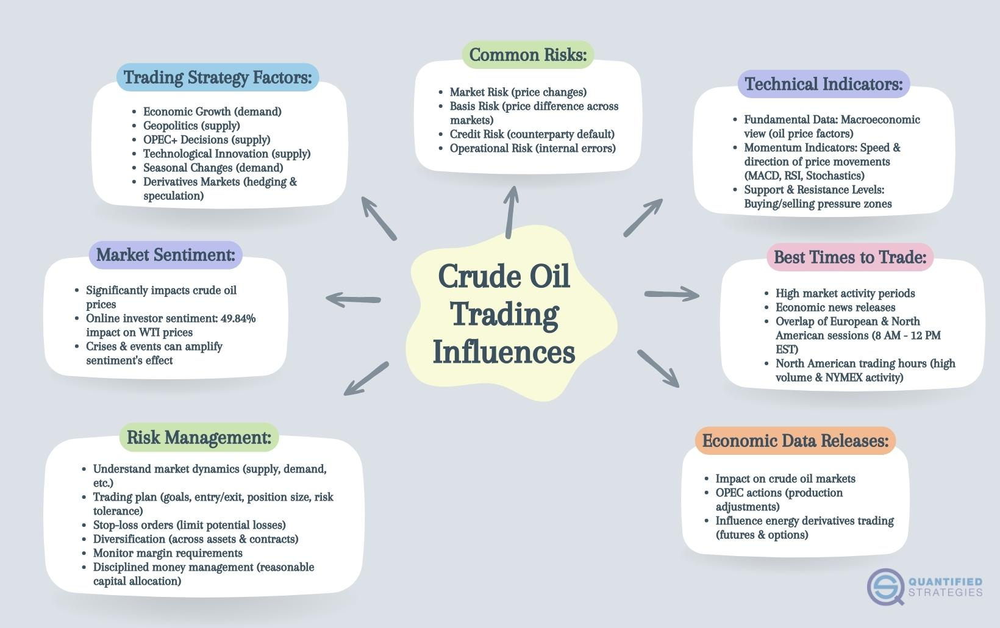

## Table of Contents

## What is the oil market and why is it important for investment?

The oil market is where people buy and sell oil. Oil is a very important resource that we use for many things like gasoline for cars, heating homes, and making plastics. The price of oil can go up and down based on how much people want it and how much is available. Countries that produce a lot of oil, like Saudi Arabia and the United States, have a big influence on the oil market.

Oil is important for investment because it affects many parts of the economy. When the price of oil changes, it can impact the cost of transportation, manufacturing, and even the price of food. Investors watch the oil market closely because it can help them predict how the economy will do. If they think the price of oil will go up, they might invest in oil companies or buy oil futures. This can be a way to make money, but it can also be risky because the oil market can be hard to predict.

## How does the global supply and demand affect oil prices?

Global supply and demand are the main things that decide how much oil costs. When there is a lot of oil available and not many people want it, the price goes down. This can happen if countries that make oil, like Saudi Arabia or Russia, decide to produce more oil. On the other hand, if there is not enough oil and a lot of people want it, the price goes up. This can happen if there are problems in oil-producing countries, like wars or natural disasters, that make it hard to get oil out of the ground.

Demand for oil can change because of what's happening in the world. For example, if the economy is doing well, more people are driving and factories are working a lot, so they need more oil. But if the economy is not doing well, people might drive less and factories might slow down, so they need less oil. Also, things like new technology or people choosing to use less oil can change how much oil people want. All these things together make the oil market go up and down, and that's why the price of oil can be hard to predict.

## What are the basic types of oil investments available to beginners?

For beginners looking to invest in oil, there are a few simple ways to get started. One way is to buy shares in oil companies. These companies explore for oil, drill for it, and sell it. When you buy their stock, you own a small part of the company. If the company does well and the price of oil goes up, the value of your shares might go up too. Some well-known oil companies you might have heard of are ExxonMobil and Chevron.

Another way to invest in oil is through exchange-traded funds (ETFs). ETFs are like baskets of stocks that you can buy and sell easily. Some ETFs focus just on oil and gas companies, so when you buy shares in these ETFs, you're investing in a bunch of oil companies at once. This can be a good way to spread out your risk because if one company doesn't do well, the others might make up for it.

Lastly, you can invest in oil futures. Futures are agreements to buy or sell oil at a certain price in the future. This can be a bit more complicated and risky, but it's a direct way to bet on what you think the price of oil will do. If you think the price of oil will go up, you can buy futures and hopefully sell them later for more money. But if the price goes down, you could lose money. It's important for beginners to learn more about futures before trying this kind of investment.

## How can geopolitical events influence oil market investments?

Geopolitical events can really shake up the oil market. If there's a war or a big political problem in a country that makes a lot of oil, it can mess with how much oil they can get out of the ground. For example, if there's fighting in the Middle East, it might make it hard for countries like Saudi Arabia or Iraq to keep their oil flowing. When this happens, the supply of oil goes down, and because there's less oil, the price can go up a lot. This can be good for people who own oil stocks or futures because their investments might become worth more money.

But it's not just about problems in oil-producing countries. Big changes in other parts of the world can affect how much oil people want. If there's a big economic crisis in a country that uses a lot of oil, like the United States or China, people might drive less and factories might slow down. This means they need less oil, and the price can go down. For investors, this can be tricky because they need to keep an eye on what's happening all over the world to guess what might happen to oil prices. Geopolitical events can make the oil market go up and down a lot, so it's important for investors to stay informed and be ready for surprises.

## What are the key indicators to watch when investing in the oil market?

When you're thinking about investing in the oil market, it's important to keep an eye on a few key things. One big thing to watch is the price of oil itself. You can look at the current price and see if it's going up or down over time. Another thing to pay attention to is how much oil is being produced around the world. If countries like Saudi Arabia or the United States are making more or less oil, it can change the supply and affect the price. Also, keep an eye on how much oil people are using. If the economy is doing well and people are driving more, they'll need more oil, which can push the price up.

Another important thing to watch is what's happening in the news, especially in countries that make a lot of oil. If there's a war or a big political problem, it might make it harder for them to get oil out of the ground, which can make the price go up. You should also look at reports from big groups like OPEC, which is made up of many oil-producing countries. They can decide to make more or less oil, and that can really change the market. Finally, keep an eye on new technology and changes in how people use energy. If more people start using electric cars or if new ways to get oil are found, it can change how much oil people need and what the price will be.

## How do futures and options work in the context of oil investments?

Futures and options are ways to invest in oil that can be a bit more complicated than just buying stocks or ETFs. A futures contract is an agreement to buy or sell oil at a certain price on a specific date in the future. If you think the price of oil will go up, you can buy a futures contract. If the price does go up by the time the contract is due, you can sell the contract for more money than you paid for it. But if the price goes down, you might lose money. Futures can be risky because they often involve borrowing money to make the trade, which can make your gains or losses bigger.

Options are a bit different. An option gives you the right, but not the obligation, to buy or sell oil at a certain price before a certain date. There are two types of options: calls and puts. A call option lets you buy oil at a set price, while a put option lets you sell oil at a set price. If you buy a call option and the price of oil goes up, you can use the option to buy oil at the lower price and then sell it at the higher market price, making a profit. If the price doesn't go up, you can just let the option expire and only lose the money you paid for the option. Options can be less risky than futures because you know the most you can lose upfront, but they can still be tricky to understand and use.

## What role do oil ETFs and mutual funds play in a diversified investment portfolio?

Oil ETFs and mutual funds can help you spread out your investments and lower your risk. When you buy an oil ETF or a mutual fund, you're not just putting your money into one company. Instead, you're investing in a whole bunch of oil companies all at once. This can be good because if one company doesn't do well, the others might make up for it. It's like not putting all your eggs in one basket. By having oil ETFs or mutual funds in your portfolio, you can balance out other investments you have, like stocks in different industries or bonds.

These kinds of investments can also help you keep an eye on the oil market without having to know everything about it. Oil ETFs and mutual funds are managed by people who know a lot about the oil industry. They pick which companies to invest in and keep track of how they're doing. This can save you time and help you feel more confident about your investments. Plus, because oil is such an important part of the economy, having some of your money in oil ETFs or mutual funds can help you take advantage of changes in oil prices, which can affect many other parts of the market.

## How can an investor use technical analysis to make decisions in the oil market?

Technical analysis is a way for investors to look at past prices and trading patterns to guess where the price of oil might go next. They use charts and graphs to spot trends and patterns. For example, if the price of oil has been going up and up, they might think it will keep going up. Or if the price has been bouncing back and forth between two points, they might think it will keep doing that for a while. They look at things like moving averages, which smooth out price changes over time, and support and resistance levels, which are prices where the oil price tends to stop going down or up.

Investors also use other tools like the Relative Strength Index (RSI) to see if the oil price is too high or too low. If the RSI is very high, it might mean the price is about to go down because it's been going up too fast. If it's very low, it might mean the price is about to go up because it's been going down too fast. By looking at all these things, investors can make better guesses about when to buy or sell oil. But remember, technical analysis is not perfect and it's just one way to make decisions. It's always good to use it along with other kinds of information, like what's happening in the world and how much oil is being made and used.

## What are the risks associated with investing in oil, and how can they be mitigated?

Investing in oil can be risky because the price of oil can go up and down a lot. This can happen because of things like wars or big changes in the economy. If you invest in oil and the price goes down a lot, you could lose money. Another risk is that oil companies can have problems, like accidents or not finding enough oil. Also, the world is trying to use less oil because of climate change, so in the future, people might not need as much oil. This can make the price go down and hurt your investment.

To lower these risks, you can spread out your money by investing in different things, not just oil. This way, if the price of oil goes down, you might still make money from your other investments. Another way to be safer is to learn about the oil market and keep up with the news. If you know what's going on, you can make better choices about when to buy or sell. Also, you can use tools like ETFs or mutual funds that invest in a lot of oil companies at once. This can help because if one company does badly, the others might do better and balance it out.

## How do environmental policies and the shift towards renewable energy impact oil market strategies?

Environmental policies and the shift towards renewable energy are changing the oil market. Governments around the world are making rules to cut down on pollution and use less oil. These rules can make it harder for oil companies to do business. For example, they might have to pay more money to follow the new rules or they might not be able to drill for oil in some places. This can make the price of oil go down because there might be less demand for it. Oil companies have to think about these rules when they make plans for the future.

The move to renewable energy, like wind and solar power, is also affecting the oil market. More and more people are using electric cars and getting their energy from clean sources. This means they need less oil. Oil companies are trying to find new ways to make money, like investing in renewable energy themselves or finding new places to sell their oil. Investors need to think about these changes when they decide where to put their money. They might want to look at oil companies that are also working on renewable energy, because those companies might do better in the future.

## What advanced strategies can expert investors use to capitalize on oil market volatility?

Expert investors can use a few smart strategies to make money from the ups and downs of the oil market. One way is called hedging. This means they buy and sell things at the same time to protect themselves from big price changes. For example, they might buy oil futures and also buy options that let them sell oil at a certain price. If the price of oil goes down, the options can help them not lose as much money. Another strategy is called swing trading. This is when investors try to buy oil when the price is low and sell it when the price goes up a bit. They look at charts and patterns to guess when the price might go up or down.

Another advanced strategy is called spread trading. This is when investors buy and sell different kinds of oil contracts at the same time. They might buy oil that will be delivered soon and sell oil that will be delivered later. If the difference between these prices changes, they can make money. Expert investors also use something called algorithmic trading. This means they use computer programs to buy and sell oil very quickly based on what's happening in the market. These programs can spot small changes in price and make trades faster than a person could. All these strategies need a lot of knowledge and can be risky, but they can help expert investors make money even when the oil market is going up and down a lot.

## How can algorithmic trading be applied to oil market investments for expert-level strategies?

Algorithmic trading can help expert investors make money in the oil market by using computer programs to buy and sell oil very quickly. These programs look at a lot of data, like past prices and how much oil people are using, to spot small changes in the market. When they see a chance to make money, they can make trades faster than a person could. This is good because the oil market can change a lot, and being able to act fast can help investors take advantage of these changes. For example, if the program sees that the price of oil is about to go up, it can buy oil right away and then sell it later for more money.

Another way algorithmic trading can be used is by setting up rules for when to buy and sell oil. These rules can be based on things like moving averages, which show the average price of oil over time, or other patterns that the program can spot. This helps investors stick to a plan and not make decisions based on feelings. It can also help them trade in a way that spreads out their risk, like buying and selling different kinds of oil contracts at the same time. This is called spread trading, and it can help investors make money even when the oil market is going up and down a lot.

## References & Further Reading

[1]: Oglend, A., & Sikveland, M. (2008). ["The volatility of oil prices and its impact on the economy."](https://www.jstor.org/stable/42629677) Journal of Economic Surveys.

[2]: Geman, H. (2005). ["Commodities and Commodity Derivatives: Modeling and Pricing for Agriculturals, Metals, and Energy."](https://www.wiley.com/en-us/Commodities+and+Commodity+Derivatives%3A+Modeling+and+Pricing+for+Agriculturals%2C+Metals+and+Energy-p-9780470012185) John Wiley & Sons.

[3]: Zhang, L., & Broadstock, D. C. (2017). ["The oil price and stock market nexus: A review of sixteen years of research."](https://www.sciencedirect.com/science/article/pii/S1544612320309983) Renewable and Sustainable Energy Reviews, 70.

[4]: ["Algorithmic and High-Frequency Trading"](https://www.cambridge.org/us/universitypress/subjects/mathematics/mathematical-finance/algorithmic-and-high-frequency-trading) by Álvaro Cartea, Sebastian Jaimungal, and José Penalva.

[5]: Kaminski, V. (2012). ["Energy Trading and Risk Management."](https://riskbooks.com/managing-energy-price-risk-4th-edition-1) Wiley Finance.

[6]: Irwin, S. H., & Sanders, D. R. (2012). ["Financialization and Structural Change in Commodity Futures Markets"](https://caia.org/sites/default/files/membersonly/Financialization_and_Structural_Change_in_Commodity_Future_Markets.pdf). Journal of Agricultural and Applied Economics.