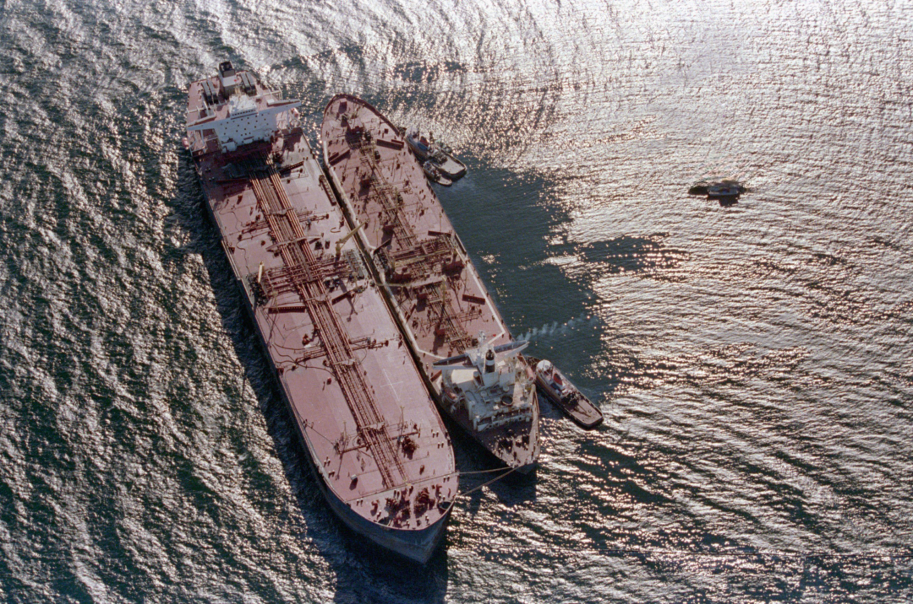

## Table of Contents

## What is the Oil Pollution Act of 1990?

The Oil Pollution Act of 1990 is a law in the United States that was created to prevent oil spills and to make sure that companies clean up any oil they spill. This law was made after a big oil spill happened from the Exxon Valdez ship in Alaska. The law says that companies have to have plans to stop oil spills and to clean them up if they happen. It also says that companies must pay for the damage that oil spills cause to the environment and to people's lives.

The Oil Pollution Act also set up a big fund, called the Oil Spill Liability Trust Fund, to help pay for cleaning up oil spills when the company responsible cannot or will not pay. This fund is paid for by a tax on oil. The law also made the U.S. Coast Guard in charge of making sure that ships and oil facilities follow the rules to prevent oil spills. The Oil Pollution Act helps to keep our waters clean and safe from oil pollution.

## What was the main trigger for the enactment of the Oil Pollution Act of 1990?

The main reason for the Oil Pollution Act of 1990 was a big oil spill from the Exxon Valdez ship in Alaska. This spill happened in 1989 and it was one of the worst oil spills in U.S. history. It caused a lot of damage to the environment and hurt many animals and plants. People were very upset about it and wanted to make sure it wouldn't happen again.

Because of the Exxon Valdez spill, the government decided to make new rules to prevent oil spills and to clean them up if they do happen. They made the Oil Pollution Act to make companies responsible for their oil and to pay for any damage they cause. This law helped to make the water safer and cleaner for everyone.

## What are the primary goals of the Oil Pollution Act of 1990?

The main goal of the Oil Pollution Act of 1990 is to stop oil spills from happening. This law makes companies have plans to prevent oil from spilling into the water. It also makes sure that ships and oil facilities follow strict rules to keep oil safe. By doing this, the law helps protect the environment and keeps our water clean.

Another important goal is to make sure that if an oil spill does happen, it gets cleaned up quickly and properly. The law says that the company that caused the spill must pay for the cleanup and for any damage the spill causes. If the company cannot pay, a special fund called the Oil Spill Liability Trust Fund helps with the costs. This way, the environment and people's lives are protected from the harm of oil spills.

## Who does the Oil Pollution Act of 1990 apply to?

The Oil Pollution Act of 1990 applies to anyone who works with oil in the United States. This includes big oil companies, ships that carry oil, and places where oil is stored or moved around. The law makes sure that these people and companies follow rules to stop oil spills from happening.

The law also applies to anyone who might cause an oil spill, even if it's by accident. If an oil spill happens, the people or companies responsible have to clean it up and pay for any damage it causes. This helps keep our water and environment safe from oil pollution.

## What types of oil and oil-related substances are covered under the Act?

The Oil Pollution Act of 1990 covers many types of oil and oil-related substances. This includes crude oil, which is the oil that comes straight from the ground, and refined oil products like gasoline, diesel, and jet fuel. These are the oils that people use every day in cars, planes, and other machines.

The Act also covers other oil-related substances like oil sludge, oil refuse, and oil mixed with other things. These substances can be very harmful if they spill into the water. By including all these types of oil and oil-related substances, the law helps to protect our environment from the damage that oil spills can cause.

## What are the key provisions of the Oil Pollution Act of 1990?

The Oil Pollution Act of 1990 has several important rules to stop oil spills and clean them up if they happen. One key rule is that companies must have plans to prevent oil spills. These plans include ways to stop oil from spilling into the water and what to do if a spill happens. The law also makes ships and oil facilities follow strict safety rules to keep oil safe. This helps to protect the environment and keep our water clean.

Another important part of the law is that it makes companies pay for cleaning up oil spills and any damage they cause. If a company causes an oil spill, they have to pay for the cleanup and fix any harm done to people or the environment. If the company cannot pay, a special fund called the Oil Spill Liability Trust Fund helps with the costs. This fund is paid for by a tax on oil, and it makes sure that oil spills are cleaned up even if the company responsible cannot pay.

The Oil Pollution Act also gives the U.S. Coast Guard the job of making sure that everyone follows these rules. The Coast Guard checks ships and oil facilities to make sure they are safe and following the law. By doing this, the Act helps to prevent oil spills and keep our water safe for everyone.

## How does the Act define and handle oil spill liability?

The Oil Pollution Act of 1990 says that if a company causes an oil spill, they have to pay for cleaning it up and fixing any damage it causes. This is called oil spill liability. The law makes sure that the company responsible pays for everything, including the cost of cleaning the spill, helping the environment recover, and paying people who are affected by the spill. This rule helps make sure that companies are careful with oil and do everything they can to stop spills from happening.

If the company that caused the spill cannot pay for everything, there is a special fund called the Oil Spill Liability Trust Fund. This fund helps pay for the cleanup and damage if the company cannot. The money for this fund comes from a tax on oil, so it's always ready to help when needed. This way, even if a company goes bankrupt or refuses to pay, the spill will still get cleaned up, and people and the environment will be taken care of.

## What are the financial responsibility requirements under the Oil Pollution Act of 1990?

The Oil Pollution Act of 1990 says that oil companies must have enough money to clean up oil spills and pay for any damage they cause. This is called financial responsibility. The law makes sure that companies can cover the costs if something goes wrong. For example, tank vessels need to show they can pay up to $3,200 per gross ton or $6 million, whichever is less. For non-tank vessels, they need to show they can pay up to $1,000 per gross ton or $950,000, whichever is less. This money helps make sure that if there's a spill, the company can take care of it without leaving the mess for others to clean up.

If a company cannot pay for the cleanup and damage after an oil spill, there is a special fund called the Oil Spill Liability Trust Fund. This fund helps pay for the costs when the company responsible cannot or will not pay. The money for this fund comes from a tax on oil, so it's always ready to help when needed. This way, even if a company goes bankrupt or refuses to pay, the spill will still get cleaned up, and people and the environment will be taken care of.

## How does the Oil Pollution Act of 1990 address the issue of oil spill response and cleanup?

The Oil Pollution Act of 1990 makes sure that oil spills get cleaned up quickly and properly. It says that if a company causes an oil spill, they have to have a plan ready to stop the spill and clean it up. The plan includes steps to control the spill and ways to remove the oil from the water. The law also makes the U.S. Coast Guard check that these plans are good and that companies follow them. This helps make sure that if an oil spill happens, it gets cleaned up fast to protect the environment and people's lives.

If a company cannot pay for the cleanup, there is a special fund called the Oil Spill Liability Trust Fund. This fund helps pay for the costs of cleaning up the spill and fixing any damage it causes. The money for this fund comes from a tax on oil, so it's always ready to help when needed. This way, even if a company goes bankrupt or refuses to pay, the spill will still get cleaned up, and the environment and people will be taken care of. The Oil Pollution Act helps make sure that oil spills are handled responsibly and that our waters stay clean and safe.

## What are the penalties for non-compliance with the Oil Pollution Act of 1990?

The Oil Pollution Act of 1990 has strict rules to make sure companies follow the law. If a company does not follow the rules, they can face big fines. The fines can be up to $25,000 for each day the company breaks the law. If the company causes an oil spill on purpose, the fines can be even higher, up to $3,000 per barrel of oil spilled. These fines help make sure that companies take oil spills seriously and do everything they can to stop them from happening.

Besides fines, people who break the law can also go to jail. If someone causes an oil spill on purpose, they can be sent to prison for up to five years. This rule makes sure that people think twice before doing something that could harm the environment. By having these penalties, the Oil Pollution Act helps keep our water clean and safe from oil pollution.

## How has the Oil Pollution Act of 1990 been amended or updated since its enactment?

Since it was made in 1990, the Oil Pollution Act has been changed a few times to make it better. One big change happened in 2006 with the Coast Guard and Maritime Transportation Act. This change made the rules about how much money companies need to have for oil spill cleanup even clearer. It also made the rules about the Oil Spill Liability Trust Fund better, so the fund could help more with cleaning up oil spills when companies cannot pay.

Another important update came in 2010 after the Deepwater Horizon oil spill. This spill was very bad and showed that the law needed to be stronger. The government made new rules to make sure oil companies have better plans to stop oil spills and clean them up if they happen. These changes help make sure that the Oil Pollution Act keeps working well to protect our water and environment from oil spills.

## What are some case studies or examples of the Oil Pollution Act of 1990 being applied in real-world scenarios?

One big example of the Oil Pollution Act of 1990 being used was after the Deepwater Horizon oil spill in 2010. This spill happened in the Gulf of Mexico and was one of the worst in U.S. history. The Act made BP, the company responsible, pay for cleaning up the spill and fixing the damage it caused. BP had to pay billions of dollars to clean up the oil and help the environment and people who were hurt by the spill. This showed how the Oil Pollution Act makes sure that companies are responsible for their oil and have to fix any problems they cause.

Another example is the Cosco Busan oil spill in San Francisco Bay in 2007. A ship called the Cosco Busan hit a bridge and spilled oil into the bay. The Oil Pollution Act made the company that owned the ship pay for cleaning up the spill and fixing the damage. They had to pay for the cleanup and help the animals and plants that were hurt by the oil. This case showed that the Act applies to all kinds of oil spills, even ones caused by accidents, and makes sure that the environment is protected.

## References & Further Reading

[1]: ["The Oil Pollution Act of 1990: A Retrospective" (20-Year Review)](https://www.jstor.org/stable/pdf/44174442.pdf) by the U.S. Environmental Protection Agency

[2]: ["Exxon Valdez Oil Spill: Fate and Effects in Alaskan Waters"](https://asmedigitalcollection.asme.org/astm-ebooks/book/1888/Exxon-Valdez-Oil-Spill-Fate-and-Effects-in-Alaskan) by University of Alaska Sea Grant College Program

[3]: ["Algorithmic Trading: Winning Strategies and Their Rationale"](https://books.google.com/books/about/Algorithmic_Trading.html?id=WAlFDwAAQBAJ) by Ernest P. Chan

[4]: ["Finance and Trading in Oil Markets"](https://www.markets.com/education-centre/crude-oil-commodity/) by Andrei V. Belyi

[5]: ["The Cost of Oil Spills in U.S. Waters" (Congressional Report)](https://nationalaglawcenter.org/wp-content/uploads/assets/crs/RL33705.pdf) by Congressional Research Service (CRS)

[6]: ["Environmental Economics and Natural Resource Management"](https://www.taylorfrancis.com/books/mono/10.4324/9781003428732/environmental-economics-natural-resource-management-david-anderson) by David A. Anderson