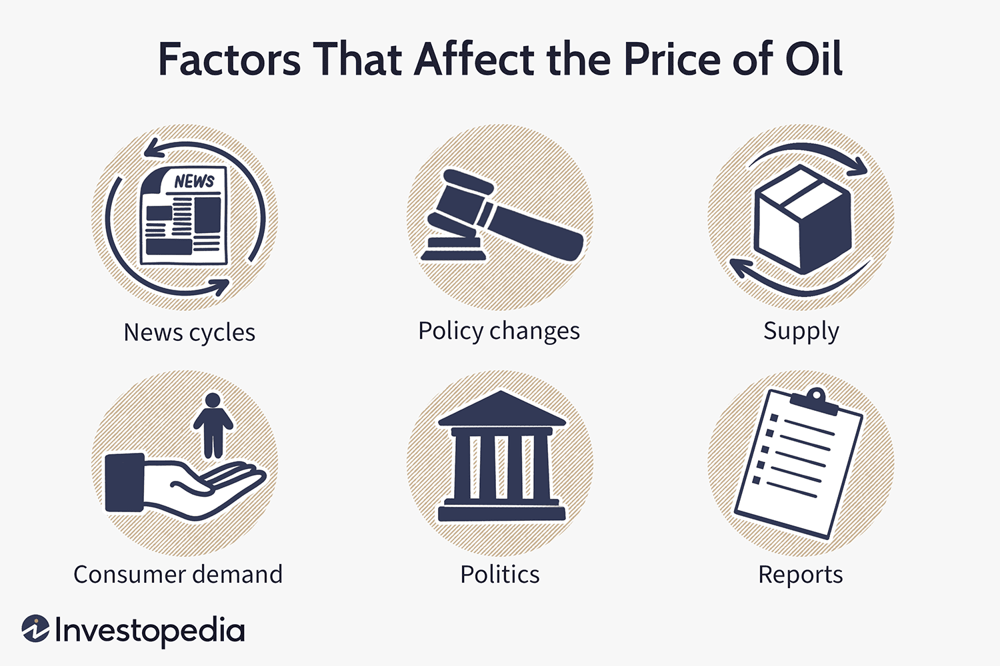

The global oil market holds significant influence over the world economy, primarily because of its extensive use in various industries and its critical role in energy production. Oil is a fundamental resource affecting everything from transportation and manufacturing to domestic energy consumption. As such, its pricing dynamics have far-reaching implications, impacting national economies and global trade patterns.

In examining the factors that determine oil prices, it is crucial to consider the interplay of supply and demand, geopolitical events, and the modern influence of algorithmic trading. Supply and demand serve as the foundational principles, where fluctuations in oil production or consumption can rapidly alter prices. An increase in supply typically results in lower prices, while heightened demand can lead to price surges. Additionally, geopolitical factors, including conflicts or regulatory changes in oil-producing regions, can disrupt supply chains and introduce significant volatility to the market.



Algorithmic trading adds a complex layer to oil pricing dynamics by leveraging technology to optimize trading decisions. These algorithms can process extensive datasets to detect market trends and execute trades at speeds beyond human capability, potentially influencing price movements by driving volume and liquidity. As a result, algorithmic trading introduces unique patterns of volatility that differ from traditional trading methods.

Understanding the intricacies of these dynamics is vital for investors, traders, and policymakers who must navigate the complex landscape of the oil market. This article aims to provide in-depth insights into how these mechanisms interact and influence oil prices, ultimately affecting economic outcomes on a global scale.

## Table of Contents

## The Fundamentals of Supply and Demand in Oil Pricing

Oil prices are fundamentally governed by the principles of supply and demand, forming the cornerstone of market economics. The relationship is straightforward: when supply exceeds demand, prices tend to fall, and when demand outpaces supply, prices rise. 

**Supply Factors**

The supply side of the oil market is influenced by production rates and oil reserves. Production rates refer to the quantity of oil extracted and processed by oil-producing countries and companies. Countries like Saudi Arabia, Russia, and the United States play pivotal roles given their significant contributions to global oil production. Oil reserves, defined as quantities of [crude oil](/wiki/crude-oil) that can be economically extracted and refined, also influence supply. Technological advancements and exploration efforts can lead to discoveries of new reserves, subsequently affecting global supply levels. 

Additionally, regulatory policies, geopolitical stability, and investment in oil infrastructure play critical roles. For instance, an increase in geopolitical tensions or regulatory restrictions can reduce supply, thereby increasing prices.

**Demand Factors**

Demand for oil is largely driven by global economic conditions. In times of economic expansion, industrial activities increase, leading to higher energy and fuel requirements, thus boosting demand for oil. Conversely, during economic downturns, reduced industrial output and transportation needs lead to diminished demand. 

Technological advancements and shifts in consumer behavior also impact demand. The global push towards renewable energy sources and improvements in fuel efficiency reduce dependency on oil, potentially decreasing demand over time. Furthermore, seasonal variations can cause fluctuations in demand; for example, colder winters in the Northern Hemisphere often increase demand for heating oil.

**Supply-Demand Dynamics**

The interplay between supply and demand is complex and often volatile, influenced by both predictable patterns and unforeseen events. Factors such as natural disasters, political decisions, and technological disruptions can cause sudden shifts in supply or demand, leading to price [volatility](/wiki/volatility-trading-strategies). 

Mathematically, the equilibrium price of oil can be represented through simple supply and demand functions:

$$
Q_d = a - bP
$$

$$
Q_s = c + dP
$$

where $Q_d$ and $Q_s$ denote the quantity demanded and supplied, respectively, $P$ represents the price of oil, and $a$, $b$, $c$, and $d$ are coefficients determined by market conditions.

The equilibrium price is reached when:

$$
Q_d = Q_s
$$

Solving for $P$ gives the equilibrium price, providing insights into market behavior under different economic scenarios.

Understanding these dynamics is essential for predicting price changes and making informed trading decisions. For investors and policymakers, recognizing the signals of supply shocks or demand surges can provide advantages in navigating the complexities of the oil market.

## Influence of OPEC and Geopolitical Factors

The Organization of the Petroleum Exporting Countries (OPEC) significantly influences global oil prices by coordinating the oil production levels of its member countries. Established in 1960, OPEC seeks to regulate the supply of oil to maintain market stability, thus ensuring fair returns for oil producers and a steady supply for consumers. Through its decisions on production quotas, OPEC can effectively set the tone for global oil markets. When OPEC announces production cuts, it often leads to a reduction in supply, which can drive prices upward. Conversely, an increase in production quotas can lead to a surplus in the market, causing prices to decline.

Geopolitical factors also critically impact oil pricing. Geopolitical tensions, such as conflicts, sanctions, and regional instability, particularly in oil-rich areas like the Middle East, can lead to supply disruptions. For instance, political instability or military conflicts in key oil-producing countries can result in significant shifts in oil supply, thereby increasing market volatility and driving prices up. The Iranian Revolution of 1979 and the Gulf War in 1990 are historical examples where geopolitical unrest led to sharp increases in oil prices due to perceived or actual supply threats.

These geopolitical events often interact with OPEC's strategies, compounding their effects on the oil market. For example, if an OPEC member faces internal conflict or sanctions, it may not be able to meet its production targets, thereby reducing the overall supply of oil. Such conditions can lead to speculative trading, where traders anticipate changes in supply that can further exacerbate price fluctuations.

Overall, the interplay between OPEC decisions and geopolitical events contributes to a complex and often unpredictable oil pricing environment. Monitoring both OPEC's strategic outputs and geopolitical developments can provide a comprehensive understanding of the factors driving volatility in the oil markets, which is crucial for market participants in making informed decisions.

## Algorithmic Trading and Its Impact on Oil Prices

Algorithmic trading has significantly reshaped the landscape of oil trading by automating and accelerating trading decisions. This technological advancement involves the use of pre-programmed instructions and sophisticated algorithms that analyze extensive datasets to pinpoint trading opportunities. By leveraging high-speed data processing, these algorithms can execute trades at a pace unattainable by human traders, thus reducing human error and bias in decision-making. 

The core of [algorithmic trading](/wiki/algorithmic-trading) lies in its ability to process and react to market information with extraordinary speed and precision. In the context of the oil market, algorithms assess a variety of factors such as historical prices, trading volumes, macroeconomic indicators, and real-time news events to make informed trading decisions. This ability to integrate diverse data sources allows for more strategic positioning in response to market fluctuations.

However, while enhancing trading efficiency, algorithmic trading also introduces new patterns of volatility in the oil market. The speed and [volume](/wiki/volume-trading-strategy) associated with algorithmic transactions can lead to abrupt price movements as large trades are executed in short time frames. This can amplify existing market trends or reverse them suddenly, contributing to increased market volatility.

Moreover, the strategies employed by these algorithms, such as high-frequency trading ([HFT](/wiki/high-frequency-trading-strategies)) and statistical [arbitrage](/wiki/arbitrage), can further contribute to volatility. High-frequency trading, for instance, involves executing a large number of orders at extremely high speeds, making profits from tiny price discrepancies. This can lead to rapid changes in oil prices, as algorithms capitalize on transient market inefficiencies before they are corrected.

Despite these challenges, algorithmic trading offers distinct advantages. It enhances market [liquidity](/wiki/liquidity-risk-premium) by ensuring continuous trading activity and tighter bid-ask spreads. Additionally, by removing emotional and psychological factors from trading decisions, algorithmic systems can maintain consistent trading behaviors aligned with predefined strategies.

In summary, while algorithmic trading brings efficiency and precision to oil trading, it also introduces complexities such as augmented volatility. The balance between leveraging the benefits of automation and managing its challenges is crucial for market participants aiming to navigate the intricate dynamics of the oil market successfully.

## Developing Successful Trading Strategies in Oil Markets

Developing a successful trading strategy in oil markets requires an integrated approach that combines both fundamental and technical analysis. Fundamental analysis involves evaluating economic indicators, geopolitical events, and supply-demand dynamics to assess market trends and potential price movements. Technical analysis, on the other hand, focuses on historical price patterns, chart patterns, and statistical indicators to forecast future price movements.

One effective strategy for evaluating the success of a trading plan is [backtesting](/wiki/backtesting), which involves applying the strategy to historical data to see how it would have performed in past market conditions. Backtesting can provide valuable insights into a strategy's potential profitability and risk exposure. Optimization is another critical step, where strategies are fine-tuned based on past performance data to enhance their effectiveness in current market climates.

Risk management is another cornerstone of a successful trading strategy. This involves using techniques such as stop-loss orders, which automatically close a trade when it reaches a certain loss threshold, thus protecting against significant losses. Position sizing is equally important, determining the amount of capital to allocate to each trade relative to account size and risk tolerance. For instance, employing the formula:

$$
\text{Position Size} = \frac{\text{Account Risk} \times \text{Account Balance}}{\text{Trade Risk}}
$$

can help determine the appropriate capital allocation per trade, where account risk is the percentage of the total account balance one is willing to risk per trade, and trade risk is the difference between the entry price and the stop-loss price.

Successful trading also involves continuous learning and adjustment. Market conditions are always evolving, necessitating regular reviews and updates to trading strategies. This dynamic approach helps traders to stay responsive to market changes and maintain a competitive edge. By integrating comprehensive analysis with rigorous risk management and continuous strategy refinement, traders can better navigate the complexities of the oil market and enhance their chances of sustained success.

## Tools and Platforms for Algorithmic Oil Trading

Algorithmic trading in oil markets has gained prominence due to its ability to execute complex trading strategies at high speeds and precision. Several platforms have been developed to facilitate this process, offering a range of tools for traders and developers.

NinjaTrader, MetaTrader, and QuantConnect are among the most popular platforms used in the trading community. These platforms provide comprehensive functionalities that enable traders to develop, test, and implement trading algorithms efficiently.

**NinjaTrader** is a versatile platform known for its advanced charting and analysis features. It offers backtesting capabilities that allow traders to evaluate the performance of their strategies over historical data. NinjaTrader also supports C# programming, which is necessary for developing custom indicators and automated strategies within the platform.

**MetaTrader** (particularly MetaTrader 4 and MetaTrader 5) is renowned for its widespread use in forex and commodities trading. Offering a customizable trading environment, MetaTrader includes a built-in scripting language known as MQL4/MQL5. This language supports the creation of automated trading robots and custom technical indicators. The platform's community and market further enhance its offering, providing traders with a vast library of scripts and tools.

**QuantConnect** is an open-source algorithmic trading platform that stands out for its support of multiple asset classes, including equities, forex, and commodities like oil. It uses the cloud for high-performance computing and offers a free algorithm development environment with LEAN, its open-source algorithmic trading engine. QuantConnect uses Python and C#, making it accessible to developers familiar with these languages. The platform's integration with data sources and brokerage APIs facilitates real-time data access and order execution.

Proficiency in programming languages such as Python is crucial when utilizing these platforms, as most require scripting for strategy development. Access to reliable APIs is another important aspect, as they provide real-time data and trading execution capabilities. The use of Python often involves libraries such as `numpy` and `pandas` for data analysis and manipulation, and `matplotlib` or `Plotly` for visualization of trading patterns and backtesting results. Below is an example code snippet in Python to illustrate a simple moving average crossover strategy:

```python
import pandas as pd
import numpy as np

# Load historical data
data = pd.read_csv('oil_price_data.csv')
data['SMA20'] = data['Close'].rolling(window=20).mean()
data['SMA50'] = data['Close'].rolling(window=50).mean()

# Define buy and sell signals
data['Signal'] = 0  # Default to no signal
data['Signal'][20:] = np.where(data['SMA20'][20:] > data['SMA50'][20:], 1, -1)

# Backtest strategy performance
data['Returns'] = data['Close'].pct_change()
data['StrategyReturns'] = data['Returns'] * data['Signal'].shift(1)

# Plot strategy returns
import matplotlib.pyplot as plt

plt.plot(data['StrategyReturns'].cumsum(), label='Strategy Returns')
plt.xlabel('Time')
plt.ylabel('Cumulative Returns')
plt.legend()
plt.show()
```

In conclusion, choosing the right platform is essential for leveraging algorithmic strategies effectively in oil trading. Each platform offers unique features, and the choice depends on the trader's specific needs, programming skills, and the complexity of the algorithmic strategies they intend to deploy.

## Challenges and Risk Management in Oil Algo Trading

Algorithmic oil trading introduces various challenges that market participants must navigate to achieve successful outcomes. One primary challenge in this domain is the risk of system failures. As trading decisions are increasingly automated, the reliance on technological infrastructure becomes a potential point of vulnerability. Hardware malfunctions, software bugs, and connectivity issues can disrupt trading operations, leading to unintended market positions or losses. To mitigate these issues, firms should implement robust system redundancies, ensuring that backup systems and contingency plans are in place to maintain trading continuity during unexpected technical disruptions.

Another significant challenge is the potential for market misinterpretations by trading algorithms. These algorithms analyze vast amounts of data to identify trends and execute trades, but they can also misinterpret market signals, particularly in volatile or choppy markets. Algorithms may react to temporary price movements or misjudge the impact of macroeconomic news, leading to inappropriate trading actions. To address this, algorithm developers must ensure that their models incorporate comprehensive data sources and are regularly updated to reflect changes in market dynamics and sentiment.

Effective risk management strategies are critical in algorithmic oil trading to reduce potential financial losses. One common approach is the use of stop-loss orders, which automatically close a position once it reaches a predetermined loss threshold. This technique helps prevent significant losses during unfavorable market movements. Additionally, position sizing strategies are crucial for managing risk exposure. Traders can calculate optimal position sizes using formulas like the Kelly Criterion, which maximizes expected logarithmic wealth by balancing the trade-off between risk and reward.

Regular evaluation and adaptation of trading strategies are essential to maintain their effectiveness in the face of evolving market conditions. Markets are dynamic, and factors influencing oil prices, such as geopolitical events or changes in supply and demand, can shift rapidly. Traders must continuously backtest their algorithms using historical data while incorporating real-time feedback to fine-tune their strategies. This iterative process ensures that trading models remain relevant and aligned with current market conditions.

In conclusion, while algorithmic oil trading offers significant advantages in efficiency and execution speed, it also presents challenges that necessitate careful risk management and system oversight. By implementing robust technical infrastructures, leveraging stop-loss mechanisms, and continuously adapting trading algorithms, market participants can effectively navigate the complexities of the oil market and optimize their trading outcomes.

## Conclusion

Understanding the dynamics of the oil market, comprising economic indicators and the role of algorithmic trading, is essential for successful trading. The integration of economic data with algorithmic strategies provides a significant competitive advantage in this complex environment. Economic indicators such as GDP growth rates, employment figures, and inflation data can signal changes in oil demand, while supply-side factors, including production rates and geopolitical events, affect market supply.

Algorithmic trading integrates these economic indicators into sophisticated models, enabling rapid processing of large datasets to identify trading opportunities. These algorithms can systematically analyze trends and patterns, providing traders with insights that might not be immediately apparent through manual observation. For instance, [machine learning](/wiki/machine-learning) models can predict price movements based on historical data and current market conditions, refining trading decisions continuously.

Investors must remain vigilant and adaptable to rapid changes in market dynamics to capitalize on opportunities efficiently. This adaptability requires not only staying informed about current market trends and news but also continuously updating trading algorithms to reflect new data and insights. Regular performance evaluation and strategy optimization are crucial, as they ensure that trading strategies remain effective in evolving market conditions.

Adopting such an informed and flexible approach allows traders to effectively manage risks, optimize trading performance, and potentially achieve better returns in the ever-changing landscape of the global oil market. In conclusion, the confluence of economic insights and algorithmic acumen represents an important evolution in trading strategy, promising increased efficiency and accuracy in decision-making processes.

## References & Further Reading

[1]: Hamilton, J. D. (2008). ["Understanding Crude Oil Prices."](https://www.jstor.org/stable/41323239) The Brookings Institution.

[2]: Kaufmann, R. K., & Ullman, B. (2009). ["Oil prices, speculation, and fundamentals: Interpreting causal relations among spot and futures prices."](https://www.sciencedirect.com/science/article/pii/S0140988309000243) Energy Economics, 31(4), 550-558.

[3]: Alquist, R., & Kilian, L. (2010). ["What Do We Learn from the Price of Crude Oil Futures?"](https://www.jstor.org/stable/40607046) Journal of Applied Econometrics, 25(4), 539-573.

[4]: Fattouh, B. (2011). ["An Anatomy of the Crude Oil Pricing System."](https://www.oxfordenergy.org/wpcms/wp-content/uploads/2011/03/WPM40-AnAnatomyoftheCrudeOilPricingSystem-BassamFattouh-2011.pdf) Oxford Institute for Energy Studies.

[5]: Lopez de Prado, M. (2018). ["Advances in Financial Machine Learning."](https://www.amazon.com/Advances-Financial-Machine-Learning-Marcos/dp/1119482089) Wiley.

[6]: Tsai, C. F., & Wang, S. P. (2009). ["Stock price forecasting by hybrid machine learning techniques."](https://www.iaeng.org/publication/IMECS2009/IMECS2009_pp755-760.pdf) Journal of Predictive Analytics and Marketing.

[7]: Engle, R. F., & Hamilton, J. D. (1990). ["Long swings in the dollar: Are they in the data and do markets know it?"](https://www.jstor.org/stable/2006703) American Economic Review, 80(4), 689-713.

[8]: ["Quantitative Trading: How to Build Your Own Algorithmic Trading Business"](https://www.amazon.com/Quantitative-Trading-Build-Algorithmic-Business/dp/0470284889) by Ernest P. Chan

[9]: Aronson, D. R. (2006). ["Evidence-Based Technical Analysis: Applying the Scientific Method and Statistical Inference to Trading Signals."](https://www.amazon.com/Evidence-Based-Technical-Analysis-Scientific-Statistical/dp/0470008741) John Wiley & Sons.

[10]: Jansen, S. (2020). ["Machine Learning for Algorithmic Trading."](https://github.com/stefan-jansen/machine-learning-for-trading) Packt Publishing.