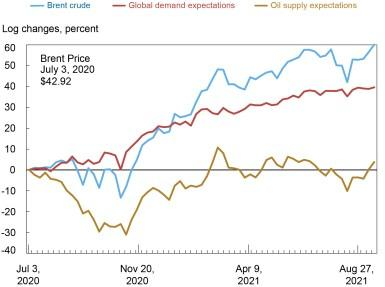

## Table of Contents

## What is oil and why is it important?

Oil is a thick, black liquid that comes from deep underground. It is made from tiny plants and animals that lived in the sea millions of years ago. When these creatures died, they sank to the bottom of the ocean and were buried under layers of sand and mud. Over time, heat and pressure turned them into oil. People find oil by drilling into the ground, and then they pump it out.

Oil is very important because it is used to make many things we use every day. It is turned into gasoline, which powers cars, trucks, and airplanes. Oil is also used to make plastics, which are in toys, bottles, and many other products. Without oil, it would be hard to travel and make many of the things we need and enjoy. That's why oil is so important to our daily lives.

## How are oil prices determined?

Oil prices are determined by how much people want oil and how much oil is available. If more people want oil than there is available, the price goes up. If there is more oil than people want, the price goes down. This is called supply and demand. For example, if many countries need more oil for their cars and factories, and there isn't enough oil to go around, the price will increase.

Other things can also affect oil prices. Events like wars or natural disasters can make it hard to get oil from certain places, which can cause prices to go up. Decisions by groups like OPEC, which is made up of countries that produce a lot of oil, can also change prices. If OPEC decides to produce less oil, the price can go up because there is less oil available. On the other hand, if they decide to produce more oil, the price can go down because there is more oil to go around.

In addition to these factors, the value of money in different countries can affect oil prices. If the money in a country becomes weaker, it can make oil more expensive for people in that country. Also, new technologies that help find and use oil more efficiently can change prices. If new ways are found to get more oil out of the ground, it can increase the supply and lower the price. All these things together help decide how much we pay for oil.

## What is the basic concept of supply and demand in relation to oil?

The basic concept of supply and demand in relation to oil is pretty simple. It's all about how much oil there is and how much people want it. If there's a lot of oil but not many people want it, the price will be low. But if there's not enough oil and lots of people need it, the price goes up. This happens because when there's more demand than supply, people are willing to pay more to get the oil they need.

For example, if a country starts using more cars and needs more gasoline, the demand for oil goes up. If oil companies can't pump out enough oil to meet this new demand, the price will rise. On the other hand, if new oil fields are discovered and there's suddenly a lot more oil available, but people are still using the same amount, the price will drop because there's more supply than demand. So, the balance between how much oil is available and how much people want it is what sets the price.

## How does an increase in oil supply affect oil prices?

When there's more oil available, it usually means that oil prices will go down. This happens because when there's a bigger supply of oil, there's less competition among buyers to get it. Imagine if you had a lot of apples to sell, but not many people wanted to buy them. You would probably lower the price to sell them all. It's the same with oil. If oil companies find new oil fields or start producing more oil, there's more oil to go around, and the price drops because people don't have to pay as much to get it.

This can also happen if countries that produce oil decide to pump out more oil. For example, if OPEC, a group of countries that make a lot of oil, decides to increase their production, there will be more oil on the market. This extra oil means that the price will go down because there's more supply than there was before. So, an increase in oil supply usually leads to lower oil prices, making it cheaper for everyone who needs to use oil.

## What happens to oil prices when demand decreases?

When people want less oil, the price of oil usually goes down. This is because there's more oil available than people need. Imagine you have a lot of cookies to sell, but not many people want to buy them. You would lower the price to sell them all. It's the same with oil. If fewer people are using oil, like if they're driving less or using less gasoline, the price drops because there's more oil than demand.

This can happen for different reasons. Maybe people start using electric cars instead of cars that run on gasoline, so they don't need as much oil. Or maybe there's a big economic slowdown, and factories and businesses aren't using as much oil as before. When demand goes down, oil companies might have to lower the price to sell all the oil they have. So, less demand for oil means lower prices.

## What are the major factors that influence oil supply?

Oil supply is affected by how much oil countries decide to pump out of the ground. Groups like OPEC, which is made up of countries that produce a lot of oil, can decide to produce more or less oil. If they choose to pump out more oil, there will be more supply. But if they decide to produce less, the supply will go down. Also, new technology can help find more oil or get more oil out of the ground. If new oil fields are discovered or if companies can extract oil more efficiently, the supply of oil can increase.

Another [factor](/wiki/factor-investing) that influences oil supply is events that can disrupt oil production. Things like wars, natural disasters, or political problems in oil-producing countries can make it hard to get oil out of the ground. If a big oil field has to stop production because of a hurricane or if there's a conflict that stops oil from being shipped, the supply of oil can decrease. These events can cause big changes in how much oil is available, which affects the overall supply.

## How do geopolitical events impact oil supply and prices?

Geopolitical events can really shake up the oil supply and prices. When there are conflicts or wars in countries that produce a lot of oil, it can be hard to get the oil out of the ground or transport it to other places. For example, if there's fighting in a big oil-producing country, they might have to stop drilling or close pipelines. This means less oil is available, which can make prices go up because there's not enough to go around.

Also, political decisions can change how much oil is produced. Groups like OPEC, which is made up of many oil-producing countries, can decide to pump out more or less oil. If they choose to produce less oil because of political reasons, like trying to keep prices high, the supply goes down and prices can go up. On the other hand, if they decide to produce more oil to help a country that's having problems, the supply goes up and prices can go down. So, what happens in the world of politics can have a big effect on how much oil we have and how much it costs.

## What role do oil reserves play in price dynamics?

Oil reserves are like a savings account for oil. They are the oil that countries have found but haven't used yet. When people talk about oil reserves, they mean the oil that's still in the ground, waiting to be pumped out. These reserves can affect oil prices because they show how much oil might be available in the future. If countries have big reserves, it can make people feel like there's plenty of oil, which can keep prices from going too high. But if reserves are small, people might worry that there won't be enough oil, which can push prices up.

Sometimes, countries use their oil reserves to help control prices. For example, if oil prices are going up a lot because there's not enough oil right now, a country might decide to start using some of its reserves. This can add more oil to the market and help bring prices down. On the other hand, if a country wants to keep prices high, it might choose not to use its reserves, keeping the supply low. So, oil reserves are important because they can be used to change how much oil is available, which affects the price people have to pay.

## How do technological advances in oil extraction influence supply and prices?

Technological advances in oil extraction can help find more oil and get it out of the ground easier. When new technology helps discover new oil fields or makes it possible to get oil from places that were hard to reach before, there's more oil available. This can increase the supply of oil. For example, new methods like fracking have made it possible to get oil from shale rock, which used to be too difficult. When there's more oil because of these new technologies, the price can go down because there's more supply than before.

But sometimes, new technology can also make oil prices go up. If the new technology is really expensive, it can cost more to get the oil out of the ground. This means that oil companies might need to charge more for the oil to make up for their higher costs. Also, if the new technology helps find oil in places that are far away or hard to get to, it can take a long time and a lot of money to start using that oil. So, even though there's more oil because of the technology, the price might not go down right away because it's expensive to use it.

## What are the effects of OPEC decisions on global oil prices?

OPEC, which stands for Organization of the Petroleum Exporting Countries, is a group of countries that produce a lot of oil. When OPEC makes decisions about how much oil to produce, it can change the amount of oil available in the world. If OPEC decides to produce less oil, there will be less oil to go around. This can make oil prices go up because there's not enough oil for everyone who wants it. On the other hand, if OPEC decides to produce more oil, there will be more oil available. This can make oil prices go down because there's more oil than people need.

These decisions by OPEC can have a big impact on what people pay for oil all over the world. For example, if OPEC cuts back on how much oil it produces, countries that rely on oil might have to pay more to get it. This can affect the price of gasoline at the pump and the cost of things that are made from oil, like plastics. When OPEC decides to increase production, it can help keep oil prices lower, which can make things cheaper for people and businesses. So, what OPEC decides to do with its oil production can really change how much we all have to pay for oil.

## How do economic cycles affect oil demand and prices?

Economic cycles are like the ups and downs that happen in the world of money and business. When the economy is doing well, people and businesses have more money to spend. They might drive more, travel more, and buy more things that need oil to make, like plastics. This means more people want oil, so the demand goes up. When demand for oil goes up and there's not enough oil to go around, the price of oil can go up too. So, during good economic times, oil prices can be higher because everyone wants more oil.

But when the economy is not doing so well, people and businesses might not have as much money. They might drive less, travel less, and buy fewer things that need oil. This means less people want oil, so the demand goes down. When demand for oil goes down, there can be more oil than people need, which can make the price of oil go down. So, during bad economic times, oil prices can be lower because not as many people are using oil. Economic cycles can really change how much oil people want and how much they have to pay for it.

## What predictive models are used to forecast oil price movements based on supply and demand?

People use different kinds of models to guess how oil prices might change in the future. These models look at things like how much oil is available and how much people want it. They also think about things that might change how much oil people need, like if the economy is doing well or not. Some models use math to look at past information and try to see patterns. They might use numbers from the past to make guesses about what will happen next. Other models use computers to do a lot of math really fast and try to predict what will happen with oil prices.

Another type of model looks at what people think will happen in the future. These models ask experts what they think about things like new oil discoveries or changes in the economy. They also look at what people are saying in the news and on social media. By putting all this information together, these models try to guess if oil prices will go up or down. No model can be perfect because the future is hard to predict, but these models help people make better guesses about oil prices.

## What are the fundamentals of supply and demand in oil pricing?

Oil prices are fundamentally governed by the principles of supply and demand, forming the cornerstone of market economics. The relationship is straightforward: when supply exceeds demand, prices tend to fall, and when demand outpaces supply, prices rise. 

**Supply Factors**

The supply side of the oil market is influenced by production rates and oil reserves. Production rates refer to the quantity of oil extracted and processed by oil-producing countries and companies. Countries like Saudi Arabia, Russia, and the United States play pivotal roles given their significant contributions to global oil production. Oil reserves, defined as quantities of [crude oil](/wiki/crude-oil) that can be economically extracted and refined, also influence supply. Technological advancements and exploration efforts can lead to discoveries of new reserves, subsequently affecting global supply levels. 

Additionally, regulatory policies, geopolitical stability, and investment in oil infrastructure play critical roles. For instance, an increase in geopolitical tensions or regulatory restrictions can reduce supply, thereby increasing prices.

**Demand Factors**

Demand for oil is largely driven by global economic conditions. In times of economic expansion, industrial activities increase, leading to higher energy and fuel requirements, thus boosting demand for oil. Conversely, during economic downturns, reduced industrial output and transportation needs lead to diminished demand. 

Technological advancements and shifts in consumer behavior also impact demand. The global push towards renewable energy sources and improvements in fuel efficiency reduce dependency on oil, potentially decreasing demand over time. Furthermore, seasonal variations can cause fluctuations in demand; for example, colder winters in the Northern Hemisphere often increase demand for heating oil.

**Supply-Demand Dynamics**

The interplay between supply and demand is complex and often volatile, influenced by both predictable patterns and unforeseen events. Factors such as natural disasters, political decisions, and technological disruptions can cause sudden shifts in supply or demand, leading to price [volatility](/wiki/volatility-trading-strategies). 

Mathematically, the equilibrium price of oil can be represented through simple supply and demand functions:

$$
Q_d = a - bP
$$

$$
Q_s = c + dP
$$

where $Q_d$ and $Q_s$ denote the quantity demanded and supplied, respectively, $P$ represents the price of oil, and $a$, $b$, $c$, and $d$ are coefficients determined by market conditions.

The equilibrium price is reached when:

$$
Q_d = Q_s
$$

Solving for $P$ gives the equilibrium price, providing insights into market behavior under different economic scenarios.

Understanding these dynamics is essential for predicting price changes and making informed trading decisions. For investors and policymakers, recognizing the signals of supply shocks or demand surges can provide advantages in navigating the complexities of the oil market.

## How can one develop successful trading strategies in oil markets?

Developing a successful trading strategy in oil markets requires an integrated approach that combines both fundamental and technical analysis. Fundamental analysis involves evaluating economic indicators, geopolitical events, and supply-demand dynamics to assess market trends and potential price movements. Technical analysis, on the other hand, focuses on historical price patterns, chart patterns, and statistical indicators to forecast future price movements.

One effective strategy for evaluating the success of a trading plan is [backtesting](/wiki/backtesting), which involves applying the strategy to historical data to see how it would have performed in past market conditions. Backtesting can provide valuable insights into a strategy's potential profitability and risk exposure. Optimization is another critical step, where strategies are fine-tuned based on past performance data to enhance their effectiveness in current market climates.

Risk management is another cornerstone of a successful trading strategy. This involves using techniques such as stop-loss orders, which automatically close a trade when it reaches a certain loss threshold, thus protecting against significant losses. Position sizing is equally important, determining the amount of capital to allocate to each trade relative to account size and risk tolerance. For instance, employing the formula:

$$
\text{Position Size} = \frac{\text{Account Risk} \times \text{Account Balance}}{\text{Trade Risk}}
$$

can help determine the appropriate capital allocation per trade, where account risk is the percentage of the total account balance one is willing to risk per trade, and trade risk is the difference between the entry price and the stop-loss price.

Successful trading also involves continuous learning and adjustment. Market conditions are always evolving, necessitating regular reviews and updates to trading strategies. This dynamic approach helps traders to stay responsive to market changes and maintain a competitive edge. By integrating comprehensive analysis with rigorous risk management and continuous strategy refinement, traders can better navigate the complexities of the oil market and enhance their chances of sustained success.

## References & Further Reading

[1]: Hamilton, J. D. (2008). ["Understanding Crude Oil Prices."](https://www.jstor.org/stable/41323239) The Brookings Institution.

[2]: Kaufmann, R. K., & Ullman, B. (2009). ["Oil prices, speculation, and fundamentals: Interpreting causal relations among spot and futures prices."](https://www.sciencedirect.com/science/article/pii/S0140988309000243) Energy Economics, 31(4), 550-558.

[3]: Alquist, R., & Kilian, L. (2010). ["What Do We Learn from the Price of Crude Oil Futures?"](https://www.jstor.org/stable/40607046) Journal of Applied Econometrics, 25(4), 539-573.

[4]: Fattouh, B. (2011). ["An Anatomy of the Crude Oil Pricing System."](https://www.oxfordenergy.org/wpcms/wp-content/uploads/2011/03/WPM40-AnAnatomyoftheCrudeOilPricingSystem-BassamFattouh-2011.pdf) Oxford Institute for Energy Studies.

[5]: Lopez de Prado, M. (2018). ["Advances in Financial Machine Learning."](https://www.amazon.com/Advances-Financial-Machine-Learning-Marcos/dp/1119482089) Wiley.

[6]: Tsai, C. F., & Wang, S. P. (2009). ["Stock price forecasting by hybrid machine learning techniques."](https://www.iaeng.org/publication/IMECS2009/IMECS2009_pp755-760.pdf) Journal of Predictive Analytics and Marketing.

[7]: Engle, R. F., & Hamilton, J. D. (1990). ["Long swings in the dollar: Are they in the data and do markets know it?"](https://www.jstor.org/stable/2006703) American Economic Review, 80(4), 689-713.

[8]: ["Quantitative Trading: How to Build Your Own Algorithmic Trading Business"](https://www.amazon.com/Quantitative-Trading-Build-Algorithmic-Business/dp/0470284889) by Ernest P. Chan

[9]: Aronson, D. R. (2006). ["Evidence-Based Technical Analysis: Applying the Scientific Method and Statistical Inference to Trading Signals."](https://www.amazon.com/Evidence-Based-Technical-Analysis-Scientific-Statistical/dp/0470008741) John Wiley & Sons.

[10]: Jansen, S. (2020). ["Machine Learning for Algorithmic Trading."](https://github.com/stefan-jansen/machine-learning-for-trading) Packt Publishing.