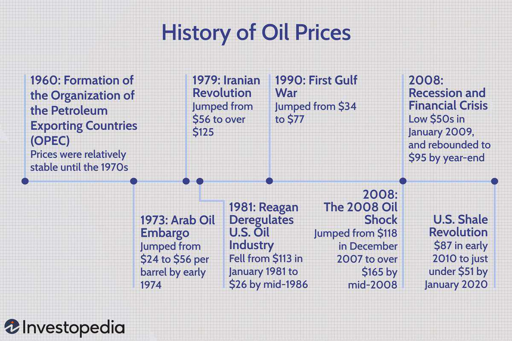

The oil market holds a pivotal position in the global economy, significantly impacting transportation, manufacturing, and energy production. A myriad of industries depends on oil as a primary energy source, which underscores its economic significance. Over the decades, oil prices have been characterized by extreme volatility, reflecting not only the complex dynamics of supply and demand but also the influence of geopolitical events, economic cycles, and technological advancements.

Historically, oil prices have reacted sharply to geopolitical tensions and events. Incidents such as the Arab Oil Embargo in 1973, the Iranian Revolution in 1979, and the financial crisis in 2008 exemplify periods of significant price fluctuations, each leaving a lasting mark on the global oil market. These incidents underscore the geopolitical sensitivity of oil prices, where political instability in oil-rich regions can lead to supply disruptions and, subsequently, price spikes.

The integration of algorithmic trading into the financial markets marks a significant technological shift, offering a sophisticated approach to analyzing and predicting oil price movements. Algorithmic trading uses advanced mathematical models and computational algorithms to enable high-speed trading, reduced human error, and the capability to process large volumes of data. This technological innovation is transforming how traders interpret historical price trends and respond to market dynamics.

This exploration will cover the historical trajectory of oil prices, examining the effects of crucial global events on market behavior and the operational structure of the oil market. Additionally, it will address how technological progress, particularly in algorithmic trading, is shaping the oil trading landscape. By understanding the historical price patterns, market structures, and the emerging technological frameworks, traders and investors can better navigate the complexities of oil trading and prepare for future challenges and opportunities. The continuing evolution in this field represents a new frontier for enhancing market efficiency and precision in oil trading strategies.

## Table of Contents

## Historical Perspective on Oil Prices

Since the establishment of the Organization of the Petroleum Exporting Countries (OPEC) in 1960, oil prices have seen significant volatility. OPEC's formation marked the beginning of a concerted effort by oil-producing nations to control oil prices through production quotas. This move was seen as a response to the dominance of Western oil companies in setting prices. However, despite OPEC's attempts at stabilizing prices, several geopolitical and economic events have led to dramatic fluctuations over the decades.

One of the most impactful events occurred during the Arab Oil Embargo of 1973-1974. This crisis began when OPEC members proclaimed an oil embargo in response to U.S. support for Israel during the Yom Kippur War. The embargo resulted in a quadrupling of oil prices, and its aftermath saw oil being used as a tool for political leverage, substantially affecting global economies.

The Iranian Revolution in 1979 further fueled oil price instability. The revolution disrupted Iranian oil production, reducing global supply and causing prices to soar. The situation was compounded by the outbreak of the Iran-Iraq War in 1980, which further tightened supplies and kept prices high through the early 1980s.

In contrast, the 2008 Oil Shock was rooted in economic factors rather than geopolitical ones. Leading up to the crisis, a combination of increased demand, especially from emerging economies like China and India, coupled with supply constraints, pushed prices to historic highs. The subsequent global financial crisis led to a sharp drop in demand, causing oil prices to plummet rapidly.

Beyond these events, the U.S. shale oil revolution has brought about a substantial shift in the oil market dynamics. Technological advancements in hydraulic fracturing and horizontal drilling have unlocked vast reserves of shale oil, particularly in the United States, leading to a surge in supply. The increased supply from shale oil has exerted downward pressure on global oil prices and has shifted some market power away from traditional oil producers.

Analyzing historical data reveals a strong correlation between oil prices and major geopolitical and economic incidents. For instance, conflicts in key oil-producing regions or economic downturns have typically led to increased [volatility](/wiki/volatility-trading-strategies). Understanding these patterns helps shed light on the complex interplay between external factors and oil pricing.

In summary, the historical fluctuations in oil prices highlight the multifaceted influences of political actions, economic shifts, and technological advancements on the global oil market. These historical insights are crucial for interpreting current trends and predicting future movements in oil prices.

## Understanding the Oil Market

The oil market is a complex and dynamic system, influenced by an array of factors including supply and demand dynamics, geopolitical stability, and economic growth. These elements contribute to the inherent volatility and strategic importance of the market.

The West Texas Intermediate (WTI) and Brent Crude are internationally recognized benchmarks for global oil pricing. WTI, sourced from the United States, is known for its high quality and low sulfur content, making it a suitable grade for refining into gasoline and other products. Brent Crude, originating from the North Sea, is similarly sought for its low sulfur content and serves as a critical pricing reference for oil from Europe, Africa, and the Middle East. These benchmarks play a fundamental role in pricing oil contracts and facilitating risk management and investment decisions.

The Organization of the Petroleum Exporting Countries (OPEC) holds a significant influence over the oil market. Since its establishment in 1960, OPEC's mission has been to coordinate and unify petroleum policies among member countries to ensure the stabilization of oil markets. By setting production targets, OPEC attempts to influence oil prices and manage supplies to meet global demand effectively. The organization's decisions can lead to substantial shifts in the global oil supply, thereby impacting prices.

A broad spectrum of market participants contributes to the complexity of the oil market. These include large oil-producing nations that control vast reserves and shape global supply dynamics, multinational oil corporations involved in production, refining, and distribution, and financial institutions engaged in trading and hedging. Individual traders and investment funds also play pivotal roles by speculating on price movements to achieve financial gains.

The structural components of the oil market encompass several stages: exploration, extraction, refining, distribution, and marketing. Each stage involves various players with specific roles, regulations, and economic factors. The exploration and extraction phase is primarily driven by resource-rich nations and energy companies that invest in technologies to discover and tap into new oil reserves. Refining converts [crude oil](/wiki/crude-oil) into usable products, while distribution channels ensure these products reach their destinations globally. Marketing organizations focus on sales and consumer engagement strategies.

Given the constant interplay between political events, technological advancements, and environmental considerations, the oil market is a focal point of global economic discussions. Understanding these structural components and key players is crucial for navigating the challenges and opportunities presented by one of the world's most vital commodities markets.

## Algorithmic Trading in the Oil Market

Algorithmic trading in the oil market is an advanced method of executing trades that relies on sophisticated mathematical models and high-speed computer programs. These systems capitalize on predefined criteria to make trading decisions, often significantly faster and more accurately than human traders. Several popular strategies are employed in this field, including statistical [arbitrage](/wiki/arbitrage), [momentum](/wiki/momentum) trading, and the integration of [machine learning](/wiki/machine-learning) techniques.

Statistical arbitrage involves profiting from price inefficiencies between related securities. In the context of the oil market, traders may look for discrepancies between oil futures and the spot prices or differences between various benchmark indices like WTI (West Texas Intermediate) and Brent Crude. These strategies rely on complex statistical models to identify and exploit these inefficiencies quickly before the market can correct them.

Momentum trading is another strategy where traders seek to capitalize on existing trends in the market. By analyzing historical price data and identifying patterns, algorithmic systems can determine the likelihood of continued price movement in a specific direction. This method is particularly effective in volatile markets like oil, where prices can shift dramatically due to geopolitical events or changes in supply and demand dynamics.

The rise of machine learning has introduced new possibilities for [algorithmic trading](/wiki/algorithmic-trading). These methods can evaluate vast amounts of data, identifying hidden patterns and making predictive models that traditional statistical methods may miss. Machine learning algorithms are capable of continuous learning and adaptation, which allows them to improve over time and respond to new market conditions faster than conventional methods.

One of the primary advantages of algorithmic trading in the oil market is the ability to execute trades at high speeds, far beyond human capabilities. Algorithms can also process large datasets efficiently, which is crucial for developing accurate models in a rapidly changing market. Additionally, by automating the trading process, the likelihood of human error is significantly reduced.

The infrastructure required for successful algorithmic trading includes robust data feeds that provide real-time market information, sophisticated trading platforms capable of executing complex algorithms, and comprehensive [backtesting](/wiki/backtesting) tools that allow traders to test their strategies against historical data. This infrastructure enables traders to optimize their strategies before applying them in live markets, thereby minimizing potential risks.

Despite its advantages, algorithmic trading in the oil market comes with certain risks. Market volatility remains a significant challenge, as algorithms must be designed to handle sudden price fluctuations and unexpected market events. Regulatory compliance is also crucial, as different jurisdictions have varied rules regarding the use of automated trading systems. Traders must ensure their algorithms adhere to these regulations to avoid legal repercussions. Moreover, model inaccuracies can arise from incorrect assumptions or data anomalies, underscoring the importance of continual monitoring and adjustment of trading algorithms.

In summary, algorithmic trading offers significant advantages in terms of speed, accuracy, and data processing capability in the oil market. However, traders must be mindful of the inherent risks and ensure that their technological infrastructure is robust enough to support sophisticated trading strategies. As technology continues to evolve, the potential for including more advanced machine learning and AI techniques will likely expand, further transforming the landscape of oil trading.

## Risks and Opportunities in Algorithmic Oil Trading

Volatility in oil prices presents significant opportunities for algorithmic trading, allowing traders to exploit rapid price movements for profit. One effective approach is the combination of momentum and mean-reversion strategies, where traders capitalize on short-term trends while also preparing for potential reversals. Momentum trading involves buying assets displaying upward trends and selling those in decline. Conversely, mean-reversion strategies assume that prices will eventually revert to their historical averages, allowing traders to profit from temporary overvaluations or undervaluations.

A crucial aspect of algorithmic trading in the oil market is managing various risks. Market risks arise from sudden geopolitical events or economic shifts that can lead to drastic price changes. Regulatory risks stem from policy changes that may affect trading practices, particularly as governing bodies increase scrutiny over algorithmic trading activities. Technological risks, including software glitches, latency issues, and cybersecurity threats, can have significant repercussions on trading performance.

Opportunities abound with the integration of [artificial intelligence](/wiki/ai-artificial-intelligence) (AI) and machine learning techniques into predictive modeling. These technologies enhance the accuracy of market forecasts by processing large datasets to identify patterns and trends that may not be visible through traditional analysis. For instance, machine learning algorithms can assess historical price movements, trading volumes, and external factors to optimize trading strategies.

The global oil market's accessibility further enhances opportunities, as it permits continuous trading across different time zones. Traders can capitalize on market events as they unfold in real time, ensuring they remain responsive to fluctuations and news developments. The ability to engage with markets around the clock also allows algorithmic systems to operate independently, executing trades efficiently without human intervention.

In summary, while algorithmic trading in the oil market offers significant advantages, it requires careful risk management and technological sophistication. By leveraging advanced trading strategies and technologies, traders can navigate the complexities of the oil market, optimizing their potential for profit amidst uncertainty and volatility.

## Future Outlook

The future of oil trading is poised for significant transformation, largely driven by technological advancements in algorithmic trading. These advancements promise to enhance the precision and adaptability of trading systems, offering traders enhanced tools for navigating the dynamic oil market. As the global energy landscape continues to evolve, particular attention is being paid to the integration of renewable energy sources, which introduces new dynamics into the oil market.

Algorithmic trading systems are expected to evolve by integrating cutting-edge technologies such as artificial intelligence (AI) and machine learning. These technologies allow for more robust predictive models capable of analyzing vast and complex datasets in real-time. Consequently, traders can anticipate price movements with greater accuracy, adapting strategies swiftly as market conditions change. For example, the use of [deep learning](/wiki/deep-learning) models in forecasting can provide insights into nonlinear patterns within trading data that traditional models might overlook.

The transition towards renewable energy sources—driven by environmental concerns and policy shifts—will significantly impact oil markets. As nations and corporations work towards reducing carbon footprints, the demand for traditional fossil fuels may fluctuate, altering traditional supply-demand dynamics. Algorithmic trading will be critical in adapting to these changes, providing the ability to swiftly respond to shifts in market sentiment and policy impacts. Traders will need to prepare for potential futures by diversifying portfolios and employing algorithms capable of simultaneous multi-asset analysis to hedge against market risks associated with these transitions.

In future scenarios, traders may face increased volatility as geopolitical tensions, regulatory changes, and technological disruptions continue to influence markets. Adaptive algorithmic systems will be essential to thriving in such an environment, necessitating robust backtesting processes and real-time optimization of trading strategies. The development of cross-market arbitrage strategies, which leverage the liquification of energy assets across oil, gas, and renewable markets, further outlines the potential for increased profitability amidst market complexity.

Continuously evolving algorithmic trading technologies will undoubtedly redefine the oil trading landscape. Advancements in cloud computing, high-frequency data access, and blockchain technology are expected to bolster security and reduce latency in trade executions. These innovations will enable traders to remain competitive by ensuring high-speed transactions and transparent operations.

In conclusion, the future of oil trading lies at the intersection of technology and energy transition. Algorithmic trading systems will serve as pivotal tools, equipping traders with the adaptability needed to navigate forthcoming challenges. By staying abreast of technological trends and market shifts, traders can position themselves to capitalize on opportunities within an ever-evolving global oil market.

## Conclusion

The history of oil prices reflects a market characterized by volatility, driven by a multitude of economic, political, and technological factors. This inherent volatility has historically challenged market participants, requiring them to navigate complex dynamics influenced by global events, supply-demand fluctuations, and economic trends. With the introduction of algorithmic trading, there is a new avenue for managing these complexities, offering a means to enhance efficiency and precision in trades.

Algorithmic trading, by integrating advanced computational techniques, provides traders with the ability to execute strategies based on comprehensive quantitative analyses. These sophisticated methods mitigate human error and offer rapid execution, allowing traders to exploit fleeting market opportunities. As traders employ these algorithms, they gain the capacity to adapt to ever-changing market conditions, which is crucial in capitalizing on both short-term fluctuations and long-term trends.

To effectively harness these opportunities, traders must remain informed and adaptable. The dynamic nature of the oil market demands constant vigilance and the strategic application of technological innovations. Skills in data analysis, machine learning, and financial modeling become increasingly valuable as traders seek to optimize their strategies in a volatile environment.

Having a robust understanding of both historical context and future trends is essential for making informed decisions. An appreciation of past market behaviors provides insight into potential future scenarios, facilitating the development of predictive models that enhance trading strategies.

The continued evolution of trading algorithms is set to redefine how market participants interact with the oil trading ecosystem. As these systems advance, incorporating more sophisticated data analytics and machine learning, they will increasingly offer enhanced precision and adaptability. This transformation underscores the importance of staying abreast of technological advancements to maintain a competitive edge in global oil trading. As a result, algorithmic trading stands as a pivotal element in the future of the oil market, poised to transform it into a more efficient, adaptable, and technologically driven domain.

## References & Further Reading

[1]: Hamilton, J. D. (2009). ["Understanding Crude Oil Prices"](https://www.jstor.org/stable/41323239). The Energy Journal.

[2]: Yergin, D. (2011). ["The Quest: Energy, Security, and the Remaking of the Modern World"](https://archive.org/details/questenergysecur0000yerg). Penguin Books.

[3]: Geman, H. (2005). ["Commodities and Commodity Derivatives: Modeling and Pricing for Agriculturals, Metals and Energy"](https://download.e-bookshelf.de/download/0000/5675/90/L-G-0000567590-0015270354.pdf). John Wiley & Sons.

[4]: Lardic, S., & Mignon, V. (2008). ["Oil Prices and Economic Activity: An Asymmetric Cointegration Approach"](https://www.sciencedirect.com/science/article/pii/S0140988306001265). The Energy Journal.

[5]: Sornette, D., & Woodard, R. (2009). ["Financial Bubbles, Real Estate Bubbles, Derivative Bubbles, and the Financial and Economic Crisis"](https://papers.ssrn.com/sol3/papers.cfm?abstract_id=1596024). Physica A: Statistical Mechanics and its Applications.

[6]: Katz, J. O., & McCormick, D. L. (2000). ["The Encyclopedia of Trading Strategies"](https://www.amazon.com/Encyclopedia-Trading-Strategies-Jeffrey-Ph-D/dp/0070580995). McGraw-Hill Education.