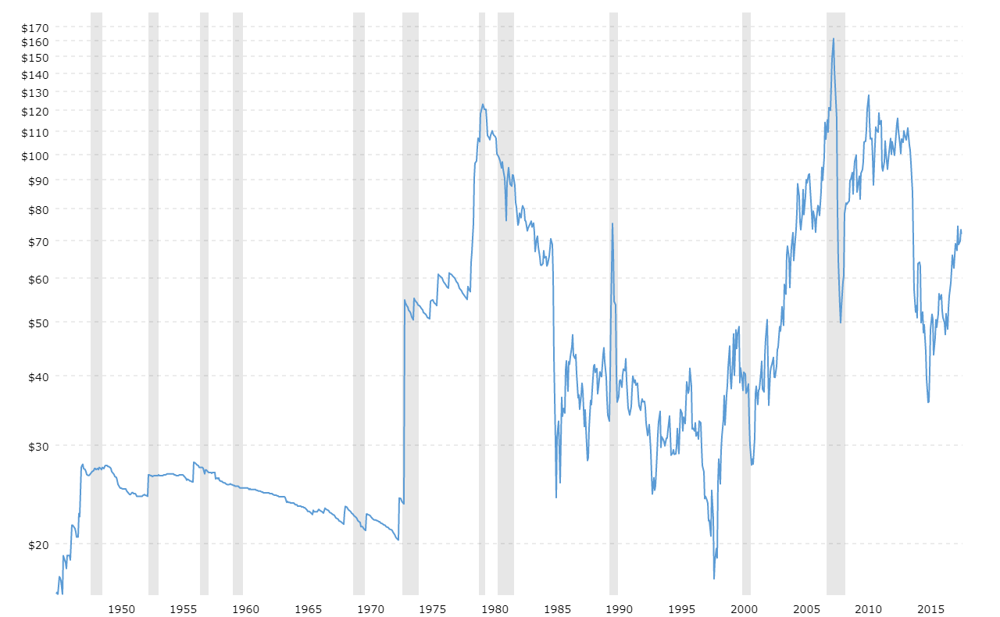

## Table of Contents

## What is oil and why is it important?

Oil is a dark, thick liquid that comes from deep under the ground. It is made from the remains of tiny plants and animals that lived millions of years ago. People find oil by drilling into the earth. Once they find it, they can pump it out and use it for many things.

Oil is very important because it is used to make gasoline, which powers cars, trucks, and airplanes. It is also used to make things like plastic, clothes, and medicine. Without oil, many things we use every day would not exist. It helps the world's economy because countries that have oil can sell it to other countries that need it.

## How are oil prices determined?

Oil prices are decided by how much people want oil and how much oil is available. If a lot of people want oil but there isn't much to go around, the price goes up. This can happen if there are problems with oil wells or if countries that make oil decide to sell less. On the other hand, if there is a lot of oil but not many people want it, the price goes down. This can happen if new oil is found or if countries start making more oil.

Another thing that affects oil prices is what people think will happen in the future. If people think there will be less oil later, they might buy more now, which makes the price go up. Also, big events like wars or natural disasters can change oil prices. For example, if a hurricane damages oil wells, less oil can be pumped out, and the price might go up because there is less oil available.

Countries and big companies also play a role in setting oil prices. Groups like OPEC, which is made up of countries that make a lot of oil, can decide to make more or less oil. This can change how much oil is available and affect the price. Companies that buy and sell oil also try to guess what the price will be and make deals based on that. All these things together decide how much oil costs.

## What are the basic units of measurement for oil?

The basic unit for measuring oil is the barrel. One barrel of oil is equal to 42 US gallons. People use barrels to talk about how much oil a country makes or uses in a day. For example, they might say a country produces 10 million barrels of oil per day.

Another unit used for oil is the cubic meter. This is often used in countries that use the metric system. One cubic meter of oil is about 6.29 barrels. So, if someone says a country produces 10,000 cubic meters of oil per day, that's about 62,900 barrels.

Sometimes, people also measure oil in liters or gallons, especially when they are talking about smaller amounts. For example, a car's gas tank might hold 50 liters of gasoline, which comes from oil.

## What was the historical trend of oil prices from the 19th century to the present?

Oil prices have changed a lot since the 19th century. In the early days, oil was not used much, so it was not very expensive. People started using oil more in the late 1800s, especially for lighting and later for cars. By the early 1900s, oil was becoming more important, and prices started to go up slowly. During World War II, oil was very important for the war effort, and prices went up a lot. After the war, oil prices stayed pretty steady for a while because there was enough oil to meet the demand.

Big changes happened in the 1970s. In 1973, some countries that make a lot of oil, like those in OPEC, decided to sell less oil to other countries. This made oil prices jump up a lot. Another big jump happened in 1979 because of the Iranian Revolution, which made less oil available. After these big jumps, oil prices went down in the 1980s and 1990s because more oil was found and new ways to get oil were used. Since the year 2000, oil prices have gone up and down a lot. They went very high in 2008, then dropped because of the global financial crisis. Prices went up again in the 2010s but fell in 2020 because of the COVID-19 pandemic, which made people use less oil. Now, oil prices keep changing because of many things like new technology, politics, and how much people want oil.

## What were the major oil price shocks and what caused them?

The first big oil price shock happened in 1973. It was caused by a group of countries called OPEC, which stands for Organization of the Petroleum Exporting Countries. These countries decided to stop selling oil to some countries because of a war in the Middle East. This made the amount of oil available go down a lot, and the price of oil went up very quickly. People had to wait in long lines to get gas for their cars, and it caused big problems for many countries.

Another major oil price shock came in 1979. This time, it was because of the Iranian Revolution. Iran is a big oil-producing country, and the revolution made it hard for them to keep making oil. So, there was less oil in the world, and the price went up again. This second shock made it even harder for countries that needed oil because they were still trying to recover from the first shock.

Since then, there have been other times when oil prices went up a lot. In 2008, oil prices reached very high levels because more people in places like China and India were using oil, and it was hard to make enough oil to meet the demand. Then, in 2020, oil prices dropped a lot because of the COVID-19 pandemic. People were not traveling as much, so they used less oil, and this made the price go down. These big changes in oil prices show how important oil is to the world and how many things can affect its price.

## How do geopolitical events influence oil prices?

Geopolitical events can change oil prices a lot because they can affect how much oil is available. If there is a war or a big political problem in a country that makes a lot of oil, like in the Middle East, it might be hard for them to keep making oil. This can make less oil available, and when there is less oil, the price goes up. For example, when there was a war in Iraq, it made it hard for Iraq to make oil, and this helped push oil prices higher.

Also, groups like OPEC, which is made up of many countries that make oil, can decide to make more or less oil. If they decide to make less oil, like they did in 1973, it can make the price go up a lot. Sometimes, countries might use oil as a way to show they are unhappy with other countries. They might stop selling oil to those countries, which can make the price go up because there is less oil to go around. So, big political events can make oil prices go up and down a lot.

## What role do OPEC and other oil-producing countries play in oil pricing?

OPEC, which stands for Organization of the Petroleum Exporting Countries, is a group of countries that make a lot of oil. They work together to decide how much oil they will make and sell. When OPEC decides to make less oil, there is less oil available in the world, and this can make the price of oil go up. On the other hand, if OPEC decides to make more oil, there is more oil available, and this can make the price go down. So, OPEC has a big say in what happens to oil prices because they can control how much oil is available.

Other countries that make oil also play a role in oil pricing. Countries like Russia and the United States make a lot of oil too. If these countries decide to make more oil, it can help keep the price from going up too much. But if they decide to make less oil, or if something happens that makes it hard for them to make oil, like a war or a natural disaster, it can make the price go up. So, what these countries do with their oil can also affect the price of oil around the world.

## How have technological advancements affected oil extraction and prices?

Technology has changed how people find and get oil out of the ground. In the past, people could only get oil from places that were easy to reach. But now, with new technology like horizontal drilling and fracking, people can get oil from places that used to be too hard to reach. Horizontal drilling means drilling down and then sideways to get more oil out of the ground. Fracking is when people break up rocks underground to let the oil come out. These new ways of getting oil have helped find more oil, which can make the price go down because there is more oil to use.

These new technologies have also made it cheaper to get oil out of the ground. When it costs less to get oil, companies can sell it for less money, and this can make the price of oil go down. But sometimes, the price of oil goes up even with new technology. This can happen if the new technology is very expensive to use, or if people start using a lot more oil because it's easier to get. So, technology can make the price of oil go up or down, depending on how it's used and how much it costs.

## What are the differences between Brent, WTI, and other oil benchmarks?

Brent and WTI are two of the most important types of oil that people use to decide oil prices. Brent oil comes from the North Sea, near Europe. It is used a lot in Europe and Africa. WTI, which stands for West Texas Intermediate, comes from the United States, in Texas. It is used a lot in the United States and also in other places. The main difference between Brent and WTI is where they come from and how they are used. Brent oil is a bit lighter and easier to turn into gasoline and other things, so it is often a little more expensive than WTI.

There are other oil benchmarks too, like Dubai Crude and OPEC Reference Basket. Dubai Crude comes from the Middle East and is used a lot in Asia. The OPEC Reference Basket is a mix of different oils from OPEC countries. Each of these benchmarks is important in different parts of the world. The price of oil can be different depending on which benchmark people are using. This is because the cost to get the oil out of the ground and to move it to where it is used can be different for each type of oil. So, when people talk about oil prices, they need to say which benchmark they are using.

## How do futures and options markets impact oil price volatility?

Futures and options markets can make oil prices go up and down a lot. These markets let people buy and sell oil for a price that they agree on now, but they will get the oil later. If a lot of people think the price of oil will go up in the future, they might buy more oil now. This can make the price go up right away. On the other hand, if people think the price will go down, they might sell more oil now, which can make the price go down. So, what people think will happen in the future can change the price of oil today.

These markets can also make oil prices change a lot because they let people bet on what the price will do. If a big event happens, like a war or a big storm, people might start buying or selling a lot of oil futures and options. This can make the price of oil jump around a lot, even if the amount of oil in the world has not changed. So, futures and options markets can make oil prices more exciting and unpredictable.

## What economic indicators should be monitored to predict oil price movements?

To predict how oil prices might change, it's important to keep an eye on some key economic indicators. One big thing to watch is how fast the world's economy is growing. When the economy is doing well, people use more oil because they are driving more, flying more, and buying more things that need oil to make. So, if you see that countries like the United States, China, and Europe are growing fast, it might mean that oil prices will go up because more people will want oil. Another thing to look at is how much oil countries are making. If countries that make a lot of oil, like those in OPEC, decide to make more or less oil, it can change how much oil is available and affect the price.

Another important indicator is the value of the US dollar. Oil is usually bought and sold in US dollars, so if the dollar gets stronger, it can make oil cheaper for people who use other kinds of money. But if the dollar gets weaker, it can make oil more expensive for them. Also, keeping an eye on things like how much oil is stored in places like the US can give clues about what will happen to oil prices. If there is a lot of oil stored up, it might mean that prices will go down because there is more oil to use. But if there is not much oil stored, it might mean that prices will go up because there is less oil to go around.

## How do environmental policies and the transition to renewable energy sources impact long-term oil price trends?

Environmental policies and the move to renewable energy can change oil prices over a long time. When countries make new rules to fight climate change, like making cars use less gas or switching to electric power, people might use less oil. This can make the price of oil go down because there is less need for it. Also, if more people start using wind, solar, or other clean energy, they might not need as much oil. This can make oil prices drop because there are other ways to get energy.

But, the change to renewable energy takes a long time. While it's happening, oil prices can still go up and down a lot. If oil companies think that people will use less oil in the future, they might not want to spend money to find new oil. This can make less oil available now, which can make the price go up. So, even though the long-term trend might be for oil prices to go down because of renewable energy, there can still be big changes in the short term.

## References & Further Reading

[1]: Hamilton, J. D. (2009). ["Understanding Crude Oil Prices"](https://www.jstor.org/stable/41323239). The Energy Journal.

[2]: Yergin, D. (2011). ["The Quest: Energy, Security, and the Remaking of the Modern World"](https://archive.org/details/questenergysecur0000yerg). Penguin Books.

[3]: Geman, H. (2005). ["Commodities and Commodity Derivatives: Modeling and Pricing for Agriculturals, Metals and Energy"](https://download.e-bookshelf.de/download/0000/5675/90/L-G-0000567590-0015270354.pdf). John Wiley & Sons.

[4]: Lardic, S., & Mignon, V. (2008). ["Oil Prices and Economic Activity: An Asymmetric Cointegration Approach"](https://www.sciencedirect.com/science/article/pii/S0140988306001265). The Energy Journal.

[5]: Sornette, D., & Woodard, R. (2009). ["Financial Bubbles, Real Estate Bubbles, Derivative Bubbles, and the Financial and Economic Crisis"](https://papers.ssrn.com/sol3/papers.cfm?abstract_id=1596024). Physica A: Statistical Mechanics and its Applications.

[6]: Katz, J. O., & McCormick, D. L. (2000). ["The Encyclopedia of Trading Strategies"](https://www.amazon.com/Encyclopedia-Trading-Strategies-Jeffrey-Ph-D/dp/0070580995). McGraw-Hill Education.