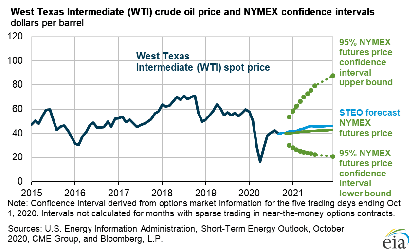

## Table of Contents

## What are the basic factors that influence oil prices?

Oil prices are influenced by several basic factors. One main factor is supply and demand. When there is more oil available than people want to buy, the price goes down. When there is not enough oil to meet the demand, the price goes up. Another factor is the cost of producing oil. If it costs more to find, drill, and refine oil, then the price of oil will likely increase. Political events and decisions by oil-producing countries can also affect supply and, therefore, prices.

Another important factor is the value of the US dollar. Oil is traded in US dollars, so if the dollar gets weaker, oil becomes cheaper for people using other currencies, which can increase demand and push prices up. On the other hand, if the dollar gets stronger, oil becomes more expensive for those using other currencies, which can decrease demand and lower prices. Economic growth also plays a role. When the global economy is doing well, more oil is used for transportation, manufacturing, and other activities, which can drive up prices.

Lastly, speculation in the oil market can influence prices. Traders and investors buy and sell oil based on what they think will happen in the future. If they think prices will go up, they buy more oil now, which can increase current prices. If they think prices will go down, they might sell their oil, which can decrease current prices. All these factors together determine the price of oil at any given time.

## How did global events in 2020 impact oil prices?

In 2020, oil prices were greatly affected by the global events, especially the COVID-19 pandemic. When the virus started spreading, many countries locked down to stop it. This meant fewer people were driving cars or flying on planes, so the demand for oil dropped a lot. Oil prices fell because there was too much oil and not enough people wanting to buy it. At one point, oil prices even went negative, which means people were paying others to take the oil away because they had no place to store it.

Another big event in 2020 was a disagreement between two big oil-producing countries, Saudi Arabia and Russia. They couldn't agree on how much oil to produce, so they decided to produce as much as they could. This led to even more oil on the market, pushing prices down even further. Later in the year, these countries and others in OPEC+ (a group of oil-producing countries) agreed to cut production to try to raise prices. By the end of 2020, oil prices started to recover a bit as countries began to reopen and demand slowly came back.

## What was the highest oil price recorded in 2020 and when did it occur?

The highest oil price in 2020 was around $63 per barrel. This happened in early January, before the big impacts of the COVID-19 pandemic started to show.

After that, oil prices went down a lot because of the virus and other events. By the end of the year, oil prices had started to go up again but did not reach the high point from January.

## What was the lowest oil price recorded in 2020 and when did it occur?

The lowest oil price in 2020 was around -$37 per barrel. This happened on April 20, 2020. It was a very unusual situation because it meant that people were paying others to take oil away. This was because there was too much oil and not enough places to store it, so oil companies wanted to get rid of it.

This low price was caused by the COVID-19 pandemic, which made people stop traveling and using as much oil. Also, there was a big disagreement between Saudi Arabia and Russia about how much oil to produce. They decided to produce a lot, which made the oil supply even bigger and pushed prices down even more.

## How did oil demand change throughout 2020?

In 2020, oil demand dropped a lot at the start of the year because of the COVID-19 pandemic. When the virus started spreading, many countries locked down to stop it. This meant fewer people were driving cars or flying on planes, so they used less oil. By April, oil demand was down by about 30% compared to the year before. This was the lowest point for oil demand in 2020.

As the year went on, oil demand started to come back slowly. By the summer, some countries began to reopen and people started traveling again. This made oil demand go up a bit. By the end of 2020, oil demand was still lower than in 2019, but it was better than in the spring. Overall, the whole year saw less oil being used because of the effects of the pandemic.

## What role did OPEC play in oil price trends in 2020?

In 2020, OPEC played a big role in trying to control oil prices. At the start of the year, there was a disagreement between Saudi Arabia and Russia, two important members of OPEC+. They couldn't agree on how much oil to produce, so they decided to produce as much as they could. This made oil prices go down a lot because there was too much oil and not enough people wanting to buy it.

Later in the year, OPEC+ realized they needed to do something to help oil prices go back up. So, they agreed to cut how much oil they were producing. This helped a little bit, and by the end of 2020, oil prices started to go up again. But they were still lower than before the big drop caused by the disagreement and the effects of the COVID-19 pandemic.

## How did the U.S. shale oil production affect oil prices in 2020?

In 2020, U.S. shale oil production had a big effect on oil prices. Shale oil is oil that comes from shale rock, and the U.S. produces a lot of it. When the COVID-19 pandemic started, people used less oil because they were staying home and not traveling. This made oil prices go down. U.S. shale oil companies had to decide if they should keep producing oil or cut back. Many of them cut back on how much oil they were producing because it was not making them money to keep going at the same level.

Even though U.S. shale oil companies cut back on production, it was not enough to stop oil prices from falling a lot in 2020. The big drop in demand from the pandemic and the disagreement between OPEC countries like Saudi Arabia and Russia made oil prices go down even more. By the end of the year, as oil demand started to come back a little bit, U.S. shale oil companies began to produce more oil again. This helped oil prices start to go up, but they were still lower than before the big drop at the start of the year.

## What were the effects of the global lockdown on oil prices?

The global lockdown in 2020 had a big effect on oil prices. When countries locked down to stop the spread of the COVID-19 virus, people stopped driving cars and flying on planes. This meant they used a lot less oil. Because there was less demand for oil, the price went down a lot. At one point, oil prices even went negative, which means people were paying others to take the oil away because they had no place to store it.

The lockdown also made oil companies cut back on how much oil they were producing. In the U.S., shale oil companies reduced their production because it was not making them money to keep going at the same level. Even with these cuts, there was still too much oil and not enough people wanting to buy it, so prices stayed low. By the end of the year, as countries started to reopen and people began to travel again, oil demand slowly came back. This helped oil prices start to go up, but they were still lower than before the lockdown.

## How did oil storage capacity issues influence oil prices in 2020?

In 2020, oil storage capacity issues had a big impact on oil prices. When the COVID-19 pandemic started, people used less oil because they were staying home and not traveling. This made oil companies produce more oil than people wanted to buy. They had to store the extra oil, but there was not enough space to keep it all. This problem got so bad that oil prices even went negative in April. That means people were paying others to take the oil away because they had no place to store it.

As the year went on, oil companies tried to solve the storage problem by cutting back on how much oil they were producing. This helped a little bit, but oil prices stayed low for a while. By the end of 2020, as countries started to reopen and people began to travel again, oil demand slowly came back. This helped oil prices start to go up, but they were still lower than before the big drop at the start of the year.

## What were the predictions for oil prices towards the end of 2020?

Towards the end of 2020, experts thought oil prices would start going up a bit. They believed this because countries were slowly reopening and people were starting to travel again. This meant more people would use oil for cars and planes. Also, OPEC and other oil-producing countries had agreed to cut back on how much oil they were making. This helped to balance the amount of oil with how much people wanted to buy.

However, experts also thought oil prices would not go back to what they were before the big drop at the start of the year. They said this because the world was still dealing with the COVID-19 virus. Some countries were still locked down, and people were not using as much oil as before. Also, there was still a lot of oil stored up from earlier in the year, which could keep prices from going up too fast. So, while oil prices were expected to improve a bit, they would still be lower than before the pandemic.

## How did financial markets and oil futures impact oil price trends in 2020?

In 2020, financial markets and oil futures had a big effect on oil prices. Oil futures are contracts where people agree to buy or sell oil at a certain price in the future. When the COVID-19 pandemic started, people thought oil prices would go down a lot because fewer people were using oil. So, they sold their oil futures, which made the price of oil go down even more. This is called speculation, and it can make oil prices change a lot, even if the real supply and demand of oil hasn't changed yet.

Oil futures also caused a big problem with oil storage. When oil prices went negative in April, it was because people who had bought oil futures had to take the oil they agreed to buy, but they had no place to store it. They were willing to pay others to take the oil away just to get rid of it. This showed how much financial markets and oil futures can affect oil prices, especially when there is a big event like a global pandemic that changes how much oil people use.

## What were the long-term implications of 2020's oil price trends on the global energy market?

The oil price trends in 2020 had big effects on the global energy market that lasted a long time. When oil prices dropped a lot because of the COVID-19 pandemic, many oil companies had to cut back on how much oil they were producing. This made some people think more about using other kinds of energy, like wind or solar power, because oil was not making as much money. Also, countries that make a lot of money from oil, like Saudi Arabia and Russia, had to change their plans because they were not getting as much money from oil as before. This made them think about other ways to make money and use their resources.

Another long-term effect was that oil companies had to be more careful about how much oil they produced. They learned that big events like a global pandemic can change how much oil people use very quickly. This made them think more about saving money and being ready for big changes in the future. Also, the low oil prices made some countries and companies think more about using less oil and more renewable energy. This could help the world move towards using cleaner energy in the long run.

## References & Further Reading

[1]: ["COVID-19 and oil price collapse: Role of financial markets under economic uncertainty and the pandemic"](https://pubmed.ncbi.nlm.nih.gov/34898815/) by Gozgor, Giray, and Demir

[2]: "International Energy Agency, 'Oil Market Report - December 2020,'" IEA, December 2020. [Link](https://www.iea.org/reports/oil-market-report-december-2020)

[3]: ["Oil Price Wars: How Saudi Arabia and Russia Crashed the Oil Market"](https://en.wikipedia.org/wiki/2020_Russia%E2%80%93Saudi_Arabia_oil_price_war) by Reuters

[4]: ["Oil prices: What's behind the drop? Simple economics"](https://www.nytimes.com/2015/01/13/business/energy-environment/oil-prices.html) by BBC News, March 9, 2020.

[5]: ["U.S. Oil Prices Plunge, Turn Negative for First Time in History"](https://www.reuters.com/article/business/oil-price-crashes-into-negative-territory-for-the-first-time-in-history-amid-pan-idUSKBN2210V8/) by Reuters, April 20, 2020.

[6]: ["OPEC, Allies Finalize Record 9.7 Million Barrel Per Day Production Cut"](https://www.cnbc.com/2020/04/12/opec-and-allies-finalize-record-oil-production-cut-after-days-of-discussion.html) by CNBC, April 12, 2020.

[7]: ["Advances in Financial Machine Learning"](https://www.amazon.com/Advances-Financial-Machine-Learning-Marcos/dp/1119482089) by Marcos Lopez de Prado

[8]: ["Quantitative Trading: How to Build Your Own Algorithmic Trading Business"](https://www.amazon.com/Quantitative-Trading-Build-Algorithmic-Business/dp/0470284889) by Ernest P. Chan