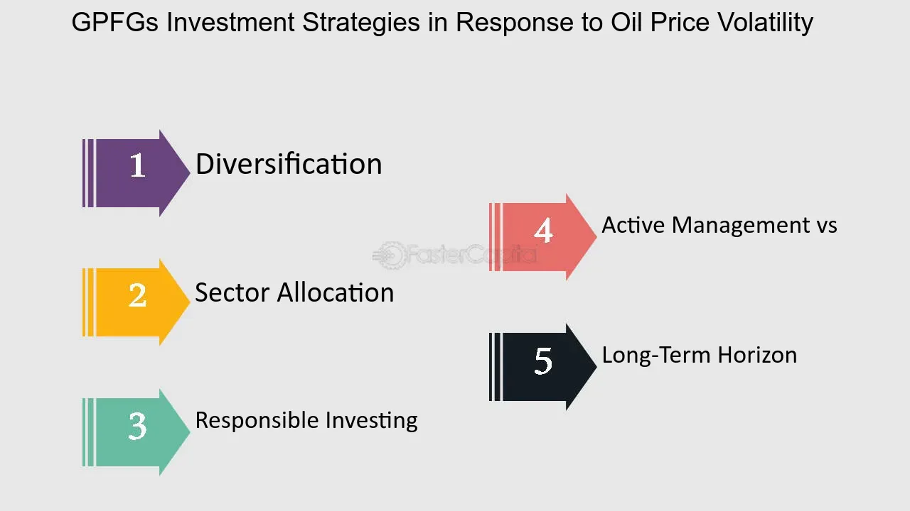

## Table of Contents

## What is oil price volatility?

Oil price volatility refers to how much and how quickly the price of oil changes over time. It's like when you see the price of oil going up and down a lot, sometimes in a short period. This can happen because of many reasons, like changes in how much oil people want to buy, or because something big happens in the world that affects oil supply.

When oil prices are volatile, it can be hard for people and businesses to plan. For example, if you run a company that uses a lot of oil, and the price suddenly goes up, it can cost you more money than you expected. On the other hand, if the price drops a lot, it might be good for your business, but it can be bad for countries that sell oil. So, oil price volatility is important to watch because it affects a lot of things in the world.

## How does oil price volatility affect the global economy?

Oil price volatility can shake up the global economy because oil is used in so many things. When oil prices jump up and down a lot, it makes it hard for businesses to plan how much they will have to spend on energy. If oil prices go up suddenly, companies might have to pay more for their energy, which can lead to higher prices for things they sell. This can slow down the economy because people might not want to buy as much if everything is more expensive. On the other hand, if oil prices drop a lot, it can be good for countries that use a lot of oil because it makes things cheaper, but it can hurt countries that sell oil because they make less money.

Also, oil price [volatility](/wiki/volatility-trading-strategies) can affect jobs and inflation. When oil prices are high, companies might need to cut back on how much they produce or even lay off workers to save money. This can lead to more people being out of work, which is bad for the economy. High oil prices can also push up inflation, making everything more expensive. But when oil prices fall, it can help keep inflation down and might even lead to more jobs as businesses can afford to grow. So, oil price swings can have a big impact on the global economy, affecting everything from what people pay for goods to how many people have jobs.

## What are the main factors that contribute to oil price volatility?

One big reason oil prices go up and down a lot is because of changes in how much oil people want to use. When the world's economy is doing well, people drive more and factories use more oil, so the demand for oil goes up. But if the economy slows down, people use less oil, and the demand drops. Also, things like weather can change how much oil people need. If it's really cold, more oil might be used for heating, and if it's warm, less oil is needed. These changes in demand can make oil prices jump around.

Another reason is because of what happens with oil supply. If there's a big event, like a war or a political problem in a country that produces a lot of oil, it can make less oil available. This can make prices go up fast. Also, oil companies might decide to produce more or less oil, which can change the supply and affect prices. Sometimes, countries that are part of groups like OPEC can agree to produce more or less oil, and this can really shake things up. So, both changes in how much oil people want and how much oil is available can make oil prices very volatile.

Lastly, financial markets play a role too. People and companies buy and sell oil as an investment, and when they think the price will go up, they buy more, pushing the price higher. If they think the price will go down, they might sell, which can make the price drop. Things like news, reports, and even rumors can make investors act quickly, causing big swings in oil prices. So, the actions of investors can add to the ups and downs of oil prices.

## How can investors track oil price movements?

Investors can keep an eye on oil price movements by using different tools and resources. One common way is to look at financial news websites and apps, which often show the current price of oil and how it has changed over time. These sites might also have charts and graphs that make it easier to see the ups and downs. Another tool investors use is a financial platform or trading software. These platforms let investors see real-time oil prices and even set up alerts for when the price hits a certain level.

Another way to track oil price movements is by following reports from organizations like the U.S. Energy Information Administration (EIA) or the International Energy Agency (IEA). These groups release regular reports about oil supply, demand, and price forecasts, which can help investors understand what might happen next. Social media and financial forums are also useful because they let investors see what other people are saying about oil prices. By keeping up with these different sources, investors can stay on top of oil price changes and make smarter decisions.

## What are some basic investment strategies for dealing with oil price volatility?

One way investors can deal with oil price volatility is by diversifying their investments. This means not putting all their money into oil but spreading it across different types of investments like stocks, bonds, and maybe even other commodities. By doing this, if oil prices go down, the other investments might help balance things out. Another strategy is to use hedging, which is like insurance for investments. Investors can buy options or futures contracts that can protect them if oil prices drop a lot. This way, even if oil prices fall, the hedging can help limit how much money they lose.

Another approach is to invest in oil companies that are good at managing costs and adapting to price changes. These companies might be able to make money even when oil prices are low because they can find ways to spend less or produce oil more cheaply. Investors can also try to time the market, which means buying oil when prices are low and selling when prices go up. This can be risky because it's hard to predict exactly when prices will change, but if done right, it can lead to big profits. By using these strategies, investors can better handle the ups and downs of oil prices.

## What are the risks of investing in oil and how can they be mitigated?

Investing in oil can be risky because the price of oil goes up and down a lot. This can happen because of things like changes in how much oil people want to use, problems with getting oil from the ground, or big events like wars or political changes in countries that produce oil. When oil prices drop a lot, investors can lose money because the value of their oil investments goes down. Also, oil companies can have other problems, like high costs for finding and getting oil out of the ground, or environmental issues that can lead to fines or bad publicity.

To lower these risks, investors can spread their money around by not just investing in oil but also in other things like stocks, bonds, or even different types of commodities. This way, if oil prices go down, the other investments might help balance things out. Another way to protect against big drops in oil prices is by using hedging, which is like buying insurance for your investments. For example, investors can buy options or futures contracts that can help limit how much money they lose if oil prices fall. By using these strategies, investors can better handle the ups and downs of oil prices and reduce their risks.

## How do futures and options play a role in managing oil price volatility?

Futures and options are like tools that investors use to handle the ups and downs of oil prices. A futures contract is a promise to buy or sell oil at a certain price on a certain date in the future. If an investor thinks oil prices are going to go up, they can buy a futures contract now and sell it later at a higher price, making a profit. But if they think prices will go down, they can sell a futures contract now and buy it back later at a lower price. This way, they can protect themselves from losing money if oil prices drop a lot.

Options are a bit different but also help with oil price volatility. An option gives the investor the right, but not the obligation, to buy or sell oil at a set price before a certain date. If an investor buys a call option, they can buy oil at a set price if the market price goes higher than that. This can help them make money if oil prices go up. On the other hand, a put option lets them sell oil at a set price if the market price goes lower. This can protect them from losing too much money if oil prices fall. By using futures and options, investors can better manage the risks that come with oil price changes.

## What advanced strategies can be used to hedge against oil price fluctuations?

One advanced way to hedge against oil price fluctuations is by using a strategy called a collar. A collar involves buying a put option to protect against falling oil prices and selling a call option to help pay for the put. This creates a range within which the oil price can move without causing too much loss. If the price drops below the put option's strike price, the put option kicks in and limits the losses. But if the price goes above the call option's strike price, the investor has to sell at that price, which caps the potential gains. This strategy can be useful for investors who want to protect against big drops in oil prices but are okay with limiting their potential profits.

Another advanced strategy is using swaps. A swap is like a contract where two parties agree to exchange cash flows based on oil prices. For example, an investor might agree to swap a floating oil price for a fixed price. This means they can get a steady income even if oil prices go up and down a lot. Swaps can be helpful for companies that use a lot of oil because they can lock in a price and plan their budgets better. But swaps can be complex and might need help from financial experts to set up and manage.

## How does geopolitical risk influence oil price volatility and investment decisions?

Geopolitical risk can shake up oil prices a lot because oil comes from places all over the world. If there's a war or political trouble in a country that makes a lot of oil, it can make less oil available. When this happens, people start to worry and might buy more oil just to be safe, which can push prices up fast. On the other hand, if a big oil-producing country decides to produce more oil or less oil because of political reasons, it can also make oil prices jump around. So, when investors see these risks, they might decide to buy or sell oil based on what they think will happen next.

These geopolitical risks can make it hard for investors to decide what to do with their money. If they think a country might start producing less oil because of a war or a new law, they might sell their oil investments to avoid losing money. Or, if they think another country will start making more oil because of a new deal, they might buy more oil, hoping to make a profit. But guessing what will happen because of these risks is tricky, so investors often use different strategies to protect themselves. They might spread their money around in different investments or use tools like futures and options to limit their losses if oil prices drop suddenly because of these geopolitical events.

## What role do OPEC decisions play in oil market volatility and investment planning?

OPEC, which stands for the Organization of the Petroleum Exporting Countries, has a big say in what happens with oil prices. When OPEC countries decide to make more or less oil, it can shake things up a lot. If they agree to produce less oil, it means there's less oil to go around, which can make prices go up. On the other hand, if they decide to produce more oil, it can make prices go down because there's more oil available. These decisions can make oil prices jump around a lot, which is called volatility. Investors watch OPEC closely because what OPEC does can change how much money they might make or lose from their oil investments.

Because OPEC's choices can change oil prices so much, investors need to think carefully about what they do with their money. If investors think OPEC is going to cut back on how much oil they produce, they might decide to buy more oil now, hoping to sell it later at a higher price. But if they think OPEC will make more oil, they might sell their oil investments to avoid losing money when prices drop. It's like trying to guess what will happen next, and it can be tricky. That's why investors often use different ways to protect themselves, like spreading their money around in different investments or using tools like futures and options to limit their losses if oil prices suddenly change because of OPEC's decisions.

## How can algorithmic trading be utilized to capitalize on oil price volatility?

Algorithmic trading can help investors make money from oil price volatility by using computer programs to buy and sell oil quickly. These programs, or algorithms, can look at a lot of information, like news, price changes, and even social media, to guess what will happen with oil prices next. If the algorithm thinks oil prices will go up, it can buy oil right away. And if it thinks prices will go down, it can sell oil fast. This quick buying and selling can help investors make a profit from the ups and downs of oil prices.

But using [algorithmic trading](/wiki/algorithmic-trading) for oil can be tricky. The algorithms need to be set up right, and they have to be able to change as the market changes. If the algorithm makes a wrong guess, it can lead to big losses. That's why it's important for investors to keep an eye on their algorithms and make sure they are working well. Even though algorithmic trading can be a powerful tool for dealing with oil price volatility, it takes a lot of know-how and careful watching to use it the right way.

## What are the long-term trends in oil price volatility and how should they influence strategic investment decisions?

Over the long term, oil price volatility has been influenced by big changes in how much oil people want to use and how much oil is available. As the world's economy grows, more people want to use oil, which can push prices up. But sometimes, new ways of getting oil out of the ground, like fracking, can make more oil available, which can bring prices down. Also, big events like wars or changes in laws can make oil prices jump around a lot. These long-term trends show that oil prices can be hard to predict and can change a lot over time.

Because of these long-term trends, investors need to think carefully about their strategies. One way to deal with oil price volatility is by spreading investments across different things, not just oil. This can help balance out the ups and downs of oil prices. Another way is to use tools like futures and options to protect against big drops in oil prices. By understanding these long-term trends and using smart strategies, investors can better handle the risks that come with oil price changes and maybe even make money from them.

## What are Commodity Trading and Investment Strategies?

Commodities trading, particularly involving [crude oil](/wiki/crude-oil), is a significant segment of global financial markets due to its potential for substantial profit stemming from price volatility. This volatility attracts traders and investors who employ various strategies to capitalize on price movements.

One primary approach is trading futures contracts. A futures contract is a legal agreement to buy or sell a particular commodity asset at a predetermined price at a specified time in the future. Traders use futures to hedge against price fluctuations or to speculate on price changes. The straightforward formula for determining profit or loss in a futures contract is:

$$

\text{Profit/Loss} = (\text{Selling Price} - \text{Purchase Price}) \times \text{Contract Size}
$$

Options spreads offer another strategic pathway, allowing traders to set up positions with options contracts that exploit volatility while limiting risk. An options spread involves buying and selling options of the same underlying asset with different strike prices or expiration dates. Popular strategies include bull call spreads, bear put spreads, and iron condors, each tailored to specific market expectations.

Spread trading between different types of crude oil, such as Brent and West Texas Intermediate (WTI), is also a common strategy. This strategy exploits pricing discrepancies between different crude types, inspired by factors such as geographical issues, quality variations, or geopolitical influences. Traders aim to profit from changes in the price differential between the two crudes.

Risk management practices are integral to trading strategies, aiming to minimize potential losses from volatile price movements. Techniques such as stop-loss orders, diversification, and portfolio optimization are employed to secure trading investments. Advanced risk models, often implemented computationally, assess potential downturns against expected returns, ensuring a balanced risk-reward scenario.

Understanding market fundamentals and technical analysis is paramount in crafting successful commodity trading strategies. Market fundamentals include supply-demand dynamics, geopolitical events, and economic indicators that can influence oil prices. Technical analysis involves using historic trading data, charts, and statistical indicators, such as moving averages and relative strength indices, to forecast future price movements.

The combination of analytical approaches enables traders to build strategies that are informed by both quantitative metrics and qualitative insights, increasing the probability of success in the high-stakes arena of oil trading.

## References & Further Reading

[1]: ["The Basics of Oil and Gas Hedging"](https://www.mercatusenergy.com/blog/bid/86597/The-Fundamentals-of-Oil-Gas-Hedging-Futures) by Justin Kuepper, Investopedia

[2]: Baker, M., & Riddick, M. (2013). ["Oil Supply, Demand, and Medium-Term Prices: An Overview."](https://www.bakerinstitute.org/research/oil-demand-supply-and-medium-term-price-prospects-a-wavelets-based-analysis) Oxford Institute for Energy Studies.

[3]: Narang, R. (2013). ["Inside the Black Box: A Simple Guide to Quantitative and High-Frequency Trading"](https://www.amazon.com/Inside-Black-Box-Quantitative-Frequency/dp/1118362411) by Rishi K. Narang

[4]: Hull, J. (2018). ["Options, Futures, and Other Derivatives"](https://elibrary.pearson.de/book/99.150005/9781292410623) by John C. Hull

[5]: Yilmaz, M., Allen, D. E., & Powell, R. (2010). ["Oil Price Volatility and Stock Returns in the UK: Evidence from Oil Companies."](https://www.sciencedirect.com/science/article/pii/S0140988322001372) Papers.SSRN.com

[6]: Chan, E. P. (2009). ["Quantitative Trading: How to Build Your Own Algorithmic Trading Business"](https://github.com/ftvision/quant_trading_echan_book) by Ernest P. Chan

[7]: Zhang, D., & Tang, D. (2018). ["The Predictability of Crude Oil Market Volatility: A Bayesian Network Approach"](https://onlinelibrary.wiley.com/doi/10.1002/for.2502) Energy Economics.