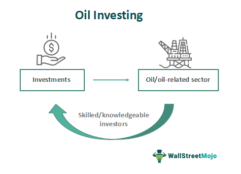

Understanding the dynamic nature of oil markets is crucial for investors, traders, and financial analysts who engage in commodity trading. Oil volatility refers to the fluctuations in oil prices caused by factors such as geopolitical events, supply and demand dynamics, and economic indicators. The oil market is notably influenced by political tensions in major oil-producing regions, shifts in global economic activities, and natural disasters that can disrupt supply chains. These factors collectively contribute to the complex behavior of oil prices, making them unpredictable yet offering opportunities for substantial gains.

Algorithmic trading has emerged as a powerful tool for profiting from oil volatility. With the integration of computer algorithms, traders can execute trades based on predefined criteria, optimizing their strategies to respond swiftly to market changes. Algorithms can process large volumes of data and identify patterns with a level of accuracy and speed unattainable by human traders alone. By employing quantitative models, algorithmic trading provides systematic investment strategies that can adapt to fluctuating market conditions, making it an indispensable asset for modern traders.



This article explores various strategies for trading oil as a commodity, leveraging algorithmic trading to maximize investment returns. It examines the role of volatility in informing trading decisions and highlights the technological tools that enhance strategic execution. By understanding the interplay between market dynamics and algorithmic models, traders can better navigate the complexities of the oil market and improve their potential for high returns.

## Table of Contents

## Understanding Oil Volatility

Oil prices are known for their high volatility, which is largely attributed to their sensitivity to various global factors. Economic conditions, geopolitical tensions, and natural disasters can all have significant impacts on oil prices. Economic downturns or booms affect the demand for oil, as industries scale back or ramp up production accordingly. Political uncertainties, such as conflicts in oil-rich regions or trade disputes, can disrupt supply chains or alter market expectations, leading to price fluctuations. Natural events like hurricanes or earthquakes can damage infrastructure or disrupt the supply, thereby affecting prices.

The Cboe Crude Oil [ETF](/wiki/etf-trading-strategies) Volatility Index (OVX) serves as an essential tool for measuring expected price fluctuations in the oil market. As a measure of market expectations of near-term volatility conveyed by oil option prices, the OVX provides traders with insights into potential price swings. For instance, a rising OVX may suggest increasing uncertainty or anticipated volatility, guiding traders in adjusting their hedging strategies accordingly. In contrast, a stable or declining OVX might indicate market stability, influencing decisions to maintain current positions or take advantage of lower volatility levels.

Traders benefit from the OVX by using it to anticipate price movements and refine their trading strategies. By analyzing the index, traders can align their trading activities with expected market conditions, implementing strategies that either capitalize on volatility spikes or protect against adverse movements. For example, an investor might employ options strategies like straddles or strangles to profit from expected high volatility scenarios indicated by a rising OVX.

Understanding the underlying factors driving oil [volatility](/wiki/volatility-trading-strategies) is crucial for traders aiming to create effective plans. Key factors include OPEC production decisions, changes in global economic conditions, shifts in energy policy, and technological advancements in energy production. Analyzing these elements allows traders to anticipate changes in supply-demand dynamics, prepare for unexpected geopolitical or natural events, and optimize their investment portfolios accordingly. By recognizing these drivers, traders can make informed decisions that align with their risk tolerance and return objectives, ultimately enhancing their overall trading performance in the volatile oil markets.

## Commodity Trading and Investment Strategies

Commodities trading, particularly involving [crude oil](/wiki/crude-oil), is a significant segment of global financial markets due to its potential for substantial profit stemming from price volatility. This volatility attracts traders and investors who employ various strategies to capitalize on price movements.

One primary approach is trading futures contracts. A futures contract is a legal agreement to buy or sell a particular commodity asset at a predetermined price at a specified time in the future. Traders use futures to hedge against price fluctuations or to speculate on price changes. The straightforward formula for determining profit or loss in a futures contract is:

$$

\text{Profit/Loss} = (\text{Selling Price} - \text{Purchase Price}) \times \text{Contract Size}
$$

Options spreads offer another strategic pathway, allowing traders to set up positions with options contracts that exploit volatility while limiting risk. An options spread involves buying and selling options of the same underlying asset with different strike prices or expiration dates. Popular strategies include bull call spreads, bear put spreads, and iron condors, each tailored to specific market expectations.

Spread trading between different types of crude oil, such as Brent and West Texas Intermediate (WTI), is also a common strategy. This strategy exploits pricing discrepancies between different crude types, inspired by factors such as geographical issues, quality variations, or geopolitical influences. Traders aim to profit from changes in the price differential between the two crudes.

Risk management practices are integral to trading strategies, aiming to minimize potential losses from volatile price movements. Techniques such as stop-loss orders, diversification, and portfolio optimization are employed to secure trading investments. Advanced risk models, often implemented computationally, assess potential downturns against expected returns, ensuring a balanced risk-reward scenario.

Understanding market fundamentals and technical analysis is paramount in crafting successful commodity trading strategies. Market fundamentals include supply-demand dynamics, geopolitical events, and economic indicators that can influence oil prices. Technical analysis involves using historic trading data, charts, and statistical indicators, such as moving averages and relative strength indices, to forecast future price movements.

The combination of analytical approaches enables traders to build strategies that are informed by both quantitative metrics and qualitative insights, increasing the probability of success in the high-stakes arena of oil trading.

## Algorithmic Trading in Oil Markets

Algorithmic trading in oil markets utilizes sophisticated computer algorithms to automate trade execution based on predetermined criteria, significantly enhancing efficiency and precision. These algorithms rely on a combination of statistical models and market signals to identify trading opportunities and optimize decision-making processes.

One prominent [algorithmic trading](/wiki/algorithmic-trading) strategy is statistical [arbitrage](/wiki/arbitrage), which involves exploiting price discrepancies between related oil contracts or assets. This strategy often employs econometric and statistical models to identify mispricings, allowing traders to execute simultaneous buy and sell orders to capture risk-free profits.

Momentum trading is another popular strategy, leveraging the tendency of oil prices to continue moving in their current direction. Algorithms detect price [momentum](/wiki/momentum) by analyzing historical price patterns and volatility, enabling the execution of trades that capitalize on these trends.

Mean reversion strategies assume that oil prices will revert to their historical mean or average levels. These algorithms identify deviations from this mean and execute trades that anticipate a return to average prices, profiting from price corrections.

Event-driven trading focuses on capitalizing on oil price fluctuations triggered by specific events such as geopolitical developments, economic announcements, or natural disasters. Algorithms assess market responses to these events and execute trades accordingly.

Machine learning techniques have significantly advanced algorithmic trading. With these techniques, algorithms can continually adapt and refine their models in response to new data, leading to more accurate and predictive trading strategies. Machine learning models analyze a plethora of market indicators, historical data, and real-time feeds to enhance trading performance.

To support the development and execution of algorithmic trading strategies, several essential tools are required. Real-time data feeds provide the latest market information necessary for decision-making. Trading platforms, equipped with advanced APIs, facilitate the seamless execution of trades based on algorithmic signals. Additionally, [backtesting](/wiki/backtesting) software allows traders to simulate and evaluate the performance of their algorithms against historical data, ensuring their robustness before deploying them in live markets.

In conclusion, algorithmic trading offers a systematic approach to profiting from oil market volatility. By employing sophisticated algorithms, techniques such as [statistical arbitrage](/wiki/statistical-arbitrage), momentum trading, mean reversion, and event-driven strategies can be effectively executed, contributing to enhanced investment outcomes.

## Risk Management and Opportunities

Successful trading in volatile markets such as oil requires strategic risk management to navigate the uncertainties and capitalize on opportunities. Traders in oil markets encounter various risks, each necessitating targeted strategies for effective mitigation.

**Market Risk** is the possibility of losing money due to adverse price movements. In oil trading, this is inherent owing to price swings driven by geopolitical tensions, natural disasters, and economic factors. To manage market risk, traders often use financial derivatives such as futures and options to hedge their positions. For instance, purchasing a put option allows a trader to sell oil at a predetermined price, providing a safety net if market prices drop.

**Regulatory Risk** arises from changes in laws and regulations governing oil trading. These can impact trading conditions and profit margins. Staying informed about regulatory changes and maintaining compliance with international trading standards is essential for mitigating this risk. Employing legal experts or using advanced compliance software can help traders adapt their strategies in response to policy shifts.

**Model Risk** involves the potential for inaccuracy in the predictive models used in algorithmic trading. Models may fail due to incorrect assumptions, data errors, or unanticipated market conditions. Managing model risk requires rigorous backtesting of trading algorithms and regularly updating models based on new data and market behavior. Machine learning techniques can enhance model adaptation and accuracy, thus reducing risk exposure.

Despite these risks, crude oil trading offers substantial opportunities due to its global market reach and inherent price volatility. Traders can exploit price fluctuations through diversified strategies. For example, **arbitrage opportunities** might arise when there are temporary price differences between related crude oil markets or derivatives. Additionally, adopting robust algorithmic strategies allows traders to execute trades with speed and precision, thereby maximizing returns.

Diversifying trading strategies involves employing a combination of tactics such as momentum trading, mean reversion, and event-driven strategies. Momentum trading takes advantage of market trends, capitalizing on the continuation of existing price movements, while mean reversion strategies seek to profit from the assumption that extreme price changes will revert to an average level. Event-driven trading leverages market reactions to significant occurrences, such as geopolitical disruptions or shifts in supply and demand dynamics.

Efficient risk management enables traders to seize these lucrative opportunities while maintaining a balanced risk profile. By integrating advanced technologies, including algorithmic trading and [machine learning](/wiki/machine-learning), traders can develop more sophisticated strategies that enhance their ability to predict market movements and respond to changes swiftly.

Here's an example of a simple Python function to simulate a basic risk management scenario using stop-loss orders:

```python
def calculate_stop_loss(entry_price, risk_percentage):
    """
    Calculate stop loss level based on entry price and acceptable risk percentage.

    :param entry_price: float, the price at which the position was entered
    :param risk_percentage: float, maximum risk tolerance in percentage
    :return: float, stop loss price
    """
    stop_loss_price = entry_price * (1 - risk_percentage / 100)
    return stop_loss_price

# Example usage
entry_price = 70.0  # Entry price of the oil position
risk_percentage = 2.0  # Maximum risk of 2%
stop_loss_price = calculate_stop_loss(entry_price, risk_percentage)
print(f"Stop loss price: ${stop_loss_price:.2f}")
```

In conclusion, effective risk management and strategic diversification are vital for traders seeking to navigate the complexities of oil markets. By leveraging technological tools and developing robust trading algorithms, traders can capitalize on the high volatility of crude oil, turning potential risks into profitable opportunities.

## Conclusion

Oil volatility presents significant opportunities for traders and investors who harness the appropriate strategies and technological tools. The highly volatile nature of oil prices, influenced by a myriad of factors such as geopolitical events and fluctuations in supply and demand, provides a fertile ground for those skilled in navigating this complexity. Algorithmic trading strategies have proven to be particularly effective in addressing the challenges and reaping the rewards of such a turbulent market. By leveraging computational power and sophisticated algorithms, traders can efficiently analyze vast quantities of data, execute trades at optimal times, and minimize human-induced errors.

While the risks associated with oil trading are considerable, the potential for high returns is equally compelling. Volatility itself is a double-edged sword; it can amplify losses just as easily as it can generate profits. Thus, sophisticated investors who employ rigorous risk management and leverage advanced algorithmic techniques can capitalize on oil's price movements. The ability to adapt and recalibrate strategies in response to ongoing market developments is crucial for sustaining profitability.

Looking forward, continued advancements in technology and data analytics are poised to further revolutionize oil trading strategies. Enhanced computational capabilities, combined with innovative machine learning approaches, will enable more precise predictions and responsive trading systems. The integration of real-time data analytics and automated decision-making will further empower traders, allowing them to swiftly adapt to market conditions and optimize their strategies for greater profitability. As these technological tools evolve, they will continue to expand the horizons of trading possibilities in the oil market, offering unprecedented opportunities for those willing to invest in and adapt to these innovations.

## References & Further Reading

[1]: ["The Basics of Oil and Gas Hedging"](https://www.mercatusenergy.com/blog/bid/86597/The-Fundamentals-of-Oil-Gas-Hedging-Futures) by Justin Kuepper, Investopedia

[2]: Baker, M., & Riddick, M. (2013). ["Oil Supply, Demand, and Medium-Term Prices: An Overview."](https://www.bakerinstitute.org/research/oil-demand-supply-and-medium-term-price-prospects-a-wavelets-based-analysis) Oxford Institute for Energy Studies.

[3]: Narang, R. (2013). ["Inside the Black Box: A Simple Guide to Quantitative and High-Frequency Trading"](https://www.amazon.com/Inside-Black-Box-Quantitative-Frequency/dp/1118362411) by Rishi K. Narang

[4]: Hull, J. (2018). ["Options, Futures, and Other Derivatives"](https://elibrary.pearson.de/book/99.150005/9781292410623) by John C. Hull

[5]: Yilmaz, M., Allen, D. E., & Powell, R. (2010). ["Oil Price Volatility and Stock Returns in the UK: Evidence from Oil Companies."](https://www.sciencedirect.com/science/article/pii/S0140988322001372) Papers.SSRN.com

[6]: Chan, E. P. (2009). ["Quantitative Trading: How to Build Your Own Algorithmic Trading Business"](https://github.com/ftvision/quant_trading_echan_book) by Ernest P. Chan

[7]: Zhang, D., & Tang, D. (2018). ["The Predictability of Crude Oil Market Volatility: A Bayesian Network Approach"](https://onlinelibrary.wiley.com/doi/10.1002/for.2502) Energy Economics.