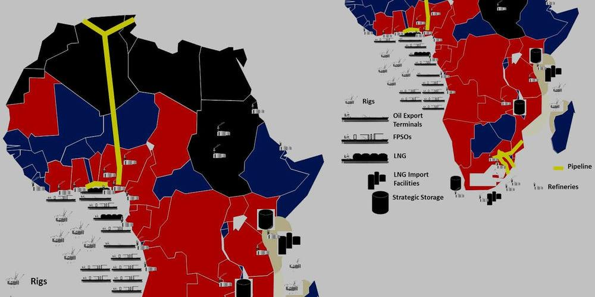

Africa, a continent abundant in natural resources, holds a prominent position in the global energy landscape, predominantly due to its considerable oil reserves. Oil production significantly contributes to the continent's economy, not only providing employment and government revenue but also influencing socio-economic development in numerous regions. In Africa, several key countries have emerged as major players in the global oil markets, including Nigeria, Libya, Angola, Algeria, and Egypt. These nations leverage their substantial oil reserves to bolster economic growth and foster international trade relations. 

In recent years, the landscape of oil trading in Africa has undergone a transformation with the increasing relevance of algorithmic trading. This advanced form of trading utilizes computer algorithms to execute trades at optimal times, impacting oil prices and trading strategies. As a result, algorithmic trading is reshaping the economic frameworks within which Africa's oil-producing countries operate, offering both opportunities for profit maximization and challenges related to market volatility.



This article scrutinizes the dynamics of oil production across Africa, identifying leading oil-producing nations and exploring how algorithmic trading is altering the industry. Through this analysis, we aim to present a comprehensive view of the opportunities and challenges that lie ahead for Africa's oil sector, shedding light on how these nations can strategically navigate this evolving landscape to sustain and enhance their economic prosperity.

## Table of Contents

## Oil Production in Africa: An Overview

Africa contributes approximately 8.23% of the world's oil production, a testament to its rich reservoir of natural resources. However, the journey of oil production across the continent has not been linear, with production levels experiencing significant fluctuations over the years. These fluctuations are influenced by an amalgamation of global economic variables and local geopolitical dynamics. For instance, the global demand and supply metrics, exchange rate shifts, and international sanctions can significantly impact oil production levels.

In recent years, there has been a modest stabilization in production levels. This stabilization marks a contrast to the previously volatile years, but it does not entirely eliminate uncertainty about future trends. Key influences on these production levels are diverse, encompassing several critical factors. 

Global oil prices play a central role, as they provide the financial incentives or disincentives for production activities. A decline in oil prices often leads to a reduction in production as it becomes less economically viable for companies to extract and process oil. Conversely, a surge in prices can trigger increased production efforts.

Political instability within African nations can significantly disrupt oil production. Conflicts and governance issues may lead to infrastructure damage, disruptions in the supply chain, and increased risks for investors, all of which can curtail production. The varying degrees of political stability across the continent mean that while some countries may experience growth in production, others may suffer setbacks.

Investment in exploration and technological advancements is another defining [factor](/wiki/factor-investing) for production levels. Increased investments can lead to the discovery of new oil reserves and improve extraction efficiency, thereby boosting production. African countries with a conducive climate for foreign and domestic investments often see a more consistent rise in production levels.

While uncertainty lingers due to potential geopolitical shifts and economic pressures, the current stabilization offers a foundation from which African nations could strategically plan for future growth in their oil sectors. To navigate these complexities, continual assessment and adaptation are crucial for sustaining and potentially expanding Africa's role in the global oil market.

## Key Oil-Producing Countries in Africa

Africa is home to several pivotal oil-producing nations, contributing significantly to the continent's economic landscape. Among these, Nigeria, Libya, Angola, Algeria, and Egypt stand out as leaders, each playing a critical role on the global stage.

Nigeria is the largest oil producer in Africa, with substantial oil reserves that have been central to its economy. The Nigerian economy heavily depends on oil, which accounts for a large percentage of government revenue and foreign exchange earnings. Despite this, the country faces challenges such as political instability and insurgency, particularly in the Niger Delta, which have affected production levels and infrastructure development.

Libya, possessing one of the largest proven oil reserves in Africa, has seen fluctuating production levels due to political instability post-2011. The Libyan conflict has disrupted oil output, affecting not only national but also regional market stability.

Angola ranks as one of the largest producers in sub-Saharan Africa. It has invested heavily in its oil sector, with oil revenues significantly boosting its GDP. However, the nation's over-reliance on oil exports has led to economic [volatility](/wiki/volatility-trading-strategies), illustrating the so-called "resource curse" where economies overly dependent on a single resource face difficulties in sustainable economic development.

Algeria, another top oil producer, has significant reserves and contributes considerably to Africa's total oil output. While the country has relatively stable production, it faces challenges related to infrastructure deficits and the need for foreign investment to enhance exploration and production capabilities.

Egypt, with a diversified energy sector, remains a key player due to its strategic location and developed infrastructure. The Suez Canal and Sumed pipeline are vital conduits for global oil transit, enhancing Egypt's role in global oil dynamics. Nonetheless, political instability and economic reforms pose challenges to maximizing its oil production potential.

These countries collectively contribute to Africa's position as a notable entity in global oil markets. However, political instability, infrastructural inadequacies, and economic challenges remain critical issues that could affect future production and economic benefits derived from their oil reserves. The strategic management of these resources is essential for long-term economic stability and growth.

## Impact of Algorithmic Trading in Oil Markets

Algorithmic trading, which employs computer algorithms to execute trades, has significantly changed the landscape of global oil markets, including those in Africa. This technology enables traders to perform high-frequency transactions, capitalizing on price movements within milliseconds. In oil markets, where prices are inherently volatile due to geopolitical factors and fluctuating demand and supply dynamics, [algorithmic trading](/wiki/algorithmic-trading) can both mitigate and exacerbate market volatility.

The primary advantage of algorithmic trading in oil markets is its potential to maximize profits. By using complex algorithms, traders can analyze vast datasets to predict future price movements based on historical patterns, news sentiment, and other variables. This predictive capability provides an edge in executing trades at optimal prices, enhancing profitability. However, the same traits that make algorithmic trading advantageous also pose risks, such as increased market volatility. Algorithms can react to fluctuations, amplifying price movements and resulting in rapid market shifts that may not align with real-world supply and demand situations.

Despite these risks, oil-producing countries are recognizing the strategic importance of algorithmic trading. It offers an avenue for participating more dynamically in global markets. For instance, by integrating algorithmic trading strategies, state-owned oil companies or national markets can better navigate price volatilities arising from international incidents or shifts in global economic policies.

In Python, basic algorithmic trading strategies can be implemented using libraries like Pandas for data manipulation and Matplotlib for visualization. An example of a simple moving average crossover strategy can be implemented as follows:

```python
import pandas as pd
import numpy as np
import matplotlib.pyplot as plt

# Load oil price data
data = pd.read_csv('oil_price_data.csv')
data['Date'] = pd.to_datetime(data['Date'])
data.set_index('Date', inplace=True)

# Calculate moving averages
short_window = 20
long_window = 50

data['Short_MA'] = data['Close'].rolling(window=short_window, min_periods=1).mean()
data['Long_MA'] = data['Close'].rolling(window=long_window, min_periods=1).mean()

# Plot moving averages
plt.figure(figsize=(10, 5))
plt.plot(data['Close'], label='Oil Price')
plt.plot(data['Short_MA'], label='20-Day MA')
plt.plot(data['Long_MA'], label='50-Day MA')
plt.legend(loc='best')
plt.title('Oil Price and Moving Averages')
plt.show()
```

Here, a moving average crossover signals traders when to buy or sell based on historical price trends, serving as a simplistic yet illustrative example of how algorithmic trading can be applied.

Overall, as algorithmic trading gains prominence, oil-producing countries, especially in Africa, are urged to monitor its impact closely. Understanding its dynamics can provide these nations with insights into global trading patterns, potentially aiding in better policy-making and market participation. Such insights can benefit national economies significantly, given the pivotal economic role that oil production plays in Africa.

## Challenges Facing Oil-Producing Countries in Africa

Political instability and governance issues frequently pose substantial challenges for oil-producing countries in Africa, impacting both production levels and economic development. Regions with abundant oil reserves, such as Nigeria and Libya, have historically experienced conflicts and governance challenges, which often result in interrupted production and deferment of investments. These political uncertainties can deter potential foreign investments, causing delays in exploration and production activities and diminishing economic prospects.

Economic over-reliance on oil exposes nations to the vulnerabilities associated with the 'resource curse.' This phenomenon, prevalent in many oil-rich African countries, refers to the paradox in which nations with abundant natural resources, particularly fossil fuels, tend to have less economic growth and worse development outcomes than countries with fewer natural resources. This dependency on oil neglects the development of other critical economic sectors, leading to fiscal volatility due to fluctuating global oil prices. Consequently, nations may face budget deficits during periods of low oil prices, compromising their ability to fund essential public services and development projects.

Diversification and investment in other sectors are essential to mitigate these vulnerabilities and achieve economic stability. Countries must prioritize developing non-oil sectors such as agriculture, manufacturing, and services. For example, Nigeria has made efforts to invest in agriculture and technology, while Angola has focused on diversification through infrastructure development and investments in tourism.

Infrastructure and technological investment are imperative to maintaining competitiveness in global oil markets. Many African oil producers experience logistical challenges due to outdated infrastructure and limited technological capabilities, impeding efficient oil extraction, refining, and transport. Significant investments in pipeline networks, transportation, and refining capacities are required to enhance operational efficiency and meet international standards. Additionally, embracing new technologies and innovations can optimize production processes and reduce costs, bolstering competitiveness in the constantly evolving global oil landscape.

In addressing these challenges, African oil-producing countries must develop comprehensive strategies involving collaborative efforts with international partners and stakeholders. By establishing stable governance frameworks, fostering economic diversification, and investing in infrastructure and technology, these nations can strengthen their resilience against market fluctuations and ensure long-term economic sustainability.

## Strategies for Sustainable Oil Production

To achieve sustainable growth in oil production, African countries must refine their policy and regulatory frameworks to attract more foreign investment. These frameworks should be designed to offer stability and transparency, minimizing uncertainties that might deter investors. By establishing clear and fair policies, countries can become more appealing to international stakeholders, ensuring a steady influx of capital necessary for exploration and production efforts.

Investment in infrastructure and technology is crucial for the efficient extraction and management of oil resources. Up-to-date infrastructure enables smoother operations and reduces the costs associated with production. Moreover, technological advancements, such as enhanced oil recovery (EOR) techniques, can boost the efficiency and yield of existing oil fields. Incorporating digital technologies and data analytics—potentially employing Python for data processing and analysis—can enhance operational efficiency. For instance, by using [machine learning](/wiki/machine-learning) algorithms, companies can optimize production schedules and maintenance routines, minimizing downtime and maximizing productivity.

Meanwhile, exploring alternative energy sources is essential for creating a diversified economic strategy. Diversification helps mitigate the risks associated with over-dependency on oil revenues, addressing the classic 'resource curse' dilemma. Investments in renewable energy sources, such as solar or wind, can provide long-term stability and align with global shifts towards sustainable energy. This dual approach not only lessens economic vulnerabilities but also contributes to reducing the carbon footprint associated with oil production.

Collaboration with international partners is another crucial strategy. These partnerships can provide access to both advanced technical expertise and financial support necessary for large-scale projects. By engaging with international companies and organizations, African nations can leverage state-of-the-art technologies and innovative practices to enhance their oil production capabilities. Such collaborations often involve knowledge transfer initiatives, which can upskill the local workforce and foster a more skilled oil and gas industry. This exchange of expertise helps build capacity and secures a more sustainable future for the nascent oil and gas sectors.

Ultimately, implementing strategic policies, investing in necessary infrastructure, diversifying energy sources, and fostering international partnerships can collectively ensure sustainable and efficient oil production in Africa. These initiatives can also aid in overcoming many of the challenges currently faced by the continent's oil-producing nations.

## Conclusion

Africa's oil-producing countries stand at a pivotal juncture where both opportunities and challenges coexist. The embrace of advanced technologies, such as algorithmic trading, has introduced a new dimension to market participation. These technologies are reshaping how trades are executed, offering potential for optimized pricing strategies and increased efficiency in the global oil markets.

Algorithmic trading, characterized by the use of complex algorithms to determine the timing, price, and quantity of trades, can enhance market accuracy and provide significant insights into market dynamics. However, it also requires robust technological infrastructure and skilled personnel to mitigate risks associated with increased volatility. Thus, strategic investment in technology and human capital is crucial for African nations to fully harness the benefits.

To sustainably capitalize on their oil reserves, African countries must navigate a complex landscape of economic, political, and technological challenges. Diversification of their economies beyond oil is vital to circumvent the potential negative effects of over-reliance on a single resource, commonly referred to as the "resource curse". This diversification involves bolstering other sectors, which can provide a buffer against volatile oil prices.

Additionally, governance and policy reforms are essential to ensure a stable and attractive investment climate. Transparent regulatory frameworks can boost investor confidence and spur investments in exploration and production activities. Furthermore, collaboration with international partners can drive technical innovation and bring much-needed financial resources for large-scale projects.

The future of oil production in Africa hinges on a balanced approach that considers sustainable exploration, active market engagement, and sound governance. By adopting a holistic strategy that addresses these areas, African nations can enhance their competitive edge in the global oil market and secure long-term economic stability. Through careful planning and execution, the continent can transform its immense oil potential into a resilient economic engine driving growth and development.

## References & Further Reading

[1]: Stevens, P. (2003). ["Resource Impact: Curse or Blessing?"](https://www.laohamutuk.org/OilWeb/Bground/Transpar/Stevens%20resource%20curseVol14_1.pdf) A Literature Survey.

[2]: Lopez de Prado, M. (2018). ["Advances in Financial Machine Learning."](https://www.amazon.com/Advances-Financial-Machine-Learning-Marcos/dp/1119482089) Wiley.

[3]: Aronson, D. R. (2007). ["Evidence-Based Technical Analysis: Applying the Scientific Method and Statistical Inference to Trading Signals."](https://onlinelibrary.wiley.com/doi/book/10.1002/9781118268315) Wiley.

[4]: Jansen, S. (2020). ["Machine Learning for Algorithmic Trading: Predictive Models to Extract Signals from Market and Alternative Data for Systematic Trading Strategies."](https://www.amazon.com/Machine-Learning-Algorithmic-Trading-alternative/dp/1839217715) Packt Publishing.

[5]: Chan, E. P. (2008). ["Quantitative Trading: How to Build Your Own Algorithmic Trading Business."](https://github.com/ftvision/quant_trading_echan_book) Wiley.

[6]: Auty, R. M. (1994). ["The Resource Curse Thesis: Minerals in Bolivian Development Policy."](https://onlinelibrary.wiley.com/doi/abs/10.1111/j.1467-9493.1994.tb00055.x) Transactions of the Institute of British Geographers, 18(3), 315-333.