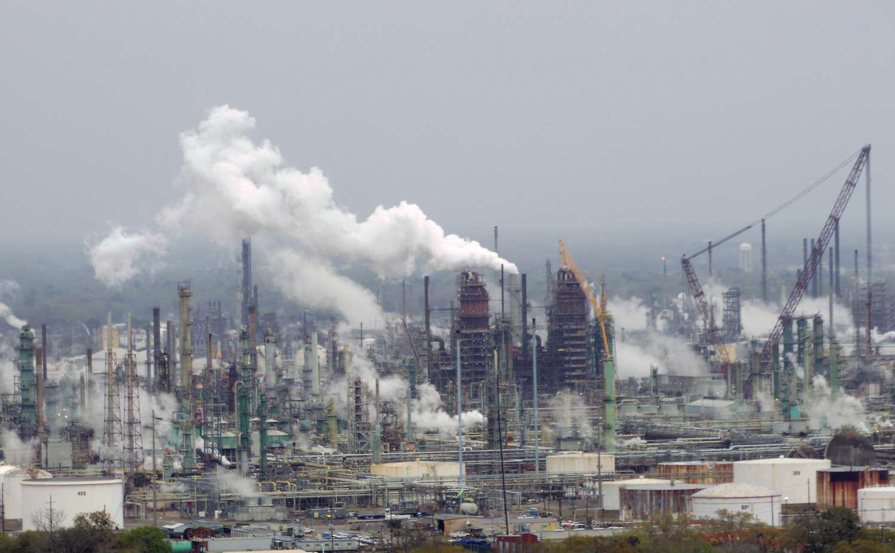

The oil industry plays a pivotal role in the global economy, serving as a cornerstone for energy supply, industrial production, and transportation sectors worldwide. It acts as a critical driver of economic growth, influencing international trade balances, and underpinning the energy security strategies of nations. The intricate web of operations within the oil industry is delineated into three fundamental sectors: upstream, midstream, and downstream, each with distinct functions and contributions to the industry's overall dynamics.

The upstream sector encompasses exploration and production activities. This phase involves locating potential crude oil and natural gas fields, as well as drilling and extracting these resources. The ability to discover untapped reserves directly impacts the supply available to meet global demand, making exploration efforts crucial for the industry's sustainability.



Midstream operations focus on the transportation and storage of crude oil and natural gas. This sector includes pipeline networks, shipping, and storage facilities essential for moving raw materials from production sites to refineries and other processing facilities. Efficient midstream infrastructure is vital for ensuring a stable and reliable supply chain, reducing the risk of bottlenecks and supply disruptions.

The downstream sector involves refining crude oil into usable products such as gasoline, diesel, jet fuel, and petrochemicals. It also includes the distribution and marketing of these products to end consumers. The downstream segment is where the oil industry intersects with consumer markets, making it critical for maintaining the balance between supply and consumer demand.

The purpose of this article is to provide an in-depth analysis of the oil industry, focusing on the integration and impact of refinery services and algorithmic trading. Readers can expect to gain insights into how these components contribute to market efficiency, price stability, and operational advancements. The article will explore how technological innovations, such as machine learning and advanced trading systems, are transforming the industry's responsiveness and efficiency. Furthermore, it will address the importance of aligning these changes with sustainable practices and regulatory frameworks, ensuring that economic progress does not come at the expense of environmental responsibility.

## Table of Contents

## Understanding the Oil Industry

## Understanding the Oil Industry

The oil industry is divided into three core sectors: upstream, midstream, and downstream, each serving a unique purpose in the lifecycle of petroleum products. Understanding these sections is critical for grasping the complexities and challenges faced by the industry.

### Upstream Sector: Exploration and Production

The upstream sector encompasses the processes involved in locating and extracting [crude oil](/wiki/crude-oil) and natural gas. It begins with geological surveys and seismic testing to identify potential reserves. Following the discovery phase, development and production ensue, involving sophisticated drilling techniques to bring hydrocarbons to the surface. Extraction methods range from traditional vertical wells to more advanced horizontal drilling and hydraulic fracturing, which maximize output from complex reservoirs. The upstream sector is heavily reliant on technology and is capital-intensive, with significant investments required for exploration and production activities.

### Midstream Sector: Transportation and Storage

The midstream sector focuses on the transportation and storage of crude oil, natural gas, and refined products. Key elements include pipelines, rail, tankers, and storage facilities. Transporting oil and gas from production sites to refineries and markets is a logistical challenge that requires efficient infrastructure. Pipelines, for instance, are the most cost-effective way of transporting large volumes over land but are subject to regulatory and environmental scrutiny. Storage facilities are critical for managing supply fluctuations and ensuring consistent delivery to downstream markets. The midstream sector serves as a critical link, providing stability and continuity within the oil supply chain.

### Downstream Sector: Refining and Distribution

The downstream sector involves the refining of crude oil into valuable products such as gasoline, diesel, jet fuel, and various petrochemicals. Refining processes include distillation, cracking, and reforming, which transform raw crude into usable products. This sector also includes the distribution and marketing of these products to end-users. The downstream sector is essential for converting oil's potential energy into forms that are practical for everyday use, impacting everything from transportation to manufacturing.

### Importance of Each Segment

Each segment of the oil industry is vital in ensuring that oil and gas products are efficiently extracted, transported, and refined into end-user products. The upstream sector is crucial for securing the raw material, while the midstream segment ensures logistical efficiency. The downstream sector then enables the product's usability, thereby completing the cycle from source to consumer. This segmentation ensures specialization and efficiency within the industry and allows for a streamlined process in reaching global markets.

### Current Challenges

The oil industry faces numerous challenges, primarily centered on market [volatility](/wiki/volatility-trading-strategies) and environmental concerns. Prices of crude oil are susceptible to geopolitical tensions, shifts in energy policies, and global economic trends, creating a volatile market environment. Additionally, there is increasing pressure to reduce environmental impacts associated with oil production and consumption. This includes addressing carbon emissions and the ecological disruptions caused by drilling and transportation activities. The industry is thus compelled to innovate and adhere to stringent regulations while pursuing more sustainable practices. 

The oil industry's complexity is marked by the intricacy of its operations and the external challenges it faces, necessitating adaptive strategies to maintain growth and sustainability.

## Role of Refinery Services

Refinery services play a critical role in the oil industry, focusing primarily on converting crude oil into usable products through a series of chemical processes. These refined products include gasoline, diesel, jet fuel, and other essential petroleum derivatives, which are pivotal for transportation, heating, and as feedstocks in chemical manufacturing.

**Processes within Refinery Services**

1. **Distillation** is the foundational process in oil refining. Crude oil is heated in a distillation column, causing it to separate into various fractions based on differences in boiling points. Heavier fractions like fuel oil separate at the bottom, while lighter fractions such as gasoline rise to the top.

2. **Cracking** is employed to break down larger, heavier molecules into lighter ones. This is vital for converting heavy fractions into valuable products like petrol. Cracking can be thermal or catalytic. Catalytic cracking uses a catalyst to lower the temperature and pressure required, making the process more efficient.

3. **Reforming** is used to improve the quality of lighter fractions. It restructures hydrocarbon molecules to increase octane numbers, enhancing fuel quality. This involves the reconfiguration of naphthenes into aromatics or paraffins into isoparaffins.

**Key Players in the Refining Sector**

The refining sector is dominated by major international oil companies such as ExxonMobil, Royal Dutch Shell, and Chevron. These entities manage large-scale refineries capable of processing vast quantities of crude oil, thus influencing global supply dynamics. Independent refiners, such as Valero Energy and Marathon Petroleum, also contribute significantly, focusing on optimizing operations for different regional markets and niche segments.

**Impact on Oil Prices and Supply Chain Stability**

Refinery services directly impact oil prices and supply chain stability. Efficient refining processes ensure a steady supply of petroleum products, mitigating price volatility. Conversely, disruptions in refinery operations, whether due to technical issues or geopolitical tensions, can lead to supply shortages and price spikes. The balance between supply and demand in refined products also dictates crude oil demand, affecting overall market prices.

**Technological Advancements in Refining Processes**

Technological innovations have continuously enhanced the efficacy of refining processes. Advances such as hydrocracking, which uses hydrogen to crack heavy hydrocarbons, improve yield and product quality. The integration of digital technologies, like predictive analytics and IoT, enables real-time monitoring and optimization of refining operations, reducing downtime and improving safety.

**Meeting Environmental and Performance Standards**

The role of refineries extends beyond production to include compliance with environmental standards. Refineries are investing in cleaner technologies to reduce their carbon footprint, such as sulfur recovery units and systems to lower nitrogen oxide emissions. These measures not only comply with regulatory standards but also align with the growing demand for sustainable practices in energy production.

In summary, refinery services are indispensable to the oil industry, facilitating the conversion of crude oil into essential products while adapting to technological advancements and environmental mandates. The sector's continual evolution ensures both market stability and the alignment with global energy needs.

## Algorithmic Trading in Oil Markets

Algorithmic trading, commonly known as algo trading, represents the use of computer algorithms to automate trading strategies in financial markets, including the oil markets. This methodology leverages mathematical models and automated execution tactics to process a large [volume](/wiki/volume-trading-strategy) of data and make trading decisions more efficiently than human traders. 

The evolution of algo trading in oil markets began with the adoption of electronic trading systems in the late 20th century. Initially confined to equities, the application of algorithmic strategies expanded into commodities, including oil, as traders and institutions sought to enhance trading efficiency and execution speed. By the early 21st century, with advancements in computing power and data analysis, [algorithmic trading](/wiki/algorithmic-trading) became increasingly prevalent in oil markets, contributing to [liquidity](/wiki/liquidity-risk-premium) and influencing pricing dynamics.

One of the primary advantages of algorithmic trading is enhanced efficiency. Algorithms can process vast datasets, analyze market trends, and execute trades at speeds that are unattainable for human traders. This capability allows for improved decision-making, reducing latency in trade execution and optimizing order placement based on market conditions. Additionally, algo trading can minimize transaction costs by leveraging price fluctuations within microseconds, a practice known as high-frequency trading ([HFT](/wiki/high-frequency-trading-strategies)).

Despite these advantages, algorithmic trading in oil markets presents challenges and risks. One significant concern is the potential for market volatility. Algorithms can amplify price movements, as evidenced during the 2010 Flash Crash, where rapid automated selling led to dramatic market declines (Kirilenko, A. A., et al.). Another risk is the reliance on complex models that may malfunction due to erroneous assumptions or unprecedented market conditions. Such malfunctions can result in substantial financial losses and contribute to systemic risk.

Case studies illustrate the impact of algo trading on oil prices. For example, during periods of geopolitical uncertainty or supply disruptions, algorithmic systems can quickly react to news, leading to sharp price movements. These systems analyze news feeds and data regarding oil inventories, weather patterns, and other relevant factors, triggering buy or sell orders based on pre-set criteria. Such actions can lead to significant short-term volatility, affecting both speculation and hedging strategies used by market participants.

Regulatory concerns in algorithmic trading center around ensuring market stability and fairness. The rapid nature of algo trading necessitates robust risk management frameworks to prevent flash crashes and protect against manipulative practices like spoofing (placing fake orders to mislead the market). Regulators, like the Commodity Futures Trading Commission (CFTC), have implemented guidelines to enhance transparency and accountability in algorithmic trading, requiring firms to register automated trading systems and adhere to stringent testing and monitoring standards.

In conclusion, algorithmic trading in oil markets offers increased efficiency and improved decision-making capabilities, yet it also poses challenges related to market volatility and systemic risk. As algo trading technology continues to evolve, balancing innovation with regulatory oversight remains critical to ensure stability and integrity in oil markets.

## Integration of Refinery Services and Algo Trading

The integration of refinery services and algorithmic trading represents a significant advancement in the oil industry, driven by the need for increased efficiency and responsiveness in a challenging market environment. 

**Benefits of Integrating Trading Systems with Refining Operations**

The integration of trading systems with refining operations offers substantial benefits to the oil industry. By synchronizing these functions, companies can make more informed decisions regarding feedstock procurement, production scheduling, and inventory management. This alignment allows for enhanced flexibility, enabling refineries to react dynamically to market shifts, such as price changes or disruptions in supply. As a result, firms can optimize their production processes to align with real-time market conditions, thus maximizing profitability and minimizing waste.

**Improving Supply Chain Efficiency**

Supply chain efficiency is notably improved through the integration of trading systems with refining operations. By leveraging real-time data analytics and predictive modeling, companies can optimize logistics and inventory management, reducing delays and costs associated with over or under-supply. This heightened level of coordination ensures that supply chain disruptions are minimized, thereby enhancing the stability and reliability of oil deliveries to markets.

**Machine Learning in Forecasting and Optimization**

Machine learning plays a critical role in enhancing forecasting and optimization within integrated operations. By analyzing vast datasets such as historical pricing, production outputs, and consumption patterns, [machine learning](/wiki/machine-learning) algorithms can forecast demand and supply with greater accuracy. A simple example in Python could involve utilizing a linear regression model to predict future prices based on historical data:

```python
from sklearn.model_selection import train_test_split
from sklearn.linear_model import LinearRegression
import numpy as np

# Sample data: historical oil prices and other relevant features
data = np.array([[...]])  # assume this is populated with actual data
X, y = data[:, :-1], data[:, -1]  # features and target variable

X_train, X_test, y_train, y_test = train_test_split(X, y, test_size=0.2)

model = LinearRegression()
model.fit(X_train, y_train)

price_prediction = model.predict(X_test)
```

**Future Strategies for Technology-Driven Operations**

Future strategies in technology-driven operations will likely focus on the deeper integration of [artificial intelligence](/wiki/ai-artificial-intelligence) (AI) and blockchain technologies. These technologies are poised to streamline contractual agreements and enhance the transparency of operations. Moreover, the implementation of IoT devices throughout the oil supply chain will enable real-time monitoring and control, further contributing to operational efficiencies.

**Balancing Economic Efficiency with Compliance and Responsibility**

Balancing economic efficiency with regulatory compliance and environmental responsibility remains a critical challenge. Companies must ensure that technological advancements and system integrations do not compromise their compliance with environmental standards or regulatory requirements. Achieving this balance requires continuous innovation in refining processes and trading strategies, alongside ethical considerations and adherence to international regulations.

In conclusion, the integration of refinery services with algorithmic trading not only enhances operational efficiency but also positions the oil industry to better navigate economic and environmental challenges. As technology continues to evolve, these integrative approaches will become indispensable for industry stakeholders aiming to achieve sustainable and profitable operations.

## Conclusion

Refinery services and algorithmic trading are pivotal components in the transformation of the oil industry, driving both operational efficiencies and market responsiveness. Technological innovations within these fields have resulted in significant enhancements in how oil companies operate and interact with the market.

Refinery services have advanced to optimize performance through cutting-edge technologies such as digital twins and AI-driven analytics. These improvements allow for real-time monitoring and predictive maintenance, thus minimizing downtime and maximizing throughput. Algorithmic trading, on the other hand, has revolutionized market operations by enabling faster and more accurate decision-making processes. Through the use of complex algorithms, trading strategies are executed with precision, reducing the impact of human error and increasing market liquidity.

The integration of these technologies with sustainable practices is crucial for future growth. Aligning operations with environmental regulations not only supports global sustainability goals but also offers a competitive advantage. Innovations that reduce carbon emissions and optimize resource usage are essential for reducing the environmental footprint of the industry.

Industry stakeholders are encouraged to adopt these innovative solutions. Continued investment in research and development, alongside collaboration with technology providers, will strengthen the industry's ability to adapt to market changes and regulatory challenges. By embracing technological change and integrating sustainable practices, the oil industry can achieve a balanced approach to economic efficiency and environmental responsibility, ensuring longevity and resilience in a rapidly evolving landscape.

## References & Further Reading

Yergin, D. (1991). *The Prize: The Epic Quest for Oil, Money & Power*. This book presents an extensive historical account of the global oil industry, discussing its critical role in shaping modern geopolitics and economy. 

McLean, B. & Elkind, P. (2003). *The Smartest Guys in the Room: The Amazing Rise and Fall of Enron*. This work investigates the rise and subsequent collapse of Enron, providing insights into corporate malfeasance and its implications on the energy markets including oil.

U.S. Energy Information Administration. This government resource provides comprehensive data and analysis on refining processes and their significance in the oil industry value chain. It is an essential reference for understanding how crude oil is transformed into finished products.

Hull, J. C. *Options, Futures, and Other Derivatives*. A foundational text for understanding derivatives markets, this book offers valuable insights into financial instruments heavily used in trading oil futures and managing risk.

Aldridge, I. *High-Frequency Trading: A Practical Guide to Algorithmic Strategies and Trading Systems*. This guide outlines the implementation and effects of algorithmic trading systems, including their application and impact within oil markets.

These references provide a foundational understanding of the complexities surrounding the oil industry, from historical perspectives and technical processes to modern financial applications and regulatory considerations.

