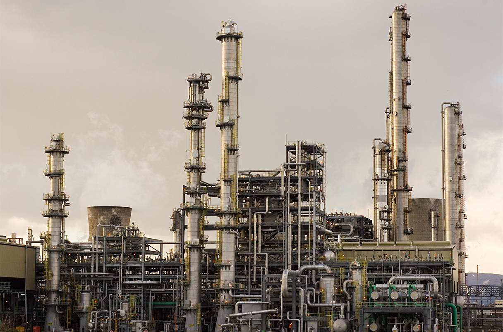

## Table of Contents

## What is an oil refinery and what is its primary purpose?

An oil refinery is a big factory where crude oil, which is a thick, dark liquid that comes from the ground, gets turned into useful products. These products include gasoline for cars, diesel for trucks, and jet fuel for airplanes. The refinery takes the crude oil and separates it into different parts, kind of like sorting a mixed bag of candy into different types.

The main purpose of an oil refinery is to make crude oil more useful. Crude oil by itself isn't very helpful, but when it's broken down into different parts, those parts can be used for many things. This process helps meet the world's need for energy and transportation fuels. Without refineries, we wouldn't have the gasoline to drive our cars or the jet fuel to fly airplanes.

## What are the main functions of an oil refinery?

An oil refinery has several main jobs. First, it separates crude oil into different parts. This is done through a process called distillation, where the oil is heated up and the different parts turn into gas at different temperatures. These gases are then cooled down and turned back into liquids. This separation is important because it lets the refinery take the useful parts out of the crude oil.

After separating the oil, the refinery changes these parts into more useful products. This is called conversion. For example, some of the heavier parts of the oil can be turned into lighter fuels like gasoline. The refinery also cleans up these products to make sure they are safe to use. This cleaning process, called treatment, removes things like sulfur that can be harmful to the environment. By doing all these things, the refinery turns crude oil into the fuels and other products we use every day.

## How does crude oil enter and move through an oil refinery?

Crude oil enters an oil refinery through pipelines or sometimes by ships or trains. When it arrives, it is stored in big tanks at the refinery. These tanks hold the oil until it's ready to be processed. From the storage tanks, the oil is pumped into the first part of the refinery, which is called the distillation unit.

In the distillation unit, the crude oil is heated up in a big tower. As it gets hotter, different parts of the oil turn into gas at different temperatures and rise up the tower. At the top of the tower, the gases cool down and turn back into liquids. These liquids are collected at different levels of the tower, depending on how heavy or light they are. From here, the different parts of the oil move to other parts of the refinery where they are turned into useful products like gasoline and diesel.

## What are the different types of crude oil and how do they affect refinery operations?

Crude oil comes in different types, mainly light, medium, and heavy. Light crude oil is easier to turn into gasoline and other fuels because it has more of the lighter parts that refineries need. Medium crude oil is in the middle and has a mix of light and heavy parts. Heavy crude oil has more of the heavy parts, which makes it harder to turn into gasoline. It often needs more processing, which can be more expensive and take more time.

The type of crude oil affects how a refinery works. If a refinery gets mostly light crude oil, it can make more gasoline and other light fuels easily. But if it gets heavy crude oil, the refinery might need special equipment to break down the heavy parts into lighter ones. This can make the refinery's job harder and more costly. So, refineries often try to get a mix of different types of crude oil to keep their operations running smoothly and efficiently.

## What are the key processes involved in refining crude oil into usable products?

The first key process in refining crude oil is called distillation. This is where the crude oil is heated up in a big tower. As it gets hot, different parts of the oil turn into gas at different temperatures and rise up the tower. At the top, these gases cool down and turn back into liquids. These liquids are collected at different levels of the tower, depending on how heavy or light they are. This separates the oil into different parts, like gasoline, diesel, and other products.

After distillation, the next important process is conversion. This is where the refinery changes the heavier parts of the oil into lighter, more useful products. For example, heavy parts can be turned into gasoline through processes like cracking or hydrocracking. These processes break down the big molecules into smaller ones that are better for fuel. The last key process is treatment. This is where the refinery cleans up the products to make sure they are safe to use. It removes harmful things like sulfur, which can be bad for the environment. By doing all these steps, the refinery turns crude oil into the fuels and other products we use every day.

## What are the most common products produced by an oil refinery?

The most common products made by an oil refinery are gasoline, diesel, and jet fuel. Gasoline is what most cars and motorcycles use to run. Diesel is used in trucks, buses, and some cars. Jet fuel is what airplanes need to fly. These fuels are made from the lighter parts of crude oil, which are easier to turn into useful products.

Besides these fuels, refineries also make other things like heating oil, which people use to warm their homes, and liquefied petroleum gas (LPG), which is used for cooking and heating. Refineries also produce asphalt, which is used to make roads, and lubricants, which help machines run smoothly. All these products come from the different parts of crude oil that the refinery separates and changes.

## How do refineries ensure the quality and safety of their products?

Refineries make sure their products are good and safe by using a process called treatment. This process cleans up the products to remove harmful things like sulfur. Sulfur can be bad for the environment and for the engines that use the fuel. By taking it out, the refinery makes sure the products are safe to use and won't hurt the air or the machines.

They also check the products a lot to make sure they meet certain rules. These rules are set by governments to make sure the fuels are safe and good for the environment. The refinery uses special machines to test the products and see if they are the right quality. If something is not right, they fix it before sending the products out. This way, people can trust that the gasoline, diesel, and other products they get from the refinery are safe and will work well.

## What role do catalysts play in the refining process?

Catalysts are very important in the oil refining process. They help speed up chemical reactions that turn heavy parts of crude oil into lighter, more useful products like gasoline. Without catalysts, these reactions would take a lot longer and need more heat, which would make refining more expensive and less efficient. Catalysts work by making it easier for the oil molecules to break apart and rearrange into the right shape for fuel.

In the refining process, catalysts are used in steps like cracking and hydrocracking. Cracking breaks down big, heavy molecules into smaller, lighter ones. Hydrocracking does the same thing but also adds hydrogen to make the products even better. The catalysts are usually made from special materials like metals or chemicals that can handle the high temperatures and pressures inside the refinery. By using catalysts, refineries can make more of the fuels we need, like gasoline and diesel, from the same amount of crude oil.

## How do environmental regulations impact refinery operations and what measures are taken to comply?

Environmental rules have a big impact on how oil refineries work. These rules are made to protect the air, water, and land from pollution. Refineries have to follow these rules, which can mean they need to change how they do things or use new technology to clean up their waste. For example, they might need to take out more sulfur from their products because sulfur can be bad for the air. This can make refining more expensive and take more time, but it's important for keeping the environment safe.

To follow these rules, refineries take a few steps. They use special equipment to clean up their products and waste. This equipment can remove harmful things like sulfur and other pollutants. They also check their products a lot to make sure they meet the rules. Sometimes, they have to change their processes or use new technology to make their products cleaner. By doing all these things, refineries can keep making the fuels we need while also taking care of the environment.

## What are the latest technological advancements in oil refining and how do they improve efficiency?

The latest technology in oil refining is making things better and more efficient. One big change is using better catalysts. These are special materials that help turn heavy oil into lighter fuels like gasoline faster and with less waste. New catalysts can handle high temperatures and pressures better, so refineries can make more fuel from the same amount of oil. Another cool thing is using computers and special software to control the refining process. This helps the refinery work better by making sure everything is just right, like the temperature and pressure, so they waste less oil and make more good products.

Another important advancement is something called "digital twins." This is like a computer model of the whole refinery. It helps the people running the refinery see how things are working and find problems before they get big. This can save a lot of time and money because they can fix things before they break. Also, new ways of cleaning up the oil, like better ways to take out sulfur, are helping refineries make cleaner fuels. This is good for the environment and helps them follow the rules better. All these new technologies are making refineries work better, use less energy, and be kinder to the planet.

## How do refineries manage and mitigate operational risks?

Refineries manage and mitigate operational risks by having strict safety rules and training their workers well. They make sure everyone knows what to do to stay safe and what to do if something goes wrong. They also use special equipment to watch over the refinery all the time. This equipment can spot problems early, like if something is too hot or if there's a leak. By catching these problems early, they can fix them before they turn into big accidents.

Another way refineries manage risks is by having good plans for emergencies. They practice these plans a lot so everyone knows what to do if there's a fire or a spill. They also keep their equipment in good shape by checking it often and fixing it when it needs it. This helps prevent breakdowns that could cause accidents. By doing all these things, refineries can keep their workers safe and keep the refinery running smoothly.

## What are the future challenges and opportunities for oil refineries in the context of global energy transitions?

Oil refineries are facing big challenges as the world tries to use less oil and more clean energy. One big challenge is that people are driving electric cars more and more, so they need less gasoline. This means refineries might not sell as much of their main product. Also, new rules to fight climate change are making refineries spend more money to clean up their products and waste. This can make it harder for them to make money. But, refineries can also find new ways to make money by turning into places that make biofuels or other green products. This could help them stay important in the new energy world.

On the other hand, there are also good opportunities for oil refineries. They can use their big factories and know-how to make new kinds of fuels, like biofuels made from plants. This can help them keep making money even as the world uses less oil. Also, refineries can use new technology to make their work cleaner and more efficient. This can help them follow the new rules and maybe even save money. By being smart and changing with the times, refineries can find new ways to be useful and successful in the future.

## References & Further Reading

Yergin, D. (1991). *The Prize: The Epic Quest for Oil, Money & Power*. This book presents an extensive historical account of the global oil industry, discussing its critical role in shaping modern geopolitics and economy. 

McLean, B. & Elkind, P. (2003). *The Smartest Guys in the Room: The Amazing Rise and Fall of Enron*. This work investigates the rise and subsequent collapse of Enron, providing insights into corporate malfeasance and its implications on the energy markets including oil.

U.S. Energy Information Administration. This government resource provides comprehensive data and analysis on refining processes and their significance in the oil industry value chain. It is an essential reference for understanding how crude oil is transformed into finished products.

Hull, J. C. *Options, Futures, and Other Derivatives*. A foundational text for understanding derivatives markets, this book offers valuable insights into financial instruments heavily used in trading oil futures and managing risk.

Aldridge, I. *High-Frequency Trading: A Practical Guide to Algorithmic Strategies and Trading Systems*. This guide outlines the implementation and effects of algorithmic trading systems, including their application and impact within oil markets.

These references provide a foundational understanding of the complexities surrounding the oil industry, from historical perspectives and technical processes to modern financial applications and regulatory considerations.

