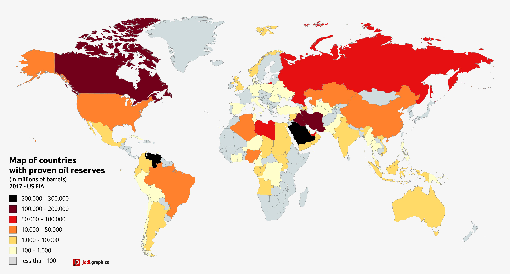

## Table of Contents

## What are oil reserves?

Oil reserves are the amounts of oil that are known to exist and can be taken out of the ground using today's technology. These reserves are important because they help countries and companies plan for the future. They are usually found deep underground or under the ocean floor. When people talk about oil reserves, they are talking about oil that can be used to make gasoline, diesel, and other products that we use every day.

Countries and companies spend a lot of time and money to find out how much oil is in their reserves. They use special tools and machines to explore the earth and find oil. Once they know where the oil is, they can start drilling to get it out. The size of oil reserves can change over time. If new oil is found, the reserves get bigger. If a lot of oil is used, the reserves get smaller. Knowing how much oil is left helps everyone make smart decisions about how to use it.

## How are oil reserves classified?

Oil reserves are classified into three main types: proven, probable, and possible reserves. Proven reserves are the oil that we are very sure is there and can be taken out with today's technology. It's like knowing exactly how many apples are on a tree because you can see them. Probable reserves are oil that we think is there, but we're not as sure about it. It's like guessing how many apples might be hidden in the leaves. Possible reserves are oil that might be there, but we're not very sure at all. It's like wondering if there might be apples on a tree far away that you can't see clearly.

These classifications help people understand how much oil they can count on. Proven reserves are the most important because they are the most reliable. Companies and countries use this information to plan how much oil they can sell or use. Probable and possible reserves are less certain, so they are used more for long-term planning. Knowing the difference between these types of reserves helps everyone make better decisions about using oil now and in the future.

## What is the difference between oil reserves and oil resources?

Oil reserves and oil resources are two different things. Oil reserves are the amounts of oil that we know are there and can be taken out of the ground using the technology we have right now. It's like knowing how many apples you can pick from a tree today. These reserves are important because they help us plan how much oil we can use or sell in the near future.

Oil resources, on the other hand, include all the oil that might be there, even if we can't get it out yet. This includes oil that is too deep or too hard to reach with today's technology. It's like knowing there are apples on a tree, but you can't reach them because they are too high up. Oil resources give us an idea of how much oil might be available in the future if we develop better ways to get it out of the ground.

## How are oil reserves estimated?

Oil reserves are estimated by using special tools and machines to explore the earth. Scientists and engineers use something called seismic surveys to send sound waves into the ground. The sound waves bounce back, and by studying these echoes, they can tell where oil might be hiding. They also drill test wells to get samples of the rock and oil. By studying these samples, they can figure out how much oil is there and how easy it will be to get it out.

Once they have all this information, they use it to make a guess about how much oil is in the reserves. They consider things like the size of the oil field, the type of rock it's in, and how well the oil flows. They also think about how much of the oil they can actually get out with the technology they have now. This is why oil reserves are often called "proven reserves" because they are the amounts of oil that we are very sure we can use.

## What are the largest oil reserves by country?

The country with the largest oil reserves is Venezuela, with about 303 billion barrels. That's a lot of oil! Saudi Arabia comes in second with around 267 billion barrels. These two countries have more oil than anyone else in the world. Iran is third with about 158 billion barrels, and Canada and Iraq follow with 170 billion and 145 billion barrels, respectively.

These numbers can change over time because new oil can be found, and some oil gets used up. Countries like Russia and the United States also have big oil reserves, but they are not as big as the top five. Knowing how much oil a country has helps them plan for the future and decide how to use their oil wisely.

## How do oil reserves impact global energy markets?

Oil reserves have a big impact on global energy markets because they tell us how much oil is available to use. When countries have a lot of oil, like Venezuela and Saudi Arabia, they can sell it to other countries. This helps keep the price of oil steady because there is enough to go around. But if the reserves start to run low, or if there are problems getting the oil out, the price can go up because there is less oil to buy.

Oil reserves also affect how countries plan for the future. If a country knows it has a lot of oil, it might decide to use more of it now or sell it to other countries. But if a country's reserves are small, it might try to save its oil and look for other ways to get energy, like using wind or solar power. This planning can change how much oil is bought and sold around the world, which can make the price of oil go up or down.

## What technologies are used to explore and extract oil reserves?

To find oil reserves, scientists use a method called seismic surveying. They send sound waves into the ground and listen to the echoes that come back. By studying these echoes, they can tell where oil might be hiding underground. Once they think they've found some oil, they drill test wells to get samples of the rock and oil. These samples help them figure out how much oil is there and how easy it will be to get it out. This is how they estimate the size of the oil reserves.

To get the oil out of the ground, people use different drilling technologies. One common method is called rotary drilling, where a big drill bit spins and cuts through the rock to reach the oil. Sometimes, they use horizontal drilling, which lets them drill sideways to reach more oil. Once they reach the oil, they might use something called hydraulic fracturing, or "fracking," to break the rock and let the oil flow out more easily. These technologies help make sure we can use as much of the oil in the reserves as possible.

## How do environmental factors affect oil reserve estimates?

Environmental factors can change how much oil we think is in the ground. For example, if an oil field is in a place with a lot of earthquakes or storms, it can be harder and more dangerous to drill there. This might make us think there is less oil we can use because it's too risky to get it out. Also, if the oil is in a sensitive area like a rainforest or near the ocean, there might be rules about how much drilling can be done to protect the environment. These rules can make the oil reserves seem smaller because we can't get to all the oil.

Another way the environment affects oil reserve estimates is through climate change. As the world gets warmer, the ice at the North and South Poles is melting. This can make it easier to find and drill for oil in places that were once covered in ice. But at the same time, climate change can make storms and weather more extreme, which can make drilling harder and more dangerous. So, while some oil might become easier to reach, other oil might become harder to get because of the changing environment.

## What is the role of OPEC in managing oil reserves?

OPEC, which stands for the Organization of the Petroleum Exporting Countries, is a group of countries that work together to manage oil reserves. They do this by deciding how much oil each country should produce and sell. This helps keep the price of oil stable and makes sure there is enough oil for everyone. OPEC countries have a lot of the world's oil reserves, so what they do can affect the whole world.

OPEC meets regularly to talk about how much oil is being used and how much oil they should produce. If they think there is too much oil and the price is going down, they might decide to produce less oil. If they think there is not enough oil and the price is going up too fast, they might decide to produce more. By doing this, OPEC tries to keep the oil market balanced and make sure that oil reserves are used wisely.

## How have oil reserve estimates changed over time?

Oil reserve estimates have changed a lot over time. In the past, people thought there was less oil than we have now because they didn't have good tools to find it. As technology got better, scientists found more oil in places they didn't know about before. For example, new ways of drilling, like horizontal drilling and fracking, helped find oil in rocks that were hard to reach before. Also, as countries explored more, they found new oil fields, which made the total amount of oil reserves go up.

But oil reserve estimates can also go down. When countries use a lot of oil, the reserves get smaller. Sometimes, oil fields don't produce as much oil as people thought they would, so the estimates have to be lowered. Political problems or wars can also make it hard to get oil out of the ground, which can change how much oil we think is available. Overall, oil reserve estimates keep changing because of new discoveries, better technology, and how much oil is being used.

## What are the economic implications of depleting oil reserves?

When oil reserves start to run out, it can have big effects on the economy. Oil is used to make a lot of things we use every day, like gasoline for cars and plastic for toys. If there is less oil, the price of these things can go up because there is not enough to go around. This can make everything more expensive, which can make it harder for people to buy what they need. Countries that sell a lot of oil, like Saudi Arabia and Venezuela, might have a hard time if their oil runs out because they won't have as much money coming in. They might need to find other ways to make money, which can be hard and take a long time.

On the other hand, running out of oil can also push countries to find new ways to get energy. This can lead to more jobs and new kinds of businesses, like those that make wind or solar power. If countries start using less oil and more clean energy, it can be good for the environment too. But changing from oil to other kinds of energy can be tricky and expensive. It takes time to build new power plants and change cars and machines to use different energy sources. So, while running out of oil can cause problems, it can also lead to new opportunities if countries plan carefully.

## What are the future prospects for oil reserves in the context of renewable energy?

As more people start using renewable energy like wind and solar power, the future of oil reserves might change a lot. Renewable energy doesn't run out like oil does, so more countries might decide to use it instead of oil. This could mean that oil reserves won't be as important as they are now. If fewer people need oil, the price might go down, and countries that sell a lot of oil might have to find other ways to make money. But oil will still be used for a while because it's hard to change everything to use renewable energy right away.

Even though renewable energy is growing, oil reserves will still play a big role for some time. Oil is used to make many things besides just fuel, like plastics and chemicals. So, even if we use less oil for energy, we might still need it for other things. But as technology gets better and more people use renewable energy, the demand for oil might slowly go down. This means that oil reserves will be less important in the future, but they will still be part of our world for a while as we make the switch to cleaner energy sources.

## References & Further Reading

[1]: ["BP Statistical Review of World Energy"](https://www.bp.com/content/dam/bp/business-sites/en/global/corporate/pdfs/energy-economics/statistical-review/bp-stats-review-2021-full-report.pdf), BP

[2]: Yergin, D. (2011). "[The Quest: Energy, Security, and the Remaking of the Modern World](https://www.amazon.com/Quest-Energy-Security-Remaking-Modern/dp/0143121944)," Penguin Books.

[3]: Geman, H. (2005). ["Commodities and Commodity Derivatives: Modelling and Pricing for Agriculturals, Metals and Energy"](https://www.wiley.com/en-us/Commodities+and+Commodity+Derivatives%3A+Modeling+and+Pricing+for+Agriculturals%2C+Metals+and+Energy-p-9780470012185), Wiley Finance.

[4]: [U.S. Energy Information Administration (EIA) Reports](https://www.eia.gov/analysis/reports.php/)

[5]: Malz, A. M. (2011). ["Financial Risk Management: Models, History, and Institutions"](https://www.wiley.com/en-us/Financial+Risk+Management%3A+Models%2C+History%2C+and+Institutions-p-9781118022917), Wiley.

[6]: Harris, L. (2003). ["Trading and Exchanges: Market Microstructure for Practitioners"](https://www.amazon.com/Trading-Exchanges-Market-Microstructure-Practitioners/dp/0195144708), Oxford University Press.

[7]: ["The Markets in Financial Instruments Directive II (MiFID II)"](https://www.esma.europa.eu/publications-and-data/interactive-single-rulebook/mifid-ii), European Securities and Markets Authority.

[8]: ["World Energy Outlook 2021"](https://www.iea.org/reports/world-energy-outlook-2021), International Energy Agency (IEA).

[9]: Aldridge, I. (2013). ["High-Frequency Trading: A Practical Guide to Algorithmic Strategies and Trading Systems"](https://www.wiley.com/en-us/High+Frequency+Trading%3A+A+Practical+Guide+to+Algorithmic+Strategies+and+Trading+Systems-p-9780470579770), Wiley.