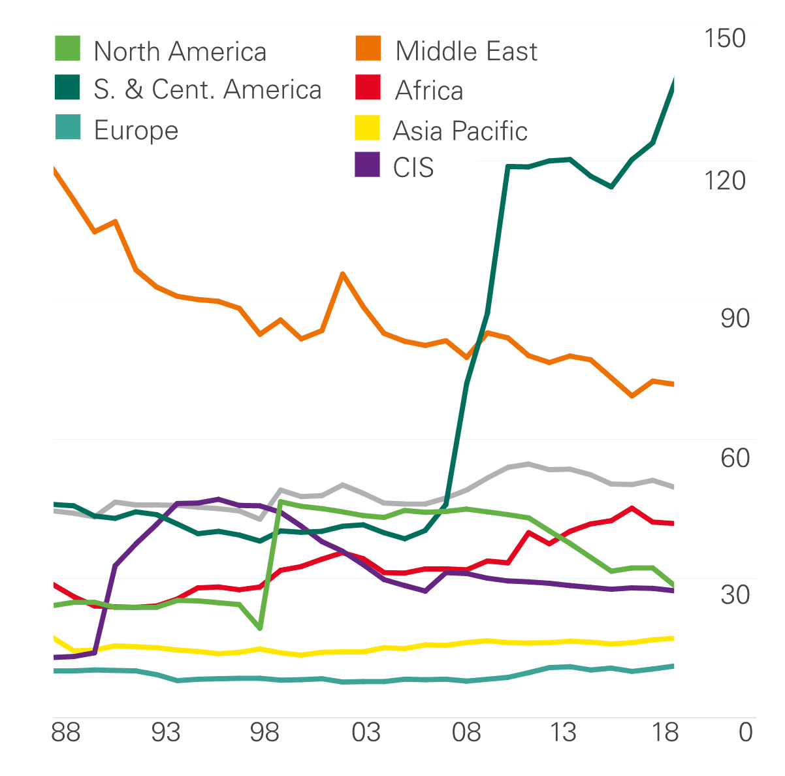

The energy industry, intricate and multifaceted, is a pivotal component of global economies, influencing areas such as oil reserves, petroleum resources, and advanced financial trading strategies, notably algorithmic trading. Oil reserves, representing quantifiable deposits of crude oil, are crucial for economic stability and growth, underscoring their significance in national and international geopolitics. Nations with substantial reserves, like Venezuela, Saudi Arabia, and Canada, are key players in the global oil market, wielding considerable influence due to their ability to impact supply and pricing.

Calculating and managing oil reserves are complex tasks that rely heavily on geological data and technological developments. The differentiation between proven, probable, and possible reserves provides a framework for understanding the extent of these resources, with proven reserves being economically feasible to extract with existing technology. Strategic Petroleum Reserves (SPRs) act as a buffer against supply disruptions, offering a safeguard in times of geopolitical unrest or natural disasters, thus stabilizing economies.

Concurrently, the rise of algorithmic trading, or algo trading, is reshaping the landscape of financial markets, including energy commodities. This advanced trading strategy uses algorithms to execute trades based on pre-set parameters, significantly enhancing the speed and efficiency of transactions. By processing vast datasets and making rapid decisions, algorithmic trading has become increasingly prevalent in energy markets, driven by the demand for real-time data analysis and execution.

Understanding the interplay between traditional oil reserves and modern trading techniques like algorithmic trading provides valuable insights into the dynamics shaping the energy industry. The integration of these elements offers a glimpse into the future, where leveraging technological innovations alongside strategic resource management will be key to navigating the evolving and competitive landscape of global energy markets. With the continuous evolution of both the energy supply chain and financial trading mechanisms, industry participants must adapt and innovate to maintain competitiveness and compliance with emerging regulatory environments.

## Table of Contents

## Understanding Oil Reserves and Petroleum Resources

Oil reserves are volumes of crude oil that can be extracted profitably using present technological capabilities. These reserves serve as a fundamental asset in the global energy landscape, influencing economic and geopolitical strategies. The primary nations with significant oil reserves are Venezuela, Saudi Arabia, and Canada. Venezuela boasts the largest oil reserves globally, primarily situated in the Orinoco Belt, while Saudi Arabia's reserves are predominantly located in the Ghawar Field, the world's largest onshore oil field. Canada's reserves are mainly composed of oil sands, located in Alberta, which represents a significant unconventional reserve type.

Oil reserves are generally classified by their recoverability likelihood. This classification is essential for assessing the certainty and potential profitability of oil extraction. Proven reserves, sometimes known as "1P" reserves, are estimated quantities of oil with a high degree of confidence (at least 90% probability) to be recoverable under existing economic and operational conditions.

A critical component of managing oil reserves is the Strategic Petroleum Reserve (SPR), which governments use to protect against supply disruptions. The SPR serves as an emergency stockpile, providing a buffer when oil supply lines are compromised, thereby helping stabilize markets and prices.

The estimation of oil reserves is a complex process, relying heavily on geological assessments and advanced extraction techniques. Accurate reserve estimation utilizes seismic survey data, drilling results, and computer modeling to predict the quantity of economically extractable oil. Enhanced recovery techniques, such as hydraulic fracturing and steam-assisted gravity drainage, can improve the yield from existing reserves, thus influencing reserve calculations.

Overall, the management and estimation of oil reserves are critical to sustaining energy supply and are vital in economic planning and resource management. As technological innovations progress, the efficiency and effectiveness of these processes continue to evolve, further shaping the global energy market.

## Algorithmic Trading in the Energy Sector

Algorithmic trading employs sophisticated algorithms to devise trading strategies in financial markets, including the energy sector. This approach is gaining substantial traction in power and gas markets due to its capacity to process vast datasets efficiently and respond swiftly to dynamic market changes. The precision and speed afforded by algorithmic systems enable traders to optimize their strategies, making [algorithmic trading](/wiki/algorithmic-trading) particularly relevant in sectors characterized by high [volatility](/wiki/volatility-trading-strategies) and rapid price fluctuations, such as energy commodities.

Execution algorithms, signal generators, and trading algorithms form the foundation of these systems. Execution algorithms are designed to execute orders in a manner that minimizes market impact and costs. They determine the optimal way to enter a trade, taking into account factors like market [liquidity](/wiki/liquidity-risk-premium) and volatility. Signal generators, on the other hand, analyze market data to identify trading opportunities, often by detecting patterns or anomalies in price movements. Trading algorithms synthesize this information to make strategic decisions on buying or selling commodities, thereby enhancing trading efficiency.

The ongoing expansion of renewable energy sources and distributed generation has intensified the demand for real-time data processing and trading analytics. As the energy grid transitions toward greater use of renewables, the variability in supply increases, necessitating more sophisticated tools for predicting and responding to market movements. This real-time processing capability is vital for accommodating the fluctuating supply and demand dynamics inherent in markets with high levels of renewable energy penetration.

The growing importance of short-term trading on energy exchanges has further cemented the role of algorithmic trading. Increased market liquidity in these short-term markets necessitates quick decision-making processes, favoring the adoption of algorithmic systems. Enhanced liquidity leads to more efficient price discovery, allowing traders to better manage risk and capital allocation. As a result, algorithmic trading not only supports the optimization of trading strategies but also contributes to stabilizing markets by providing liquidity and narrowing bid-ask spreads.

The integration of algorithmic trading into the energy sector represents a convergence of technological innovation and market necessity, driven by the complexities and opportunities presented by modern energy trading environments.

## Impacts and Trends of Algo Trading in Energy Markets

Algorithmic trading, widely known as algo trading, has significantly reshaped the landscape of energy markets. By employing advanced algorithms, traders can automate the execution of trades, enabling faster and more efficient decisions in volatile markets. This innovation allows market participants to manage risks better and optimize trading strategies by leveraging the vast volumes of data generated daily. The capability to instantly assess market conditions, forecast trends, and execute trades offers a competitive advantage that manual methods cannot match.

One of the key benefits of algo trading is its ability to analyze large datasets and react swiftly to market signals, thus capitalizing on fleeting opportunities. This approach is particularly advantageous in energy markets where price fluctuations can be sudden and dramatic due to geopolitical events, supply chain disruptions, or changes in demand. Algorithmic strategies facilitate the detection of patterns and trends that might be imperceptible to human traders, enabling them to act decisively and with precision.

Despite these advantages, algo trading also introduces challenges, primarily concerning the risks of market manipulation and the need for stringent risk management controls. Algorithmic systems can potentially be exploited to engage in predatory trading practices, such as spoofing or layering, which involves placing bogus orders to manipulate market prices. Consequently, ensuring the integrity of trading systems and implementing robust safeguards is crucial to prevent such abuses.

Regulatory bodies, particularly in the European Union, have recognized the potential risks associated with algorithmic trading. The Markets in Financial Instruments Directive II (MiFID II) is a prominent example of a regulatory framework designed to address these challenges. MiFID II imposes rigorous requirements on algorithmic trading, including the necessity for algorithm testing, risk controls, and transparency. These guidelines aim to maintain fair and orderly markets by curbing manipulative practices and enhancing the oversight of automated trading activities.

The integration of [artificial intelligence](/wiki/ai-artificial-intelligence) (AI) in algorithmic trading further amplifies both the potential and the complexity of these systems. AI can augment algo trading strategies by enabling systems to learn and adapt autonomously, improving accuracy and efficiency over time. However, this also raises concerns about operational risks, such as the increased possibility of unforeseen behaviors or errors in trading algorithms. Thorough testing and ongoing monitoring of AI-driven trading systems are essential to mitigate these risks.

Looking ahead, the future of energy trading is poised to become increasingly dependent on algorithmic strategies as markets continue to evolve and integrate. As energy markets grow more complex and interconnected, algo trading offers a means to navigate this intricacy with better precision and speed. Participants in these markets will likely need to hone their technological capabilities, adopting more sophisticated algorithms and AI-driven tools to remain competitive.

In summation, while algo trading presents significant opportunities for enhancing trading efficiency and decision-making in energy markets, it also necessitates a vigilant approach to managing inherent risks. Balancing innovation with regulation will be critical in harnessing the full potential of algorithmic trading while safeguarding the integrity and stability of global energy markets.

## Conclusion

The energy industry is undergoing a rapid transformation, driven by a complex interplay between traditional resources, such as oil reserves and petroleum, and modern financial trading techniques like algorithmic trading. At the core of global supply dynamics, oil reserves and petroleum resources continue to underpin national economies and shape geopolitical landscapes. The strategic management and accurate estimation of these resources remain crucial for maintaining economic stability and energy security.

Simultaneously, algorithmic trading emerges as a transformative force within energy markets. By allowing for the efficient execution of trades and strategic decision-making, algorithmic trading has significantly enhanced market participants' ability to navigate complex markets. This development is particularly pertinent as the energy sector becomes more data-intensive, requiring sophisticated models to process real-time information.

As technological advancements continue to unfold, the future of the energy sector will be characterized by the confluence of traditional energy resources and cutting-edge trading techniques. The integration of artificial intelligence and [machine learning](/wiki/machine-learning) into trading algorithms is expected to further enhance the capabilities and efficiency of market operations. This evolution presents both opportunities and challenges; market participants must adeptly navigate the regulatory landscapes while capitalizing on innovative financial strategies.

In conclusion, understanding and effectively managing the interaction between oil reserves, petroleum resources, and algorithmic trading are essential for thriving in the increasingly competitive energy industry. As the sector evolves, success will depend on the ability to adapt to new technologies, comply with regulatory requirements, and leverage strategic innovations. The continuous evolution of these elements highlights their pivotal role in shaping the future dynamics of global energy markets.

## References & Further Reading

[1]: ["BP Statistical Review of World Energy"](https://www.bp.com/content/dam/bp/business-sites/en/global/corporate/pdfs/energy-economics/statistical-review/bp-stats-review-2021-full-report.pdf), BP

[2]: Yergin, D. (2011). "[The Quest: Energy, Security, and the Remaking of the Modern World](https://www.amazon.com/Quest-Energy-Security-Remaking-Modern/dp/0143121944)," Penguin Books.

[3]: Geman, H. (2005). ["Commodities and Commodity Derivatives: Modelling and Pricing for Agriculturals, Metals and Energy"](https://www.wiley.com/en-us/Commodities+and+Commodity+Derivatives%3A+Modeling+and+Pricing+for+Agriculturals%2C+Metals+and+Energy-p-9780470012185), Wiley Finance.

[4]: [U.S. Energy Information Administration (EIA) Reports](https://www.eia.gov/analysis/reports.php/)

[5]: Malz, A. M. (2011). ["Financial Risk Management: Models, History, and Institutions"](https://www.wiley.com/en-us/Financial+Risk+Management%3A+Models%2C+History%2C+and+Institutions-p-9781118022917), Wiley.

[6]: Harris, L. (2003). ["Trading and Exchanges: Market Microstructure for Practitioners"](https://www.amazon.com/Trading-Exchanges-Market-Microstructure-Practitioners/dp/0195144708), Oxford University Press.

[7]: ["The Markets in Financial Instruments Directive II (MiFID II)"](https://www.esma.europa.eu/publications-and-data/interactive-single-rulebook/mifid-ii), European Securities and Markets Authority.

[8]: ["World Energy Outlook 2021"](https://www.iea.org/reports/world-energy-outlook-2021), International Energy Agency (IEA).

[9]: Aldridge, I. (2013). ["High-Frequency Trading: A Practical Guide to Algorithmic Strategies and Trading Systems"](https://www.wiley.com/en-us/High+Frequency+Trading%3A+A+Practical+Guide+to+Algorithmic+Strategies+and+Trading+Systems-p-9780470579770), Wiley.