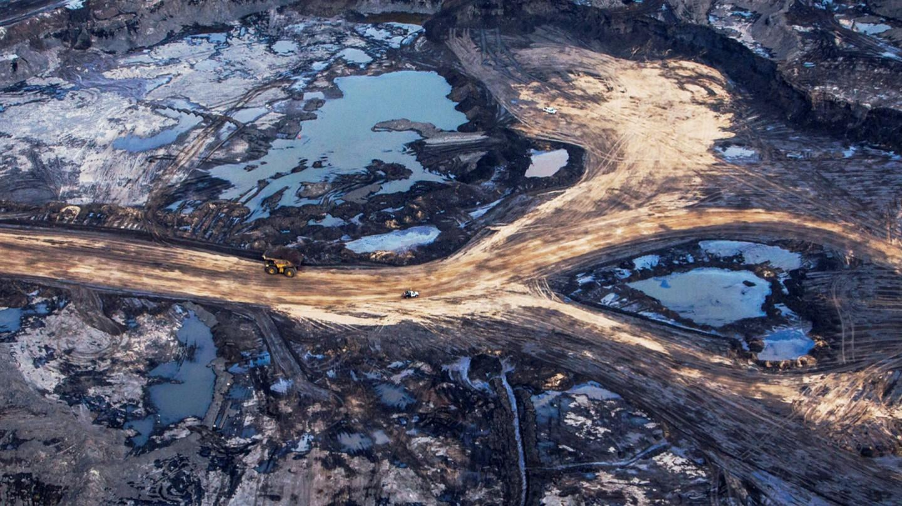

The oil sands industry is a pivotal component of the global energy market, significantly contributing to crude oil production. As traditional light crude oil sources decline, oil sands—comprising sand, clay, and water enriched with viscous bitumen—offer an alternative avenue for meeting global energy demand. This complex mixture demands specialized extraction techniques, placing the industry at the intersection of innovation and economic strategy.

This article examines the significant roles that oil sands and bitumen play in the commodities market, alongside the application of algorithmic trading in this sector. Technological advancements are redefining the operational framework of oil sands, enhancing efficiencies, and mitigating environmental impacts associated with extraction and processing. These technological shifts, coupled with strategic market practices, influence the economic viability and sustainability of oil sands operations, presenting both opportunities and challenges for stakeholders and investors.



By understanding these dynamics, stakeholders can better navigate the intricate landscape of the oil sands industry, optimizing their investment strategies and adapting to changing market conditions. Such insights are crucial for those seeking to capitalize on the vast opportunities the oil sands sector offers, particularly as it adjusts to evolving environmental responsibilities and market demands.

The fundamental concepts of oil sands, bitumen, and their interconnections within global markets lay the groundwork for comprehending their broader impact and significance. Understanding these elements is a critical step forward, guiding investments and operations toward a balanced integration of economic ambition and environmental stewardship.

## Table of Contents

## Understanding Oil Sands and Bitumen

Oil sands, often referred to as tar sands, are a natural mixture comprising sand, clay, water, and bitumen. Bitumen, a dense and highly viscous form of crude oil, necessitates specialized extraction and processing techniques due to its thick and heavy nature. Extraction of bitumen from oil sands is significantly more complex and resource-intensive compared to conventional crude oil extraction. This complexity arises from the need to separate bitumen from its surrounding materials and subsequently upgrade it to a form suitable for refining.

The geographical distribution of oil sands is concentrated in several key areas around the world. The most notable deposits are found in Canada, Venezuela, Kazakhstan, and Russia. Canada, in particular, is home to one of the largest oil sands reserves, primarily located in the Athabasca, Cold Lake, and Peace River regions of Alberta. This substantial reserve places Canada third in terms of proven oil reserves globally, following Venezuela and Saudi Arabia. [source: Government of Canada]

The importance of oil sands in fulfilling global energy requirements cannot be underestimated. As conventional oil reserves gradually dwindle, unconventional sources such as oil sands play an increasingly critical role in securing energy supplies. Despite the advantages oil sands provide in terms of energy security, their extraction and processing are often criticized for being costly and environmentally challenging. The processes involved are energy-intensive, resulting in significant greenhouse gas emissions, and pose risks to local water resources due to extensive water usage.

Efforts are continuously made to enhance the sustainability and efficiency of oil sands operations. Technological innovations aim to reduce the environmental footprint of extraction processes and improve the economic feasibility of oil sands production. Consequently, stakeholders in the industry are keenly focused on balancing the economic benefits derived from oil sands with the environmental responsibilities associated with their exploitation.

## Extraction and Processing of Oil Sands

Oil sands extraction is a critical process in the oil production industry, necessitating distinct methods based on the depth of the deposits. The two primary extraction techniques employed are surface mining and in-situ methods.

### Surface Mining

Surface mining is predominantly utilized when oil sands deposits are within 75 meters of the earth's surface. This technique involves the removal of large amounts of overburden – the layer of soil and rock covering the oil sands – to access the bitumen-rich deposits beneath. The process begins with clearing the land of trees and topsoil, followed by the use of draglines and bucket-wheel excavators to remove the overburden. The oil sands are then transported to a processing facility where the bitumen is separated from the sand and clay through a series of physical and chemical processes, such as crushing, hot water infusion, and flotation. Surface mining is highly efficient for shallow deposits, but it significantly alters the landscape and requires extensive land reclamation efforts.

### In-Situ Extraction

For deposits located deeper underground, in-situ methods are employed. The most common in-situ technique is Steam-Assisted Gravity Drainage (SAGD). In this process, pairs of horizontal wells are drilled into the formation. Steam is injected into the upper well, heating the bitumen to reduce its viscosity, allowing it to flow gravitationally into the lower production well, from where it is pumped to the surface. This method minimizes the surface footprint compared to surface mining and allows for the exploitation of deeper resources. However, it is energy-intensive, as it requires significant steam generation, often leading to higher greenhouse gas emissions.

### Bitumen Upgrading

Post-extraction, bitumen is processed to improve its quality and convert it into synthetic [crude oil](/wiki/crude-oil) suitable for refinery processing into transportation fuels like gasoline and diesel. Upgrading typically involves a combination of coking, hydroprocessing, and desulfurization to remove impurities, reduce viscosity, and enhance hydrogen content.

```python
def calculate_bitumen_viscosity_reduction(initial_viscosity, temperature_increase, coefficient):
    # Simplified formula for viscosity reduction based on temperature
    # initial_viscosity: original viscosity of bitumen
    # temperature_increase: increase in temperature (°C)
    # coefficient: thermal sensitivity coefficient for viscosity reduction

    final_viscosity = initial_viscosity / (1 + coefficient * temperature_increase)
    return final_viscosity

# Example usage
initial_viscosity = 10  # in Poise
temperature_increase = 5  # in °C
coefficient = 0.02  # assumed coefficient value

final_viscosity = calculate_bitumen_viscosity_reduction(initial_viscosity, temperature_increase, coefficient)
print(f"Final Viscosity: {final_viscosity} Poise")
```

### Economic and Environmental Considerations

The extraction and processing of oil sands, while crucial for meeting global energy needs, [carry](/wiki/carry-trading) significant economic and environmental considerations. The processes are capital and resource-intensive, contributing to high production costs. Moreover, both surface mining and in-situ methods pose environmental challenges, including land disturbance, greenhouse gas emissions, and water consumption. Efforts to develop more efficient and less harmful extraction techniques are ongoing, aiming to balance production needs with environmental responsibilities.

Ultimately, the oil sands industry plays an essential role in the energy sector. However, advancing technology and implementing sustainable practices will be key to mitigating the environmental impact of extraction and processing activities.

## Economic and Environmental Implications

Oil sands extraction plays a pivotal role in bolstering the economy of regions where these resources are abundant. Key contributions include substantial investments in infrastructure and technological development, which bolster local and national economies. The industry supports a considerable number of jobs, ranging from exploration and production to transportation and refining. Moreover, oil sands exports contribute significantly to trade balances, providing a vital source of revenue for governments. For instance, Canada's oil sands industry supports thousands of jobs and has attracted billions in foreign investment, strengthening the country’s economic framework ([Natural Resources Canada, 2021](https://www.nrcan.gc.ca)).

However, the economic benefits of oil sands extraction are accompanied by substantial environmental challenges. One of the primary concerns is the emission of greenhouse gases (GHGs). The extraction and processing of oil sands are carbon-intensive activities, contributing to increased atmospheric CO2 levels. According to estimates, the greenhouse gas emissions per barrel of synthetic crude oil from oil sands are notably higher compared to conventional crude oil. This has significant implications for meeting international climate commitments and reducing global carbon footprints ([IPCC, 2018](https://www.ipcc.ch/)).

Water usage is another critical environmental issue associated with oil sands development. The extraction process, particularly in surface mining applications, requires significant volumes of water, resulting in the diversion of water from rivers and lakes. This can alter aquatic ecosystems and affect biodiversity in surrounding areas. Furthermore, the creation of tailings ponds, which store waste byproducts, presents long-term ecological risks due to the potential for leakage and contamination of water sources.

Land disturbance is an additional environmental impact of oil sands extraction. Surface mining operations necessitate the clearing of large land areas, leading to habitat destruction and changes in land use. The process can disrupt wildlife habitats and reduce biodiversity. Restoring these land areas post-extraction is a complex and lengthy process that requires careful planning and implementation.

Efforts to mitigate these environmental impacts focus on developing more sustainable extraction technologies and practices. Innovations such as carbon capture and storage (CCS) aim to reduce GHG emissions by capturing CO2 emissions before they enter the atmosphere. Additionally, research into more efficient water usage and treatment processes seeks to minimize the freshwater footprint of oil sands operations. Land reclamation techniques are also being refined to accelerate the recovery of ecosystems post-extraction ([Alberta Government, 2022](https://www.alberta.ca)).

In summary, while oil sands extraction significantly strengthens economies through investment, job creation, and exports, it also poses considerable environmental challenges that must be addressed through ongoing technological and regulatory advancements.

## Algorithmic Trading in Oil Sands Commodities

Algorithmic trading, or algo trading, employs sophisticated computer algorithms to execute trades in financial markets at high speeds and with precision. In the context of oil sands commodities, this computerized trading methodology aims to optimize the execution of trades by thoroughly analyzing various market conditions. Algorithms in commodities trading leverage historical and real-time data to identify trading opportunities and make split-second decisions that would be beyond human capabilities. 

An integral aspect of [algorithmic trading](/wiki/algorithmic-trading) in oil sands commodities is the utilization of macroeconomic indicators, market [liquidity](/wiki/liquidity-risk-premium), and price [volatility](/wiki/volatility-trading-strategies) as key factors in trading strategies. Macroeconomic indicators such as interest rates, inflation rates, and GDP growth forecasts provide a broad picture of economic conditions that can influence commodity prices. Changes in these indicators are incorporated into the algorithms to adjust trading strategies accordingly. For example, if inflation forecasts rise, it could signal potential increases in oil prices, prompting the algorithm to adjust its trading [volume](/wiki/volume-trading-strategy) or position sizes in anticipation of price movements.

Market liquidity, defined as the ease with which assets can be bought or sold in the market without affecting the asset's price, is a critical [factor](/wiki/factor-investing) in algorithmic trading. High liquidity in the oil sands market allows algorithms to execute large trades with minimal impact on prices, thereby improving trade efficiency and cost-effectiveness. Conversely, low liquidity conditions may require algorithms to break down large trades into smaller transactions to mitigate price slippage.

Price volatility, or the degree of variation in trading prices over a certain period, is another cornerstone of algorithmic trading strategies. Algorithms utilize sophisticated models to predict price movements and optimize entry and [exit](/wiki/exit-strategy) points. For instance, using statistical models or [machine learning](/wiki/machine-learning) techniques, these algorithms can detect patterns in historical price data that might indicate potential future volatility, allowing traders to capitalize on shifts in the market.

To illustrate, consider the following simple Python example utilizing the popular algorithmic trading library, Zipline:

```python
from zipline.api import order, record, symbol
import numpy as np

def initialize(context):
    context.asset = symbol('CRUDE_OIL')
    context.price_history = []

def handle_data(context, data):
    current_price = data.current(context.asset, 'price')
    context.price_history.append(current_price)

    short_mavg = np.mean(context.price_history[-10:])
    long_mavg = np.mean(context.price_history[-50:])

    if short_mavg > long_mavg:
        # Buy signal
        order(context.asset, 10)
    elif short_mavg < long_mavg:
        # Sell signal
        order(context.asset, -10)

    record(CRUDE_OIL=current_price, short_mavg=short_mavg, long_mavg=long_mavg)
```

This algorithm, implemented using Zipline, employs a simple moving average crossover strategy to determine buy and sell signals based on fluctuations in crude oil prices. This type of strategy is indicative of how algorithmic trading systems can analyze historical data to make informed trading decisions.

Overall, algorithmic trading in oil sands commodities represents a fusion of technological advancement and market analytics, harnessing data to enhance trading efficiency and capitalize on market conditions for optimized financial outcomes.

## The Role of Technology in Oil Sands and Trading

Technological advancements play a pivotal role in transforming both oil sands extraction and the dynamics of algorithmic trading. In the oil sands sector, technology has emerged as a crucial factor in enhancing extraction efficiency while also mitigating the environmental impact associated with these operations. Innovations in machinery, such as automated and remote-controlled equipment, enable more precise and safer extraction methods. Additionally, advanced techniques like steam-assisted gravity drainage (SAGD) have significantly improved the recovery rates of bitumen from deeper reserves while reducing the surface footprint compared to traditional methods.

Moreover, the integration of sensor technology and data analytics facilitates real-time monitoring of oil sands operations. This enables the optimization of resource use, such as reducing water consumption and energy usage during the extraction process. Sophisticated software applications can analyze various parameters, enabling operators to make informed decisions and adjust operations to improve overall efficiency and minimize ecological impact.

In the financial arena, technological advancements underpin the sophistication of algorithmic trading strategies, particularly in commodities markets such as oil sands. Advanced algorithms are designed to process vast amounts of market data, identifying patterns and executing trades at speeds unattainable by human traders. These algorithms leverage historical data and predictive analytics to enhance decision-making, offering insights into market trends, liquidity, and volatility. The ability to automate trading decisions based on predefined criteria helps in optimizing investment strategies, allowing traders to capitalize on fleeting market opportunities with precision.

The use of machine learning and [artificial intelligence](/wiki/ai-artificial-intelligence) further augments algorithmic trading, enabling the development of adaptive systems that improve their performance over time. These technologies can incorporate macroeconomic indicators and geopolitical developments into their analyses, providing a comprehensive understanding of factors influencing the oil sands market. As a result, traders and investors can mitigate risks and maximize returns through more informed and rapid decision-making processes.

Overall, technology serves as a cornerstone for revolutionizing both the extraction of oil sands and the execution of trades in the commodities market. By continuing to innovate, the industry can achieve greater sustainability and profitability, ensuring its viability in an increasingly competitive and environmentally conscious global landscape.

## Investment Opportunities and Challenges

Investors in the oil sands sector must navigate a dynamic landscape shaped by fluctuations in oil prices, rapid technological advancements, and evolving regulatory frameworks. The interplay of these factors can significantly influence investment returns, necessitating a comprehensive understanding of both the opportunities and challenges inherent in this industry.

One of the primary considerations for investors is the volatility of oil prices. The value of oil sands investments is closely tied to global crude oil prices, which are influenced by a myriad of factors including geopolitical tensions, supply and demand dynamics, and production decisions by major oil-producing countries. This volatility requires investors to adopt strategies that can mitigate risk while capitalizing on price movements. Algorithmic trading emerges as a valuable tool in this context, providing the ability to execute trades swiftly and efficiently by leveraging market data and predictive analytics. Advanced algorithms can analyze historical price trends and utilize machine learning techniques to forecast future price movements, offering investors a competitive edge.

Technological innovations present both opportunities and challenges for oil sands investors. On one hand, advancements in extraction technologies, such as enhanced in-situ methods and cleaner upgrading processes, can improve operational efficiency and reduce environmental impact. These developments can lower production costs and increase the profitability of oil sands projects. On the other hand, investors must be mindful of the costs associated with implementing new technologies and the time required to realize their full benefits.

Regulatory changes also play a pivotal role in shaping investment strategies. Governments are increasingly imposing stringent environmental regulations aimed at reducing greenhouse gas emissions and minimizing ecological impacts. Compliance with such regulations can increase operational costs, posing a challenge for investors seeking to maintain competitive returns. However, regulatory frameworks also offer incentives for companies that adopt sustainable practices and invest in clean technologies, presenting opportunities for forward-thinking investors.

Finally, the global transition to renewable energy sources poses a long-term challenge to the oil sands industry. As countries strive to reduce their carbon footprint, demand for fossil fuels is expected to decline, potentially impacting the growth prospects of oil sands investments. Investors must, therefore, carefully assess the viability of their investments in the context of a transitioning energy landscape and consider diversifying their portfolios to include renewable energy assets.

In conclusion, while the oil sands sector offers investment opportunities driven by technological advancements and market dynamics, it is also fraught with challenges stemming from price volatility, regulatory pressures, and the shift towards renewable energy. Investors must deploy sophisticated analytical tools and remain adaptable to the changing landscape to achieve sustainable investment outcomes.

## Conclusion

Oil sands continue to play a pivotal role in the global energy landscape due to their substantial contribution to crude oil production. Despite the significant environmental concerns and challenges associated with extraction processes, including greenhouse gas emissions and land disturbance, oil sands are essential in meeting the worldwide demand for energy. This underscores the necessity for the industry to innovate continuously, developing more sustainable practices and technologies that can mitigate environmental impacts.

In parallel, algorithmic trading has emerged as a contemporary tool for maneuvering through the complexities of commodities markets, including oil sands. By utilizing advanced computer algorithms to assess market conditions and execute trades efficiently, algorithmic trading optimizes the trading process, leading to potentially higher returns on investment. This technological advancement aligns with the need for dynamic market strategies that account for factors such as market liquidity, price volatility, and macroeconomic indicators.

The future of oil sands and trading practices will largely hinge on the ability to harmonize economic goals with environmental stewardship. The push for more sustainable energy solutions and increased regulatory scrutiny requires stakeholders to adopt balanced approaches that acknowledge both economic opportunities and environmental responsibilities. Achieving this balance is critical as the industry confronts the dual pressures of meeting global energy demands and transitioning towards more renewable energy sources. 

Continuous innovation, therefore, remains crucial. As technology evolves, it will not only enhance the efficiency and sustainability of oil sands extraction but also refine the algorithms that underpin trading strategies, leading to improved decision-making and performance in the commodities market. This relentless drive for innovation will enable sustainable growth and favorable investment outcomes, securing the oil sands sector's place in the evolving energy paradigm.

## References & Further Reading

[1]: Nikiforuk, A. (2010). ["Tar Sands: Dirty Oil and the Future of a Continent."](https://archive.org/details/tarsandsdirtyoil0000niki) Greystone Books.

[2]: LeBillon, P., & Carter, A. (2012). ["Oil Sands and Gas: Marketization, Governmentality, and Environmental Risk."](https://blogs.ubc.ca/lebillon/files/2015/01/CV_lebillon.pdf) Economic Geography.

[3]: Government of Canada. ["Oil Sands: Economic Contributions."](https://natural-resources.canada.ca/sites/www.nrcan.gc.ca/files/energy/pdf/oilsands-sablesbitumineux/15-0510%20Oil%20Sands%20-%20Brochure_e.pdf) Natural Resources Canada.

[4]: Alberta Government. ["Oil Sands Environmental Monitoring and Efforts."](https://www.alberta.ca/oil-sands-monitoring-program) 

[5]: ["Introduction to Oil Sands Extraction and Refinery Technologies."](https://www.oilsandsmagazine.com/courses/short-course-oil-sands-101) by John S. Morgan

[6]: Maczynska, M. (2015). ["Algorithmic Trading of Oil Futures with Machine Learning Algorithms."](https://www.researchgate.net/publication/383201516_Algorithmic_trading_and_machine_learning_Advanced_techniques_for_market_prediction_and_strategy_development) Delft University of Technology.

[7]: ["Advances in Financial Machine Learning"](https://www.amazon.com/Advances-Financial-Machine-Learning-Marcos/dp/1119482089) by Marcos Lopez de Prado.