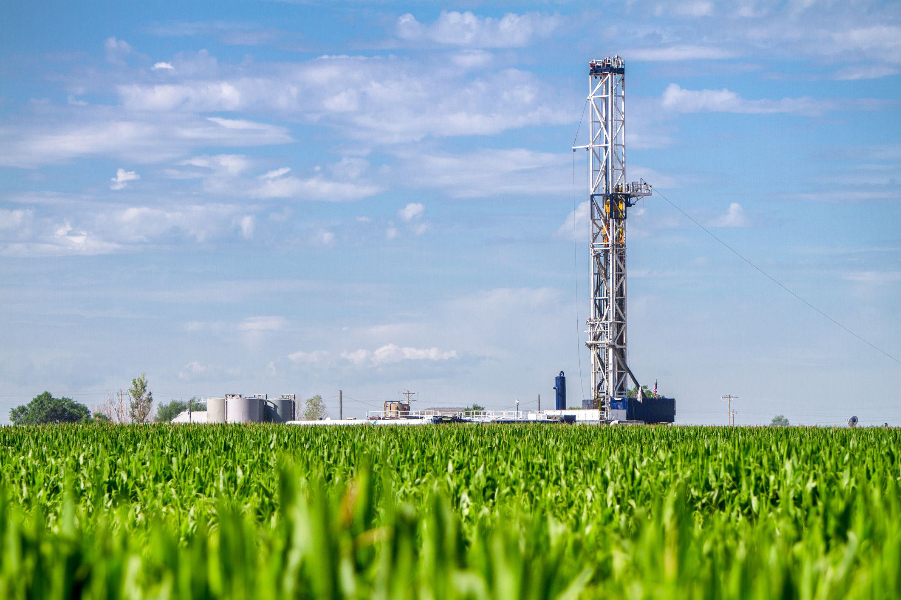

## Table of Contents

## What is oil shale and how does it differ from conventional oil?

Oil shale is a type of rock that contains a substance called kerogen. Kerogen is a solid, waxy material that can be turned into oil and gas when heated. To get oil from oil shale, you have to mine the rock and then heat it in a process called retorting. This is different from how we get conventional oil, which is already in liquid form and can be pumped out of the ground.

Conventional oil comes from underground reservoirs where oil has already formed and collected over millions of years. We drill into these reservoirs and pump the oil out. This is easier and usually cheaper than getting oil from oil shale. Oil shale, on the other hand, needs more steps and energy to turn the kerogen into usable oil. Because of this, oil shale is not used as much as conventional oil, but it could be important in the future if we run out of easier-to-get oil.

## What are the main characteristics of oil shale?

Oil shale is a rock that has a substance called kerogen inside it. Kerogen is not oil yet, but it can be turned into oil if you heat it up. The rock itself can look like shale, which is a type of sedimentary rock, but it can also look like other types of rock. Oil shale is usually found in layers and can be brown, gray, or black, depending on how much kerogen it has.

To get oil from oil shale, you have to mine the rock and then heat it in a process called retorting. This process turns the kerogen into oil and gas that you can use. Oil shale is different from regular oil because regular oil is already liquid and can be pumped out of the ground. Oil shale needs more work to turn it into something useful, which makes it more expensive and harder to use.

## How is oil shale formed geologically?

Oil shale is formed from the remains of tiny plants and animals that lived in ancient lakes, seas, and swamps millions of years ago. When these tiny organisms died, they sank to the bottom and got buried under layers of mud and other sediments. Over time, more and more layers piled up, pressing down on the bottom layers and turning them into rock. The remains of the plants and animals got trapped inside this rock and turned into a substance called kerogen.

The process of turning these remains into kerogen happens because of heat and pressure deep underground. The heat and pressure come from the weight of the rock layers above and from the Earth's own heat. This process can take millions of years. Not all of the rock with kerogen turns into oil shale, though. It depends on things like how much heat and pressure there was, and what kinds of plants and animals were there in the first place. When the conditions are just right, the rock becomes oil shale, which can later be turned into oil if we heat it up.

## What are the primary methods used to extract oil from oil shale?

There are two main ways to get oil out of oil shale: surface mining and in-situ processing. In surface mining, people dig up the oil shale rock from the ground and take it to a place where they can heat it up. This heating process is called retorting. When the rock gets hot, the kerogen inside it turns into oil and gas that can be collected and used. Surface mining is good for oil shale that is close to the surface, but it can be hard on the environment because it makes big holes in the ground and can cause a lot of dust and pollution.

The other way to get oil from oil shale is called in-situ processing. This means leaving the oil shale in the ground and heating it up there. To do this, people drill holes into the ground and put heaters down the holes. The heaters warm up the oil shale, and the kerogen inside it turns into oil and gas. This oil and gas then moves up through the ground and can be collected at the surface. In-situ processing can be better for the environment than surface mining because it doesn't make big holes in the ground, but it can still use a lot of energy and water.

## What is the process of oil shale retorting?

Oil shale retorting is a way to turn the kerogen in oil shale into oil and gas. First, people dig up the oil shale from the ground. Then, they put the rock into a special machine called a retort. Inside the retort, they heat up the oil shale to very high temperatures, usually between 400 and 500 degrees Celsius. When the rock gets hot, the kerogen inside it starts to break down and turn into oil and gas. These liquids and gases come out of the rock and are collected. The leftover rock, which is now called spent shale, is taken away.

There are different ways to do retorting, but they all use heat to change the kerogen into something useful. Some retorts use hot gases to heat the oil shale, while others use hot sand or other materials. The choice of method can depend on things like how much oil shale there is and what kind of equipment is available. No matter which method is used, the goal is the same: to get as much oil and gas out of the oil shale as possible. After the oil and gas are collected, they can be cleaned up and used just like regular oil and gas.

## What are the environmental impacts associated with oil shale extraction and processing?

Extracting and processing oil shale can harm the environment in many ways. When people dig up oil shale from the ground, it can make big holes and change the land. This is called surface mining, and it can destroy habitats for animals and plants. It also makes a lot of dust and can pollute the air. The leftover rock, called spent shale, can be a problem too. If it's not put back in the ground the right way, it can cause more dust and pollution. Also, the process of heating the oil shale to get the oil out uses a lot of energy, which can add to the problem of climate change by releasing more greenhouse gases.

In-situ processing, where the oil shale is heated underground, can be better for the land because it doesn't make big holes. But it still has its own problems. It uses a lot of energy to heat the rock, which can release more greenhouse gases. It also needs a lot of water, and in some places, water is already hard to come by. If the oil and gas leak out during the process, they can pollute the groundwater and harm the environment even more. Both ways of getting oil from oil shale can have big impacts on the environment, so people need to think carefully about how to do it in the least harmful way.

## How does the energy efficiency of oil shale compare to other fossil fuels?

Oil shale is less energy efficient than other fossil fuels like coal, oil, and natural gas. This is because getting oil from oil shale takes a lot of extra steps and energy. You have to dig up the rock, heat it up to turn the kerogen into oil, and then clean up the oil so it can be used. All these steps use a lot of energy, and some of that energy is wasted along the way. So, for the same amount of energy you get out of oil shale, you might need to put in more energy than you would with other fossil fuels.

Compared to coal, oil shale needs more energy to process and turn into something useful. Coal can be burned right away to make energy, but oil shale has to be heated up first. This makes oil shale less efficient because you lose energy in the heating process. Natural gas and regular oil are even more efficient because they can be used right after they're taken out of the ground, without needing to be processed as much. So, while oil shale can be a source of energy, it's not as good at turning the energy it has into useful energy as other fossil fuels.

## What is the historical significance of oil shale in global energy markets?

Oil shale has been important in the history of energy because it was seen as a way to get more oil when regular oil was hard to find. People started looking at oil shale a long time ago, especially during times when there were worries about running out of oil. For example, during World War II, countries like Germany and Estonia used oil shale to make fuel because they didn't have enough regular oil. This showed that oil shale could be a backup plan when other sources of energy were not available.

Even though oil shale has been used in some places, it has never become a big part of the global energy market. The main reason is that getting oil from oil shale is expensive and hard on the environment. Countries like the United States and China have a lot of oil shale, but they haven't used it much because it's cheaper and easier to use other kinds of energy. Still, oil shale is important because it reminds us that there are other ways to get energy if we need them, even if they are not the best choice right now.

## Can you describe a major historical oil shale project and its outcomes?

One big oil shale project happened in Colorado, USA, in the 1970s and 1980s. It was called the Colony Project, run by Exxon. The goal was to see if they could get a lot of oil from oil shale and make it a big part of America's energy. They spent a lot of money building a big plant to heat the oil shale and turn it into oil. But the project didn't work out as planned. In 1982, Exxon suddenly stopped the project because the price of regular oil went down, and it was too expensive to keep going with oil shale. This was a big shock to the area, and it's remembered as "Black Sunday" because a lot of people lost their jobs.

The Colony Project showed that getting oil from oil shale was harder and more expensive than people thought. Even though they tried hard and spent a lot of money, the project failed because it couldn't compete with regular oil. After the project stopped, people learned that oil shale might not be a good choice for energy if regular oil is cheaper and easier to get. The failure of the Colony Project made people more careful about starting big oil shale projects in the future. It also showed that we need to think about the environment and the cost when we look for new ways to get energy.

## What are the current technological advancements in oil shale extraction?

People are working on new ways to get oil from oil shale that are better than the old ways. One new idea is called "in-situ conversion process" (ICP). This means they leave the oil shale in the ground and heat it up there. They use special heaters to warm up the rock slowly over a long time. This turns the kerogen inside the rock into oil and gas, which can then be pumped out. This way can be better for the environment because it doesn't make big holes in the ground like mining does. But it still uses a lot of energy and water, so scientists are trying to make it more efficient.

Another new technology is called "electro-thermal dynamic stripping process" (ET-DSP). This uses electricity to heat up the oil shale. They put electrodes into the ground and send electricity through them. The electricity makes the rock hot, and the heat turns the kerogen into oil and gas. This method can be faster than the old ways and might use less energy. But it's still new, and people are still figuring out if it can work well on a big scale. Both of these new technologies show that people are trying to find better ways to use oil shale, but they still have to solve some problems before they can be used a lot.

## How do economic factors influence the viability of oil shale projects?

Economic factors play a big role in deciding if oil shale projects are worth doing. The main thing is the price of regular oil. If regular oil is cheap, it's hard to make money from oil shale because it costs a lot more to get oil out of oil shale. You have to dig up the rock, heat it up, and then clean the oil, which all takes a lot of money and energy. So, oil shale projects usually only make sense if the price of regular oil is high enough to cover these extra costs.

Another important economic [factor](/wiki/factor-investing) is the cost of the technology needed to get oil from oil shale. New technologies can make it cheaper and easier to do, but they also cost a lot of money to develop and use. Governments and companies have to think about if they want to spend money on these new technologies, especially when there's no guarantee they will work well. If the technology is too expensive or doesn't work as well as hoped, the whole project might not be worth it. So, the price of oil and the cost of technology are big reasons why oil shale projects can be hard to make work.

## What is the future outlook for oil shale in the context of global energy needs and environmental considerations?

The future of oil shale depends a lot on what happens with regular oil and how much we care about the environment. If regular oil gets really expensive or hard to find, people might start using oil shale more. But getting oil from oil shale is hard and costs a lot of money. It also uses a lot of energy and can harm the environment. So, even if oil shale could help meet our energy needs, we have to think about if it's worth the cost and the harm it might do.

People are working on new ways to get oil from oil shale that might be better for the environment. These new technologies could make oil shale a bit more useful in the future. But even with new technology, oil shale might still be too expensive and hard on the environment to use a lot. As we look for new energy sources, we need to think about how to balance our need for energy with taking care of the planet. Oil shale might be part of the answer, but it's not the whole solution.

## References & Further Reading

[1]: Dyni, J. R. (2006). ["Geology and Resources of Some World Oil-Shale Deposits."](https://pubs.usgs.gov/sir/2005/5294/pdf/sir5294_508.pdf) U.S. Geological Survey Scientific Investigations Report 2005-5294.

[2]: Speight, J. G. (2012). ["Oil Shale: A Solution to the Liquid Fuel Dilemma?"](https://pubs.acs.org/doi/10.1021/bk-2010-1032) in Shale Oil Production Processes, Elsevier.

[3]: ["Algorithmic Trading: Winning Strategies and Their Rationale"](https://books.google.com/books/about/Algorithmic_Trading.html?id=WAlFDwAAQBAJ) by Ernie Chan.

[4]: Malliaris, A., Malliaris, M., & Williams, H. (2016). ["Oil Prices and Algorithmic Trading"](https://www.semanticscholar.org/paper/Time-series-and-neural-networks-comparison-on-gold%2C-Malliaris-Malliaris/71563eec9a5d1a15d7957a4aa1fd472cf34b7c86) Working Paper, Social Science Research Network.

[5]: ["The Quest: Energy, Security, and the Remaking of the Modern World"](https://www.amazon.com/Quest-Energy-Security-Remaking-Modern/dp/0143121944) by Daniel Yergin.