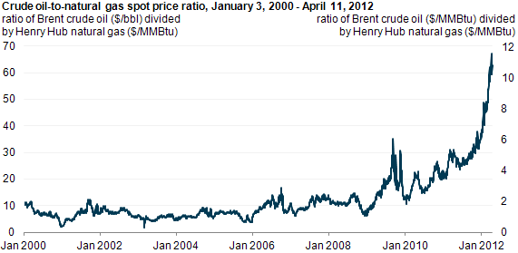

The energy market is a cornerstone of the global economy, significantly influencing economic growth, geopolitical stability, and technological development. Among the primary commodities at the heart of this market are oil and natural gas, both critical not only for electricity generation and transportation but also for industrial processes and residential use. The pervasive influence of these commodities makes an understanding of their pricing dynamics vital for investors, traders, and policymakers who must navigate this complex landscape.

The interplay between the prices of oil and natural gas is often encapsulated by the oil price to natural gas ratio, a vital metric in the energy market. This ratio, calculated by dividing the market price of oil (typically in barrels) by the price of natural gas (usually in million British thermal units or MMBtu), provides a comparative measure of the relative value of these two energy sources. Over the years, this ratio has been subject to fluctuations resulting from a myriad of factors including shifts in supply and demand, geopolitical tensions, and technological innovations that alter production capabilities and costs.

For market participants, the oil price to natural gas ratio serves as an instrumental indicator in making informed trading and investment decisions. It aids in identifying potential periods of overvaluation or undervaluation, hence guiding strategic portfolio adjustments. Furthermore, as the market adapts to the complexities of energy transition and increasingly integrates advanced trading methodologies, the role of algorithmic trading comes to the forefront. This modern trading approach influences how rapidly and efficiently market conditions are analyzed and responded to, with significant implications for market liquidity and price discovery.

This article aims to thoroughly examine the importance of the oil to natural gas ratio, the transformative impact of algorithmic trading on market operations, and the broader consequences within the energy sector. Understanding these dynamics is crucial for stakeholders seeking leverage in a continually evolving energy landscape.

## Table of Contents

## Understanding the Oil Price to Natural Gas Ratio

The oil price to natural gas ratio is a metric used to analyze and compare the relative value of two vital energy commodities: oil and natural gas. This ratio is calculated by dividing the price of oil by the price of natural gas:

$$
\text{Oil to Natural Gas Ratio} = \frac{\text{Price of Oil (per barrel)}}{\text{Price of Natural Gas (per million BTU)}}
$$

This ratio has historically fluctuated due to varying supply and demand dynamics, which are influenced by numerous factors, including geopolitical events, technological advancements, and production costs.

Geopolitical events, such as conflicts in oil-rich regions or sanctions on oil-producing countries, can significantly affect the supply of oil, thus impacting its price. For instance, tensions in the Middle East often lead to [volatility](/wiki/volatility-trading-strategies) in oil prices, which in turn affects the ratio. On the other hand, natural disasters or political considerations that impact natural gas supply chains can also cause shifts in the ratio.

Technological advancements in extraction and production techniques have played a crucial role in affecting this ratio. The development of hydraulic fracturing and horizontal drilling has substantially increased the supply of natural gas, often leading to lower prices and subsequent changes in the ratio. Similarly, improvements in oil extraction technology can influence oil supply and alter the ratio.

Production costs are another key [factor](/wiki/factor-investing). A rise in production costs for either oil or natural gas can lead to an increase in the price of the respective commodity, thereby affecting the ratio. This can be attributed to changes in labor costs, regulatory compliance expenses, and shifts in operational efficiencies.

Historically, the oil to natural gas ratio has seen significant variations during major economic and political events. The 2008 financial crisis, for example, saw drastic alterations in the ratio, driven by shifts in demand at both the industrial and consumer levels. Another impactful event was the 2020 oil price collapse, triggered by both a supply glut and unprecedented drops in demand due to the COVID-19 pandemic, which again influenced the ratio considerably.

Understanding this ratio helps traders and investors assess the relative value of oil and natural gas, enabling more informed commodity trading decisions. By analyzing the factors that drive changes in this ratio, they can potentially capitalize on market conditions and effectively hedge against risks associated with energy sector volatility.

## Significance of the Ratio in Commodity Trading

Traders consider the oil to natural gas ratio a crucial indicator for assessing the relative value of these commodities in the energy market. This ratio is calculated by dividing the price per barrel of oil by the price per million British thermal units (MMBtu) of natural gas. Mathematically, it is expressed as:

$$
\text{Ratio} = \frac{\text{Price of Oil (per barrel)}}{\text{Price of Natural Gas (per MMBtu)}}
$$

A high ratio might suggest that oil is overvalued compared to natural gas. In such circumstances, traders might reassess their portfolios, potentially reducing their oil holdings in favor of natural gas investments. This strategic shift can help mitigate risks associated with overvalued assets and capitalize on potential depreciation in oil prices.

Conversely, a low ratio could signal that oil is undervalued relative to natural gas. This situation may present opportunities for traders to invest in oil, anticipating a potential price increase that aligns the ratio with historical norms or market expectations. For traders, understanding these dynamics is critical, as it allows them to optimize their commodity trading strategies based on perceived value and market conditions.

The ratio also provides insights into broader market trends and regulatory landscapes. For instance, changes in production technology or geopolitical developments can significantly impact supply and demand, thereby influencing the ratio. Such shifts necessitate that traders remain vigilant and utilize the oil to natural gas ratio as a tool for informed decision-making, enabling them to navigate the complexities of the ever-evolving energy market.

## Algorithmic Trading and Its Impact on the Energy Market

Algorithmic trading has revolutionized commodities trading, particularly in the energy sector, which encompasses oil and natural gas. This advanced trading approach employs algorithms—sophisticated mathematical models designed to execute trades based on predefined criteria. By leveraging algorithms, traders can rapidly analyze vast amounts of market data, identify patterns, and execute trades with minimal human intervention. This ability to process information at high speeds confers a significant competitive advantage, enabling traders to seize opportunities that might be missed through manual trading methods.

One of the primary advantages of [algorithmic trading](/wiki/algorithmic-trading) is improved price discovery, which is the process through which the market determines the price of a commodity based on supply and demand factors. In volatile markets such as oil and natural gas, where prices are influenced by geopolitical events, production levels, and technological changes, algorithmic trading facilitates more accurate price assessment. This enhanced price discovery contributes to market efficiency by ensuring that prices reflect the latest available information.

Algorithmic trading also bolsters market [liquidity](/wiki/liquidity-risk-premium), defined as the ease with which assets can be bought or sold without causing significant price changes. By executing trades promptly and efficiently, algorithms increase trading [volume](/wiki/volume-trading-strategy) and the market's capacity to handle large transactions. This increased liquidity generally benefits all market participants by reducing the bid-ask spread—the difference between the lowest price a seller is willing to accept and the highest price a buyer is willing to pay.

However, the ascent of algorithmic trading in the energy market introduces several challenges. One concern is the potential for market volatility exacerbation due to the rapid execution of a high volume of trades. In certain scenarios, algorithms may act on erroneous data or misinterpret market signals, leading to "flash crashes" or significant price deviations in a brief period. Additionally, the reliance on sophisticated technologies for algorithmic trading raises the barrier to entry for smaller traders who may not have access to the necessary resources or expertise.

Another challenge lies in the potential for market manipulation. Since algorithms operate on predefined instructions, traders might design them to exploit market patterns unfairly, leading to illicit practices such as spoofing—where false orders are placed to create the illusion of demand or supply before canceling them.

In summary, while algorithmic trading has significantly contributed to efficiency and liquidity in energy markets, it has also introduced new complexities that traders and regulators must navigate. As this trading approach continues to evolve, ongoing efforts to address these challenges will be essential in maintaining market integrity and fairness.

## Case Studies and Historical Trends

Historically, the oil to natural gas ratio has been a crucial measure for understanding the complex interplay between these two pivotal energy commodities. This ratio has seen significant fluctuations, especially during major economic and political upheavals, offering valuable insights into market dynamics and external influences.

One of the most significant shifts in the oil to natural gas ratio occurred during the 2008 financial crisis. The global economic downturn led to a sharp decline in demand for oil, with prices plummeting from over $140 per barrel in mid-2008 to below $40 by early 2009. In contrast, natural gas prices did not experience an equivalent drop, primarily due to the domestic focus of its markets and the advent of hydraulic fracturing, which bolstered supply in the United States. As a result, the oil to natural gas ratio, which typically hovered around 6:1 before the crisis, soared to unprecedented levels of over 20:1 in early 2009. This disparity highlighted the decoupling of oil and natural gas markets and underscored the impact of global economic conditions on this ratio.

Another notable instance of significant fluctuations in the oil to natural gas ratio was the 2020 oil price collapse. Triggered initially by the COVID-19 pandemic, the energy markets witnessed a severe demand shock as global economic activity came to a standstill. In March 2020, geopolitical tensions further exacerbated the situation when Russia and Saudi Arabia engaged in an oil price war, leading to an oversupplied market. Consequently, oil prices crashed, with U.S. crude futures briefly turning negative in April 2020. During this period, natural gas prices remained relatively stable, partly due to reduced associated gas production from oil wells and steady residential demand. The oil to natural gas ratio plummeted to about 12:1 by mid-2020, reflecting the rapid changes in market conditions brought on by the crisis.

Analyzing these historical trends requires a nuanced understanding of the various factors at play. The distinct behavior of the oil to natural gas ratio during these events demonstrates the influence of both macroeconomic drivers and sector-specific dynamics. By examining major crises and their aftermaths, it becomes evident how sensitive the ratio is to external shocks and how it can serve as a barometer for broader market conditions. These insights can help investors, policymakers, and traders gauge future market movements and adjust their strategies accordingly.

Overall, the historical shifts in the oil to natural gas ratio during events like the 2008 financial crisis and the 2020 oil price collapse exemplify the intricate relationships within energy markets and underscore the importance of monitoring this ratio to anticipate changes in the global energy landscape.

## Future of Energy Trading: Challenges and Opportunities

The energy market is experiencing profound changes driven by technological advancements and an accelerating shift towards renewable energy sources. This transformation is creating new opportunities and challenges for traders and investors, reshaping the landscape of energy trading.

Algorithmic trading is expected to maintain its influential presence in this evolving market. The ability of algorithms to analyze voluminous datasets and execute trades at unprecedented speeds provides market participants with a significant competitive edge. As these trading systems become more sophisticated, they enhance market efficiency by improving price discovery and liquidity. However, this increased reliance on algorithmic trading introduces regulatory challenges and ethical considerations that must be addressed. Stringent oversight is necessary to prevent market manipulation and ensure transparency, while ethical debates about algorithm accountability and decision-making remain ongoing concerns.

Traders and investors must increasingly adapt to these rapid changes to seize the opportunities within the energy sector. This adaptation involves integrating technology to enhance decision-making processes and adopting strategies that accommodate the shift towards cleaner energy. Developing expertise in data analytics and [machine learning](/wiki/machine-learning) is crucial for those seeking to understand complex market dynamics and predict trends effectively.

Moreover, as the world transitions towards renewable energy, traditional energy investments must be re-evaluated. Opportunities are emerging in green technologies and sustainable energy solutions, prompting a reallocation of resources towards these growth areas. Investors who can adeptly navigate the changing market by embracing technological innovation and aligning their portfolios with sustainable development goals will likely achieve significant advantages.

In summary, the future of energy trading presents both significant challenges and opportunities. As technology continues to drive unprecedented changes, traders and investors must remain vigilant and proactive in adapting to this dynamic environment. Balancing the benefits of algorithmic trading with its regulatory and ethical implications, while capitalizing on the shift towards renewable energy, will be pivotal for success in the evolving energy market.

## Conclusion

The oil to natural gas ratio is a fundamental tool for evaluating relative values within the energy market. This ratio serves as a crucial barometer for both traders and investors in assessing the respective worth of these two vital commodities. By comparing the price of oil to that of natural gas, the ratio provides insights into their market positions, helping stakeholders make informed decisions.

As algorithmic trading continues to gain prominence, understanding its implications for market dynamics is essential. Algorithmic trading relies on complex computations and real-time data analysis to execute trades at unprecedented speeds. While this technology offers significant advantages in terms of efficiency and responsiveness, it also introduces challenges such as increased market volatility and the potential for market manipulation. Therefore, comprehending the effects of algorithmic interventions is crucial for navigating this evolving landscape.

Looking towards the future, technological advancements and the adaptation to new market conditions are increasingly important. The energy market is undergoing a transformation, with a discernible shift towards renewable energy sources and a heightened focus on sustainability. As these changes unfold, traders and investors will need to leverage technology continuously to capitalize on emerging opportunities while navigating regulatory challenges and ethical concerns. The ability to adapt swiftly to these evolving trends will be a key determinant of success in the energy sector.

## References & Further Reading

[1]: EIA. (2021). ["Oil and natural gas price trends and determinants"](https://www.eia.gov/energyexplained/oil-and-petroleum-products/prices-and-outlook.php). U.S. Energy Information Administration.

[2]: Investopedia. (2020). ["Oil-to-Gas Ratio"](https://www.investopedia.com/terms/o/oil-price-to-natural-gas-ratio.asp). 

[3]: Yermack, D. (2017). ["Corporate Governance and Blockchains"](https://papers.ssrn.com/sol3/papers.cfm?abstract_id=2700475). National Bureau of Economic Research.

[4]: Lopez de Prado, M. (2018). ["Advances in Financial Machine Learning"](https://www.amazon.com/Advances-Financial-Machine-Learning-Marcos/dp/1119482089). Wiley.

[5]: Bauer, R. J., & Dahlquist, J. R. (1999). ["Technical Market Indicators: Analysis & Performance"](https://archive.org/details/technicalmarketi0000baue). Probus Professional Pub.

[6]: Zhang, Y., & Wang, W. (2019). ["Algorithmic Trading: An Introduction"](https://www.sciencedirect.com/science/article/pii/S2095809920302502). CRC Press.