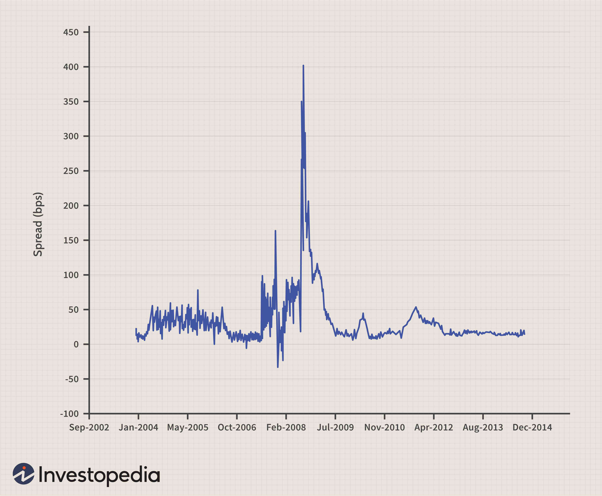

In recent years, OIS discounting has emerged as a critical component of financial markets, gaining particular importance in algorithmic trading and modern finance. This shift has been catalyzed by the 2008 financial crisis, which exposed weaknesses in traditional derivative pricing methods. Before the crisis, derivatives were generally priced using benchmarks such as the London Interbank Offered Rate (LIBOR). However, the crisis underscored the inadequacy of these methods due to significant counterparty risk and market instability, leading to a reevaluation of financial pricing models.

OIS, or Overnight Index Swap discounting, utilizes overnight rates as the discounting factor. This approach is perceived as a more accurate proxy for risk-free rates compared to traditional benchmarks like LIBOR. Overnight rates are typically more stable and closely aligned with central bank policies, providing a reliable foundation for discounting cash flows. By anchoring derivative valuations to these overnight rates, OIS discounting enhances precision and reduces systemic risk within financial systems.

Moreover, the integration of OIS discounting into algorithmic trading has facilitated more accurate and efficient trading strategies. Algorithmic trading systems rely on high-frequency data and robust risk management frameworks, both of which benefit from the stability and predictability offered by overnight rates. This has allowed traders to refine their pricing models and adapt better to market changes, thereby maintaining a competitive edge.

In conclusion, the adoption of OIS discounting marks a pivotal evolution in financial markets post-2008 crisis. By aligning more closely with perceived risk-free standards, financial institutions have improved their pricing models and bolstered market stability. The ongoing evolution within derivative markets continues to emphasize the importance of OIS discounting, especially as algorithmic trading becomes more prevalent.

## Table of Contents

## Understanding OIS Discounting

OIS (Overnight Index Swap) discounting is a financial methodology for valuing derivative instruments by applying overnight rates as the discounting [factor](/wiki/factor-investing). This method marks a significant shift from the traditional practice where interest rate swaps (IRS) were primarily priced using the London Interbank Offered Rate (LIBOR). The 2008 financial crisis played a crucial role in altering market preferences, advocating for OIS as a more accurate representation of risk-free rates.

LIBOR, prior to the crisis, was widely used as a benchmark rate in derivative pricing due to its reflection of short-term interbank lending rates. However, the crisis exposed significant vulnerabilities and the risk of bank defaults, leading to heightened risk perceptions associated with LIBOR. This, in turn, underscored the necessity for a more stable and reliable benchmark, with the market gradually gravitating towards using OIS discounting as an alternative.

OIS discounting is centered around overnight rates, which are inherently less volatile compared to LIBOR. These rates are closely aligned with central bank rates, making them a more stable financial benchmark for discounting cash flows. The stability of these rates emanates from their short-term nature, which significantly reduces the credit and [liquidity](/wiki/liquidity-risk-premium) risks associated with longer-term rates like LIBOR.

To illustrate the application of OIS discounting, consider a simple cash flow valuation using a hypothetical overnight rate. If a cash flow $CF$ is expected in one year, the present value $PV$ using an OIS rate $r_{\text{OIS}}$ is calculated as follows:

$$
PV = \frac{CF}{(1 + r_{\text{OIS}})}
$$

This formula signifies the core concept of OIS discounting where the overnight rate $r_{\text{OIS}}$ is utilized to derive the present value, reflecting a close approximation of a risk-free rate. 

The transition to OIS discounting also aligns with regulatory and market developments aimed at enhancing transparency and reducing reliance on interbank rates that incorporate bank-specific credit risk. As a risk management tool, OIS provides a refined mechanism for discounting that aligns with contemporary financial standards, ensuring that derivative pricing reflects the minimal inherent risk in risk-free rates. 

Overall, OIS discounting is a crucial development in the financial landscape post-crisis, ensuring more accurate pricing of derivatives and promoting market stability through reliance on more dependable overnight rates.

## Impact of the 2008 Financial Crisis on Derivative Valuations

Before the 2008 financial crisis, financial institutions widely regarded government bonds and interbank lending rates, particularly the London Interbank Offered Rate (LIBOR), as risk-free benchmarks for derivative valuations. LIBOR served as the fundamental rate for a broad spectrum of financial instruments, including [interest rate](/wiki/interest-rate-trading-strategies) swaps, loans, and mortgages. Institutions trusted these benchmarks because they reflected the average interest rate at which major global banks could borrow from each other, thus giving a perceived measure of stability and reliability.

However, the financial crisis revealed significant vulnerabilities in this system. Many banks encountered severe financial distress and several prominent institutions collapsed or required substantial government bailouts. The crisis exposed the inadequacy of LIBOR as a measure of risk-free rates due to its susceptibility to manipulation and the inherent counterparty risks. As a result, the global financial community experienced an urgent need to reassess the valuation models traditionally used for derivatives.

The aftermath of the crisis prompted a fundamental reevaluation of how derivative contracts should be priced. This reevaluation emphasized the necessity of incorporating credit and liquidity risks into pricing models more explicitly. One major shift in valuation practices was the increased adoption of Overnight Index Swap (OIS) discounting. OIS rates, derived from overnight interbank lending rates, began to replace LIBOR as the preferred risk-free rate benchmark. Unlike LIBOR, OIS is less volatile and more closely tied to central bank rates, offering a more stable and reliable basis for discounting future cash flows associated with derivatives.

Consequently, OIS discounting allowed for a more accurate reflection of the true economic value of derivatives by accounting for liquidity and credit risks more appropriately, thereby enhancing the overall robustness of financial risk management practices. This adjustment in valuation standards marked a significant change in financial markets and contributed to the broader shift towards more transparent and risk-sensitive trading environments.

## Collateralized vs. Uncollateralized Derivatives

Collateralized derivatives involve the use of collateral to mitigate counterparty risk, thereby providing a level of protection against potential losses. In these transactions, collateral acts as a safety net, ensuring that in the event of a counterparty default, the party exposed to the risk is partially or fully compensated by the available collateral. This mechanism reduces the overall risk profile of the transaction and allows for the use of risk-free rates, such as OIS, for discounting. Because the perceived risk is lower due to the collateral, interest rate swaps and other collateralized derivatives are often priced using OIS rates, which are considered closer to a true risk-free rate compared to alternatives like LIBOR.

On the other hand, uncollateralized derivatives do not benefit from such risk mitigation strategies, as they involve transactions without the backing of collateral. This absence of collateral increases the counterparty risk, leading to a higher likelihood of losses in the event of a default. As a result, uncollateralized derivative transactions are generally considered riskier and often require additional premiums or higher interest rates to compensate for this added risk. The lack of mitigating measures necessitates the use of higher discount rates to reflect the increased risk levels, deviating from the traditional risk-free benchmarks.

The choice between collateralized and uncollateralized structures significantly impacts the discounting approach and ultimately the pricing of derivatives. Collateralized derivatives align more closely with OIS discounting due to their reduced risk profile, whereas uncollateralized derivatives may require alternative discounting methods to adequately reflect the additional counterparty risks. This distinction is crucial for financial institutions aiming to optimize their derivative pricing models and manage financial risk effectively.

## The Role of OIS Discounting in Algorithmic Trading

Algorithmic trading systems are increasingly adopting OIS discounting to enhance precision in pricing and risk management. The central feature of OIS discounting is its reliance on overnight rates, which are notably stable and provide a robust foundation for executing trades in automated systems. This stability originates from the close alignment of overnight rates with central bank policies, minimizing [volatility](/wiki/volatility-trading-strategies) and resulting in more accurate risk assessments.

Incorporating OIS discounting into [algorithmic trading](/wiki/algorithmic-trading) results in several key benefits. The consistency of overnight rates ensures that algorithms can forecast cash flows with greater certainty, reducing pricing errors. Automated systems can thereby optimize trading strategies, leveraging this reliable rate information to maximize returns while minimizing risks. This lowers the likelihood of unexpected changes in derivative values, contributing to greater financial equilibrium.

Furthermore, OIS discounting's precise approach facilitates risk neutrality, allowing traders to balance potential gains against possible losses efficiently. Algorithms can integrate OIS-based models in their decision-making processes to anticipate market movements, adjusting trading positions dynamically to maintain neutrality. This ensures that portfolios are neither overly exposed nor under-leveraged, adjusting rapidly to market shifts.

The deployment of OIS discounting in algorithmic trading is synonymous with improved market stability. Automated systems continually adapt to changes in overnight rates, making frequent adjustments to collateral positions as stipulated in various agreements. This dynamic adjustment process is crucial for maintaining liquidity, especially in markets susceptible to rapid fluctuations.

In summary, leveraging OIS discounting in algorithmic trading enhances price accuracy and risk management. The integration of stable overnight rates into automated systems offers a structured approach to forecasting, reduces error margins, and promotes consistency in derivative valuations, ultimately aligning trading activities with evolving market dynamics.

## OIS Discounting and Risk Mitigation

OIS discounting is a key component of risk management frameworks in contemporary finance, particularly following the shift from the London Interbank Offered Rate (LIBOR) to more stable overnight rates. With the inherent fluctuations and credit risks previously experienced under LIBOR, Overnight Index Swaps (OIS) have emerged as a preferred benchmark. They offer a more reliable "risk-free" rate closely linked with central bank policies, ensuring consistency and stability in financial valuations.

A critical aspect of OIS discounting is its role in daily collateral management. Financial transactions, particularly those involving derivatives, often require collateral to mitigate counterparty risk. Through the implementation of OIS discounting, collateral calls and adjustments are made daily based on overnight rate movements. This system allows institutions to preemptively mitigate potential losses, thereby maintaining market stability. The continuous recalibration of collateral requirements ensures that positions remain secure, reducing the likelihood of default events and systemic disruptions.

Moreover, firms integrating OIS discounting into their operations leverage these rates to assess the value and risk exposure of derivative portfolios. The use of OIS means that derivative valuations align more closely with genuine "risk-free" standards, unlike the more volatile LIBOR that was susceptible to interbank credit risk. By employing overnight rates within their models, financial institutions can achieve a more accurate reflection of market conditions and identify potential risk factors more effectively.

In the broader spectrum of risk management, OIS discounting facilitates a proactive approach. By using overnight rates as a standard, firms emphasize a more granular and responsive mechanism for evaluating the risks associated with derivative holdings. This is particularly significant in algorithmic trading, where precision and risk management are paramount. Institutions can better anticipate market movements and align trading strategies accordingly, thanks to the stability and predictability that OIS discounting affords.

## Conclusion

The shift toward OIS discounting marks a profound transformation in the operation of financial markets following the 2008 crisis. This transition reflects a move towards adopting more reliable and stable benchmarks for assessing risk and pricing derivatives. By utilizing overnight rates, institutions have improved their alignment with perceived risk-free standards, thereby enhancing the precision of their pricing models. 

Overnight Index Swaps (OIS) offer a closer approximation to risk-free rates compared to traditional benchmarks like LIBOR, which were increasingly viewed as unreliable post-crisis. This shift not only improves the accuracy of pricing and valuation in financial markets but also contributes to a more robust risk management framework. The utilization of OIS discounting minimizes counterparty risk, especially in the valuation of collateralized derivatives, due to overnight rates' less volatile nature and close alignment with central bank policies.

The ongoing evolution in derivative markets continues to underscore the importance of OIS discounting. Algorithmically driven trading environments, in particular, benefit greatly from the stability and accuracy provided by OIS rates. These systems rely on precise pricing and risk assessment models to execute trades effectively, and OIS discounting provides the necessary framework for achieving this precision. Ultimately, the integration of OIS discounting into financial modeling and algorithmic trading supports a more stable and efficient market environment, enhancing the ability of institutions to anticipate and respond to market fluctuations while maintaining risk neutrality.

## References & Further Reading

[1]: Henrard, M. (2014). ["Interest Rate Modelling in the Multi-Curve Framework: Foundations, Evolution and Implementation"](https://link.springer.com/book/10.1057/9781137374660). Springer.

[2]: Gregory, J. (2010). ["Counterparty Credit Risk: The new challenge for global financial markets"](https://books.google.com/books/about/Counterparty_Credit_Risk.html?id=WZ_vbGGx1z4C). Wiley.

[3]: ["OIS Discounting: The New Era for Interest Rate Derivatives"](https://www-2.rotman.utoronto.ca/~hull/DownloadablePublications/OIS_Discounting.pdf) - Article from Risk.net

[4]: Hull, J. (2012). ["Options, Futures, and Other Derivatives"](https://www.semanticscholar.org/paper/Options%2C-Futures%2C-and-Other-Derivatives-Hull/89bdee500c8623864fc9eb7a471546aa713acc44). Pearson.

[5]: Brigo, D., & Mercurio, F. (2006). ["Interest Rate Models - Theory and Practice: With Smile, Inflation and Credit"](https://link.springer.com/book/10.1007/978-3-540-34604-3). Springer.