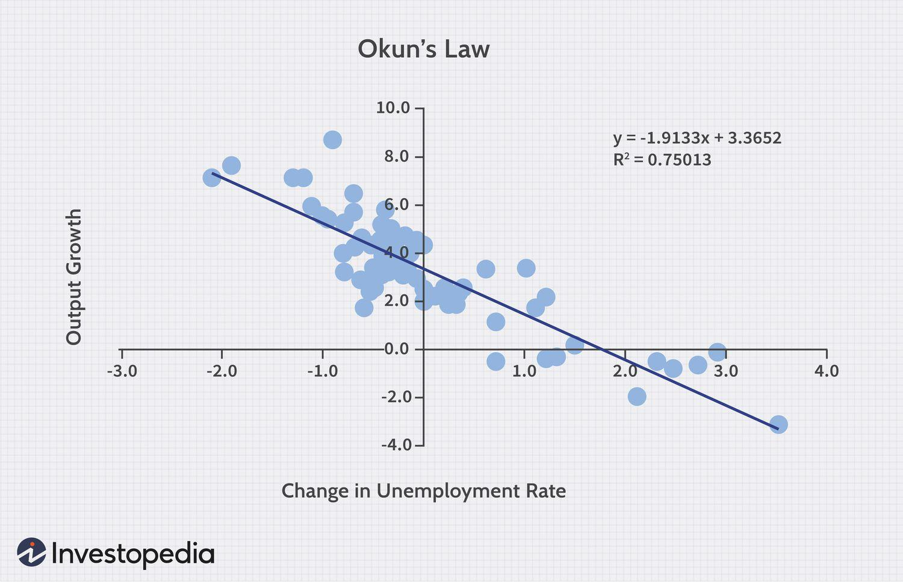

## Table of Contents

## What is Okun's Law?

Okun's Law is an economic theory that shows the connection between unemployment and a country's economic growth. It says that when the economy grows, unemployment goes down. Specifically, for every 1% increase in the Gross Domestic Product (GDP) above the trend growth rate, the unemployment rate drops by about 0.5%.

This law was named after Arthur Okun, an economist who studied this relationship in the 1960s. It's a useful tool for policymakers because it helps them understand how changes in economic growth can affect joblessness. However, it's not a perfect rule and can vary depending on the country and time period.

## Who is Arthur Okun and why is he significant in economics?

Arthur Okun was an American economist born in 1928 and passed away in 1980. He worked as an economic advisor to President Lyndon B. Johnson and was a key member of the Council of Economic Advisers. Okun is well-known for coming up with Okun's Law, which shows how changes in a country's economic growth can affect unemployment. This idea has helped many people understand the relationship between how well an economy is doing and how many people have jobs.

Okun's work is important because it gives policymakers a way to predict how their decisions might affect unemployment. His law has been used by governments around the world to make better economic plans. Even though Okun's Law isn't perfect and can change depending on the country and time, it's still a big part of how economists think about unemployment and economic growth.

## How does Okun's Law relate economic growth to unemployment?

Okun's Law shows how economic growth and unemployment are connected. It says that when a country's economy grows faster than normal, the number of people without jobs goes down. Specifically, for every 1% increase in the Gross Domestic Product (GDP) above the usual growth rate, the unemployment rate drops by about 0.5%. This means that if the economy is doing really well, more people will find jobs.

This idea was discovered by an economist named Arthur Okun in the 1960s. He noticed this pattern while studying the U.S. economy. Okun's Law is useful because it helps people who make decisions about the economy understand how their choices might affect unemployment. However, it's not a perfect rule and can be different in different countries or at different times.

## What is the typical ratio used in Okun's Law?

Okun's Law uses a typical ratio to show how economic growth affects unemployment. The ratio says that for every 1% increase in a country's Gross Domestic Product (GDP) above its normal growth rate, the unemployment rate drops by about 0.5%. So, if the economy grows faster than usual, more people will find jobs.

This ratio was found by Arthur Okun, an economist, when he studied the U.S. economy in the 1960s. It's a helpful tool for people who make decisions about the economy because it helps them predict how their choices might change the number of people without jobs. But, it's important to remember that this ratio can be different in other countries or at different times.

## Can you explain the formula for Okun's Law?

Okun's Law helps us understand how the economy growing can affect how many people have jobs. It says that for every 1% the economy grows faster than it usually does, the number of people without jobs goes down by about 0.5%. So, if the economy grows 2% more than normal, we might see the unemployment rate drop by about 1%.

This idea came from an economist named Arthur Okun. He looked at the U.S. economy in the 1960s and saw this pattern. People who make decisions about the economy use Okun's Law to guess how their choices might change unemployment. But, it's not a perfect rule and can be different in other countries or at different times.

## How is Okun's Law used by policymakers?

Policymakers use Okun's Law to understand how their decisions about the economy might change the number of people without jobs. They know that if the economy grows faster than usual, more people will find jobs. So, when they make plans to help the economy grow, they think about how this growth might lower unemployment. This helps them make better choices that can help more people find work.

Even though Okun's Law isn't perfect and can be different in different places or times, it's still a useful tool. Policymakers use it to guess what might happen if they make certain changes to the economy. For example, if they want to lower unemployment, they might try to make the economy grow faster, knowing that a 1% increase in growth above normal can lower unemployment by about 0.5%. This helps them plan better and make decisions that can improve people's lives.

## What are the limitations of Okun's Law?

Okun's Law is a useful tool, but it has some limits. It doesn't work the same way in every country or at every time. What might be true in the United States might not be true in another country. Also, the relationship between economic growth and unemployment can change over time. So, even if Okun's Law says that a 1% increase in growth should lower unemployment by 0.5%, it might not always happen that way.

Another problem is that Okun's Law looks at the whole economy, but it doesn't tell us about different groups of people. For example, it might not show how young people or people in certain jobs are affected by economic growth. Also, other things like technology or changes in how businesses work can change the relationship between growth and unemployment. So, while Okun's Law can help us understand some things, it can't tell us everything about how the economy works.

## How has the accuracy of Okun's Law varied over time?

The accuracy of Okun's Law has changed over time. When Arthur Okun first came up with the idea in the 1960s, it worked pretty well for the U.S. economy. But as time went on, the relationship between economic growth and unemployment started to change. Sometimes, the economy would grow a lot, but unemployment wouldn't go down as much as Okun's Law predicted. Other times, the economy might not grow much, but unemployment would still drop.

There are a few reasons why Okun's Law might not be as accurate now. One reason is that the way businesses work has changed a lot. For example, technology has made some jobs easier, so companies might not need to hire as many people even if they are making more money. Also, different groups of people, like young workers or those in certain industries, might be affected differently by economic growth. So, while Okun's Law can still be a helpful guide, it's not always perfect in predicting how the economy will affect unemployment.

## In what ways can structural changes in the economy affect Okun's Law?

Structural changes in the economy can mess with how well Okun's Law works. For example, when new technology comes along, it can change how many workers a company needs. If a business can do more with fewer people because of machines or computers, then the economy might grow without hiring more workers. This means that even if the economy is doing well, unemployment might not go down as much as Okun's Law says it should.

Also, the kinds of jobs people do can change over time. If more people start working in industries like tech or services instead of manufacturing, the relationship between economic growth and unemployment can be different. These industries might not need as many workers to grow, so the usual rule of a 1% increase in growth lowering unemployment by 0.5% might not hold true. So, when the economy changes a lot, Okun's Law might not be as accurate in predicting what will happen to unemployment.

## How do different countries' experiences with Okun's Law vary?

Different countries have different experiences with Okun's Law because their economies work in different ways. For example, in the United States, where Okun's Law was first noticed, a 1% increase in economic growth might lower unemployment by about 0.5%. But in other countries, like Germany, the same increase in growth might not lower unemployment as much. This is because each country has its own way of doing things, like how they hire workers or how their industries work.

Also, the kind of jobs people have in different countries can change how Okun's Law works. In some countries, a lot of people might work in industries like farming or manufacturing, where more growth can mean more jobs. But in other countries, more people might work in services or technology, where growth might not need as many new workers. So, even if the economy is doing well, the number of people without jobs might not go down as much as Okun's Law says it should.

## What are some criticisms of Okun's Law from economic theorists?

Some economic theorists say that Okun's Law is too simple to really explain how economic growth and unemployment work together. They think it doesn't take into account all the different things that can affect jobs, like changes in technology or how businesses work. For example, if a company starts using machines instead of people, the economy might grow without hiring more workers. This means that even if the economy is doing well, unemployment might not go down as much as Okun's Law predicts.

Another criticism is that Okun's Law might not work the same way in every country or at every time. What's true in the United States might not be true in other places. Also, the relationship between growth and unemployment can change over time. So, while Okun's Law can be a helpful guide, it's not always perfect in predicting what will happen to unemployment. Some theorists argue that we need more detailed and specific models to understand how the economy affects jobs.

## How might future economic trends influence the applicability of Okun's Law?

Future economic trends could change how well Okun's Law works. As more businesses use technology like robots and computers, they might not need to hire as many people even if they are making more money. This means that the economy could grow without lowering unemployment as much as Okun's Law says it should. Also, if more people start working in jobs that don't need a lot of new workers to grow, like in tech or services, the usual rule of a 1% increase in growth lowering unemployment by 0.5% might not be true anymore.

Another thing that could affect Okun's Law is how the world's economy changes. If countries start working together more and trading more, the way growth affects jobs might be different in each country. Also, big events like climate change or global health crises could make the economy and jobs change in ways that Okun's Law doesn't expect. So, while Okun's Law can still be a helpful guide, future economic trends might make it less accurate in predicting what will happen to unemployment.

## What is Exploring Okun's Law?

Okun's Law is a key economic principle that describes a relationship between unemployment and economic growth. Formally, it can be expressed as a simple linear equation that suggests a negative correlation between changes in unemployment and changes in real Gross Domestic Product (GDP). The mathematical expression of Okun's Law can be written as:

$$
\Delta u = -k (\Delta y - c)
$$

where $\Delta u$ represents the change in the unemployment rate, $\Delta y$ is the growth rate of real GDP, $k$ is the coefficient that measures the response of unemployment to GDP changes, and $c$ is a constant representing the growth rate of GDP required to keep unemployment stable.

Historically, Okun's Law was first proposed by economist Arthur Okun in the 1960s based on empirical observations of the U.S. economy. Okun identified that for every 1% increase in unemployment, a country's GDP was approximately 2% lower than its potential. This original rule-of-thumb was derived from data during the 1950s and 1960s in the United States. Over time, subsequent research has refined the numerical coefficients, but the underlying principle of a trade-off between unemployment and economic growth has remained influential.

The empirical validation of Okun's Law has been robust across various economies and time periods, although the specific coefficients can differ. For example, in some countries or at different times, the relationship might show a different sensitivity of unemployment to economic growth, reflected in the scale of the coefficient $k$.

Okun's Law is widely used to forecast economic conditions. It provides a straightforward tool for policymakers and economists to assess how changes in GDP would likely affect unemployment and vice versa. During periods of economic planning or in setting monetary policy, knowing the likely impact on unemployment when targeting certain GDP growth rates can guide decisions.

However, several factors can influence the strength and validity of Okun’s relationship. These include structural changes in the labor market, technological advancements, and shifts in labor force participation rates. For instance, labor market policies or demographic trends can impact the natural rate of unemployment, potentially altering the established relationship. Furthermore, during severe recessions or unexpected economic shocks, deviations from the typical Okun's Law relationship can occur.

Critics of Okun’s Law point out that it is a historical observation rather than an immutable economic law. One limitation is its assumption of linearity; in practice, the relationship between unemployment and GDP growth can be more complex. Additionally, Okun’s Law does not account for all factors influencing unemployment, such as shifts in the types of available jobs or changes in work hours. Furthermore, the empirical coefficients may vary significantly across different countries and over time, suggesting a need for local calibration rather than a one-size-fits-all approach.

In summary, while Okun's Law remains a fundamental tool in economic analysis, especially for short-term forecasting and policy-making, it is essential to consider its limitations and the context in which it is applied. Economic models should adjust the relationship between unemployment and GDP growth based on current data and prevailing economic conditions.

## What are the interconnections between unemployment, economic growth, and algo trading?

Shifts in unemployment and economic growth are crucial determinants of market conditions and trading volumes. High unemployment typically signals decreased consumer spending, which can lead to reduced corporate profits and stock market downturns. Conversely, robust economic growth often results in increased investor confidence and higher trading volumes. Algorithmic trading systems, which constitute a significant portion of transactions in financial markets, are particularly sensitive to these economic shifts.

Algorithmic models can potentially incorporate Okun’s Law, which states that for every 1% increase in unemployment, a country's GDP will be at an estimated 2% lower than its potential GDP. This relationship can be expressed mathematically as:

$$
\Delta Y = -c \cdot \Delta U
$$

where $\Delta Y$ is the change in GDP, $\Delta U$ is the percentage change in unemployment, and $c$ is Okun's coefficient, typically ranging around 2-3.

By integrating Okun’s Law into algorithmic trading strategies, traders can adjust their models to predict and respond to changes in macroeconomic indicators like unemployment rates. For example, when unemployment data forecast a potential GDP decline, algorithms could be programmed to anticipate market reactions, such as stock sell-offs, to capitalize on anticipated price movements.

There are numerous case studies illustrating how economic shifts have led to pronounced algorithmic trading responses. For instance, during the 2008 financial crisis, a surge in unemployment led to heightened market [volatility](/wiki/volatility-trading-strategies), which many algorithmic traders exploited. Similarly, the rapid recovery post-COVID-19 pandemic saw economic growth indicators leading to increased bullish algorithmic trading activity.

Incorporating macroeconomic indicators into trading algorithms presents both risks and rewards. The primary reward lies in gaining a competitive edge through enhanced predictive accuracy. However, risks include relying on potentially outdated models that may not account for new economic realities or black swan events. Furthermore, over-reliance on historical data can lead to model failure if unprecedented economic conditions arise.

Looking forward, the interplay between unemployment, economic growth, and algorithmic trading is poised to significantly impact financial markets. As computational power increases and economic models become more sophisticated, algorithmic trading systems will likely become even more adept at integrating complex economic theories, such as Okun's Law. These systems could be designed to continuously learn and adapt to real-time data, potentially leading to more efficient capital markets. However, this evolution requires careful consideration of ethical and regulatory frameworks to ensure market stability and fairness.

## References & Further Reading

[1]: Okun, A. M. (1962). ["Potential GNP: Its Measurement and Significance."](https://www.sciencedirect.com/science/article/pii/0167223179900095) Cowles Foundation Paper 190.

[2]: Jorda, O., Singh, S. R., & Taylor, A. M. (2020). ["Okun's Law Revisited."](https://www.nber.org/papers/w26934) National Bureau of Economic Research Working Paper No. 25402.

[3]: BLS Handbook of Methods. ["How the Government Measures Unemployment: Definitions and Calculations."](https://www.bls.gov/opub/hom/) Bureau of Labor Statistics.

[4]: Carlin, W., & Soskice, D. (2006). ["Macroeconomics: Imperfections, Institutions, and Policies."](https://archive.org/details/macroeconomicsim0000carl) Oxford University Press.

[5]: Energijs, M., Wozniak, M., Reusch, B., & Grusevaja, M. (2016). ["Algorithmic Trading Strategies."](https://www.sciencedirect.com/science/article/pii/S1364032116301502) Computational Intelligence and Its Applications.

[6]: Aldridge, I. (2013). ["High-Frequency Trading: A Practical Guide to Algorithmic Strategies and Trading Systems."](https://www.ahmetbeyefendi.com/wp-content/uploads/2020/07/High-Frequency-Trading-Irene-Aldridge.pdf) Wiley Trading.