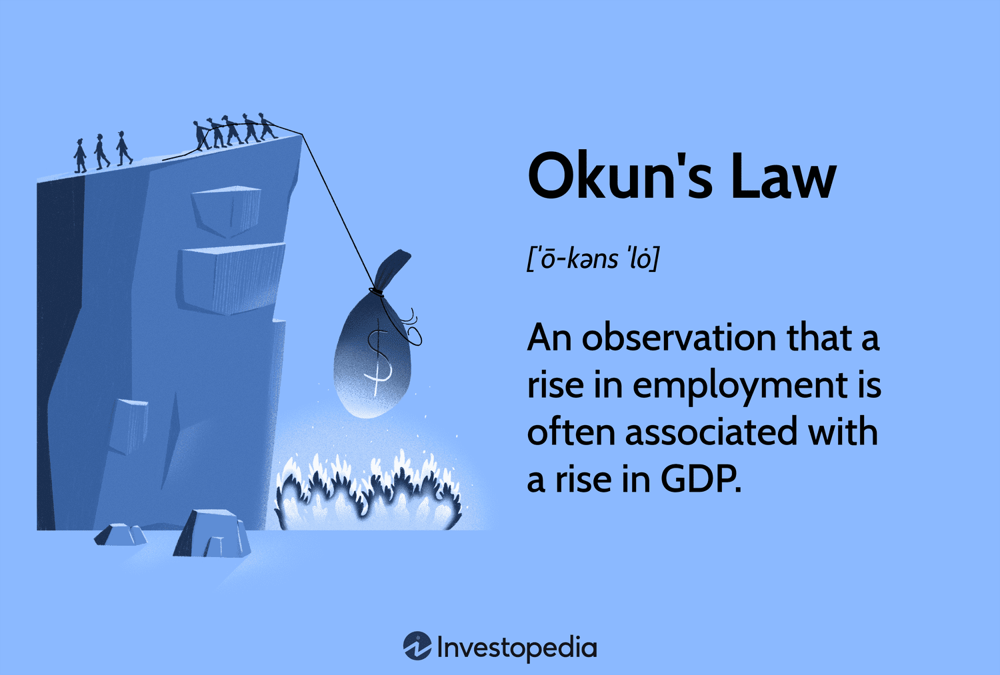

## Table of Contents

## What is Okun's Law?

Okun's Law is a rule in economics that connects changes in unemployment to changes in a country's economic growth. It says that for every 1% increase in unemployment, a country's GDP will be about 2% lower than its potential GDP. This means that if more people are out of work, the economy isn't doing as well as it could.

This law helps economists predict how changes in unemployment might affect the overall economy. It's not a perfect rule because the relationship between unemployment and GDP can change over time and be different in various countries. But, it gives a useful guide for understanding economic health and planning policies to boost employment and growth.

## Who developed Okun's Law and when?

Okun's Law was developed by an economist named Arthur Okun. He came up with this idea in the 1960s while working at the Brookings Institution in the United States. Arthur Okun noticed a pattern between unemployment rates and the growth of the economy, and he wanted to explain this relationship in a simple way.

He published his findings in a paper called "Potential GNP: Its Measurement and Significance" in 1962. In this paper, Okun explained that when unemployment goes up, the economy doesn't grow as much as it could. His work helped other economists understand and predict how changes in unemployment might affect the overall health of the economy.

## What is the basic formula of Okun's Law?

Okun's Law can be shown with a simple formula. The basic idea is that for every 1% increase in the unemployment rate, a country's GDP will be about 2% lower than what it could be if everyone who wanted a job had one. You can write this as: GDP Gap = -2 × (Actual Unemployment Rate - Natural Unemployment Rate). The GDP Gap is the difference between what the economy is actually producing and what it could produce at full employment.

This formula helps economists guess how changes in unemployment will affect the economy. If the actual unemployment rate is higher than the natural rate, the economy is not doing as well as it could. The natural rate of unemployment is the level of unemployment that happens even when the economy is doing well. It's not zero because some people are always moving between jobs or looking for new ones. By using Okun's Law, economists can see how much the economy might be losing because of higher unemployment.

## How does Okun's Law relate unemployment to economic output?

Okun's Law shows how unemployment and economic output, or GDP, are connected. It says that when more people are out of work, the economy doesn't produce as much as it could. Specifically, for every 1% increase in the unemployment rate, the GDP is about 2% lower than what it could be if everyone had a job. This means that if the unemployment rate goes up, the economy loses some of its potential to grow.

This relationship helps economists understand how changes in unemployment can affect the overall economy. If unemployment is higher than what's normal, called the natural rate of unemployment, then the economy is not doing as well as it could. The natural rate is the level of unemployment that exists even when the economy is doing well because some people are always switching jobs or looking for new ones. By using Okun's Law, economists can predict how much the economy might be losing due to higher unemployment and plan policies to help.

## Can you provide an example of how Okun's Law is applied?

Let's say a country has a natural unemployment rate of 5%. This means that even when the economy is doing well, about 5% of people are out of work because they are between jobs or looking for new ones. Now, imagine that the actual unemployment rate goes up to 6%. According to Okun's Law, this 1% increase in unemployment means the country's GDP is about 2% lower than what it could be if everyone who wanted a job had one.

In this example, if the country's potential GDP (the GDP at full employment) is $1 trillion, then with a 6% unemployment rate, the actual GDP would be about $980 billion. This is because the 1% increase in unemployment leads to a 2% drop in GDP, which is $20 billion less than the potential $1 trillion. Economists can use this information to understand how much the economy is losing due to higher unemployment and to plan policies that might help bring the unemployment rate back down to the natural rate.

## What are the typical values used in Okun's Law calculations?

The typical values used in Okun's Law calculations are a ratio of 2 to 1. This means that for every 1% increase in the unemployment rate, the GDP is about 2% lower than its potential. The potential GDP is what the economy could produce if everyone who wanted a job had one. The natural unemployment rate, which is the unemployment rate when the economy is doing well, is often used as a starting point. Economists usually consider this natural rate to be around 4% to 6%, but it can vary from one country to another.

In practice, economists take the difference between the actual unemployment rate and the natural unemployment rate. They then multiply this difference by 2 to find the percentage by which the GDP is below its potential. For example, if the natural unemployment rate is 5% and the actual rate goes up to 6%, the difference is 1%. Multiplying this 1% by 2 gives a 2% drop in GDP from its potential level. This simple formula helps economists estimate how much the economy is losing because of higher unemployment.

## How has Okun's Law been used in economic policy?

Okun's Law has been a helpful tool for people who make economic policies. They use it to understand how changes in unemployment can affect the overall economy. For example, if the unemployment rate goes up, policymakers know that the economy might be losing some of its potential to grow. They can then decide to use different strategies to bring the unemployment rate down. These strategies might include things like lowering interest rates to make borrowing money easier, or starting programs to help people find jobs.

Economists and government officials also use Okun's Law to predict what might happen to the economy in the future. If they see that unemployment is starting to go up, they can guess how much the GDP might drop and plan ahead. This can help them make better decisions about things like taxes and government spending. By keeping an eye on unemployment and using Okun's Law, they can try to keep the economy strong and help more people find work.

## What are some criticisms of Okun's Law?

Some people say that Okun's Law is not always right because the connection between unemployment and GDP can change over time. In some years, the economy might grow a lot even if unemployment doesn't go down much. In other years, the economy might not grow even if unemployment goes down. This means that the rule of a 2% drop in GDP for every 1% increase in unemployment doesn't always work the same way in different situations. Economists have found that the relationship can be different in different countries too.

Another criticism is that Okun's Law doesn't explain why the relationship between unemployment and GDP exists. It just tells us that there is a connection, but it doesn't say why more people out of work means less stuff is made. This makes it hard for people making economic policies to know exactly what to do. They can see that unemployment is going up, but they might not understand all the reasons behind it, so their plans to fix it might not work as well as they hope.

## How does Okun's Law vary across different countries?

Okun's Law can be different in different countries. In some places, the relationship between unemployment and GDP might be stronger than the usual 2% drop in GDP for every 1% increase in unemployment. For example, in countries with a lot of flexible jobs, a small change in unemployment might have a big effect on the economy. In other countries, the relationship might be weaker. This can happen in places where the economy is not as sensitive to changes in unemployment, maybe because a lot of people work in government jobs that don't change much.

The reasons why Okun's Law varies across countries can be complicated. Things like how easy it is for people to switch jobs, how much the government helps the economy, and even the culture of the country can make a difference. For example, in countries where it's hard to fire people, a rise in unemployment might not hurt the economy as much because companies keep their workers even when times are tough. Economists have to study each country carefully to understand how Okun's Law works there and use it to help make good economic policies.

## What are the limitations of Okun's Law in modern economies?

Okun's Law has some problems when we use it in today's economies. One big issue is that the link between unemployment and GDP can change over time. Sometimes, the economy might grow a lot even if unemployment doesn't go down much. Other times, the economy might not grow even if unemployment goes down. This means that the rule of a 2% drop in GDP for every 1% increase in unemployment doesn't always work the same way in different situations. This makes it hard for people making economic policies to use Okun's Law to predict what will happen to the economy.

Another problem is that Okun's Law doesn't explain why the relationship between unemployment and GDP exists. It just tells us that there is a connection, but it doesn't say why more people out of work means less stuff is made. This makes it difficult for policymakers to know exactly what to do. They can see that unemployment is going up, but they might not understand all the reasons behind it, so their plans to fix it might not work as well as they hope. In today's world, where economies are more complicated and connected, these limitations make Okun's Law less useful for making decisions.

## How have recent economic changes affected the applicability of Okun's Law?

Recent economic changes have made Okun's Law less reliable. Things like technology and globalization have changed how economies work. Now, jobs can move to different countries, and machines can do work that people used to do. This means that even if unemployment goes up, the economy might not slow down as much as Okun's Law says it should. Also, the way people work has changed. More people work from home or have flexible jobs, which can make the link between unemployment and economic growth weaker.

Another big change is how governments and central banks handle the economy. They use new tools and policies to keep the economy stable, even when unemployment goes up. For example, they might print more money or change interest rates to help the economy. These actions can make the relationship between unemployment and GDP different from what Okun's Law predicts. Because of all these changes, economists need to be careful when using Okun's Law to make predictions about the economy. They have to look at other things too, not just unemployment and GDP.

## What are some advanced statistical methods used to refine Okun's Law?

Economists use fancy math to make Okun's Law better. They use something called regression analysis to look at lots of numbers from the past and see how unemployment and GDP really fit together. This helps them find the best way to describe the relationship between these two things. They also use time series analysis, which looks at how things change over time. This can help them see if the connection between unemployment and GDP changes as years go by. These methods help economists make Okun's Law more accurate and useful for today's world.

Another way to improve Okun's Law is by using panel data analysis. This method looks at data from many different countries or regions at the same time. By doing this, economists can see how the relationship between unemployment and GDP might be different in different places. They can also use something called structural vector autoregression (SVAR) models. These models help economists understand why unemployment and GDP change together by looking at other things in the economy too. All these advanced methods help economists make better guesses about how unemployment affects the economy, even when things are changing fast.

## What is the relationship between unemployment and economic theory?

Unemployment is a critical metric in economic analysis, representing the percentage of the labor force that is jobless and actively seeking employment. It is a key indicator of economic health, influencing monetary policy, government budgets, and overall economic planning.

### Types of Unemployment

1. **Cyclical Unemployment**: This type occurs due to fluctuations in the economic cycle. During recessions, demand for goods and services decreases, leading to layoffs and higher unemployment. Conversely, during economic expansions, demand increases, reducing unemployment. Cyclical unemployment is often temporary and diminishes when the economy recovers.

2. **Structural Unemployment**: Structural unemployment arises from changes in the economy that alter the demand for certain skills. Factors can include technological advancements, changes in consumer preferences, or globalization. For example, automation might reduce the need for manufacturing workers while increasing demand for tech-savvy employees.

3. **Frictional Unemployment**: This is the short-term unemployment that occurs when individuals are transitioning between jobs or entering the workforce for the first time. It results from normal labor market turnover and is generally considered less concerning than other types.

4. **Other Types**: Additional forms include seasonal unemployment, which results from seasonal variations in demand (e.g., agricultural or holiday-related jobs), and long-term unemployment, which affects those unemployed for extended periods due to various factors.

### Implications for Economic Growth and Stability

Unemployment has significant effects on economic growth and stability. High unemployment indicates underutilized labor resources, leading to lower output and income. It can reduce consumer spending, slow down economic growth, and increase the burden on social welfare programs. Persistent unemployment can lead to social issues, including increased poverty and reduced social cohesion. Conversely, low unemployment suggests a fully utilized workforce, potentially spurring inflation if demand outstrips supply.

### Economic Theory and Unemployment

Economic theory provides a framework for understanding both the causes and effects of unemployment. Keynesian economics, for instance, emphasizes the role of aggregate demand in causing cyclical unemployment. It argues for government intervention, such as fiscal stimulus, to boost demand and reduce unemployment.

Classical economic theory, however, posits that good labor market flexibility and minimal regulations naturally lead to full employment by allowing wages to adjust to match supply and demand. Structural unemployment is often highlighted in this context, suggesting that improving education and retraining programs helps align workforce skills with market needs.

### Mathematical Representation

Unemployment rates are often modeled using the natural rate of unemployment ($U_n$) and the actual unemployment rate ($U$). Economic theories employ Phillips Curve models to illustrate the relationship between inflation and unemployment, often represented as:

$$
\pi = \pi^e - \beta (U - U_n)
$$

where $\pi$ is the actual inflation rate, $\pi^e$ is the expected inflation rate, and $\beta$ is the sensitivity of inflation to unemployment gaps.

In summation, understanding the dynamics of unemployment through various economic theories helps policymakers design effective interventions. Recognizing the types and implications of unemployment enables targeted strategies to foster economic stability and growth.

## What is Okun's Law: The Correlation Between Unemployment and GDP?

Okun's Law is an empirical relationship identified by economist Arthur Okun in the early 1960s, showcasing the correlation between unemployment and a country's Gross Domestic Product (GDP). In essence, Okun's Law posits that for every percentage point increase in the unemployment rate, a country's GDP will be roughly an additional 2% lower than its potential GDP. This idea helps economists and policymakers understand how changes in employment levels impact economic performance, thereby assisting in economic forecasting and analysis.

Arthur Okun's original formulation was relatively straightforward. He observed that there was a consistent relationship between unemployment levels and GDP fluctuations, particularly within the United States. This relationship was expressed through the equation:

$$
\Delta Y = k - c \times \Delta U
$$

where:
- $\Delta Y$ is the change in real GDP,
- $k$ is the potential GDP growth rate,
- $c$ is the Okun coefficient (approximately 2 in Okun's original work),
- $\Delta U$ is the change in unemployment rate.

Okun's Law thus indicates that when unemployment rises, economic output shrinks, as fewer people are employed and productive economic activities diminish.

Empirical observations of Okun's Law reveal its practical utility and limitations. Generally, the law holds in different economies but varies significantly in the magnitude of the Okun coefficient. Numerous studies across various time periods and regions have shown the 2:1 relationship to differ due to structural differences in the labor market, national economic policies, and variations in how unemployment itself is measured. For instance, labor market rigidities or technological advancements can affect how sensitive GDP is to changes in unemployment.

Despite its empirical strengths, Okun's Law is not without criticisms and limitations, especially in economic forecasting. It does not account for the quality of employment or underemployment, where individuals might be employed but not to the fullest of their skills or capacity. Also, it assumes a linear relationship between unemployment and GDP, which might not hold during extraordinary economic events like financial crises or major technological disruptions. The model's simplicity can overlook complex economic dynamics, such as productivity growth or changes in labor force participation rates.

In economic forecasting, reliance solely on Okun's Law might lead to inaccuracies, especially in rapidly fluctuating economies. However, when used in conjunction with other economic indicators and models, it remains a valuable tool for understanding the broader relationships within an economy. Its adaptability and empirical foundation allow it to serve as a baseline or rule of thumb that can guide economic policy and decision-making processes.

## References & Further Reading

[1]: Blanchard, O. J., & Johnson, D. R. (2012). ["Macroeconomics"](https://books.google.com/books/about/Macroeconomics.html?id=-jQZMAEACAAJ). Pearson Education.

[2]: Samuelson, P. A., & Nordhaus, W. D. (2010). ["Economics"](https://books.google.com/books/about/EBOOK_Economics.html?id=rMovEAAAQBAJ). McGraw-Hill Education.

[3]: Ball, L., Leigh, D., & Loungani, P. (2013). ["Okun's Law: Fit at 50?"](https://www.imf.org/external/pubs/ft/wp/2013/wp1310.pdf). IMF Working Papers.

[4]: Lopez de Prado, M. (2018). ["Advances in Financial Machine Learning"](https://www.amazon.com/Advances-Financial-Machine-Learning-Marcos/dp/1119482089). Wiley.

[5]: Jansen, S. (2020). ["Machine Learning for Algorithmic Trading - Second Edition: Predictive models to extract signals from market and alternative data for systematic trading strategies with Python"](https://www.oreilly.com/library/view/machine-learning-for/9781839217715/Text/Front_Matter.xhtml). Packt Publishing.

[6]: Okun, A. M. (1962). ["Potential GNP: Its Measurement and Significance"](https://www.sciencedirect.com/science/article/pii/0167223179900095). Proceedings of the Business and Economic Statistics Section of the American Statistical Association.

[7]: Chan, E. P. (2009). ["Quantitative Trading: How to Build Your Own Algorithmic Trading Business"](https://github.com/ftvision/quant_trading_echan_book). Wiley.

[8]: Aronson, D. R. (2006). ["Evidence-Based Technical Analysis: Applying the Scientific Method and Statistical Inference to Trading Signals"](https://www.wiley.com/en-us/Evidence+Based+Technical+Analysis%3A+Applying+the+Scientific+Method+and+Statistical+Inference+to+Trading+Signals-p-9780470008744). Wiley.

[9]: Brynjolfsson, E., & McAfee, A. (2014). ["The Second Machine Age: Work, Progress, and Prosperity in a Time of Brilliant Technologies"](https://psycnet.apa.org/record/2014-07087-000). W. W. Norton & Company.