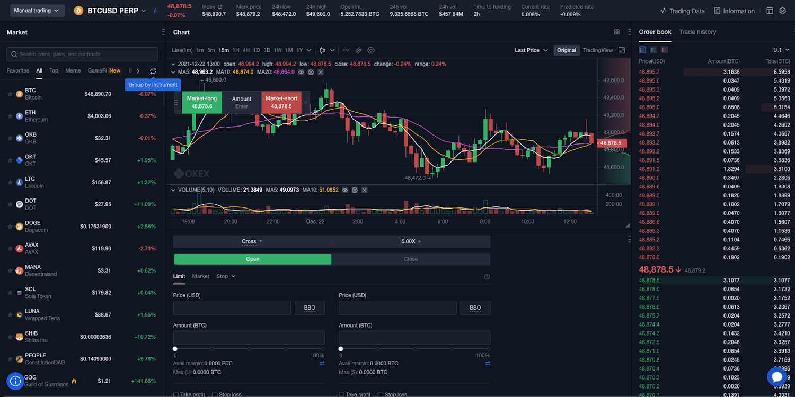

Algorithmic trading, a method of executing trades using automated pre-programmed trading instructions, has gained significant traction among investors and traders worldwide. Its growing popularity can be attributed to its ability to conduct transactions at speeds and frequencies that exceed human capabilities, utilizing advanced mathematical models and complex algorithms. This approach not only enhances efficiency but also mitigates emotional decision-making, providing a significant edge in the fast-paced financial markets.

OKX stands as a prominent figure in the cryptocurrency exchange sector, renowned for offering a wide array of trading functionalities and a secure platform for digital asset transactions. Founded to serve both institutional and retail investors, OKX has swiftly ascended to become one of the most popular platforms in the cryptocurrency space, owing to its robust infrastructure and reliable services. Emphasizing user experience and security, OKX facilitates transactions in multiple cryptocurrencies, thereby broadening the trading horizon for its users.



APIs, or Application Programming Interfaces, are pivotal in algorithmic trading. They allow software applications to communicate with trading platforms seamlessly, enabling automated trading strategies to operate effectively. APIs serve as the backbone of algorithmic trading by providing real-time market data, executing trades, and managing account transactions. The integration of APIs into trading strategies allows developers to construct, backtest, and deploy complex trading algorithms using a systematic and efficient approach.

In this article, we explore critical facets of algorithmic trading and its applications via the OKX API. We aim to provide a comprehensive understanding of algorithmic trading mechanics, delve into the specifics of the OKX API functionalities, outline the process of setting up the API for trading, and discuss best practices for developing and optimizing trading algorithms. Additionally, the article will highlight strategies for maintaining security and performance in your trading operations.

Understanding the OKX API is advantageous for traders, providing them with tools to enhance trading precision and operational efficiency. By leveraging the API, traders can access real-time data, execute trades with minimal latency, and develop intricate algorithms tailored to their trading strategies. Moreover, familiarity with the API empowers users to customize their trading experiences and scale their operations effectively. As algorithmic trading continues to evolve, mastering the use of APIs like those offered by OKX can provide a competitive advantage, enabling traders to navigate the dynamic and complex world of cryptocurrency markets with greater proficiency.

## Table of Contents

## Understanding Algorithmic Trading

Algorithmic trading is the process of using computer algorithms to automate trading decisions in financial markets. These algorithms follow defined instructions for trade execution to generate profits at a speed and frequency that manual trading cannot match. By leveraging technology, algorithmic trading allows traders to analyze vast amounts of market data swiftly, identify opportunities, and execute trades with precision.

The role of algorithms in trading primarily revolves around executing trades efficiently by automating repetitive tasks, managing multiple market orders, and monitoring data trends. Algorithms can scan multiple markets and assets simultaneously, react to market conditions in real-time, and execute trades across global markets at any time. This capability is crucial for high-frequency trading ([HFT](/wiki/high-frequency-trading-strategies)), where the speed of executing trades can be a significant competitive advantage.

One of the key advantages of [algorithmic trading](/wiki/algorithmic-trading) over manual trading is enhanced efficiency. Algorithms can process data and execute trades far faster than human traders, reducing the latency between the identification of a trading opportunity and the execution of a trade. Additionally, automation reduces human error, helping to ensure that trades are executed as planned without the potential for emotional bias that could lead to irrational decision-making.

Algorithmic trading has transformed financial markets by increasing [liquidity](/wiki/liquidity-risk-premium) and market efficiency. It has also democratized access to markets, enabling retail investors to employ sophisticated strategies that were once only available to institutional investors. The use of algorithms in trading can lead to tighter spreads, reduced transaction costs, and better order execution for all market participants.

Common strategies used in algorithmic trading include:

1. **Trend Following**: This strategy involves algorithms that identify and follow market trends, such as moving average crossovers or price level breakouts. These algorithms capitalize on the continuing momentum of market trends.

2. **Arbitrage**: Algorithms detect price discrepancies between different markets or instruments and execute trades to profit from these inefficiencies.

3. **Market Making**: Algorithms place both buy and sell orders to profit from the bid-ask spread. This strategy involves providing liquidity to the markets and profiting from the volume of trades.

4. **Mean Reversion**: This strategy relies on the statistical concept that prices will revert to their mean or average over time. Algorithms identify overbought or oversold conditions and execute trades anticipating a reversion to the mean.

5. **Statistical Arbitrage**: This involves using quantitative models to identify relative value opportunities, where pricing anomalies among correlated assets can be exploited.

The impact of algorithmic trading on the financial markets is profound, influencing everything from the development of new financial products to changes in market structure. It requires traders to understand mathematical models, data analytics, and often programming languages such as Python, R, or C++, which are used to develop and implement trading strategies. As technology continues to advance, the scope and capabilities of algorithmic trading are expected to expand further, playing an ever-more integral role in modern trading.

 to OKX API

The OKX API is a critical tool designed for developers, traders, and institutions focused on algorithmic trading within the [cryptocurrency](/wiki/cryptocurrency) markets. By offering a suite of features, OKX facilitates robust and efficient trading experiences that are integral to maintaining competitive strategies in fast-paced environments.

At its core, the OKX API provides programmatic access to the platform's trading capabilities. This access enables users to automate the buying and selling of digital assets, retrieve market data, and manage account details without manual intervention. The API is an essential component for implementing any algorithmic trading strategy, offering both REST and WebSocket interfaces to suit different operational needs.

The OKX REST API offers a variety of HTTP methods which enable traders to execute orders, access account information, and obtain historical data through standardized requests and responses. It is best suited for applications where real-time data streaming is not critical, such as executing batch trading strategies or accessing detailed account balance and transaction history updates.

In contrast, the OKX WebSocket API provides real-time data streaming for dynamic market data, such as tickers, order [books](/wiki/algo-trading-books), and live trade information. This feature is crucial for traders who require instantaneous data updates to make split-second decisions based on shifting market conditions. Through persistent connections, it minimizes latency and ensures that users have the most up-to-date information possible, which is indispensable for high-frequency trading strategies.

The OKX API plays a pivotal role in enhancing algorithmic trading by offering complex order types, including limit, market, and stop orders, as well as advanced options like conditional and iceberg orders. These enable sophisticated strategies that can operate seamlessly without manual oversight. By automating processes, it eradicates human error and emotional decision-making, thus optimizing trade execution efficiency and consistency.

Security is a primary concern when dealing with cryptocurrency trading platforms. The OKX API incorporates various measures to ensure the safety of user data and transactions. This includes the use of API keys, which act as private credentials required to authenticate any request made to the API. The API keys are tied to the user's account, and can be configured with different permissions to limit functionality. Best practices recommend using strong, unique keys for each application, regularly rotating keys, and keeping them confidential to prevent unauthorized access.

Moreover, the API employs encryption methodologies to protect data transmitted over networks. Ensuring that connections are established through secure protocols (such as HTTPS) is of utmost importance for maintaining confidentiality and integrity of information. For added security, users are advised to implement IP whitelisting, permitting access only from trusted IP addresses, and to monitor API activity logs for anomalous operations that could indicate potential security breaches.

In summary, the OKX API provides a comprehensive framework for executing algorithmic trading on the exchange. Its dual REST and WebSocket APIs offer flexibility and reliability, while security measures ensure safe and efficient trading operations. With these tools, traders can leverage automation to optimize their trading strategies and stay competitive in the evolving digital asset markets.

## Setting Up OKX API for Algo Trading

To successfully engage in algorithmic trading using the OKX API, it's crucial to properly set up your API account, configure your settings, and integrate the API with trading platforms. This section outlines the necessary steps and considerations to ensure a smooth and efficient setup process for traders.

### Step-by-Step Guide to Setting Up an OKX API Account

1. **Creating an OKX Account:**
   - To access OKX API, you must first create an account on the OKX platform. Visit [OKX's official website](https://www.okx.com/) and follow the registration process by entering the required personal information and verifying your identity.

2. **Activating API Access:**
   - Once your account is active, log in to the OKX user dashboard. Navigate to the API management section, which is typically found under the 'Account' or 'Settings' tab.

3. **Obtaining API Keys:**
   - In the API management section, select the option to create new API keys. You'll be prompted to provide a label for your API key and select permissions such as 'read-only' or 'trading'. Ensure to select the appropriate permissions based on your trading needs.
   - After completing these steps, a unique API key and secret will be generated. Store these securely, as they are necessary for API integration but should never be shared publicly.

### Configuration of API Settings for Different Strategies

API settings play a vital role in how your trading algorithm interacts with the market. Here are some key configuration considerations:

- **Permission Settings:**
  - Depending on your trading strategy, ensure that the API key permissions align with your operations. For instance, a strategy that involves both querying market data and executing trades will require both 'read' and 'write' permissions.

- **Rate Limits:**
  - Be aware of OKX's rate limits to avoid any disruptions in your trading activities. Configure your algorithms to comply with the rate limits to ensure continuous access.

- **Configurations for Trading Strategies:**
  - For strategies that require high-frequency data access, consider using WebSocket API for real-time updates.
  - Set any necessary timeouts or retries in your API calls to handle network uncertainties effectively.

### Integrating OKX API with Trading Platforms and Software

- **Choosing a Trading Platform:**
  - Select a trading platform or software that supports integration with OKX API. Examples include MetaTrader, QuantConnect, or custom solutions written in Python or C++.

- **Implementing the API:**
  - Use the provided API key and secret in your chosen platform to authenticate and establish a connection to OKX.

- **Python Example:**

  ```python
  import requests
  import hmac
  import hashlib

  api_key = 'YOUR_API_KEY'
  api_secret = 'YOUR_API_SECRET'

  # Example of making a request
  def get_account_balance():
      url = 'https://www.okx.com/api/v5/account/balance'
      headers = {
          'OK-ACCESS-KEY': api_key,
          'OK-ACCESS-SIGN': hmac.new(api_secret.encode(), msg=url.encode(), digestmod=hashlib.sha256).hexdigest(),
          'Content-Type': 'application/json'
      }
      response = requests.get(url, headers=headers)
      return response.json()

  balance_info = get_account_balance()
  print(balance_info)
  ```

### Troubleshooting Common Setup Issues

- **API Key Errors:**
  - Ensure API keys are entered correctly and permissions are appropriate for the operations you intend to perform.

- **Connection Issues:**
  - Check network connectivity and ensure there is no firewall blocking the API requests to OKX servers.

- **Rate Limit Exceeded:**
  - If you encounter rate limit issues, review and optimize your request frequency and apply back-off strategies.

By following these guidelines, traders can efficiently set up the OKX API for algorithmic trading. Proper configuration and integration are key to exploiting the full potential of the API for executing complex trading strategies.

## Developing Trading Algorithms with OKX API

Developing trading algorithms using OKX API requires a thorough understanding of various components that ensure efficiency and robustness. Here are some key considerations:

**Key Considerations When Designing Trading Algorithms**

When designing trading algorithms, one must consider factors such as latency, execution speed, and financial goals. Algorithms should be designed to capitalize on market inefficiencies, and must adapt to evolving market conditions. Risk management and portfolio diversification are also crucial to safeguard investments against unforeseen market movements.

**Accessing Market Data and Executing Trades via OKX API**

OKX API offers tools for accessing real-time and historical market data, including price feeds and trade execution capabilities. To access market data, developers typically use REST API calls for historical data or WebSocket API for real-time updates.

Example in Python to access market data using REST API:
```python
import requests

def get_market_data():
    url = 'https://www.okex.com/api/spot/v3/instruments/BTC-USD/candles'
    response = requests.get(url)
    data = response.json()
    return data

market_data = get_market_data()
print(market_data)
```

Executing trades via OKX API involves sending POST requests with the necessary parameters to facilitate buy or sell transactions. Securing these operations with API keys and access tokens is a best practice to ensure safety and privacy.

**Common Programming Languages and Tools for Developing with OKX API**

Python is the preferred language for developing trading algorithms due to its extensive ecosystem of libraries, such as NumPy for numerical operations, Pandas for data manipulation, and libraries like ccxt which facilitate trading bot development by simplifying API interactions. Additionally, languages like C++ and JavaScript are also used for high-frequency trading systems due to their performance efficiency.

**Case Studies of Successful Trading Algorithms Using OKX API**

Several case studies showcase the successful implementation of trading algorithms with OKX API. For instance, [momentum](/wiki/momentum) trading strategies, which capitalize on short-term trends, have shown promise. Another successful approach is the [arbitrage](/wiki/arbitrage) strategy, which exploits price differences of the same asset across different markets. Implementing these strategies requires robust coding and thorough [backtesting](/wiki/backtesting) to minimize risks.

**Testing and Optimizing Algorithms for Better Performance**

Testing trading algorithms involves backtesting on historical data to evaluate their effectiveness before deploying them live. Developers can use available data from OKX API to simulate trading sessions and refine their strategies. Key performance metrics include Sharpe ratio, drawdown, and profit-and-loss curves.

For optimization, parameters such as risk limits, stop-loss thresholds, and order sizes need fine-tuning. Machine learning techniques can aid in improving predictive accuracy and adapting to market changes.

Overall, leveraging the functionalities of OKX API effectively enables the development of sophisticated trading algorithms that thrive in dynamic financial markets. By adhering to best practices and continuously iterating on strategies, developers can maintain an edge in algorithmic trading.

## Best Practices for Using OKX API in Algo Trading

Ensuring security and privacy while using OKX API is paramount for any trader engaged in algorithmic trading. This involves implementing robust authentication mechanisms to protect API keys. Use of secure storage solutions, such as encrypted databases or secret management tools, is recommended to safeguard these credentials against unauthorized access. Employing API key permissions effectively by granting only necessary access rights and utilizing IP whitelisting can further bolster security.

Monitoring and maintaining the performance of trading bots presents a significant challenge and requires a methodical approach. Routine checks of the system’s health, such as latency tests and error rate analysis, are essential. Implementing real-time monitoring tools that can alert traders to anomalies or unexpected behavior in trading bots ensures that corrective actions can be executed swiftly.

Risk management strategies in algorithmic trading are critical to safeguarding investments. Deploying algorithms that incorporate stop-loss mechanisms can protect against excessive losses. Diversifying trading strategies and assets is another prudent approach to mitigate risk, reducing the impact of adverse market events on overall portfolio performance.

Staying updated with OKX API changes and updates is crucial for maintaining trading operations. Traders should subscribe to OKX's developer updates or notifications to receive timely information on API modifications. Regularly reviewing the official OKX documentation can help traders adapt their algorithms to changes, ensuring uninterrupted trading.

Tips for scaling and improving algorithmic trading operations include optimizing code for efficiency and minimizing latency. Leveraging cloud-based solutions can enhance scalability while managing computational resources effectively. Employing backtesting frameworks allows for the evaluation of algorithmic strategies against historical data, facilitating continuous improvement and adaptation to market conditions.

A proactive approach to these best practices can significantly enhance the effectiveness and security of trading operations conducted via the OKX API.

## Conclusion

The OKX API plays a pivotal role in algorithmic trading by providing traders with the tools required for efficient and effective market analysis and order execution. With the ever-expanding scope of cryptocurrency markets, leveraging APIs like OKX enables traders to automate their strategies, ensuring precision and speed that is unattainable through manual methods. The integration of algorithm-driven strategies with the OKX platform allows for seamless operation, enhanced by its robust infrastructure and security measures.

The advantages of utilizing API-driven strategies are numerous. By automating trades, investors can react to market fluctuations instantaneously, capitalize on arbitrage opportunities, and implement complex strategies with perfect consistency. Automation also reduces the emotional biases often associated with manual trading, providing a more disciplined approach to market participation. Furthermore, the scalability of these strategies is significantly enhanced, catering to both novice traders and institutional investors.

Continuous learning and experimentation are crucial in the dynamic environment of cryptocurrency trading. As the market evolves, so too must the strategies employed within it. The OKX API serves as a flexible foundation for developing such innovations, allowing traders to test and refine their algorithms under real-time conditions. The consistent improvement and optimization of these systems contribute not only to individual success but also to the advancement of trading methodologies as a whole.

Looking ahead, the future of algorithmic trading with OKX appears promising. As the platform continues to expand its capabilities and introduce new features, traders will have more opportunities to refine their strategies and explore cutting-edge technologies in algorithm development. Additionally, the pursuit of AI and [machine learning](/wiki/machine-learning) applications within trading algorithms will likely revolutionize how trades are executed and managed.

For those interested in harnessing the power of algorithmic trading, the OKX API presents a valuable resource. It encourages traders to explore its potential fully and experience firsthand the benefits of automated trading. By engaging with the OKX API, traders can unlock new dimensions of precision, efficiency, and opportunity in their trading practices.

## References & Further Reading

[1]: Bergstra, J., Bardenet, R., Bengio, Y., & Kégl, B. (2011). ["Algorithms for Hyper-Parameter Optimization."](https://papers.nips.cc/paper/4443-algorithms-for-hyper-parameter-optimization) Advances in Neural Information Processing Systems 24.

[2]: ["Advances in Financial Machine Learning"](https://www.amazon.com/Advances-Financial-Machine-Learning-Marcos/dp/1119482089) by Marcos Lopez de Prado

[3]: Aronson, D. R. (2006). ["Evidence-Based Technical Analysis: Applying the Scientific Method and Statistical Inference to Trading Signals"](https://www.amazon.com/Evidence-Based-Technical-Analysis-Scientific-Statistical/dp/0470008741). John Wiley & Sons, Inc.

[4]: Jansen, S. (2020). ["Machine Learning for Algorithmic Trading"](https://github.com/stefan-jansen/machine-learning-for-trading). Packt Publishing.

[5]: Chan, E. P. (2008). ["Quantitative Trading: How to Build Your Own Algorithmic Trading Business"](https://github.com/ftvision/quant_trading_echan_book). John Wiley & Sons.