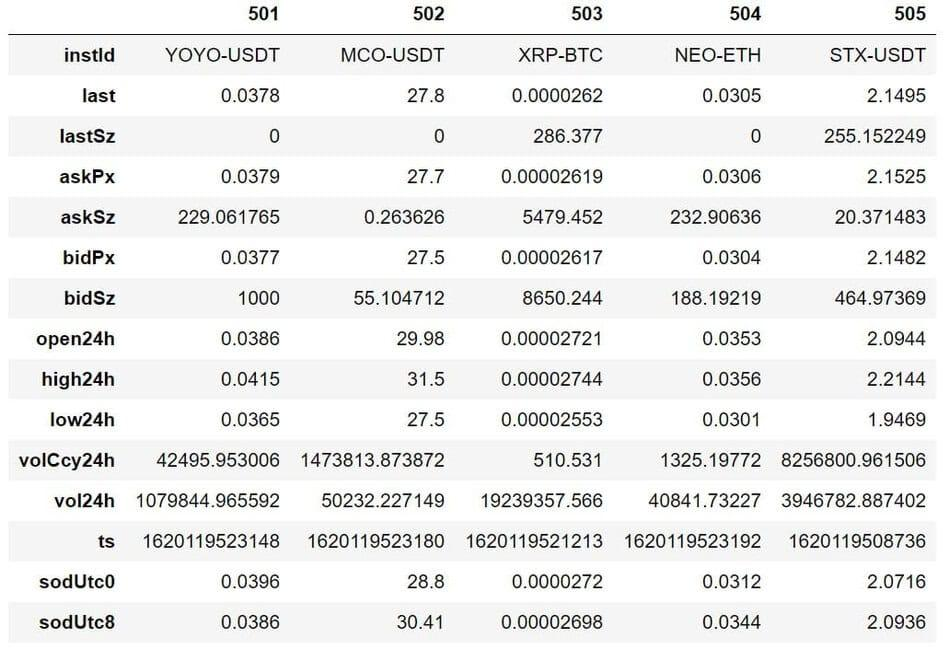

## Table of Contents

## What is the OKX API and what can it be used for?

The OKX API is a tool that lets you connect to the OKX cryptocurrency exchange. It allows you to do things like buy and sell cryptocurrencies, check your account balance, and see how the market is doing, all without using the OKX website or app. It's like a special language that your computer can use to talk to the OKX exchange.

You can use the OKX API for many different things. For example, if you're a trader, you can use it to make trades automatically based on certain rules you set up. This can save you time and help you make better decisions. If you're a developer, you can use the API to build your own apps or websites that work with OKX, like a custom trading platform or a tool to track your investments.

## How do I register for an OKX API key?

To register for an OKX API key, you first need to have an OKX account. If you don't have one, go to the OKX website and sign up. Once you're logged in, go to the "Account" section and find the "API" tab. Click on it to start the process of creating your API key.

After you click on the "API" tab, you'll see a button to create a new API key. Click on that button and follow the instructions. You'll need to give your API key a name and set up some security settings, like a passphrase and an IP address whitelist. Make sure to keep your API key and passphrase safe and don't share them with anyone. Once you've set everything up, your API key will be ready to use.

## What are the different types of API keys available on OKX?

On OKX, there are two main types of API keys: read-only keys and read-write keys. A read-only key lets you see information like your account balance and market data, but you can't use it to make trades or move money. It's like having a library card that lets you read [books](/wiki/algo-trading-books) but not take them home.

A read-write key, on the other hand, gives you full access to your account. With this key, you can not only see your account information but also make trades, deposit, and withdraw money. It's like having a key to your house that lets you go in and out and do whatever you want inside. Because of this, read-write keys are more powerful but also more risky, so you need to be careful with them.

## How do I set up my development environment to use the OKX API?

To set up your development environment for using the OKX API, you first need to choose a programming language that you're comfortable with. OKX supports several languages like Python, JavaScript, and Java. Once you've picked your language, you'll need to install the OKX API library for that language. For example, if you're using Python, you can use pip to install the OKX Python SDK. After installing the library, you'll need to set up your API key and secret key in your code. These keys are what let your program talk to the OKX exchange.

Once your environment is set up, you can start writing code to interact with the OKX API. You'll need to import the OKX library in your code and use the functions provided by the library to make API calls. For example, you might use a function to check your account balance or to place a trade. Make sure to handle errors properly and keep your API keys secure. With everything set up, you can start building your own trading bots, market analysis tools, or any other application that uses the OKX API.

## What are the basic endpoints for trading on the OKX API?

The OKX API has several basic endpoints that you can use for trading. One important endpoint is the "place order" endpoint. This lets you send a request to OKX to buy or sell a [cryptocurrency](/wiki/cryptocurrency). You need to tell OKX what kind of order you want, like a market order or a limit order, and how much you want to buy or sell. Another useful endpoint is the "cancel order" endpoint. This lets you stop an order that you've already placed if you change your mind.

Another key endpoint is the "get order details" endpoint. This lets you check on an order you've placed to see if it's been filled, canceled, or is still open. You can use this to keep track of your trades. The "get account balance" endpoint is also important because it lets you see how much money you have in your OKX account. This is useful for making sure you have enough money to place new orders.

The "get market data" endpoint is another basic one. It lets you see information about the market, like the current price of different cryptocurrencies and how much they're being traded. This can help you make better trading decisions. By using these endpoints together, you can build a trading system that works with the OKX exchange.

## How do I place a market order using the OKX API?

To place a market order using the OKX API, you first need to set up your API key and secret key in your code. These keys let your program talk to the OKX exchange. Once you have your keys set up, you can use the "place order" endpoint. You need to tell OKX that you want to place a market order, which means you want to buy or sell a cryptocurrency at the current market price. You also need to say how much you want to buy or sell and what cryptocurrency you're trading.

After you send your request to the "place order" endpoint, OKX will try to fill your order at the best available price. If everything goes well, you'll get a response from OKX telling you that your order was placed successfully. You can then use the "get order details" endpoint to check on your order and see if it's been filled. If you want to cancel your order, you can use the "cancel order" endpoint. By using these endpoints together, you can manage your market orders on OKX.

## What are the rate limits for the OKX API and how can I manage them?

The OKX API has rate limits to stop people from sending too many requests at once. This helps keep the system running smoothly for everyone. The rate limits depend on what kind of request you're making. For example, you might be allowed to make 20 requests per second for some types of requests, but only 10 requests per second for others. If you go over the limit, OKX will tell you to slow down and wait a bit before you can send more requests.

To manage these rate limits, you can keep track of how many requests you're sending and make sure you don't go over the limit. One way to do this is to add a small delay between your requests. Another way is to use a queue to hold your requests and send them out slowly over time. By being careful with your requests, you can make sure you stay within the rate limits and keep your program running smoothly.

## How can I use the OKX API to retrieve my account balance and transaction history?

To get your account balance using the OKX API, you need to use the "get account balance" endpoint. This endpoint lets you see how much money you have in your OKX account. You just send a request to this endpoint, and OKX will send back information about your balance. It's like checking your wallet to see how much money you have, but you're doing it through your computer. Make sure you have your API key and secret key set up in your code, because these keys let OKX know it's really you asking for your balance.

To look at your transaction history, you use the "get transaction history" endpoint. This endpoint shows you a list of all the times you've bought or sold cryptocurrencies on OKX. It's like looking at your bank statement to see all the money that's come in and gone out of your account. You send a request to this endpoint, and OKX will send back a list of your transactions. Again, you need to use your API key and secret key to make sure OKX knows it's you asking for this information. By using these endpoints, you can keep track of your money and trades on OKX.

## What advanced features does the OKX API offer for algorithmic trading?

The OKX API has some cool features that can help you do [algorithmic trading](/wiki/algorithmic-trading). One big feature is the ability to set up stop-loss and take-profit orders. This means you can tell OKX to automatically sell your cryptocurrency if the price goes down too much (stop-loss) or if it goes up to a certain point (take-profit). This can help you make money and avoid losing too much. Another useful feature is the ability to use different types of orders, like iceberg orders and trailing stop orders. These let you hide part of your order from other traders or automatically adjust your stop-loss as the price moves, which can give you more control over your trades.

Another advanced feature is the ability to use the OKX WebSocket API. This lets your program talk to OKX in real-time, so you can get the latest market data and make trades right away. This is really helpful for algorithmic trading because you can react to changes in the market as soon as they happen. With the WebSocket API, you can build trading bots that work faster and smarter than if you were just using the regular API. By using these advanced features together, you can create powerful trading strategies that help you make better decisions and trade more effectively.

## How do I implement WebSocket connections for real-time data with the OKX API?

To use WebSocket connections with the OKX API for real-time data, you first need to set up a WebSocket client in your code. This client will let your program talk to OKX in real-time. You start by connecting to the OKX WebSocket server using the URL they provide. Once you're connected, you can send a message to OKX telling them what kind of data you want to see, like the latest prices for a certain cryptocurrency. OKX will then send you updates as soon as the data changes, so you can get the most up-to-date information.

After you've set up your WebSocket connection, you need to handle the data that OKX sends you. This means writing code to read the messages you get from OKX and do something with the information. For example, if you're building a trading bot, you might use the real-time price data to decide when to buy or sell a cryptocurrency. Make sure to keep your WebSocket connection open and handle any errors that might come up, so you don't miss any important updates from OKX. By using WebSocket connections, you can get real-time data and make faster, smarter trading decisions.

## What security measures should I take when using the OKX API?

When using the OKX API, it's really important to keep your API key and secret key safe. These keys are like the keys to your house, so you don't want anyone else to get them. Make sure to store them in a secure place, like an encrypted file or a secure environment variable. Don't share your keys with anyone, and be careful when you're putting them in your code. If someone else gets your keys, they could use them to take your money or make trades without your permission.

Another good idea is to use the IP address whitelist feature that OKX offers. This means you can tell OKX to only let requests from certain IP addresses use your API key. This can help stop people from using your key if they steal it, because they won't be able to use it from their own IP address. Also, always use HTTPS when you're talking to the OKX API, because this helps keep your data safe while it's being sent over the internet. By taking these security measures, you can help protect your account and your money when you're using the OKX API.

## How can I troubleshoot common errors when using the OKX API?

When you're using the OKX API, you might run into some common errors. One of these is getting a "401 Unauthorized" error, which means your API key or secret key might be wrong or missing. Make sure you've entered your keys correctly and that they're in the right place in your code. Another error you might see is a "429 Too Many Requests" error, which happens if you're sending too many requests to OKX too quickly. To fix this, you can add a small delay between your requests or use a queue to send them out more slowly.

Another common issue is getting a "500 Internal Server Error" from OKX. This usually means there's a problem on OKX's side, and you might just need to wait a bit and try again. If you're getting errors that say your order can't be placed, like a "400 Bad Request" error, check that all the information you're sending to OKX is correct. Make sure you're using the right order type, the right amount, and the right cryptocurrency. By checking these things and being patient, you can solve most of the common errors you might run into when using the OKX API.

## References & Further Reading

[1]: Bergstra, J., Bardenet, R., Bengio, Y., & Kégl, B. (2011). ["Algorithms for Hyper-Parameter Optimization."](https://papers.nips.cc/paper/4443-algorithms-for-hyper-parameter-optimization) Advances in Neural Information Processing Systems 24.

[2]: ["Advances in Financial Machine Learning"](https://www.amazon.com/Advances-Financial-Machine-Learning-Marcos/dp/1119482089) by Marcos Lopez de Prado

[3]: Aronson, D. R. (2006). ["Evidence-Based Technical Analysis: Applying the Scientific Method and Statistical Inference to Trading Signals"](https://www.amazon.com/Evidence-Based-Technical-Analysis-Scientific-Statistical/dp/0470008741). John Wiley & Sons, Inc.

[4]: Jansen, S. (2020). ["Machine Learning for Algorithmic Trading"](https://github.com/stefan-jansen/machine-learning-for-trading). Packt Publishing.

[5]: Chan, E. P. (2008). ["Quantitative Trading: How to Build Your Own Algorithmic Trading Business"](https://github.com/ftvision/quant_trading_echan_book). John Wiley & Sons.