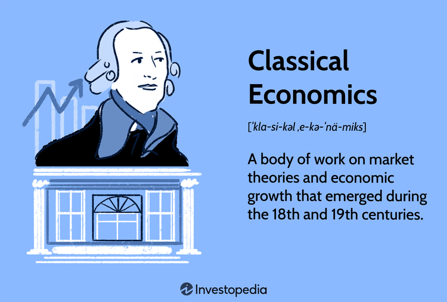

The term 'Old Economy' refers to traditional industries and sectors that were prominent before the advent of digital technology. These industries primarily revolve around the production of tangible goods and the delivery of services that are heavily reliant on manual labor. Key sectors within the old economy include manufacturing, mining, and agriculture, all of which have played foundational roles in shaping modern economic structures. Manufacturing, for instance, has been pivotal in producing goods ranging from consumer products to industrial machinery, while agriculture has been essential in ensuring food security and raw material supply. Mining, on the other hand, has provided crucial resources such as coal and minerals, essential for various industrial applications.

Despite the rapid technological advancements seen in recent decades, old economy sectors continue to hold significant sway within global economies. These industries contribute substantially to Gross Domestic Product (GDP) and employment, underscoring their ongoing importance. Countries rich in natural resources, for instance, still rely heavily on sectors like mining and agriculture for economic stability and growth. Manufacturing remains critical, especially in nations where industrial exports form a significant portion of the economic output.



This article aims to examine the historical significance of the old economy, how it interacts with emerging new-age industries, and how developments like algorithmic trading are beginning to influence traditional market practices. By understanding the dynamics between old and modern economies, we can better appreciate the nuanced economic landscape that defines contemporary global markets. The ability to balance traditional industry practices with innovative digital technologies will be key to sustaining growth and ensuring that these sectors continue to play a critical role in economic development.

## Table of Contents

## Historical Background of the Old Economy

The old economy gained significant momentum during the Industrial Revolution, a transformative period spanning the late 18th to early 19th centuries. This era was characterized by a shift from agrarian societies to industrial powerhouses, fueled by innovations that dramatically altered production methods, transportation, and economic structures.

Key industries such as steel, agriculture, and manufacturing were at the forefront of this economic resurgence. The steel industry, in particular, was pivotal, as the advent of the Bessemer process allowed for the mass production of steel, significantly reducing costs and enabling rapid infrastructure growth, including railroads, which were vital for transporting goods and resources efficiently across vast geographies. This industrial innovation also spurred the construction of buildings, bridges, and machinery, further embedding steel as a cornerstone of economic development during this period.

Agriculture underwent significant transformations during the Industrial Revolution as well, despite remaining a staple of the old economy. The introduction of mechanized equipment, like the reaper and the threshing machine, increased production efficiency, reduced labor costs, and expanded the arable potential of existing farmlands. This mechanization allowed for larger-scale farming operations, raised agricultural output, and contributed to feeding an urbanizing population.

Manufacturing processes also experienced profound changes, transitioning from small-scale artisanal production to larger factory-based systems. The implementation of the assembly line, particularly influenced by figures such as Henry Ford in later years, exemplified the shift towards mass production of goods such as textiles and machinery. These manufacturing innovations not only increased output but also standardized products, ensuring consistency and reliability, which were crucial for expanding domestic and international markets.

Despite these advancements, the processes used in these key industries have remained relatively consistent over centuries, with only incremental technological updates. For example, while steel production today involves more advanced materials and processes, the basic principles established during the Industrial Revolution continue to underpin modern practices. Similarly, agricultural techniques have evolved with the introduction of genetically modified organisms (GMOs) and advanced irrigation systems, yet core methods of planting, cultivation, and harvesting remain rooted in their historical origins. Manufacturing, too, has embraced automation and robotics, but still relies on the assembly-line principles that revolutionized production over a century ago.

In summary, the old economy industries of steel, agriculture, and manufacturing form the backbone of industrial development, with foundations laid during the Industrial Revolution that continue to support economic growth through established yet evolving processes.

## Traditional Industries of the Old Economy

Old economy industries are characterized by their traditional methods of production, focusing heavily on tangible goods and physical labor rather than the exchange of digital information. At the heart of the old economy are sectors such as manufacturing and agriculture, which have been instrumental in forming the foundational structures of modern economies.

Manufacturing is a cornerstone of the old economy, where products are created through the transformation of raw materials into finished goods. This sector has historically relied on easily quantifiable metrics such as operating expenses, raw material costs, and labor inputs. These factors contribute to the overall production cost, directly impacting the pricing strategies and profit margins of manufacturing firms. As an example, manufacturing industries often calculate the cost per unit using the formula:

$$
\text{Cost Per Unit} = \frac{\text{Total Manufacturing Costs}}{\text{Total Units Produced}}
$$

This metric enables manufacturers to determine efficiency, control expenses, and address issues in production processes.

Agriculture, another vital old economy sector, is largely dependent on environmental variables including climate conditions, soil fertility, and seasonal cycles. The scarcity of agricultural products, alongside [volatility](/wiki/volatility-trading-strategies) in supply and demand, has historically driven pricing and influenced market stability. The agriculture sector sustains a substantial portion of the global workforce, playing a key role in food security and economic development.

The old economy continues to employ a large percentage of the workforce despite the accelerated growth of the digital economy. This sector contributes significantly to the Gross Domestic Product (GDP) of many nations, especially those with extensive industrial and agricultural bases. According to the World Bank, the manufacturing sector alone can account for a substantial percentage of GDP in industrial economies.

Traditional industries often face significant headwinds as they navigate the pressures of modern technological advancements and shifts in consumer demands. However, the persistent demand for physical goods and the inherent stability of certain old economy sectors underscore their enduring importance in the global economic landscape.

## Challenges and Limitations

Old economy industries, characterized by their reliance on traditional production methods and physical goods, confront notable challenges that impede innovation. These industries, deeply rooted in established practices, often exhibit resistance to change, which can hinder adaptation to new demands and external pressures.

A significant challenge is climate change, which necessitates considerable shifts in how traditional industries operate. The environmental impact of sectors like manufacturing, agriculture, and mining is under scrutiny due to their substantial carbon footprints and resource consumption. As a result, there is a growing demand for sustainable practices. However, the transition to environmentally friendly processes is often slow due to the cost of implementing new technologies and the potential disruption to established workflows.

Evolving consumer demands also place pressure on these industries to innovate. Consumers are increasingly prioritizing sustainability, ethical production, and digital integration in the products they support. This trend requires old economy industries to rethink their operations and product offerings, aligning them with contemporary expectations. Yet, the shift towards meeting these demands is often hampered by the sectors' attachment to conventional methods. The reluctance to abandon tried-and-tested processes, which have historically ensured profitability and stability, creates a tension between maintaining legacy systems and pursuing innovation.

Moreover, technological advancements necessitate a delicate balance between adopting new tools and preserving long-standing methods. The gradual nature of this transition is due to the significant investment required for technological upgrades and the workforce training needed to implement them effectively. For instance, introducing automation in manufacturing might increase efficiency but also risks redundancy among workers accustomed to manual processes. This scenario underscores the complexity of integrating new technologies without alienating a significant portion of the existing workforce.

In conclusion, while old economy industries recognize the need for innovation, their traditional roots present significant hurdles. Addressing these challenges requires a strategic approach that balances the preservation of historical practices with the incorporation of modern technologies. As these industries navigate this complex landscape, the ability to adapt while honoring tradition will be crucial for their continued relevance and success.

## Algo Trading in the Old Economy

Algorithmic trading, commonly referred to as algo trading, embodies the fusion of advanced technology with traditional market practices. At its core, algo trading involves the use of computer algorithms to automate trade execution, leveraging vast datasets to make precise trading decisions within fractions of a second. This technological integration brings enhanced efficiency and speed to trading processes, which are particularly beneficial in sectors like commodities trading—a hallmark of the old economy.

In traditional markets, trades were often executed manually by brokers making decisions based on limited information flow and market conditions. However, with the advent of algo trading, these actions are now executed with remarkable speed and accuracy, driven by algorithms capable of analyzing a multitude of variables that influence market prices. These algorithms process extensive historical and real-time data to identify trading opportunities, manage risk, and execute trades—all without human intervention. This not only optimizes operational efficiencies but also significantly reduces the likelihood of human error.

Algo trading is usually associated with modern financial markets, but it is increasingly making its presence felt in old economy exchanges. One of the key benefits is the optimization of operations and decision-making processes in sectors like agriculture, manufacturing, and mining. For instance, in commodities trading, where price volatility can impact profitability, algorithms assist traders by executing buy and sell orders based on pre-set criteria or [machine learning](/wiki/machine-learning) models that predict market trends. This allows for better hedging strategies and efficient market participation.

The shift towards algo trading in these sectors is made possible through advancements in data collection and analysis technologies, as well as improved computational power. For example, Python, a popular programming language due to its simplicity and robust data-handling libraries, is commonly used to develop such trading algorithms. A simple Python script to monitor moving averages for a commodity's price might look like this:

```python
import numpy as np

def moving_average(data, window_size):
    return np.convolve(data, np.ones(window_size) / window_size, 'valid')

def generate_signals(prices, short_window, long_window):
    signals = []
    short_ma = moving_average(prices, short_window)
    long_ma = moving_average(prices, long_window)

    for i in range(1, len(short_ma)):
        if short_ma[i] > long_ma[i] and short_ma[i-1] <= long_ma[i-1]:
            signals.append("Buy")
        elif short_ma[i] < long_ma[i] and short_ma[i-1] >= long_ma[i-1]:
            signals.append("Sell")
        else:
            signals.append("Hold")
    return signals

# Example price data and function call
price_data = [100, 102, 105, 108, 107, 105, 110, 112, 115, 113]
signals = generate_signals(price_data, short_window=3, long_window=5)
print(signals)
```

In this script, a simple moving average crossover strategy is used to generate buy, sell, or hold signals based on price data. This is a basic example of an algorithmic approach to trading, showcasing how technological solutions can enhance decision-making in traditional sectors.

By improving efficiency and providing sophisticated analytical tools, algo trading introduces a new dimension of strategic capabilities to the old economy. As these sectors embrace technological advancements, the interplay between traditional practices and innovative techniques will continue to evolve, offering substantial benefits in terms of operational effectiveness and market competitiveness.

## The Intersection of Old and New Economy

The perceived divide between the old and new economies is becoming increasingly blurred as traditional sectors begin to incorporate modern technological advancements. This integration is giving rise to a new economic landscape where time-honored industries are redefining themselves through the adoption of digital technologies.

Traditional industries such as manufacturing, agriculture, and transportation are experiencing this transformation by implementing state-of-the-art technologies such as automation, Internet of Things (IoT), and data analytics. These developments not only improve operational efficiency but also enhance product quality and customer satisfaction. For instance, the use of IoT in agriculture—often referred to as "smart farming"—allows farmers to optimize planting cycles, monitor soil conditions, and manage resources more effectively, ultimately leading to increased yields and sustainable farming practices.

In manufacturing, the advent of Industry 4.0 is a testament to this convergence. By integrating cyber-physical systems, [artificial intelligence](/wiki/ai-artificial-intelligence), and cloud computing, manufacturing processes are becoming more adaptable and efficient. These changes facilitate mass customization, where products are tailored to individual consumer preferences without significant cost increases.

Moreover, the logistics and transportation sectors are leveraging technologies such as autonomous vehicles, blockchain, and advanced routing algorithms to streamline operations, reduce costs, and increase reliability. Autonomous vehicles and drones are revolutionizing the way goods are delivered, providing faster and more cost-effective logistics solutions.

In this evolving landscape, the pressure on old economy players to adopt these innovations is mounting. Failing to do so risks declining market relevance as competitors who leverage digital tools can react more swiftly to market demands and customer needs. This necessity for innovation is often driven by the competitive advantage that digital technologies can provide—they enable real-time decision-making, predictive maintenance, and optimized supply chains.

The growing intersection between the old and new economies also encourages collaboration across sectors. This synergy fosters the development of hybrid business models that leverage the strengths of both worlds—heritage and innovation—to capture new market opportunities. Consequently, the integration of modern technology within traditional industries is not merely an option but a strategic imperative that can determine future business success.

Ultimately, this ongoing convergence underscores the importance of digital transformation as a key driver of economic resilience and growth. As traditional industries continue to embrace modern technologies, they not only ensure their survival but also contribute to a more robust and interconnected global economy.

## Conclusion

Old economy industries continue to hold a pivotal position in global economic infrastructures, despite the formidable rise of the digital economy. These traditional sectors, deeply rooted in tangible goods and established methods, provide a stable foundation upon which modern innovations can build. In the ever-evolving landscape of today's market environments, the necessity to balance tradition with innovation has become increasingly pronounced. As [algorithmic trading](/wiki/algorithmic-trading) (algo trading) gains traction, it exemplifies the integration of advanced technology within these age-old frameworks. With its ability to analyze large volumes of data and execute trades efficiently, algo trading introduces an essential layer of precision and adaptability to sectors that have traditionally operated on slower, manual processes.

Going forward, the symbiotic relationship between old and new economies is set to play a significant role in shaping global economic dynamics. The integration of technology does not signal the obsolescence of traditional sectors; rather, it highlights their evolution. As these industries incorporate digital tools into their operations, they enhance their resilience and competitiveness in an increasingly digitized world. This convergence supports a new economic landscape where the two paradigms coexist and bolster each other.

The future trajectory of the global economy will likely reflect a blend of these forces, where old economy sectors leverage modern technologies to innovate and optimize. This amalgamation ensures that traditional industries remain relevant, dynamic, and essential to the broader economic narrative.

## References & Further Reading

[1]: Crafts, N. F. R. (1985). ["British Economic Growth during the Industrial Revolution."](https://archive.org/details/britisheconomicg0000craf) Oxford University Press.

[2]: Lipsey, R. G., & Carlaw, K. I. (2005). ["Technical Change, Economic Growth and the Environment."](https://fhburgenland.contentdm.oclc.org/digital/api/collection/p15425dc/id/75873/download) Elgar Publishing.

[3]: Rifkin, J. (2011). ["The Third Industrial Revolution: How Lateral Power is Transforming Energy, the Economy, and the World."](https://archive.org/details/thirdindustrialr0000rifk) Palgrave Macmillan.

[4]: Brynjolfsson, E., & McAfee, A. (2014). ["The Second Machine Age: Work, Progress, and Prosperity in a Time of Brilliant Technologies."](https://psycnet.apa.org/record/2014-07087-000) W. W. Norton & Company.

[5]: Graeber, D. (2011). ["Debt: The First 5,000 Years."](https://archive.org/details/DebtTheFirst5000Years) Melville House.

[6]: Schwab, K. (2017). ["The Fourth Industrial Revolution."](https://books.google.com/books/about/The_Fourth_Industrial_Revolution.html?id=ST_FDAAAQBAJ) Currency.

[7]: Perez, C. (2002). ["Technological Revolutions and Financial Capital: The Dynamics of Bubbles and Golden Ages."](https://www.cambridge.org/core/journals/journal-of-economic-history/article/abs/technological-revolutions-and-financial-capital-the-dynamics-of-bubbles-and-golden-ages-by-carlota-perez-cheltenham-uk-and-northampton-ma-edward-elgar-2002-pp-xix-198-6500-cloth-3000-paper/C97EC3EA6C77E62FD8C40B9C7A5CFECF) Elgar Publishing.