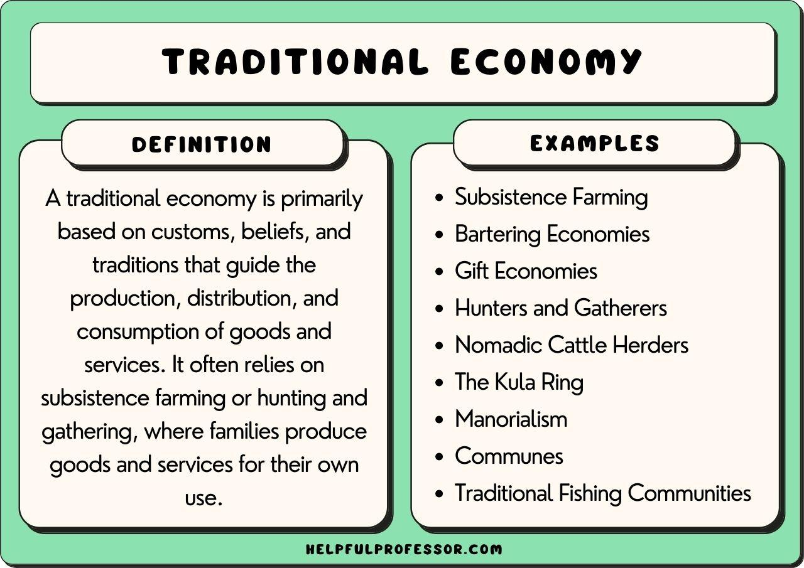

## Table of Contents

## What is the old economy?

The old economy refers to traditional industries and sectors that have been around for a long time. These include things like manufacturing, agriculture, and mining. These sectors were the backbone of many economies in the past and provided a lot of jobs and wealth. They often involve making physical goods or extracting resources from the earth.

In contrast to the new economy, which focuses on technology, services, and information, the old economy is more about tangible products and traditional ways of doing business. While the old economy is still important, it has faced challenges in recent years. Many of these industries have moved to countries where labor is cheaper, and automation has reduced the number of jobs available. Despite these challenges, the old economy remains essential for providing the basic goods and materials that people need every day.

## How does the old economy differ from the new economy?

The old economy and the new economy are different in what they focus on and how they work. The old economy includes industries like farming, making things in factories, and digging for resources like coal or oil. These are traditional jobs that have been around for a long time. They make things you can touch, like food, cars, and clothes. These jobs are important because they give us the things we need to live.

The new economy, on the other hand, is all about technology, services, and information. This includes things like computer software, the internet, and businesses that help people, like restaurants or shops. Instead of making physical things, the new economy often deals with ideas and services. It's newer and growing fast because of technology. While the old economy is still very important, the new economy is changing how we live and work by making things faster and easier.

Both the old and new economies are important. The old economy gives us the basics we need, while the new economy brings innovation and new ways of doing things. They work together to keep our world running, but they face different challenges. The old economy might struggle with fewer jobs because of machines and moving factories to other countries. The new economy can grow quickly but also faces issues like protecting people's information online.

## What are the main sectors typically associated with the old economy?

The old economy is made up of industries that have been around for a long time. These include farming, which grows the food we eat, and manufacturing, where factories make things like cars, clothes, and toys. Another big part is mining, where people dig for coal, oil, and other resources we need. These sectors focus on making physical things that we can touch and use every day.

These industries have been the backbone of many countries' economies for a long time. They provide a lot of jobs and help make the things we need to live. But they also face challenges, like fewer jobs because machines can do the work, and factories moving to other countries where it's cheaper to make things. Even with these problems, the old economy is still very important because it gives us the basics we need to survive.

## Can you provide examples of industries that are part of the old economy?

The old economy includes industries like farming. Farmers grow crops and raise animals to give us food. This has been around for a very long time and is still important today. Another part of the old economy is manufacturing. This is where factories make things like cars, clothes, and toys. These factories have been making these things for many years.

Mining is also a big part of the old economy. Miners dig for coal, oil, and other resources that we use every day. These resources help us make energy and other things we need. These industries are all about making physical things that we can touch and use. They have been the backbone of many countries' economies for a long time.

## What are the key characteristics of old economy businesses?

Old economy businesses are all about making physical things. They include industries like farming, where people grow food, and manufacturing, where factories make cars, clothes, and toys. These businesses have been around for a long time and focus on making things you can touch. They are important because they give us the things we need every day, like food and clothes.

These businesses often face challenges. One big challenge is that machines can do a lot of the work now, so there are fewer jobs for people. Also, some factories move to other countries where it's cheaper to make things. Even with these problems, old economy businesses are still very important. They help keep our world running by providing the basics we need to live.

## How have old economy industries evolved over time?

Old economy industries like farming, manufacturing, and mining have changed a lot over time. In the past, farming was done by hand, but now farmers use big machines to help them grow more food faster. Manufacturing used to be small factories where people made things by hand, but now there are huge factories with machines that make things like cars and clothes quickly. Mining used to be done with simple tools, but now miners use big machines to dig for coal and oil. These changes have made these industries more efficient and able to produce more.

Even though these industries have gotten better at making things, they still face problems. One big problem is that machines can do a lot of the work now, so there are fewer jobs for people. Also, some factories have moved to other countries where it's cheaper to make things. This can make it hard for people in the old economy to find work. But even with these challenges, old economy industries are still very important. They give us the basic things we need every day, like food, clothes, and energy.

## What challenges do old economy sectors face in the modern world?

Old economy sectors like farming, manufacturing, and mining face big challenges today. One main problem is that machines can do a lot of the work now. This means there are fewer jobs for people. When machines take over, workers can lose their jobs and find it hard to make money. Another challenge is that some factories move to other countries where it's cheaper to make things. This can leave workers in their home countries without jobs.

These industries also have to deal with changing rules about the environment. Governments are making new laws to protect the planet, which can make it harder and more expensive for old economy businesses to keep working. For example, mining companies might have to spend more money to make sure they don't harm the environment. Even with these problems, old economy sectors are still very important. They give us the basic things we need every day, like food, clothes, and energy.

## How do old economy companies adapt to technological advancements?

Old economy companies, like those in farming, manufacturing, and mining, have to adapt to new technology to stay in business. They do this by using machines and computers to make their work faster and easier. For example, farmers now use big machines to plant and harvest crops, which helps them grow more food in less time. In factories, robots and computers help make things like cars and clothes more quickly and with fewer mistakes. Miners use big machines to dig for coal and oil, which makes their work safer and more efficient.

Even though using technology can help these companies, it also brings challenges. One big problem is that machines can do the work that people used to do, so there are fewer jobs for workers. This can make it hard for people to find work and make money. Also, old economy companies need to spend money to buy and use new technology, which can be expensive. But if they don't keep up with new technology, they might not be able to compete with other companies that do use it. So, these companies have to find a balance between using technology to improve their work and making sure their workers and communities are taken care of.

## What role does globalization play in the old economy?

Globalization has a big impact on old economy industries like farming, manufacturing, and mining. It means that these industries can now reach people all over the world. For example, a farmer in one country can sell their crops to people in another country. This can help old economy businesses make more money and grow bigger. But it also means they have to compete with other businesses from all around the world. This competition can make it hard for them to stay in business if they can't keep their prices low or make their products better.

One big challenge of globalization for old economy sectors is that factories might move to other countries where it's cheaper to make things. This is called outsourcing. When this happens, workers in the home country can lose their jobs. It can be hard for them to find new work, especially if they don't have skills for jobs in the new economy. But globalization isn't all bad for old economy industries. It can also help them find new markets and customers, which can keep them going strong. So, while globalization brings both good and bad changes, old economy companies need to find ways to adapt and stay competitive.

## How does the old economy contribute to employment and economic stability?

The old economy, which includes industries like farming, manufacturing, and mining, plays a big role in creating jobs. These jobs are important because they give people a way to earn money and support their families. Many people work in these industries, especially in places where there are a lot of farms, factories, or mines. When these businesses do well, they can hire more people, which helps lower unemployment and makes the economy stronger. Even though machines and technology have changed these jobs, they still provide a lot of work for people.

Old economy industries also help keep the economy stable. They make things that people need every day, like food, clothes, and energy. When these industries are strong, they help the whole economy stay healthy. If they have problems, like when factories move to other countries or when prices for their products go down, it can hurt the economy. But when they are doing well, they can help the economy grow and stay stable. So, even though the old economy faces challenges, it is still very important for jobs and economic health.

## What are the future prospects for old economy industries?

The future of old economy industries like farming, manufacturing, and mining looks different but still important. These industries will keep changing because of new technology and rules about the environment. For example, farmers might use even more machines and new ways of growing food to make their work easier and better for the planet. Factories will keep using robots and computers to make things faster and with fewer mistakes. Miners will need to find new ways to dig for resources without harming the environment as much. These changes can help old economy businesses stay strong and keep giving people jobs.

Even with these changes, old economy industries will still face challenges. One big problem is that machines and computers can do a lot of the work that people used to do, so there might be fewer jobs for workers. Also, some factories might keep moving to other countries where it's cheaper to make things, which can make it hard for people in their home countries to find work. But old economy industries are still very important because they give us the things we need every day, like food, clothes, and energy. So, even though they will change, these industries will keep playing a big role in our lives and our economy.

## How can old economy businesses remain competitive in a rapidly changing market?

Old economy businesses can stay competitive by using new technology to make their work better and faster. For example, farmers can use machines to help them grow more food in less time. Factories can use robots to make things like cars and clothes quickly and without mistakes. Miners can use big machines to dig for coal and oil in a safer way. By using technology, these businesses can make more things and save money, which helps them compete with other companies.

Another way old economy businesses can stay competitive is by finding new markets and customers around the world. This is called globalization. If a farmer in one country can sell their crops to people in another country, they can make more money. But they also need to keep their prices low and make their products better to compete with other businesses from all over the world. By finding new ways to reach people and improve their products, old economy businesses can keep going strong even as the world changes.

## What are the traditional industries of the old economy?

Old economy industries are characterized by their traditional methods of production, focusing heavily on tangible goods and physical labor rather than the exchange of digital information. At the heart of the old economy are sectors such as manufacturing and agriculture, which have been instrumental in forming the foundational structures of modern economies.

Manufacturing is a cornerstone of the old economy, where products are created through the transformation of raw materials into finished goods. This sector has historically relied on easily quantifiable metrics such as operating expenses, raw material costs, and labor inputs. These factors contribute to the overall production cost, directly impacting the pricing strategies and profit margins of manufacturing firms. As an example, manufacturing industries often calculate the cost per unit using the formula:

$$
\text{Cost Per Unit} = \frac{\text{Total Manufacturing Costs}}{\text{Total Units Produced}}
$$

This metric enables manufacturers to determine efficiency, control expenses, and address issues in production processes.

Agriculture, another vital old economy sector, is largely dependent on environmental variables including climate conditions, soil fertility, and seasonal cycles. The scarcity of agricultural products, alongside [volatility](/wiki/volatility-trading-strategies) in supply and demand, has historically driven pricing and influenced market stability. The agriculture sector sustains a substantial portion of the global workforce, playing a key role in food security and economic development.

The old economy continues to employ a large percentage of the workforce despite the accelerated growth of the digital economy. This sector contributes significantly to the Gross Domestic Product (GDP) of many nations, especially those with extensive industrial and agricultural bases. According to the World Bank, the manufacturing sector alone can account for a substantial percentage of GDP in industrial economies.

Traditional industries often face significant headwinds as they navigate the pressures of modern technological advancements and shifts in consumer demands. However, the persistent demand for physical goods and the inherent stability of certain old economy sectors underscore their enduring importance in the global economic landscape.

## References & Further Reading

[1]: Crafts, N. F. R. (1985). ["British Economic Growth during the Industrial Revolution."](https://archive.org/details/britisheconomicg0000craf) Oxford University Press.

[2]: Lipsey, R. G., & Carlaw, K. I. (2005). ["Technical Change, Economic Growth and the Environment."](https://fhburgenland.contentdm.oclc.org/digital/api/collection/p15425dc/id/75873/download) Elgar Publishing.

[3]: Rifkin, J. (2011). ["The Third Industrial Revolution: How Lateral Power is Transforming Energy, the Economy, and the World."](https://archive.org/details/thirdindustrialr0000rifk) Palgrave Macmillan.

[4]: Brynjolfsson, E., & McAfee, A. (2014). ["The Second Machine Age: Work, Progress, and Prosperity in a Time of Brilliant Technologies."](https://psycnet.apa.org/record/2014-07087-000) W. W. Norton & Company.

[5]: Graeber, D. (2011). ["Debt: The First 5,000 Years."](https://archive.org/details/DebtTheFirst5000Years) Melville House.

[6]: Schwab, K. (2017). ["The Fourth Industrial Revolution."](https://books.google.com/books/about/The_Fourth_Industrial_Revolution.html?id=ST_FDAAAQBAJ) Currency.

[7]: Perez, C. (2002). ["Technological Revolutions and Financial Capital: The Dynamics of Bubbles and Golden Ages."](https://www.cambridge.org/core/journals/journal-of-economic-history/article/abs/technological-revolutions-and-financial-capital-the-dynamics-of-bubbles-and-golden-ages-by-carlota-perez-cheltenham-uk-and-northampton-ma-edward-elgar-2002-pp-xix-198-6500-cloth-3000-paper/C97EC3EA6C77E62FD8C40B9C7A5CFECF) Elgar Publishing.