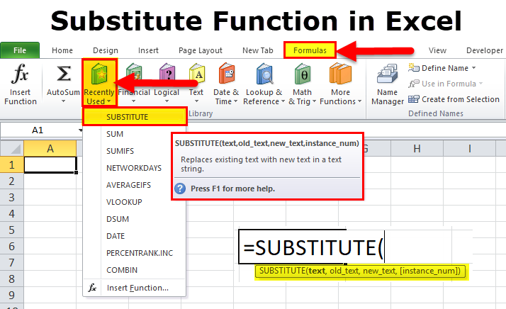

The term "Old Lady" carries a rich historical significance within financial contexts, often evoking imagery of tradition, reliability, and stability. The juxtaposition of this term with the modern world of algorithmic trading presents a fascinating exploration of how traditional financial concepts intersect with cutting-edge technological advancements. Understanding the historical origins of terms like "Old Lady" is crucial in appreciating how past practices continue to influence current trading methodologies.

Algorithmic trading, defined as the use of computer algorithms to automate trading decisions, represents a significant evolution in financial markets. This method leverages sophisticated algorithms, technology, and massive data analysis to execute trades at speeds and volumes far exceeding human capability. The importance of algorithmic trading today cannot be overstated, as it dominates trading floors and contributes to market liquidity and efficiency. Financial institutions widely adopt these practices due to their precision, speed, and the capacity to manage complex trading strategies.

The exploration of "Old Lady" in the context of algorithmic trading uncovers a dialogue between the steadfast principles of traditional finance and the innovative might of modern trading technology. This relationship underscores how historical contexts and modern practices can coalesce to enhance financial markets. Analyzing this intersection helps traders and institutions balance the conservative nature often associated with the "Old Lady" with the dynamic innovations of algorithmic trading.

Key terms relevant to this discussion include "algorithmic trading," "Old Lady," "financial markets," "trading algorithms," and "traditional financial practices." Understanding these terms is essential for grasping the complexities of modern trading environments, where the past informs the future and innovation must be grounded in the tried-and-test principles of reliability and stability.

## Table of Contents

## What is Algorithmic Trading?

Algorithmic trading refers to the use of automated, pre-programmed trading instructions to execute financial trades at high-speed and volume, typically through electronic trading platforms. This approach leverages mathematical models and computer algorithms to determine key aspects of a trade, such as timing, price, and quantity. It is primarily used by institutional investors such as investment banks, hedge funds, and pension funds to manage complex portfolios and execute trades efficiently in the financial markets.

The evolution of algorithmic trading has been transformative for financial markets, fundamentally altering trading practices over the past few decades. Originating in the 1970s with the advent of electronic exchanges, algorithmic trading gained significant traction in the 1990s as technological advances made computing power more accessible and cost-effective. Improvements in telecommunications and data processing capabilities have further accelerated its adoption, allowing for near-instantaneous trade execution and improved market liquidity.

Key components of [algorithmic trading](/wiki/algorithmic-trading) include algorithms, technology, and data analysis. Algorithms, often based on mathematical models, are at the heart of this trading approach. They can be designed to execute trades based on various criteria including market price movements, technical indicators, or news events. Technology, encompassing both hardware and software, plays a crucial role in processing vast amounts of data and executing trades with minimal latency. Data analysis is essential for developing and refining algorithms, enabling traders to identify patterns and make informed decisions.

Algorithmic trading is widely used by financial institutions due to its ability to enhance trading efficiency, reduce transaction costs, and minimize the impact of human emotions on trading decisions. It allows for the execution of complex trading strategies that would be infeasible to perform manually. Additionally, algorithmic trading can improve market conditions by providing [liquidity](/wiki/liquidity-risk-premium) and reducing bid-ask spreads.

Notable examples of algorithmic trading strategies include:

1. **Market Making**: Involves continuous quoting of buy and sell prices to earn the bid-ask spread, thereby providing liquidity to the market.

2. **Statistical Arbitrage**: Exploits temporary price inefficiencies between correlated securities to generate profits, frequently utilizing pairs trading strategies.

3. **Trend Following**: Relies on identifying and following market trends using technical indicators, such as moving averages or momentum factors.

4. **High-Frequency Trading (HFT)**: Executes a large number of orders in fractions of a second, capitalizing on short-term market fluctuations and leveraging speed as a competitive advantage.

Through continued innovation in technology and data analytics, algorithmic trading is expected to maintain its prominent role in shaping the future of financial markets, offering both opportunities and challenges to traders and institutions.

## The Origins of the Term 'Old Lady' in Financial Contexts

The term "Old Lady" in financial contexts is famously associated with the Bank of England, often affectionately referred to as the "Old Lady of Threadneedle Street." This moniker dates back to the late 18th century and is rooted in both historical narrative and public perception that underscores the bank's role in the economic and political landscape of Great Britain.

The epithet "Old Lady" originates from a satirical cartoon published in 1797 by caricaturist James Gillray. The cartoon depicted the Bank of England as a distressed elderly woman, symbolizing conservative financial practices, being courted by then-Primer Minister William Pitt the Younger. This allegory represented the British government's pressure on the bank to issue banknotes as a way to deal with war expenses. Since then, the term "Old Lady" has become a colloquial reference to the Bank of England, emphasizing its historical significance and dependable nature.

The metaphorical use of "Old Lady" in finance generally describes institutions or practices that are seen as traditional or conservative. As a central bank, the Bank of England embodies stability, prudence, and resilience, traits often linked to the enduring image of an elderly woman. This symbolism of reliability and stability is crucial in a financial institution, as it reassures the public and markets about the institution's ability to manage financial matters effectively, even in times of turmoil.

Historically, the Bank of England's steady hand has been pivotal during financial crises. Its policies and actions have contributed to stabilizing markets and reassuring investors, thus reinforcing the "Old Lady" title as a symbol of unwavering dependability. Whether through managing inflation, regulating the banking industry, or acting as a lender of last resort, the bank's role over the centuries affirms the validity of such a representation.

Furthermore, historical narratives surrounding the "Old Lady of Threadneedle Street" often highlight the bank's significant role in fostering economic stability. For instance, during the 19th and 20th centuries, the bank's monetary policies were essential in regulating the British economy, particularly during the Industrial Revolution and post-World War periods. These narratives bolster the image of the bank as both a guardian of monetary policy and an exemplar of conservative prudence.

In sum, the term "Old Lady" as applied in financial contexts serves as a reminder of the Bank of England's long history and its symbolization of continuous diligence and conservative financial governance. It is a testament to how traditions in finance intertwine with modern practices, maintaining an equilibrium between the old and the new.

## The Intersection of 'Old Lady' and Algorithmic Trading

Traditional financial concepts and modern algorithmic trading practices intersect at a crucial point where the stability associated with the "Old Lady" meets the rapid innovation characteristic of contemporary markets. Algorithmic trading, often perceived as a cutting-edge advancement, operates at speeds and efficiencies unimaginable in the era of traditional finance. The "Old Lady," a term historically linked to conservatism and enduring financial foundations, offers a stark contrast to the perceived [volatility](/wiki/volatility-trading-strategies) and complexity of algorithmic trading. This juxtaposition highlights a dynamic tension between time-tested principles and the demands of the modern trading landscape.

The cultural and technological impacts influencing this intersection are multifaceted. Culturally, algorithmic trading disrupts traditional norms by emphasizing data-driven decisions and automated processes over human intuition and manual oversight. This transition echoes a broader trend in society towards prioritizing technology's role in decision-making. Technologically, the rise of sophisticated algorithms relies heavily on advancements in computing power, access to vast amounts of financial data, and the development of [machine learning](/wiki/machine-learning) techniques. These innovations allow for strategies that are not only fast but also adaptive to real-time market conditions.

Traditionalists within the financial sector may view algorithmic trading with skepticism, concerned about the loss of human judgment and the potential for unpredictable market disruptions. They argue for meticulous risk management and the incorporation of rigorous historical analyses to inform algorithmic decisions. On the other hand, modern financial technology adopters embrace the efficiencies that algorithms provide, such as increased trading [volume](/wiki/volume-trading-strategy) capacity and the ability to execute complex strategies that were previously unfeasible. These adopters point to the reduction of human error and the new opportunities for profit that algorithmic trading offers.

Examples of convergence between these two worlds include the development of algorithms designed to emulate historical trading patterns or to mitigate risks aligned with traditional risk management practices. For instance, risk parity strategies, which allocate assets based on the distribution of risk rather than capital, can be implemented algorithmically while still adhering to conservative financial principles. Moreover, algorithmic strategies like mean-reversion incorporate statistical analyses that track historical price behavior, thereby integrating traditional insights into a modern framework.

In conclusion, the intersection of the "Old Lady" and algorithmic trading exemplifies a critical dialogue between the stability of traditional finance and the innovative potential of technology. As financial markets continue to evolve, the lessons of the past remain relevant, providing a foundation upon which new technologies can build resilient and effective trading strategies.

## The Impact of 'Old Lady' Principles on Modern Trading

Conservative financial principles, exemplified by the metaphorical 'Old Lady', hold significant sway in shaping modern trading algorithms. These principles emphasize stability, caution, and risk aversion—qualities that are incredibly relevant in developing algorithmic trading strategies which aim to navigate the volatile nature of financial markets.

Balancing stability and innovation in algorithmic trading is crucial. While cutting-edge technology and complex algorithms drive modern trading systems, grounding these innovations in conservative principles ensures a robust defense against market pitfalls. Historical financial insights stress the importance of sound risk management by recognizing patterns of market behavior and economic cycles. Algorithms enriched with this historical context can effectively anticipate potential risks, offering resilience against unpredictable market shifts.

Traditional financial principles also guide algorithmic strategies. For instance, value investing, which emphasizes thorough analysis of an asset's fundamental worth, can be integrated into an algorithmic framework. An algorithm might apply the formula for calculating a company's intrinsic value, incorporating various financial ratios, historical earnings, and growth expectations, to make purchase decisions akin to a seasoned value investor. This infusion of classic investment strategies into automated processes allows traders to harness the combined power of legacy market wisdom and computational efficiency.

Industry experts advocate for blending traditional and modern methodologies, highlighting the synergy between historical understanding and contemporary technological potential. Paul Wilmott, an authority on quantitative finance, argues that incorporating the timeless principles of financial prudence into advanced trading systems can mitigate extreme positions, promoting sustainability. He asserts that algorithms aligned with 'Old Lady' values are better equipped to manage risk, fostering stable long-term returns rather than merely chasing short-lived gains.

The integration of conservative financial principles within modern algorithmic trading encourages a fusion where both stability and innovation coexist. The legacy of sound fiscal prudence serves as a compass, ensuring that algorithms not only optimize profit margins but also safeguard investors' interests through informed, prudent decision-making.

## Conclusion

This article has explored the intriguing relationship between the historical term "Old Lady" and modern algorithmic trading. The journey through the financial lexicon demonstrates how traditional terminologies continue to hold relevance even amidst rapid technological advancements. The "Old Lady" principle, symbolizing conservatism and reliability, serves as a cornerstone for understanding risk management frameworks vital to algorithmic trading strategies. 

Integrating traditional financial principles with contemporary trading techniques allows for a robust approach to market dynamics, leveraging the best of both historical wisdom and cutting-edge technology. This fusion benefits investors by enhancing risk assessment capabilities and facilitating sound decision-making processes in an automated trading environment. 

Investor literacy can be significantly enhanced by understanding both historical and modern practices. This includes a thorough grasp of terms and concepts that transcend time, ensuring that investors are equipped with a comprehensive toolset for navigating the complexities of today's financial markets. 

Continual learning in financial practices not only fortifies knowledge but also prepares investors and traders to adapt successfully to innovations. As we evolve with technology, embracing historical perspectives ensures a balanced approach, ultimately leading to more informed and stable financial operations.

## References & Further Reading

[1]: ["Advances in Financial Machine Learning"](https://www.amazon.com/Advances-Financial-Machine-Learning-Marcos/dp/1119482089) by Marcos Lopez de Prado

[2]: Bergstra, J., Bardenet, R., Bengio, Y., & Kégl, B. (2011). ["Algorithms for Hyper-Parameter Optimization."](https://dl.acm.org/doi/10.5555/2986459.2986743) Advances in Neural Information Processing Systems 24.

[3]: ["Evidence-Based Technical Analysis: Applying the Scientific Method and Statistical Inference to Trading Signals"](https://www.amazon.com/Evidence-Based-Technical-Analysis-Scientific-Statistical/dp/0470008741) by David Aronson

[4]: ["Machine Learning for Algorithmic Trading"](https://github.com/stefan-jansen/machine-learning-for-trading) by Stefan Jansen

[5]: ["Quantitative Trading: How to Build Your Own Algorithmic Trading Business"](https://www.amazon.com/Quantitative-Trading-Build-Algorithmic-Business/dp/1119800064) by Ernest P. Chan

[6]: Khandani, A. E., & Lo, A. W. (2007). ["What Happened to the Quants in August 2007?" ](https://web.mit.edu/Alo/www/Papers/august07.pdf) Social Science Research Network.

[7]: King, M. (2004). ["The Institutions of Monetary Policy,"](https://www.aeaweb.org/articles?id=10.1257/0002828041301957) National Bureau of Economic Research.

[8]: Aldridge, I. (2013). ["High-Frequency Trading: A Practical Guide to Algorithmic Strategies and Trading Systems"](https://www.wiley.com/en-us/High+Frequency+Trading%3A+A+Practical+Guide+to+Algorithmic+Strategies+and+Trading+Systems-p-9780470579770) by Irene Aldridge

[9]: Bookstaber, R. (2007). ["A Demon of Our Own Design: Markets, Hedge Funds, and the Perils of Financial Innovation"](https://archive.org/details/demonofourowndes0000book) by Richard Bookstaber