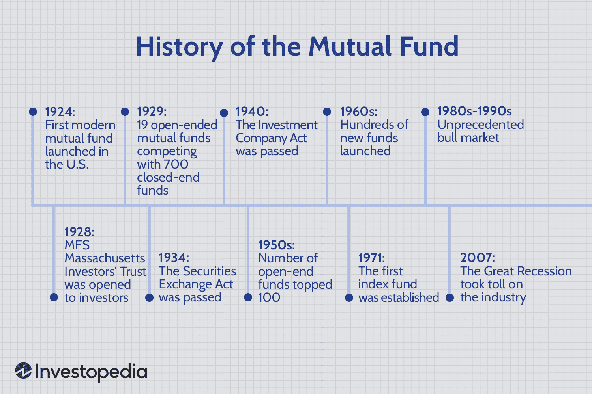

## Table of Contents

## What is a mutual fund?

A mutual fund is a type of investment where many people pool their money together to buy a variety of stocks, bonds, or other assets. It's like a big basket where everyone puts in some money, and a professional manager decides what to buy with it. This makes it easier for people who don't have a lot of money or time to invest in a diverse range of assets.

When you invest in a mutual fund, you buy shares of the fund, and the value of your shares goes up or down based on how well the investments in the fund are doing. Mutual funds can be a good way to spread out risk because they invest in many different things. This means if one investment does poorly, it might be balanced out by others that do well.

## How long have mutual funds been in existence?

Mutual funds have been around for a long time. The first mutual fund in the world started in the Netherlands in 1774. It was called Eendragt Maakt Magt, which means "Unity Creates Strength." This fund was set up to let smaller investors buy into a big group of assets, just like modern mutual funds do.

In the United States, the first mutual fund was created in 1924. It was called the Massachusetts Investors Trust. Since then, mutual funds have become very popular. Today, millions of people use mutual funds to save for things like retirement, buying a house, or their kids' education. They are a big part of how people invest their money.

## What is considered an 'old' mutual fund?

An 'old' mutual fund is usually one that has been around for a long time, often many decades. For example, if a mutual fund started in the early 1900s or even before that, it would be considered old. These funds have seen many different market conditions and have a long history of performance that investors can look at.

Old mutual funds are interesting because they show how investing has changed over time. They might have started with just a few types of investments but have grown to include many different kinds of assets. Investors often look at old mutual funds to see how they've done over the years and to learn from their history.

## What are the benefits of investing in older mutual funds?

One benefit of investing in older mutual funds is that they have a long history you can look at. This history can show you how the fund has done through good times and bad times in the market. By looking at this history, you can get a better idea of how the fund might do in the future. This can help you feel more sure about your investment choice.

Another benefit is that older mutual funds often have a lot of experience managing money. The people who run these funds have been doing it for a long time, so they know a lot about investing. They might be better at [picking](/wiki/asset-class-picking) good investments and making smart choices about where to put the fund's money. This experience can help the fund do well over time.

Also, older mutual funds might have a strong reputation. People trust them because they've been around for a long time and have a good track record. This trust can make the fund more stable, and it might attract more investors. More investors can mean more money in the fund, which can help it grow even more.

## Can you name the oldest mutual fund still in operation?

The oldest mutual fund still in operation is the Foreign & Colonial Investment Trust, which started in 1868. It was set up in the United Kingdom to give people a way to invest in a variety of assets. Back then, it was a new idea to let smaller investors pool their money together to buy into bigger investments.

Today, the Foreign & Colonial Investment Trust is still going strong. It has changed a lot over the years and now invests in many different things all over the world. People like it because it has a long history of doing well and it shows how investing has changed over time.

## How has the performance of the oldest mutual funds changed over time?

The performance of the oldest mutual funds, like the Foreign & Colonial Investment Trust, has changed a lot over the years. When these funds started, they mostly invested in a few types of assets, like stocks and bonds from one country. Over time, they began to invest in many different things all over the world. This helped them grow and do better, especially when one market was not doing well. The long history of these funds shows that they can handle different market conditions and keep growing over time.

These old mutual funds have seen many ups and downs in the market. For example, they went through big events like the Great Depression, World War II, and more recent events like the 2008 financial crisis. Each time, they had to change how they invested to keep doing well. The people who run these funds learned from these events and got better at picking good investments. This experience helped the funds stay strong and keep growing, even when times were tough.

## What are the key characteristics of the oldest mutual funds?

The oldest mutual funds, like the Foreign & Colonial Investment Trust, have been around for a very long time. They started with simple ideas, like letting small investors pool their money to buy into bigger investments. Over the years, these funds have grown a lot. They now invest in many different things all around the world, not just in one country or type of asset. This change helped them do better and grow over time.

These old mutual funds have seen many big events, like wars and financial crises. Each time, they had to change how they invested to keep doing well. The people who run these funds learned a lot from these events. They got better at picking good investments and making smart choices. This experience helped the funds stay strong and keep growing, even when times were tough.

## How do the investment strategies of old mutual funds differ from newer ones?

Old mutual funds often started with simple investment strategies. They focused on a few types of assets, like stocks and bonds from one country. Over time, they learned to invest in many different things all around the world. This helped them grow and do better, especially when one market was not doing well. The people who run these old funds have a lot of experience. They've seen many ups and downs in the market and have learned how to pick good investments and make smart choices. This experience helps the old funds stay strong and keep growing, even when times are tough.

Newer mutual funds, on the other hand, often start with more complex strategies right from the beginning. They might use technology and data to make investment choices. New funds might focus on specific themes, like technology or green energy, which can be very different from the broad, diversified approach of old funds. Because they are newer, they don't have the long history of performance that old funds have. This means they might need to prove themselves more to attract investors. But they can also be more flexible and adapt quickly to new trends and changes in the market.

## What role have the oldest mutual funds played in the development of the financial markets?

The oldest mutual funds have been very important in the development of financial markets. They started a long time ago and showed people that it was possible to pool money together to invest in many different things. This idea helped more people get into investing, even if they didn't have a lot of money. Over time, these old funds grew and changed how they invested. They started to invest in many different countries and types of assets, which helped make financial markets bigger and more diverse. This made it easier for people to spread out their risk and invest in things they might not have been able to before.

These old mutual funds also helped set up rules and standards for how funds should work. They showed other funds how to be open about what they invest in and how they do it. This helped build trust in the financial markets. People could see how these funds did over many years, which made them feel more sure about investing. The experience and history of these old funds also helped make the financial markets more stable. They showed that even through tough times, like wars and financial crises, funds could keep going and help people save for the future.

## How have regulatory changes affected the oldest mutual funds?

Regulatory changes have had a big impact on the oldest mutual funds. Over the years, governments have made new rules to make sure these funds are safe and fair for everyone. These rules have changed how the funds can invest and what they need to tell people about their investments. For example, they might need to show more information about what they are investing in and how much risk there is. This helps people trust the funds more and feel safe about putting their money in them.

The oldest mutual funds have had to change how they work because of these new rules. They might need to be more careful about what they invest in and how they manage the money. This can be good because it makes the funds stronger and more stable. But it can also make it harder for them to take big risks that might make more money. Overall, these changes have helped make the financial markets better and safer for everyone.

## What are some challenges faced by the oldest mutual funds in today's market?

The oldest mutual funds face some big challenges in today's market. One big challenge is competition. There are a lot of new funds out there that use new technology and ideas to attract investors. These new funds can be more flexible and adapt quickly to changes in the market. The old funds have to work hard to show that their long history and experience are still valuable. They need to keep up with new trends and make sure they are still doing well, even with all the new competition around them.

Another challenge is changing what people want. Today, many people are looking for funds that focus on things like green energy or technology. The oldest mutual funds might have started with a broad approach, investing in many different things. Now, they need to show that they can also focus on these new areas that people care about. They have to balance their old ways of doing things with new ideas to keep people interested in investing with them. This can be hard, but it's important for them to stay relevant in today's market.

## What future trends might impact the longevity of these old mutual funds?

One big trend that might impact the longevity of old mutual funds is the rise of technology and data in investing. New funds are using computers and big data to make investment choices. This can make them more flexible and able to change quickly when the market changes. Old mutual funds need to keep up with this trend. They might need to use technology more to stay competitive and show that they can still do well in today's fast-changing market.

Another trend is the growing interest in things like green energy and social responsibility. More and more people want to invest in funds that focus on these areas. Old mutual funds might need to change what they invest in to match what people want. They need to show that they can care about the same things that their investors care about. If they can do this, they can keep attracting new investors and stay strong for a long time.

Overall, old mutual funds have to balance their long history and experience with new trends and ideas. They need to show that they can change and adapt to stay relevant in today's market. If they can do this, they can keep going strong and help people invest for the future.

## What is the importance of the inception date?

Understanding a fund's inception date is essential for evaluating its performance track record and reliability. The inception date represents the point at which a fund begins its operations and starts compiling its performance history. This historical perspective is crucial for investors as it provides insights into how a fund navigates different market environments and economic cycles.

Older funds have the advantage of having demonstrated their resilience and adaptability across varying market conditions. Their longevity offers a wealth of performance data, which can be analyzed to discern patterns in management effectiveness and strategic adjustments over time. For instance, by examining returns during both bullish and bearish markets, investors can assess a fund's capacity to manage risks and capitalize on opportunities. Historical performance can be calculated using metrics like the compound annual growth rate (CAGR), which quantifies the mean annual rate of return of the fund over a specified time period:

$$
\text{CAGR} = \left( \frac{V_f}{V_i} \right)^{\frac{1}{n}} - 1
$$

where $V_f$ is the ending value, $V_i$ is the beginning value, and $n$ is the number of years.

Moreover, the inception date is a marker against which investors can measure the maturity and experience of a fund's management team. Funds that have been operational for several decades underscore the proficiency of their management in formulating strategies that endure market shifts and regulatory changes. This track record often translates into greater investor confidence, as past performance is frequently used as a proxy to predict future behavior, despite the adage that past performance does not guarantee future results.

In contrast, funds with a shorter history may lack the same breadth of performance data, rendering it challenging for investors to perform a comprehensive analysis based solely on historical trends. However, these newer funds might implement innovative strategies that are better aligned with current market conditions, which underscores the importance of balancing historical performance with contemporary adaptiveness. 

Ultimately, while an older fund's inception date offers a significant amount of assurance regarding its durability and performance, it should be just one of many factors investors consider when making investment decisions. Through careful analysis of a fund's history and strategy, investors can make more informed decisions that align with their financial goals and risk tolerance.

## What is the impact of algorithmic trading on mutual funds?

Algorithmic trading has significantly altered the landscape of mutual fund management over the past few decades. By utilizing computer algorithms, mutual funds can execute trades at speeds and volumes previously unimaginable, which can potentially enhance returns through more efficient trading strategies. These algorithms are designed to scan multiple markets and securities, executing trades automatically if predefined market conditions are met. 

The efficiency of [algorithmic trading](/wiki/algorithmic-trading) is achieved through high-frequency trading ([HFT](/wiki/high-frequency-trading-strategies)), where vast volumes of trades are executed in fractions of a second. This approach allows mutual funds to capitalize on minute price discrepancies that might otherwise be unavailable through manual trading practices. The use of quantitative models ensures systematic, data-driven decisions, which reduces the risk of emotional or impulse-based trading.

Algorithms used in mutual fund management typically focus on statistical [arbitrage](/wiki/arbitrage), where perceived inefficiencies in pricing are exploited, or [market making](/wiki/market-making), where the fund provides [liquidity](/wiki/liquidity-risk-premium) to the market by being ready to buy or sell certain securities at publicly quoted prices. Furthermore, [machine learning](/wiki/machine-learning) techniques are increasingly being integrated to improve predictive accuracy and adapt dynamically to changing market conditions.

One commonly used algorithmic strategy is the mean reversion strategy, which is based on the assumption that the price of a security will revert to its historical mean. The algorithm will trigger a buy order when the price is significantly below its average and a sell order when it rises above. Mathematically, a simple example of this can be defined as:

$$
\text{Buy Signal: } P_t < \mu - n\sigma
$$
$$
\text{Sell Signal: } P_t > \mu + n\sigma
$$

Where $P_t$ is the current price, $\mu$ is the mean price, $\sigma$ is the standard deviation of past prices, and $n$ is a threshold multiplier.

Despite these advantages, algorithmic trading presents new risks that must be prudently managed. One of the main risks is market [volatility](/wiki/volatility-trading-strategies), which can be exacerbated by the high-speed and high-frequency nature of these transactions. Algorithms can sometimes act on incomplete information or unexpected market events, leading to 'flash crashes'. Furthermore, the reliance on technology makes systems susceptible to technical failures and hacking, necessitating robust risk management protocols and safeguards.

In conclusion, while algorithmic trading offers impressive benefits of efficiency and potential return enhancements for mutual funds, it requires careful oversight. Investors need to be aware of the associated risks and ensure that mutual funds employing algorithmic trading techniques have adequate measures in place to mitigate these challenges.

## References & Further Reading

[1]: Rouwenhorst, K. G. (2004). ["The Origins of Mutual Funds."](https://www.semanticscholar.org/paper/The-Origins-of-Mutual-Funds-Rouwenhorst/147d494f41da0f68576a1f7195f303c01c2b31f8) Yale ICF Working Paper No. 04-48.

[2]: Pozen, R. C., & Hamacher, T. (2015). ["The Fund Industry: How Your Money is Managed"](https://www.amazon.com/Fund-Industry-Money-Managed-Finance/dp/1118929942) (2nd Edition). John Wiley & Sons.

[3]: John C. Bogle. (2015). ["Bogle on Mutual Funds: New Perspectives for the Intelligent Investor"](https://www.amazon.com/Bogle-Mutual-Funds-Perspectives-Intelligent/dp/111908833X). John Wiley & Sons.

[4]: Malkiel, B. G. (1999). ["A Random Walk Down Wall Street: The Time-Tested Strategy for Successful Investing"](https://yourknowledgedigest.org/wp-content/uploads/2020/04/a-random-walk-down-wall-street.pdf). W. W. Norton & Company.

[5]: Lyons, M. (2010). ["Algorithmic Trading and DMA: An Introduction to Direct Access Trading Strategies"](https://archive.org/details/algorithmictradi0000john). 4Myeloma Press.