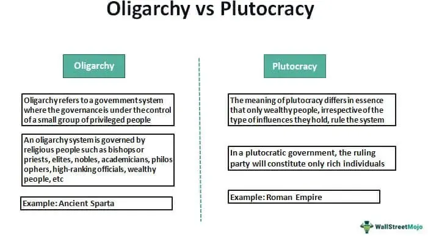

The term 'oligarchy' has traditionally been used to describe power structures where a limited number of individuals exert significant control over decision-making and governance. Historically, these individuals have wielded power through means such as wealth, nobility, or religion. In the modern context, oligarchies have evolved, with technology playing a pivotal role in reshaping their influence, particularly in political and economic spheres.

In today's society, the fusion of technology with financial systems has introduced novel dynamics to oligarchic structures. For instance, algorithmic trading has revolutionized financial markets by enabling rapid execution of trades through sophisticated algorithms. These advancements open new avenues for oligarchs to not only maintain but amplify their influence, transitioning beyond traditional industries into these futuristic mechanisms.

The convergence of oligarchic influence with political power and algorithmic trading raises critical questions. How does such influence impact democratic governance? What are the consequences for market fairness and integrity? These issues are pertinent as algorithmic decision-making becomes increasingly prevalent in financial markets and policy-making, posing challenges to political stability and equitable economic practices.

Understanding the influence of oligarchs is essential in a global context where their power reshapes national and international markets. This discussion will shed light on oligarchs' impact in powerful nations and explore how they mold both markets and policy decisions, offering insights crucial for those aiming to balance innovation, competition, and democracy in our evolving world.

## Table of Contents

## Understanding Oligarchy and Its Modern Manifestations

Oligarchies have existed throughout various periods of history, characterized by power concentrated within a small group distinguished by wealth, noble lineage, or religious authority. In ancient Greece, where the term originated, oligarchies often comprised elites who maintained control over city-states through hereditary privilege or military dominance. Throughout medieval Europe, oligarchic systems frequently emerged among aristocratic families who wielded significant land ownership and political influence.

In contemporary society, oligarchs predominantly manifest as wealthy individuals exerting substantial control over political and economic spheres. This form of oligarchy is evident in countries like Russia and the United States, where financial clout facilitates significant sway in political arenas. In Russia, the transition from a communist state to a market economy in the 1990s saw the emergence of a class of oligarchs who amassed vast wealth through the privatization of state assets. These individuals retain considerable influence over political decisions and government policies [1].

The United States also illustrates the modern incarnation of oligarchic influence, where economic power often translates into political advantage. Wealthy donors and corporations contribute substantial sums to political campaigns through mechanisms such as Super PACs (political action committees), shaping policy directions and electoral outcomes. The Supreme Court’s decision in Citizens United v. Federal Election Commission (2010) significantly impacted this dynamic by deregulating political contributions. This ruling allowed for unlimited corporate and individual spending in political campaigns, further intensifying the potential for oligarchic control [2].

Modern oligarchs utilize their resources to influence policy and governance through strategic campaign financing and lobbying, thereby impacting democratic processes and regulatory frameworks. They can shape legislative agendas in sectors ranging from finance to technology and health care, often aligning policy outcomes with their vested interests. This confluence of wealth and political influence poses challenges to democratic integrity by potentially skewing policy-making in favor of a select few, undermining equitable representation [3].

In summary, understanding the historical roots and contemporary manifestations of oligarchy reveals ongoing patterns of concentrated power wielded by a privileged minority. The intersection of wealth and political influence remains a critical area of analysis for evaluating the health of democratic institutions and the integrity of market systems in modern societies.

[1] Radygin, A., Simachev, Y., & Entov, R. (2015). The Russian model of privatization: A history and its transmutation. Problems of Economic Transition, 57(9), 3-48.

[2] Citizens United v. Federal Election Commission, 558 U.S. 310 (2010).

[3] Gilens, M., & Page, B. I. (2014). Testing theories of American politics: Elites, interest groups, and average citizens. Perspectives on Politics, 12(3), 564-581.

## Algorithmic Trading: A New Tool for Oligarchs

Algorithmic trading refers to the utilization of sophisticated algorithms to automate trades and optimize trading strategies within financial markets. This approach is characterized by the swift execution of large volumes of trades, reducing latency and potentially improving market efficiency. By employing pre-programmed instructions, [algorithmic trading](/wiki/algorithmic-trading) can rapidly analyze market data and execute orders, which some argue can enhance [liquidity](/wiki/liquidity-risk-premium) and price discovery.

Despite its efficiencies, algorithmic trading also raises significant concerns around market manipulation and [volatility](/wiki/volatility-trading-strategies). The capability to execute a [high frequency](/wiki/high-frequency-trading) of trades in milliseconds gives traders with advanced technological resources a distinct advantage. This speed not only impacts the predictability of market movements but also raises the risk of events such as flash crashes, where sudden price drops occur within very short time spans.

Oligarchs, particularly those with stakes in the finance and technology industries, exploit algorithmic trading to consolidate their financial influence. By leveraging access to cutting-edge technology and substantial capital, these individuals can potentially sway market dynamics to their favor. For instance, high-frequency trading, a subset of algorithmic trading, allows such traders to capitalize on minor price imbalances in the market, often unnoticed by slower retail investors.

The intersection of oligarchy and algorithmic trading magnifies the potential for significant impacts on market stability and integrity. The substantial resources commanded by oligarchs enable them to develop proprietary algorithms, providing them with a competitive edge over smaller market participants. This asymmetry can exacerbate inequality, as those with the greatest resources further entrench their market positions.

Understanding the influence of oligarchic power through algorithmic trading is crucial for risk management within financial systems. Regulatory bodies must balance fostering innovation with the necessity of ensuring fair market practices. Addressing disparities in algorithmic trading infrastructures and decreasing the potential for abuse is vital for maintaining market integrity. As these technologies continue to evolve, ongoing scrutiny and regulation are paramount to prevent the entrenchment of oligarchic power in financial markets.

## Political Influence of Oligarchs Through Technology

Oligarchs have adeptly embraced technological advancements, leveraging tools such as social media and data analytics to influence public opinion and political outcomes. These technologies facilitate precision in political advertising and strategic influence, raising substantial ethical concerns about transparency and fairness in electoral processes. 

For instance, social media platforms enable the micro-targeting of advertisements based on users' data, allowing oligarchs to sway specific demographics effectively. This precision can shift perceptions and voting behaviors, raising questions about the manipulation of information and the potential distortion of democratic processes. Studies have highlighted how targeted campaigns can significantly impact political landscapes, particularly when financial resources are heavily concentrated among a few powerful individuals or entities [1].

High-profile instances in the United States illustrate the strategic use of technology by oligarchs to back specific political candidates and policies. The capacity to fund extensive data-driven campaigns gives these individuals a disproportionate influence on political agendas, aligning public policy more closely with their interests. This scenario often leads to an imbalance in democratic representation, as elected officials may prioritize the concerns of a wealthy minority over the broader electorate.

Moreover, the symbiosis of technology and oligarchic power has profound implications for democratic integrity. The prioritization of a narrow set of interests can undermine public trust in political institutions and processes. As technological platforms become pivotal arenas for political discourse, the potential for a few powerful players to dominate the narrative grows, highlighting the need for robust checks and balances.

To mitigate these issues, there have been calls for regulatory reforms aimed at balancing technological innovation with democratic safeguards. Proposed measures include enhancing transparency in political advertising, imposing stricter data privacy regulations, and ensuring equal access to technological tools across political candidates. Such reforms aim to curb excessive influence and preserve the democratic principle of fair representation.

In summary, while technology offers powerful means for political engagement, its monopolized use by oligarchs poses significant challenges to democratic processes. Addressing these challenges requires ongoing dialogue and policy innovation to ensure that technology serves as a tool for comprehensive and equitable democratic participation.

[1] Howard, P. N. (2006). New Media Campaigns and the Managed Citizen. Cambridge University Press.

## Global Implications and Future Outlook

The influence of oligarchs extends beyond national borders, having substantial impacts on global economic policies and diplomatic relations. As influential figures with vast resources, oligarchs possess the capacity to navigate the intricacies of a globalized economy, implementing strategies that can lead to significant geopolitical shifts. These shifts often reflect the power dynamics of countries where oligarchic influence is most pronounced, such as Russia and the United States, affecting international trade agreements, resource allocations, and foreign policies.

A noteworthy development in the context of global governance is the emergence of 'techno-oligarchs.' These individuals blend technological expertise with entrepreneurial acumen, creating powerful entities that shape policies both in business and technology domains. Techno-oligarchs like those found in Silicon Valley possess not only economic capital but also technological platforms that can influence public opinion and political decisions on a massive scale. Their role in regulatory debates about digital privacy, data management, and [artificial intelligence](/wiki/ai-artificial-intelligence) highlights their significant impact on shaping modern governance.

Given the pervasive influence of oligarchs, there is an urgent need for innovative regulatory models tailored to addressing their power while fostering technological progress and open markets. This involves striking a delicate balance between encouraging innovation and ensuring that such innovation does not disproportionately amplify the already considerable influence of oligarchs. Regulatory frameworks must prioritize transparency and accountability, incorporating mechanisms for public oversight and participation in decision-making processes.

In summary, comprehending the intertwined roles of oligarchy, political influence, and algorithmic trading is vital for crafting a balanced global future. This understanding will facilitate the development of policies that mitigate excessive concentrations of power and reinforce democratic principles. By fostering environments where diverse voices can thrive, policymakers can work towards an equilibrium that promotes technological advancement, fair competition, and equitable economic growth.

## Conclusion

Oligarchs wield significant influence in both political arenas and financial markets, primarily through their engagement with algorithmic trading. This control poses intricate challenges to the foundation of democratic institutions and the principles of market fairness. Addressing these challenges necessitates the development of comprehensive policy frameworks. Such policies must emphasize transparency and accountability while ensuring market practices remain equitable. Only through detailed regulations can the undue influence of oligarchs be mitigated, promoting a healthy democratic process and a fair economic system.

Public awareness and open dialogue play critical roles in preventing oligarchic dominance. Diverse perspectives must be woven into policymaking processes, ensuring that decisions are not disproportionately swayed by oligarchic interests. Engaging a broad range of stakeholders enriches the regulatory environment, encouraging solutions that reflect societal values and priorities.

Ultimately, the goal is to diminish excessive concentrated power, finding a sustainable equilibrium between innovation, competition, and the preservation of democratic values. Balancing these elements is crucial to fostering an environment where technological and market advancements benefit a broader spectrum of society, preventing the erosion of democratic systems under oligarchic pressures.

## References & Further Reading

[1]: Radygin, A., Simachev, Y., & Entov, R. (2015). ["The Russian model of privatization: A history and its transmutation."](https://www.semanticscholar.org/paper/The-Fundamental-Privatization-Theorem%3A-Ideology%2C-Radygin-Entov/215bed493e176a78f09c44f54b0cc706a5bf70a7) Problems of Economic Transition, 57(9), 3-48.

[2]: Citizens United v. Federal Election Commission, 558 U.S. 310 (2010). [Supreme Court of the United States Document](https://supreme.justia.com/cases/federal/us/558/310/).

[3]: Gilens, M., & Page, B. I. (2014). ["Testing theories of American politics: Elites, interest groups, and average citizens."](https://www.cambridge.org/core/journals/perspectives-on-politics/article/testing-theories-of-american-politics-elites-interest-groups-and-average-citizens/62327F513959D0A304D4893B382B992B) Perspectives on Politics, 12(3), 564-581.

[4]: Howard, P. N. (2006). ["New Media Campaigns and the Managed Citizen."](https://www.cambridge.org/core/books/new-media-campaigns-and-the-managed-citizen/6D88539C6FD25C7026A721DF9C9AC09D) Cambridge University Press.

[5]: Lopez de Prado, M. (2018). ["Advances in Financial Machine Learning."](https://www.amazon.com/Advances-Financial-Machine-Learning-Marcos/dp/1119482089) Wiley.

[6]: Chan, E. P. (2009). ["Quantitative Trading: How to Build Your Own Algorithmic Trading Business."](https://github.com/ftvision/quant_trading_echan_book) Wiley.

[7]: Jansen, S. (2020). ["Machine Learning for Algorithmic Trading."](https://github.com/stefan-jansen/machine-learning-for-trading) Packt Publishing.

[8]: Aronson, D. R. (2007). ["Evidence-Based Technical Analysis: Applying the Scientific Method and Statistical Inference to Trading Signals."](https://www.amazon.com/Evidence-Based-Technical-Analysis-Scientific-Statistical/dp/0470008741) Wiley.