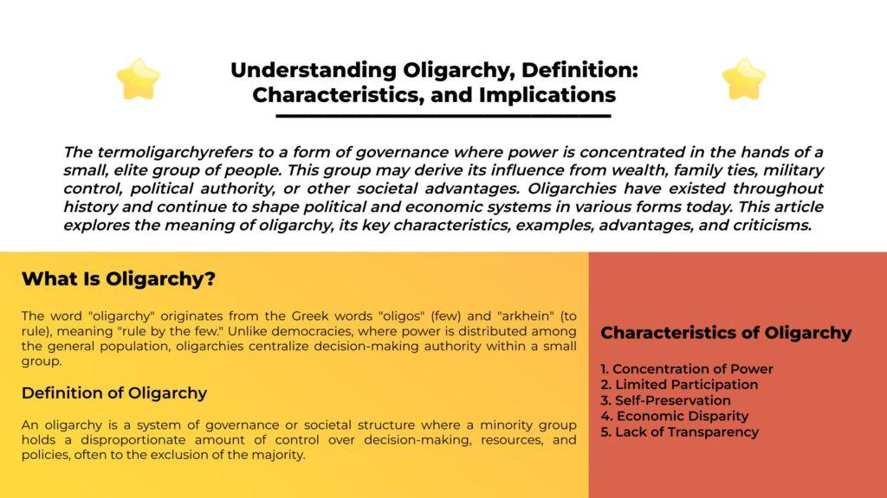

## Table of Contents

## What is the basic definition of an oligarch?

An oligarch is a person who has a lot of power and influence in a country, usually because they are very rich. They often have control over important parts of the economy, like businesses or industries. In some countries, oligarchs can influence politics and government decisions because of their wealth and power.

Oligarchs are most commonly found in countries where the government is not very strong or where there is a lot of corruption. They can use their money to buy influence and make sure that laws and policies benefit them. This can lead to a situation where a small group of rich people have more power than the rest of the population.

## How does the term 'oligarch' differ from similar terms like 'tycoon' or 'magnate'?

The term 'oligarch' is different from 'tycoon' and 'magnate' because it often has a political meaning. An oligarch is not just a rich person, but someone who uses their wealth to influence politics and government. They might control important parts of the economy and use this power to affect laws and policies. This term is often used in countries where a small group of rich people have a lot of power over the government.

On the other hand, 'tycoon' and 'magnate' focus more on business success. A tycoon is a very successful business leader who has built a large company or industry. They are known for their business skills and achievements. A magnate is similar, often used to describe someone who is very rich and powerful in a specific industry, like a steel magnate or a media magnate. These terms do not usually suggest political influence, just business success.

So, while all three terms describe very rich and powerful people, 'oligarch' adds the idea of political power and influence, which is not part of the meaning of 'tycoon' or 'magnate.'

## What are the common characteristics of oligarchs?

Oligarchs are usually very rich people who have a lot of power in their country. They often control important parts of the economy, like big businesses or industries. This wealth gives them the ability to influence what happens in their country. They might use their money to help politicians or to make laws that help them stay rich and powerful.

Oligarchs are often found in countries where the government is weak or where there is a lot of corruption. In these places, they can use their money to buy influence and make sure that the government does what they want. This can lead to a situation where a small group of rich people have more power than everyone else. This can make it hard for regular people to have a say in how their country is run.

In some cases, oligarchs might also have a lot of control over the media or other ways people get information. This can help them shape what people think and believe, making it easier for them to keep their power. Overall, oligarchs are known for using their wealth to gain and keep political and economic power.

## In which countries are oligarchs most prevalent and why?

Oligarchs are most common in Russia and Ukraine. In Russia, after the fall of the Soviet Union in the 1990s, a few people got very rich by buying up businesses and industries that used to belong to the government. These people, called oligarchs, used their money to influence politics and make sure the government did what they wanted. They often had close ties to the president and other powerful people, which helped them stay rich and powerful.

In Ukraine, oligarchs also became powerful after the Soviet Union ended. They took control of important parts of the economy like steel, coal, and media. Like in Russia, these oligarchs used their wealth to influence politics and government decisions. They often supported different political parties and used their control over the media to shape public opinion. This made it hard for regular people to have a say in how their country was run.

Oligarchs are also found in other countries where the government is weak or there is a lot of corruption. In these places, rich people can use their money to buy influence and power. This can lead to a situation where a small group of rich people have more control over the country than the rest of the population.

## What historical events have contributed to the rise of oligarchs?

The fall of the Soviet Union in the early 1990s played a big role in the rise of oligarchs in Russia and Ukraine. After the Soviet Union ended, many businesses and industries that used to belong to the government were sold off. A few smart and sometimes ruthless people bought these businesses at low prices and became very rich. These people, known as oligarchs, used their new wealth to influence politics and make sure the government helped them stay powerful.

In Russia, during the 1990s, a process called "loans-for-shares" helped create oligarchs. The government was short of money and needed loans. In return for these loans, the government let rich people take control of big companies. When the government couldn't pay back the loans, these rich people kept the companies. This made them even richer and more powerful. They used their money to help politicians and get favors, which helped them keep their power.

In Ukraine, the end of the Soviet Union also led to the rise of oligarchs. People who were in the right place at the right time bought up businesses and industries that were being sold off. They used their wealth to influence politicians and control the media. This made it hard for regular people to have a say in how the country was run. Over time, these oligarchs became very powerful and shaped a lot of what happened in Ukraine.

## How do oligarchs typically acquire their wealth and power?

Oligarchs usually get their wealth and power by taking advantage of big changes in their country, like when the Soviet Union ended. In Russia and Ukraine, after the Soviet Union fell apart, the government sold off a lot of businesses and industries that used to belong to them. Some smart people bought these businesses at low prices and became very rich. They often used their money to help politicians or to make laws that helped them stay rich and powerful. This was especially true in Russia with the "loans-for-shares" program, where rich people gave the government loans and got big companies in return. When the government couldn't pay back the loans, these people kept the companies and became even richer.

Once they have their wealth, oligarchs use it to gain more power. They might support politicians who will help them, or they might control parts of the economy like steel, coal, or media. By controlling the media, they can influence what people think and believe, which makes it easier for them to keep their power. In countries where the government is weak or there is a lot of corruption, oligarchs can use their money to buy influence and make sure the government does what they want. This can lead to a situation where a small group of rich people have more power than everyone else, making it hard for regular people to have a say in how their country is run.

## What are the mechanisms through which oligarchs influence politics and society?

Oligarchs influence politics and society mainly by using their money and control over businesses. They often give money to politicians or political parties that will help them. This can mean supporting candidates who will make laws that help the oligarchs stay rich and powerful. They might also use their control over big companies to influence what happens in the government. For example, if an oligarch owns a big factory, they might threaten to close it if the government doesn't do what they want. This can make politicians do what the oligarchs want, even if it's not good for everyone else.

Oligarchs also have a lot of power over the media. They might own newspapers, TV stations, or websites. By controlling the media, they can decide what news people see and what they don't see. This can help them shape what people think and believe. If the media always talks about how great the oligarchs are, people might start to believe it. This makes it easier for oligarchs to keep their power because people might not know about the bad things they do. In countries where the government is weak or there is a lot of corruption, oligarchs can use these methods to have a big influence on politics and society.

## Can oligarchs exist in democratic systems, and if so, how?

Yes, oligarchs can exist in democratic systems, but it's harder for them to have as much power as in countries with weak governments or a lot of corruption. In a democracy, people vote for their leaders, and there are usually laws to stop one person from having too much power. But oligarchs can still try to influence politics by giving money to political campaigns or by using their control over businesses to affect what politicians do. They might also own media companies and use them to shape what people think and believe.

In some democratic countries, oligarchs might not be as obvious as in places like Russia or Ukraine. They might work behind the scenes, using their money to support politicians who will help them. This can lead to a situation where a small group of rich people have more influence over the government than regular people. Even though it's harder for oligarchs to control everything in a democracy, they can still have a big impact on politics and society if they use their wealth and power wisely.

## What are the economic impacts of oligarchs on a country's development?

Oligarchs can have a big impact on a country's economy. When a few rich people control a lot of the businesses and industries, it can make it hard for new companies to start up. This is because oligarchs might use their power to keep out competition. They might also use their money to get special deals from the government, like lower taxes or special loans. This can make it harder for the economy to grow because it's not fair to everyone. If the government is more focused on helping the oligarchs, they might not spend enough money on things like schools, roads, and hospitals, which are important for the whole country.

On the other hand, oligarchs can sometimes help the economy grow. They might invest a lot of money in businesses and industries, which can create jobs and make the economy stronger. If they use their money to build new factories or start new companies, it can help the country develop. But this often depends on whether the oligarchs are using their power to help the whole country or just themselves. If they are only looking out for their own interests, it can lead to problems like inequality and corruption, which can slow down the country's development in the long run.

## How do international sanctions affect oligarchs and their operations?

International sanctions can make life hard for oligarchs. When countries put sanctions on oligarchs, it means they can't do business with those countries anymore. This can stop them from using their money in banks or buying things they need for their businesses. It can also make it hard for them to travel or move their money around the world. This can hurt their businesses and make them less powerful.

But oligarchs are often smart and can find ways to get around sanctions. They might move their money to countries that don't have sanctions or use other people to do business for them. This can make the sanctions less effective. Still, sanctions can make it harder for oligarchs to keep their power and influence, especially if a lot of countries work together to stop them.

## What are the ethical considerations surrounding the role of oligarchs in society?

Oligarchs can cause a lot of problems in society because they have so much power and money. It's not fair when a few rich people can control what happens in a country. They might use their money to help politicians who will make laws that help them stay rich, instead of helping everyone. This can make it hard for regular people to have a say in how their country is run. It can also lead to a lot of inequality, where the rich get richer and the poor get poorer. This is not good for society because it can make people feel like they don't matter.

On the other hand, some people think that oligarchs can help the economy grow. They might invest a lot of money in businesses and industries, which can create jobs and make the country stronger. But this only works if they use their power to help everyone, not just themselves. It's important for oligarchs to think about the ethical side of what they do. They should try to make the world a better place, not just focus on getting more money and power. If they don't, it can lead to a lot of problems and make people unhappy.

## What measures can be taken to regulate or mitigate the influence of oligarchs?

One way to regulate the influence of oligarchs is by making strong laws that stop them from using their money to control politics. Governments can set rules about how much money people can give to political campaigns. This can help make sure that politicians listen to everyone, not just the rich. Another way is by having good checks and balances in the government. This means having different parts of the government that watch each other and make sure no one person gets too much power. If the government is strong and fair, it can be harder for oligarchs to do what they want.

Another important measure is to make sure the economy is fair for everyone. Governments can help by supporting small businesses and making it easier for new companies to start up. This can stop oligarchs from controlling everything. It's also important to fight corruption. If the government is honest and works for everyone, it can be harder for oligarchs to buy influence. By making sure everyone has a fair chance, countries can reduce the power of oligarchs and help their societies grow in a healthy way.

## References & Further Reading

[1]: Radygin, A., Simachev, Y., & Entov, R. (2015). ["The Russian model of privatization: A history and its transmutation."](https://www.semanticscholar.org/paper/The-Fundamental-Privatization-Theorem%3A-Ideology%2C-Radygin-Entov/215bed493e176a78f09c44f54b0cc706a5bf70a7) Problems of Economic Transition, 57(9), 3-48.

[2]: Citizens United v. Federal Election Commission, 558 U.S. 310 (2010). [Supreme Court of the United States Document](https://supreme.justia.com/cases/federal/us/558/310/).

[3]: Gilens, M., & Page, B. I. (2014). ["Testing theories of American politics: Elites, interest groups, and average citizens."](https://www.cambridge.org/core/journals/perspectives-on-politics/article/testing-theories-of-american-politics-elites-interest-groups-and-average-citizens/62327F513959D0A304D4893B382B992B) Perspectives on Politics, 12(3), 564-581.

[4]: Howard, P. N. (2006). ["New Media Campaigns and the Managed Citizen."](https://www.cambridge.org/core/books/new-media-campaigns-and-the-managed-citizen/6D88539C6FD25C7026A721DF9C9AC09D) Cambridge University Press.

[5]: Lopez de Prado, M. (2018). ["Advances in Financial Machine Learning."](https://www.amazon.com/Advances-Financial-Machine-Learning-Marcos/dp/1119482089) Wiley.

[6]: Chan, E. P. (2009). ["Quantitative Trading: How to Build Your Own Algorithmic Trading Business."](https://github.com/ftvision/quant_trading_echan_book) Wiley.

[7]: Jansen, S. (2020). ["Machine Learning for Algorithmic Trading."](https://github.com/stefan-jansen/machine-learning-for-trading) Packt Publishing.

[8]: Aronson, D. R. (2007). ["Evidence-Based Technical Analysis: Applying the Scientific Method and Statistical Inference to Trading Signals."](https://www.amazon.com/Evidence-Based-Technical-Analysis-Scientific-Statistical/dp/0470008741) Wiley.