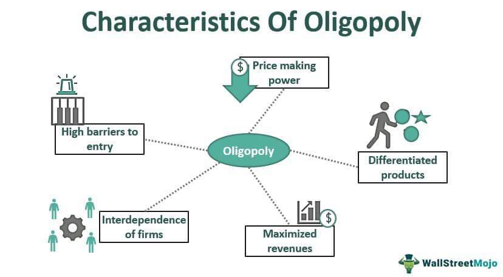

Understanding different market structures is crucial for businesses and investors navigating today's dynamic economic landscape. Among these structures, the oligopoly stands out due to its distinct characteristics, primarily a market dominated by a small number of firms. This structure allows significant influence over market dynamics, notably in pricing, competition, and innovation. Oligopolistic markets can lead to a concentration of market power, often resulting in price-setting capabilities that differ markedly from those in more competitive environments.

In these markets, strategic interactions among firms become essential, as each firm's actions directly affect the others. This interdependence can lead to tacit or overt collusion, potentially influencing price stability and innovation rates. Industries such as telecommunications, automotive, and airlines frequently exemplify oligopolistic characteristics, where a few major players hold substantial market shares.

Furthermore, algorithmic trading has increasingly become a critical component within oligopolistic markets. The integration of sophisticated algorithms facilitates the rapid execution of large transactions, optimizing trading strategies and reducing the need for manual interventions. While this technological advancement enhances market efficiency and price discovery, it also presents new challenges, such as potential market manipulation and flash crashes.

This article aims to explore the impact of oligopolistic market structures on various economic factors, with a focus on algorithmic trading. By examining the intersection of these two elements, we aim to provide insights into the opportunities and challenges they present, contributing to a comprehensive understanding of modern financial markets.

## Table of Contents

## Understanding Oligopoly Market Structure

An oligopoly is defined as a market structure typified by the presence of a small number of firms that hold substantial market power, allowing them to influence both prices and production levels. This market format diverges significantly from perfect competition and monopoly, presenting unique economic dynamics and strategic interactions.

Key characteristics of oligopolies include a limited number of sellers. This small set of dominant firms controls a large portion of the market share, which leads to mutual interdependence among them. Each firm's actions directly affect the others, creating a scenario where firms must strategically anticipate competitors' moves. This interdependence often results in behaviors aimed at maintaining stable market conditions, sometimes through tacit collusion or explicit agreements.

High barriers to entry are another defining feature of oligopolistic markets. These barriers protect incumbent firms from potential competitors. Barriers can be economic, such as significant capital investment requirements, or technological, involving proprietary technology or access to limited raw resources. Such barriers maintain the integrity of market power for the leading firms and deter new entrants from disrupting the existing equilibrium.

Unlike in perfectly competitive markets, firms in an oligopoly have the power to significantly impact prices. Through strategic interactions and potential collusion, these firms can set prices above marginal cost, thus maximizing profits. This price-setting ability is typically constrained by the potential for regulatory intervention and the threat of new entrants if barriers are not maintained.

Industries commonly exhibiting oligopolistic characteristics include telecommunications, oil, automotive, and airlines. In these sectors, a few powerful entities control major portions of market share. For example, the automotive industry is largely dominated by a handful of global manufacturers, each exerting substantial influence over price and innovation within the market.

Oligopolistic markets offer a complex environment where understanding the strategic interactions and barriers is crucial for comprehension. These markets illustrate how a few firms can shape entire industries, leveraging their power for competitive advantage while simultaneously navigating the challenges posed by high interdependence and regulatory scrutiny.

## Characteristics of Oligopoly Markets

Oligopolistic markets are defined by specific characteristics that set them apart from other types of market structures. Central to an oligopoly is the presence of a small number of dominant firms that possess significant market power, enabling them to influence prices above competitive levels. This contrasts sharply with competitive markets, where numerous players typically drive prices closer to marginal costs.

One of the principal features of oligopolicious markets is the significant barriers to entry. These barriers ensure that new competitors find it difficult to enter the market. High capital requirements for infrastructure development, substantial research and development investments, and access to advanced technology often protect incumbents from potential rivals. Moreover, regulatory frameworks and licensing can further complicate entry into these markets.

In oligopolies, firms tend to rely heavily on non-price competition. Since competing on price can lead to destructive price wars, firms in an oligopoly often use advertising, product differentiation, and branding to secure and enhance their market positions. This strategy allows them to maintain and grow their customer base without necessarily lowering prices, thus preserving higher profit margins.

The interdependence of firms in an oligopoly leads to strategic behavior, where the actions of one firm can prompt immediate reactions from others. This interdependence is often modeled using game theory, where firms anticipate competitor responses when making strategic decisions. For example, if one firm decides to lower prices, others may follow suit to maintain market share, leading to an equilibrium state that benefits no one firm disproportionately.

Mathematically, this interaction can be described using the Cournot or Bertrand models, which provide frameworks for understanding how firms might set quantities or prices, respectively. For instance, the Cournot model assumes that each firm chooses output quantities to maximize profits, considering the output levels of competitors. The resulting equilibrium is derived from a set of reaction functions:

$$
Q_i^* = f(Q_{-i})
$$

where $Q_i^*$ represents the optimal output for firm $i$, and $Q_{-i}$ denotes the combined output of rival firms. This output determination requires each firm to continuously adjust its strategy based on competitor actions, underscoring the strategic interdependence characteristic of oligopolistic markets.

Thus, oligopoly markets are marked by a blend of competitive and monopolistic features, fostering an environment where strategic interplay among a few powerful firms shapes market outcomes.

## Algorithmic Trading in Oligopolistic Markets

Algorithmic trading has substantially transformed asset trading dynamics in oligopolistic markets. These markets, characterized by a limited number of dominant firms, benefit from the swift execution capabilities provided by sophisticated algorithms, which facilitate the efficient handling of large transactions. This capability is particularly crucial in market structures where the number of participants is limited, and each holds significant market power.

Algorithms effectively optimize trading strategies by leveraging computational power to analyze vast datasets and execute trades at high speeds, which manual interventions cannot match. This technological advancement not only boosts operational efficiency but also enhances decision-making precision, as algorithms can assess market conditions and adjust strategies in real time.

The impact of [algorithmic trading](/wiki/algorithmic-trading) on market efficiency is noteworthy. Algorithms improve market [liquidity](/wiki/liquidity-risk-premium) by providing a consistent presence in the market, thereby narrowing bid-ask spreads and reducing transaction costs. This results in more efficient price discovery as trades are executed at prices that reflect the most recent market information. Moreover, the speed and efficiency of algorithmic trading contribute to reduced [volatility](/wiki/volatility-trading-strategies) by smoothing price fluctuations that might occur due to abrupt changes in supply and demand dynamics.

However, while algorithmic trading enhances efficiency, it also influences market volatility under certain conditions. For example, high-frequency trading, a form of algorithmic trading, can lead to increased volatility through rapid trading volumes that potentially amplify price movements during market stress. This dual effect necessitates a well-calibrated balance in the design and deployment of trading algorithms to safeguard market stability.

Understanding these intricate dynamics is crucial for stakeholders in oligopolistic markets. By integrating algorithms thoughtfully and strategically, firms can not only achieve superior trading outcomes but also contribute to a more stable and efficient market ecosystem. The widespread adoption of algorithmic trading underscores its integral role in shaping the modern financial landscape, particularly within oligopolistic market structures.

## Challenges and Opportunities

Oligopolistic markets are distinctive for their ability to offer stable profit opportunities while posing unique challenges. One of the primary challenges is the high barriers to entry that limit the influx of new competitors. These barriers can include substantial capital requirements, access to technology, and regulatory hurdles. The dominance of existing firms, which enjoy economies of scale and a strong market presence, further exacerbates the difficulty for new entrants, potentially limiting innovation and consumer choice.

Algorithmic trading presents both opportunities and challenges within oligopolistic markets. On the one hand, sophisticated algorithms enhance market operations by optimizing trade executions and improving liquidity. They offer a means for firms to conduct large transactions swiftly, which is particularly crucial in markets with a limited number of participants. On the other hand, algorithmic trading carries risks such as market manipulation and incidents like flash crashes, where rapid trading anomalies result in significant market disruptions. These risks necessitate robust oversight and adaptive strategies to mitigate adverse effects.

Maintaining a competitive edge in algorithmic trading also demands substantial computational resources. High-frequency trading requires vast data processing capabilities to analyze market conditions and execute trades in fractions of a second. This need for advanced technology and infrastructure further raises the entry barriers, consolidating the power of well-established firms that can afford such investments.

Strategies to navigate these challenges and leverage opportunities within oligopolistic markets include fostering innovation through investment in technology and data analytics, which can enhance trading strategies and market understanding. Moreover, firms must remain vigilant to regulatory changes and ethical considerations to prevent market abuses associated with algorithmic trading. Policymakers, too, play a crucial role in balancing regulation with innovation to ensure fair and competitive market practices.

Understanding these dynamics is essential for stakeholders seeking to exploit the opportunities within oligopolistic markets while effectively addressing the inherent challenges. This equilibrium will be vital in shaping future market structures and ensuring sustainable economic growth.

## Conclusion

Oligopoly market structures exert a profound impact on economic landscapes by virtue of their defining characteristics, including a limited number of dominant firms and substantial barriers to entry. These structures can significantly manipulate pricing and market dynamics, creating both challenges and opportunities for businesses and investors. Within this context, algorithmic trading emerges as a potent tool, capable of enhancing trading efficiency but also presenting risks such as market manipulation. 

The integration of algorithmic trading in oligopolistic markets necessitates a nuanced understanding of the interplay between these dynamics. This understanding is crucial for navigating today’s financial markets, where strategic analysis and adaptive strategies enable stakeholders to capitalize on opportunities within such markets. Algorithmic trading facilitates rapid execution and sophisticated strategies, which can be pivotal in markets characterized by a few influential players.

However, these benefits are counterbalanced by the risks inherent in algorithmic trading, including the potential for exacerbating market volatility and inviting regulatory scrutiny. High-frequency trading algorithms, for instance, can induce flash crashes or result in unintended bid-ask spreads if not properly managed. Recognizing these risks while leveraging the efficiencies of algorithmic trading is essential for stakeholders aiming to thrive in oligopolistic environments.

Looking forward, future research and policy development will be critical in shaping the evolving role of oligopolistic market structures and algorithmic trading within the global economy. Policymakers and industry leaders must collaborate to create frameworks that mitigate risks while fostering innovation and competition. This collaborative approach will ensure that the benefits of oligopoly markets, such as economies of scale and innovation driven by competition among a few, are maximized while minimizing the potential for anticompetitive practices and systemic risks.

## References & Further Reading

[1]: Schmalensee, R. (1989). ["Inter-Industry Studies of Structure and Performance."](https://dspace.mit.edu/bitstream/handle/1721.1/2167/SWP-1874-18211615.pdf) Handbook of Industrial Organization, Elsevier.

[2]: Carlton, D. W., & Perloff, J. M. (2005). ["Modern Industrial Organization."](https://books.google.com/books/about/Modern_Industrial_Organization_Global_Ed.html?id=Gr4bCAAAQBAJ) Addison Wesley.

[3]: Lopez de Prado, M. (2018). ["Advances in Financial Machine Learning."](https://www.amazon.com/Advances-Financial-Machine-Learning-Marcos/dp/1119482089) Wiley.

[4]: Jansen, S. (2020). ["Machine Learning for Algorithmic Trading."](https://github.com/stefan-jansen/machine-learning-for-trading) Packt Publishing.

[5]: Stigler, G. J. (1964). ["A Theory of Oligopoly."](https://www.semanticscholar.org/paper/A-Theory-of-Oligopoly-Stigler/d33bef53cddf86e5719740df576e887ec64cfb00) Journal of Political Economy.

[6]: Chan, E. P. (2009). ["Quantitative Trading: How to Build Your Own Algorithmic Trading Business."](https://github.com/ftvision/quant_trading_echan_book) Wiley.

[7]: Wooldridge, J. M. (2012). ["Introductory Econometrics: A Modern Approach."](https://drive.google.com/file/d/1Gw_VYjaRxi8Tq-EroKiQLJYuFIW3gs9f/view?usp=sharing) Cengage Learning. 

[8]: Tirole, J. (1988). ["The Theory of Industrial Organization."](https://archive.org/details/theoryofindustri00jean) MIT Press.

[9]: Vives, X. (1999). ["Oligopoly Pricing: Old Ideas and New Tools."](https://www.jstor.org/stable/41794874) MIT Press.

[10]: Aronson, D. (2006). ["Evidence-Based Technical Analysis: Applying the Scientific Method and Statistical Inference to Trading Signals."](https://www.amazon.com/Evidence-Based-Technical-Analysis-Scientific-Statistical/dp/0470008741) Wiley.