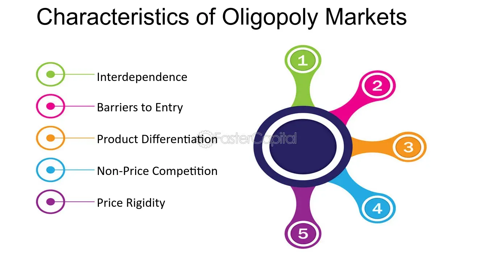

## Table of Contents

## What is an oligopoly?

An oligopoly is a market structure where a small number of companies control most of the market. These companies are usually big and powerful. They sell similar products or services. Because there are only a few companies, each one's actions can affect the others and the whole market. For example, if one company lowers its prices, the others might have to do the same to keep their customers.

In an oligopoly, companies often watch each other closely. They might even work together to keep prices high or to control the supply of their products. This can make it hard for new companies to enter the market because they have to compete with these big, established companies. Examples of oligopolies include the automobile industry, where a few big car makers dominate, and the airline industry, where a few major airlines control most of the flights.

## How does an oligopoly differ from other market structures like monopoly and perfect competition?

An oligopoly is different from a monopoly and perfect competition in several ways. In an oligopoly, a few big companies control the market. They sell similar products and watch each other closely. If one company changes its prices or products, the others often have to respond. This can lead to a kind of balance where companies work together to keep prices high or control supply. In contrast, a monopoly is when just one company controls the whole market. This company can set prices however it wants because there's no competition. On the other hand, perfect competition has many small companies selling the same product. Prices are set by the market, and no single company can influence them much.

In an oligopoly, it's hard for new companies to enter the market because they have to compete with these big, established companies. This is different from perfect competition, where new companies can easily enter and exit the market. In a monopoly, there's usually a big barrier that keeps other companies out, like high costs or legal restrictions. So, while an oligopoly has some competition, it's not as free as perfect competition, and it's not as controlled as a monopoly. Each market structure affects how companies behave and how prices are set.

## What are the key characteristics of an oligopolistic market?

An oligopolistic market has a few big companies that control most of the market. These companies sell similar products or services. Because there are only a few companies, each one's actions can affect the others and the whole market. For example, if one company lowers its prices, the others might have to do the same to keep their customers. This makes the companies watch each other closely. They might even work together to keep prices high or to control the supply of their products.

It's hard for new companies to enter an oligopolistic market. The big companies already have a lot of power and resources. New companies have to compete with these established giants, which can be very difficult. This can lead to a situation where the big companies keep their power and make it tough for others to break in. In an oligopoly, the companies often have some control over prices, but not as much as in a monopoly where one company controls everything.

## Can you explain the concept of barriers to entry in an oligopoly?

Barriers to entry in an oligopoly make it hard for new companies to start competing with the big companies that already control the market. These barriers can be things like high costs to start a business, special technology or patents that the big companies have, or strong brand loyalty from customers who stick with the big names they know. Because the big companies in an oligopoly have so much power and resources, it's really tough for a new company to break into the market and take away their customers.

These barriers keep the market controlled by just a few big companies. For example, if a new company wants to start making cars, it would need a lot of money to build factories and develop the technology. The big car companies already have all this, plus customers who trust their brands. So, the new company would have a hard time getting started and competing. This is why oligopolies stay dominated by a small number of companies, and it's difficult for new players to enter the game.

## What role do product differentiation and branding play in an oligopoly?

In an oligopoly, product differentiation and branding are really important. They help companies stand out from each other. Even though the big companies in an oligopoly sell similar things, they try to make their products seem different and better. They do this by adding special features or making their products look nicer. Branding is also a big deal. Companies spend a lot of money on ads to make people think their brand is the best. This can make customers loyal to one brand and less likely to switch to another, even if the other company has a similar product.

This loyalty to a brand can make it even harder for new companies to enter the market. If customers are used to buying from one of the big companies, they might not want to try something new, even if it's cheaper or just as good. So, product differentiation and strong branding help the big companies keep their power in the market. They make it tough for new companies to compete because they have to not only offer a good product but also build up a brand that people trust and like.

## How do firms in an oligopoly set prices and what is price rigidity?

In an oligopoly, firms set prices carefully because they know that their actions can affect the other big companies in the market. If one company lowers its prices, the others might have to do the same to keep their customers. This can start a price war, where all the companies keep lowering their prices to try to beat each other. To avoid this, companies in an oligopoly often try to keep prices stable. They might even work together, either officially or secretly, to set prices at a level that keeps everyone happy and making money.

This idea of keeping prices stable is called price rigidity. It means that prices don't change much, even if costs or demand change. Companies in an oligopoly are afraid to change their prices because it could upset the balance in the market. If one company changes its prices, it might start a chain reaction where all the other companies have to change their prices too. So, they often decide it's better to keep prices the same, even if it means not making as much money as they could if they were the only ones changing prices.

## What is the kinked demand curve model and how does it apply to oligopolies?

The kinked demand curve model is a way to explain how companies in an oligopoly set their prices. It says that if one company lowers its prices, other companies will quickly do the same to keep their customers. But if one company raises its prices, the other companies might not follow because they can keep their customers without changing their prices. This makes the demand curve for a company's product look like it has a kink or a sharp bend in it. The top part of the curve is flat because if a company raises its price, it loses a lot of customers. The bottom part is steep because if a company lowers its price, it doesn't gain many more customers because other companies lower their prices too.

This model helps explain why prices in an oligopoly can be sticky or hard to change. Companies are afraid to lower their prices because it might start a price war, where everyone keeps lowering prices until no one is making much money. They're also afraid to raise their prices because they might lose customers to the other companies that keep their prices the same. So, even if costs or demand change, the prices often stay the same. This is called price rigidity. The kinked demand curve model shows how companies in an oligopoly try to keep a balance and avoid big changes in the market.

## Can you describe the game theory and how it is used to analyze strategic interactions in oligopolies?

Game theory is a way to study how people or companies make decisions when they have to think about what others might do. In an oligopoly, where a few big companies control the market, game theory helps us understand how these companies act and react to each other. Imagine the companies are players in a game, and their decisions, like setting prices or launching new products, are their moves. Each company wants to do what's best for itself, but it has to guess what the other companies will do. If one company lowers its prices, the others might do the same to keep their customers. This back-and-forth is like a game where everyone is trying to win.

One famous example in game theory is the Prisoner's Dilemma. In an oligopoly, this can show how companies might choose to work together or compete. If two companies could make more money by keeping prices high, they might agree to do that. But if one company thinks the other might cheat and lower prices, it might lower its prices first to protect itself. This can lead to a situation where both companies end up lowering prices and making less money than if they had worked together. Game theory helps us see these kinds of situations and predict what companies might do in an oligopoly.

## What are the different types of collusion that can occur in an oligopoly and their effects on the market?

In an oligopoly, companies might work together to control the market. This is called collusion. There are two main types of collusion: explicit and tacit. Explicit collusion is when companies make a clear agreement to set prices or divide the market. This is often illegal because it can harm customers by keeping prices high. An example of explicit collusion is a cartel, where companies agree to limit production to keep prices up. Tacit collusion is when companies don't have a clear agreement but still act in ways that help them all. They might watch each other and keep prices the same without talking about it. This can be hard to prove and stop because there's no clear evidence of an agreement.

Collusion can have big effects on the market. When companies work together to keep prices high, customers end up paying more than they would in a more competitive market. This can also make it hard for new companies to enter the market because they can't compete with the high prices set by the big companies. In the long run, collusion can lead to less innovation because companies don't have to work hard to beat each other. They can just keep prices high and make money without trying to make their products better. So, while collusion can help the companies in an oligopoly make more money, it can hurt customers and the overall health of the market.

## How do mergers and acquisitions impact the dynamics of an oligopolistic market?

Mergers and acquisitions can change the way an oligopolistic market works. When two companies join together or one company buys another, it can make the market less competitive. If a big company buys a smaller one, it might have more power to set prices or control the supply of products. This can make it harder for other companies to compete because the bigger company has more resources and a stronger position in the market. Mergers and acquisitions can also make it harder for new companies to enter the market because the big companies become even more powerful.

These changes can affect customers too. When companies merge or get bought out, they might raise prices because there's less competition. Customers might have fewer choices and have to pay more for the same products. On the other hand, sometimes mergers and acquisitions can help companies become more efficient and offer better products. But in an oligopoly, where a few big companies already control a lot of the market, these deals can make the market even less competitive and lead to higher prices and less choice for customers.

## What are the welfare implications of oligopolies compared to other market structures?

Oligopolies can have different effects on people's well-being compared to other market structures like monopolies or perfect competition. In an oligopoly, a few big companies control the market. This can lead to higher prices for customers because the companies might work together to keep prices up. It can also mean fewer choices for customers because it's hard for new companies to start competing with the big ones. This can make people worse off because they have to pay more for things and don't have as many options.

On the other hand, oligopolies can sometimes be better for customers than a monopoly, where just one company controls everything. In an oligopoly, there's still some competition between the big companies, which can lead to better products and services. The companies might try to outdo each other by making their products better or offering special deals. But compared to perfect competition, where many small companies compete and prices are set by the market, oligopolies can still be worse for customers. In perfect competition, prices are usually lower and there are more choices, which can make people better off. So, the effects of an oligopoly on people's well-being can be mixed, depending on how much competition there is and how the companies behave.

## How do government regulations and antitrust laws affect the behavior and outcomes in oligopolistic markets?

Government regulations and antitrust laws play a big role in oligopolistic markets. These rules are made to stop the big companies from working together too much or from getting too powerful. Antitrust laws, like those against price-fixing or cartels, are there to make sure the companies don't agree to keep prices high or to divide the market among themselves. This helps to keep the market fair and can stop the companies from hurting customers by charging too much. Governments might also watch mergers and acquisitions closely to make sure they don't make the market even less competitive.

These regulations can change how companies in an oligopoly act. Knowing that they could get in trouble for breaking the rules, companies might be more careful about how they set prices or work with other companies. This can lead to more competition and better outcomes for customers, like lower prices and more choices. But it can also make things harder for the companies because they have to follow a lot of rules. In the end, government regulations and antitrust laws try to balance the power of the big companies in an oligopoly to make the market work better for everyone.

## What are the characteristics of oligopoly markets?

Oligopolistic markets are defined by specific characteristics that set them apart from other types of market structures. Central to an oligopoly is the presence of a small number of dominant firms that possess significant market power, enabling them to influence prices above competitive levels. This contrasts sharply with competitive markets, where numerous players typically drive prices closer to marginal costs.

One of the principal features of oligopolicious markets is the significant barriers to entry. These barriers ensure that new competitors find it difficult to enter the market. High capital requirements for infrastructure development, substantial research and development investments, and access to advanced technology often protect incumbents from potential rivals. Moreover, regulatory frameworks and licensing can further complicate entry into these markets.

In oligopolies, firms tend to rely heavily on non-price competition. Since competing on price can lead to destructive price wars, firms in an oligopoly often use advertising, product differentiation, and branding to secure and enhance their market positions. This strategy allows them to maintain and grow their customer base without necessarily lowering prices, thus preserving higher profit margins.

The interdependence of firms in an oligopoly leads to strategic behavior, where the actions of one firm can prompt immediate reactions from others. This interdependence is often modeled using game theory, where firms anticipate competitor responses when making strategic decisions. For example, if one firm decides to lower prices, others may follow suit to maintain market share, leading to an equilibrium state that benefits no one firm disproportionately.

Mathematically, this interaction can be described using the Cournot or Bertrand models, which provide frameworks for understanding how firms might set quantities or prices, respectively. For instance, the Cournot model assumes that each firm chooses output quantities to maximize profits, considering the output levels of competitors. The resulting equilibrium is derived from a set of reaction functions:

$$
Q_i^* = f(Q_{-i})
$$

where $Q_i^*$ represents the optimal output for firm $i$, and $Q_{-i}$ denotes the combined output of rival firms. This output determination requires each firm to continuously adjust its strategy based on competitor actions, underscoring the strategic interdependence characteristic of oligopolistic markets.

Thus, oligopoly markets are marked by a blend of competitive and monopolistic features, fostering an environment where strategic interplay among a few powerful firms shapes market outcomes.

## References & Further Reading

[1]: Schmalensee, R. (1989). ["Inter-Industry Studies of Structure and Performance."](https://dspace.mit.edu/bitstream/handle/1721.1/2167/SWP-1874-18211615.pdf) Handbook of Industrial Organization, Elsevier.

[2]: Carlton, D. W., & Perloff, J. M. (2005). ["Modern Industrial Organization."](https://books.google.com/books/about/Modern_Industrial_Organization_Global_Ed.html?id=Gr4bCAAAQBAJ) Addison Wesley.

[3]: Lopez de Prado, M. (2018). ["Advances in Financial Machine Learning."](https://www.amazon.com/Advances-Financial-Machine-Learning-Marcos/dp/1119482089) Wiley.

[4]: Jansen, S. (2020). ["Machine Learning for Algorithmic Trading."](https://github.com/stefan-jansen/machine-learning-for-trading) Packt Publishing.

[5]: Stigler, G. J. (1964). ["A Theory of Oligopoly."](https://www.semanticscholar.org/paper/A-Theory-of-Oligopoly-Stigler/d33bef53cddf86e5719740df576e887ec64cfb00) Journal of Political Economy.

[6]: Chan, E. P. (2009). ["Quantitative Trading: How to Build Your Own Algorithmic Trading Business."](https://github.com/ftvision/quant_trading_echan_book) Wiley.

[7]: Wooldridge, J. M. (2012). ["Introductory Econometrics: A Modern Approach."](https://drive.google.com/file/d/1Gw_VYjaRxi8Tq-EroKiQLJYuFIW3gs9f/view?usp=sharing) Cengage Learning. 

[8]: Tirole, J. (1988). ["The Theory of Industrial Organization."](https://archive.org/details/theoryofindustri00jean) MIT Press.

[9]: Vives, X. (1999). ["Oligopoly Pricing: Old Ideas and New Tools."](https://www.jstor.org/stable/41794874) MIT Press.

[10]: Aronson, D. (2006). ["Evidence-Based Technical Analysis: Applying the Scientific Method and Statistical Inference to Trading Signals."](https://www.amazon.com/Evidence-Based-Technical-Analysis-Scientific-Statistical/dp/0470008741) Wiley.