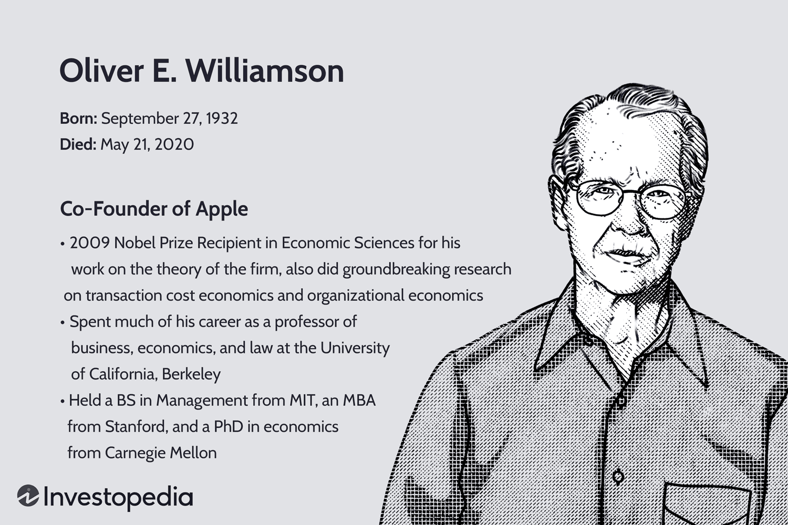

## Table of Contents

## Who is Oliver Williamson?

Oliver Williamson was an important economist who won the Nobel Prize in Economics in 2009. He was born in 1932 in the United States and passed away in 2020. Williamson is famous for his work on how businesses and organizations work. He studied why companies choose to do some things themselves and why they choose to work with other companies.

Williamson's main idea is called "transaction cost economics." This idea says that companies make decisions based on the costs of doing business. If it's cheaper to do something inside the company, they will do it themselves. If it's cheaper to work with another company, they will do that instead. His work helps us understand how businesses can be more efficient and save money.

## When and where was Oliver Williamson born?

Oliver Williamson was born on September 27, 1932. He was born in the city of Superior, which is in the state of Wisconsin, USA.

Williamson grew up in this small city on the shores of Lake Superior. This is where he started his journey that would later make him a famous economist.

## What is Oliver Williamson's educational background?

Oliver Williamson went to school in the United States. He started at the Massachusetts Institute of Technology (MIT), where he got his bachelor's degree in 1955. After that, he went to Stanford University and got his MBA in 1960. He liked learning and wanted to know more about economics, so he decided to keep studying.

Williamson then went back to school at Carnegie Mellon University. There, he worked with famous economists and got his PhD in economics in 1963. His time at Carnegie Mellon was important because it helped him develop his ideas about how businesses work. After finishing his PhD, he started teaching at different universities, sharing what he learned with students and other economists.

## What are the main fields of study that Oliver Williamson contributed to?

Oliver Williamson mainly worked in the fields of economics and business. He is best known for his work in transaction cost economics. This field looks at why companies choose to do some things inside their own business and why they choose to work with other companies. Williamson's ideas help us understand that businesses make these choices based on the costs of doing things. If it's cheaper to do something inside the company, they will do it themselves. If it's cheaper to work with another company, they will do that instead.

Another important field that Williamson contributed to is organizational economics. This field studies how businesses are organized and how they can work better. Williamson's work showed that the way a business is set up can affect how well it does. He looked at things like how decisions are made, how information is shared, and how people work together. His ideas have helped many businesses figure out how to be more efficient and successful.

Williamson also worked in the field of economic governance. This field looks at the rules and systems that help businesses work well. He studied how contracts and agreements between companies can help them work together better. His work in this area has helped us understand how to make business relationships stronger and more reliable. Overall, Williamson's contributions have had a big impact on how we think about and manage businesses.

## What is the concept of transaction cost economics, and how did Williamson contribute to it?

Transaction cost economics is an idea about how businesses make choices. It says that businesses decide whether to do things themselves or work with other companies based on the costs involved. If it's cheaper to do something inside the company, they will do it themselves. If it's cheaper to work with another company, they will do that instead. These costs are called "transaction costs." They include things like the cost of finding the right company to work with, making a deal, and making sure the other company does what they promised.

Oliver Williamson made big contributions to transaction cost economics. He helped develop the idea and made it more popular. Williamson said that businesses think about how hard it is to find a good partner, how much it costs to make a deal, and how easy it is to make sure the other company does what they promised. He also talked about how some deals can be hard to change once they're made, which can make businesses think twice before working with others. Williamson's work has helped many businesses understand how to save money and work better.

## What is the difference between market and hierarchy according to Williamson?

According to Oliver Williamson, businesses can choose to do things in two main ways: through the market or through a hierarchy. The market way means working with other companies to get things done. This can be good because it lets businesses focus on what they do best and use other companies for the rest. But, it can also be hard because finding the right company to work with, making a deal, and making sure they do what they promised can cost a lot of time and money.

The hierarchy way means doing things inside the company itself. This can be good because the company has more control over how things are done. They don't have to spend time and money finding and working with other companies. But, it can also be hard because the company has to handle everything itself, which can make things more complicated and expensive. Williamson said that businesses choose between these two ways based on which one will cost them less in the end.

## How did Oliver Williamson's work influence the field of organizational economics?

Oliver Williamson's work had a big impact on organizational economics. He helped people understand that how a business is organized can make a big difference in how well it does. Williamson looked at things like how decisions are made, how information is shared, and how people work together inside a company. He showed that if these things are done well, the company can save money and work better. His ideas have helped many businesses figure out how to set things up in a way that makes them more efficient and successful.

Williamson's ideas about transaction costs also changed how people think about organizational economics. He said that businesses should think about whether it's cheaper to do things themselves or to work with other companies. This idea helped businesses see that the way they are organized can affect their costs. By choosing the right way to do things, businesses can save money and work better. Williamson's work has made a big difference in how businesses are run and has helped many people understand how to make their organizations work better.

## What are some of the key books and publications by Oliver Williamson?

Oliver Williamson wrote many important books and articles. One of his most famous books is called "Markets and Hierarchies: Analysis and Antitrust Implications." This book came out in 1975 and talks about how businesses choose to do things themselves or work with other companies. It helped start the idea of transaction cost economics. Another important book by Williamson is "The Economic Institutions of Capitalism," which he wrote in 1985. This book looks at how businesses are organized and how they can work better. It is a big part of organizational economics.

Williamson also wrote many articles that helped people understand his ideas better. One of his well-known articles is "The Modern Corporation: Origins, Evolution, Attributes," which he wrote in 1981. In this article, he talks about how big companies started and how they have changed over time. Another important article is "Transaction Cost Economics: The Governance of Contractual Relations," which came out in 1979. This article explains how businesses can make better deals with other companies. Williamson's books and articles have helped many people learn about how businesses work and how they can be more efficient.

## Can you explain the concept of 'bounded rationality' in Williamson's theories?

Bounded rationality is an important idea in Oliver Williamson's theories. It means that people can't always make perfect decisions because they have limits on their time, information, and brain power. In real life, people can't know everything about a situation or think through every possible choice. So, they make decisions based on what they know and can handle at the moment. Williamson used this idea to explain why businesses sometimes choose to do things themselves instead of working with other companies. If it's too hard to figure out a good deal with another company, it might be easier and cheaper to just do it inside the business.

Williamson said that because of bounded rationality, businesses have to think about the costs of making deals. If they can't be sure that another company will do what they promised, it might be better to do the work themselves. This is part of his idea of transaction cost economics. Bounded rationality helps explain why businesses choose to organize themselves in certain ways. It shows that the way a business is set up can help it deal with the limits on people's ability to make perfect decisions.

## What awards and recognitions did Oliver Williamson receive for his work?

Oliver Williamson received many important awards for his work. One of the biggest awards he got was the Nobel Prize in Economics in 2009. He shared this prize with another economist named Elinor Ostrom. The Nobel Prize is a very big deal, and it showed that Williamson's ideas about how businesses work were very important.

Williamson also got other awards. In 1996, he won the John von Neumann Award, which is given to people who do great work in economics. He also got the Distinguished Fellow Award from the American Economic Association in 2007. These awards show that many people thought Williamson's work was very helpful and important for understanding how businesses can be more efficient and save money.

## How has Williamson's work on governance structures impacted business practices?

Oliver Williamson's work on governance structures has changed how businesses think about working with other companies. He said that businesses should think about the costs of making deals and working together. If it's too hard to make sure another company does what they promised, it might be better to do the work inside the business. This idea has helped businesses decide when to work with others and when to do things themselves. Many companies now look at these costs before making big decisions. This has made businesses more careful about who they work with and how they make deals.

Williamson's ideas have also helped businesses set up better rules and systems for working together. He talked about how contracts and agreements can help businesses work better with each other. By making clear rules and having good ways to check that everyone is doing what they promised, businesses can trust each other more. This has made business relationships stronger and more reliable. Companies now use these ideas to make sure their partnerships are successful and that they can work together smoothly.

## What criticisms or debates have arisen regarding Oliver Williamson's theories?

Some people have criticized Oliver Williamson's theories. They say that his idea of transaction cost economics is too simple. They think it doesn't explain everything about how businesses make decisions. Some critics also say that Williamson focused too much on costs and not enough on other important things, like how people work together or the culture of a company. They believe that businesses make choices based on more than just money.

There are also debates about how well Williamson's theories work in the real world. Some people think that his ideas are hard to use in practice. They say that it's not always easy to figure out the costs of working with other companies. Others argue that Williamson's focus on contracts and agreements might not be the best way to make business relationships strong. They think that trust and good communication are more important than just having a good contract. These debates show that while Williamson's ideas are important, they are not perfect and there is still a lot to learn about how businesses work.

## References & Further Reading

[1]: Williamson, O. E. (1985). ["The Economic Institutions of Capitalism: Firms, Markets, Relational Contracting."](https://archive.org/details/economicinstitut0000will) Free Press.

[2]: Coase, R. H. (1937). ["The Nature of the Firm."](https://onlinelibrary.wiley.com/doi/full/10.1111/j.1468-0335.1937.tb00002.x) Economica, 4(16), 386-405.

[3]: Simon, H. A. (1976). ["Administrative Behavior: A Study of Decision-Making Processes in Administrative Organizations."](https://www.researchgate.net/publication/341371173_Herbert_A_Simon_Administrative_Behavior_A_Study_of_Decision-Making_Processes_in_Administrative_Organization) The Free Press.

[4]: Ostrom, E. (1990). ["Governing the Commons: The Evolution of Institutions for Collective Action."](https://archive.org/details/governingcommons0000ostr) Cambridge University Press.

[5]: Williamson, O. E. (1979). ["Transaction-Cost Economics: The Governance of Contractual Relations."](https://www.jstor.org/stable/725118) Journal of Law and Economics, 22(2), 233-261.