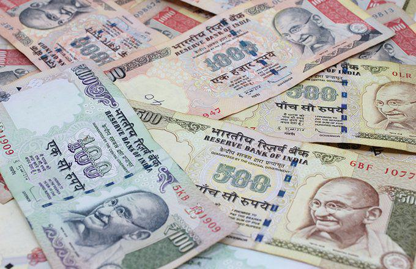

The Omani Rial (OMR) serves as the official currency of Oman and is managed by the Central Bank of Oman. It is renowned as one of the strongest currencies worldwide, attributed to its high value and consistent stability. This financial stability is a critical factor for traders who are increasingly turning to algorithmic trading techniques in today’s digital trading environments. Algorithmic trading has become a fundamental tool, particularly within the highly liquid and dynamic forex markets.

In this discussion, we will explore the strategies and opportunities presented by the algorithmic trading of the Omani Rial. By examining the properties of the OMR, known for its resilience and stability, alongside the intricacies of trading strategies, we aim to shed light on the benefits and challenges of this approach.



The OMR's stability, when combined with sophisticated algorithmic trading methods, opens up significant opportunities for traders who are equipped with the necessary tools and insights. Leveraging algorithmic trading not only allows for the automation of trading processes but also enhances precision and efficiency in trade execution, which is crucial in optimizing profit margins. As traders increasingly integrate these advanced strategies, the role of algorithms in trading the Omani Rial is set to expand, presenting both opportunities and complexities within the forex trading landscape.

## Table of Contents

## Understanding the Omani Rial (OMR)

The Omani Rial (OMR) was introduced in the 1970s, effectively replacing the Indian Rupee and the Maria Theresa Thaler as the official currency of Oman. This transition marked a significant move towards economic sovereignty and modernization for the nation. One of the distinctive characteristics of the OMR is its pegging to the US Dollar, a strategy implemented in 1973. Initially, the exchange rate was set at 1 OMR = 2.895 USD, a rate designed to stabilize the currency within the volatile international markets. This pegging system has been successful in maintaining the strength and stability of the OMR over decades, making it a reliable currency for international trade transactions.

The OMR is comprised of both coins and banknotes, which feature traditional Omani designs. These designs not only reflect the rich cultural heritage of Oman but also serve to promote national identity. Coins are available in denominations of 5, 10, 25, 50, and 100 baisa (with 1000 baisa equaling 1 OMR), while banknotes are issued in denominations of 1, 5, 10, 20, and 50 rials.

The pegged exchange rate mechanism of the OMR plays an integral role in Oman’s economy and international financial dealings. It minimizes the currency's exposure to speculative attacks and exchange rate fluctuations, providing a predictable economic environment for foreign investors and local businesses alike. This stability fosters confidence in trade activities and attracts investments, contributing positively to the nation's economic growth. The absence of large currency fluctuations ensures that the import and export sectors can operate without significant exchange rate risk, thereby maintaining economic equilibrium. Consequently, the OMR's security and reliability are central to its standing as a strong global currency.

## Algorithmic Trading Overview

Algorithmic trading involves the deployment of computer algorithms to automate the execution of trading orders, effectively transforming how financial markets operate. These algorithms are engineered to operate at high speeds, often executing orders within fractions of a second, which significantly reduces the potential for human error. The advantage of such speed and precision allows traders to capitalize on market opportunities that would otherwise be missed through manual trading.

At its core, [algorithmic trading](/wiki/algorithmic-trading) leverages historical data and market indicators to inform trading decisions. These algorithms analyze patterns derived from vast datasets to predict future market movements. By processing large volumes of data more accurately and swiftly than a human could, algorithms make data-driven decisions that reflect market conditions.

The foreign exchange ([forex](/wiki/forex-system)) markets have particularly benefited from algorithmic trading. The highly liquid and volatile nature of forex markets offers numerous opportunities for algorithmic traders to optimize trading patterns. Algorithms can efficiently manage and execute trades, thereby reducing transaction costs and enhancing market efficiency. This optimization occurs through the constant analysis and adjustment of trading strategies in response to fluctuating exchange rates and market conditions.

Traders design algorithms with various technical analysis tools to maximize performance. For example, indicators such as moving averages, stochastic oscillators, and MACD (Moving Average Convergence Divergence) are commonly incorporated into algorithmic trading strategies. These tools help identify price trends and market signals, allowing algorithms to execute trades based on predefined rules and conditions.

Python is a preferred language for developing trading algorithms, given its rich libraries and tools that facilitate financial analysis and trading. For instance, libraries such as NumPy and pandas are used for data manipulation, while modules like TA-Lib provide functions to generate technical indicators essential for formulating trading strategies.

Algorithmic trading's systematic approach ensures that strategies are void of emotional biases that often affect human traders. By automating the trading process, algorithms ensure consistency and adherence to the set parameters, delivering a disciplined trading strategy that can be continually optimized through [backtesting](/wiki/backtesting) and real-time monitoring. This adaptability and precision make algorithmic trading an invaluable tool in modern forex markets, maximizing efficiency and profitability for traders exploiting the Omani Rial and other currencies.

## Technical Analysis Tools for OMR Trading

Technical analysis tools are essential for identifying price trends and potential trading opportunities in the Omani Rial (OMR) market. These tools analyze historical market data to forecast future price movements, providing traders with the insights needed to make informed decisions.

**Moving Averages**:
Moving averages (MA) are fundamental technical analysis tools used to smooth out price data and identify market trends over a specified period. The two most common types are the Simple Moving Average (SMA) and the Exponential Moving Average (EMA). The SMA calculates the average of a selected range of prices, usually closing prices, by the number of periods in that range. In contrast, the EMA gives more weight to recent prices, making it more responsive to new information.
```python
import pandas as pd

def calculate_sma(data, window):
    return data.rolling(window=window).mean()

def calculate_ema(data, window):
    return data.ewm(span=window, adjust=False).mean()
```

**Relative Strength Index (RSI)**:
The Relative Strength Index is a [momentum](/wiki/momentum) oscillator that measures the speed and change of price movements, oscillating between 0 and 100. Traditionally, RSI values above 70 indicate an overbought market, suggesting a potential price reversal, while values below 30 suggest an oversold market condition.
```python
def calculate_rsi(data, window=14):
    delta = data.diff()
    gain = (delta.where(delta > 0, 0)).rolling(window).mean()
    loss = (-delta.where(delta < 0, 0)).rolling(window).mean()
    rs = gain / loss
    rsi = 100 - (100 / (1 + rs))
    return rsi
```

**Fibonacci Retracements**:
Fibonacci retracement levels are horizontal lines that indicate potential support and resistance levels where price could reverse direction. This technical tool is based on the theory that markets will retrace a predictable portion of a move, after which they will continue in the original direction. The most commonly used retracement levels are 23.6%, 38.2%, 50%, 61.8%, and 100%.

**Bollinger Bands**:
Bollinger Bands consist of a middle band (SMA) and two outer bands based on standard deviations from the middle band. This tool helps measure market [volatility](/wiki/volatility-trading-strategies) and identify overbought or oversold conditions. When prices touch or exceed the bands, it can signal a potential trend reversal.
```python
def calculate_bollinger_bands(data, window=20, num_sd=2):
    sma = calculate_sma(data, window)
    std = data.rolling(window=window).std()
    upper_band = sma + (std * num_sd)
    lower_band = sma - (std * num_sd)
    return sma, upper_band, lower_band
```

**Ichimoku Cloud**:
The Ichimoku Cloud is a versatile indicator defining support and resistance, identifying trend direction, gauging momentum, and providing trading signals. It consists of five lines, including the Tenkan-sen, Kijun-sen, Senkou Span A, Senkou Span B, and the Chikou Span, offering a comprehensive view of the market.

Incorporating these technical analysis tools with algorithmic trading scripts significantly enhances trade execution accuracy. Algorithms can efficiently process large volumes of data to detect reliable trading signals and trends, optimizing buying or selling opportunities in the OMR market. Such integration aids in creating strategies that leverage technical insights for profitable trading outcomes, ensuring timely and efficient market entry and [exit](/wiki/exit-strategy) decisions.

## Benefits of Algo Trading OMR

Algorithmic trading of the Omani Rial (OMR) offers several benefits that enhance trading performance and efficiency. A primary advantage is the reduction of cognitive load on traders, as algorithms automate repetitive trading tasks. This automation streamlines decision-making processes, allowing traders to focus on strategy development and analysis rather than mundane, repetitive operations.

One of the most significant benefits is the consistency algorithmic trading ensures in executing trading strategies. Unlike manual trading, which is susceptible to emotional biases and human error, algorithmic trading adheres strictly to predefined rules and criteria. This consistency leads to more reliable and predictable trading outcomes, as strategies are implemented precisely as intended without deviation due to emotional responses.

High-frequency trading ([HFT](/wiki/high-frequency-trading-strategies)) is a specialized subset of algorithmic trading that can greatly benefit from OMR trading. In HFT, trades are executed in fractions of a second, allowing traders to capitalize on even minute changes in the market. This capability is particularly advantageous in the OMR market due to the currency's stability. The minimal volatility can be exploited through HFT strategies, achieving optimal profit margins by executing numerous small-profit trades.

OMR's stability further enables traders to embed robust risk management strategies within their algorithms. Algorithms can be meticulously designed to account for various market conditions, enabling precise control over risk exposure. This aspect is crucial, as effective risk management is a cornerstone of sustainable trading success. 

Moreover, the ability to backtest algorithms on historical data is a critical [factor](/wiki/factor-investing) in refining and improving trading strategies. Traders can simulate trading scenarios using past OMR market data to evaluate the potential effectiveness of their algorithms. Backtesting enables them to identify possible weaknesses or inefficiencies and optimize their algorithms accordingly before deploying them in live trading environments. This process ensures only well-vetted strategies are used in actual trading, increasing the likelihood of successful outcomes.

In summary, the integration of algorithmic trading in OMR markets significantly enhances trading operations by automating tasks, ensuring consistency, and optimizing profitability through high-frequency trading. The stable nature of the OMR provides a conducive environment for implementing effective risk management strategies, while the ability to backtest algorithms ensures continuous improvement and refinement of trading methodologies.

## Challenges in Algo Trading with OMR

Algorithmic trading offers various benefits, but it also presents significant challenges, especially when trading the Omani Rial (OMR). Given its unique characteristics, traders must navigate specific complexities.

Firstly, market unpredictability and unforeseen geopolitical events pose substantial risks to algorithmic trading. These factors can introduce sudden market changes that affect the performance of trading algorithms. For example, unexpected political instability or economic announcements can lead to rapid price fluctuations, potentially rendering pre-existing algorithmic strategies ineffective or unprofitable.

The pegged nature of the OMR, set at 1 OMR = 2.895 USD since 1973, limits opportunities for volatility exploitation. Unlike currencies with floating exchange rates, pegged currencies tend to exhibit more stable and predictable price movements. While this stability is generally beneficial for minimizing risk, it restricts the potential for profiting from short-term market volatility—a typical aim of many forex trading algorithms. Traders need to design algorithms that focus on incremental market movements and capitalize on other aspects of the forex market, such as [interest rate](/wiki/interest-rate-trading-strategies) differentials, rather than solely relying on volatility.

Additionally, the development and maintenance of effective trading algorithms demand substantial technical expertise and resources. Creating sophisticated algorithms that can process large volumes of market data, adapt to changing conditions, and execute decisions swiftly requires advanced programming skills and deep understanding of quantitative modeling. Moreover, continuous algorithm refinement and testing are crucial to ensure optimal performance, which involves significant investment in time and computational resources.

Regulatory compliance is another key challenge. Trading in financial markets necessitates adherence to regulatory frameworks established by both local and international bodies. For the Omani Rial, ensuring that algorithms operate within these guidelines can be complex, given the diverse regulatory environments that traders may encounter. Algorithms must incorporate mechanisms to comply with regulations such as trading limits, reporting requirements, and anti-manipulation rules.

In conclusion, while algorithmic trading provides a strategic advantage in trading OMR, understanding and addressing these challenges is essential. Traders must carefully design algorithms to navigate market unpredictability, leverage the OMR's characteristics effectively, and ensure compliance with regulatory standards.

## Conclusion

Algorithmic trading offers a strategic advantage when trading the Omani Rial (OMR), largely due to the currency's inherent stability and strength. This stability is a product of its pegged exchange rate to the US Dollar, which provides an attractive environment for deploying algorithmic strategies. The integration of sophisticated algorithms with reliable technical tools, such as Moving Averages and Bollinger Bands, allows traders to achieve substantial trading success. These tools enable precise identification of market trends and timely execution of trades, capitalizing on even minor market movements.

Consistent monitoring and backtesting are vital components of successful algorithmic trading. Backtesting enables traders to evaluate the performance of their algorithms using historical OMR data, which aids in tuning the algorithms for optimal performance. Algorithm adaptability is crucial to address the dynamic nature of financial markets and manage risks effectively. Market anomalies and unexpected geopolitical events can influence currency fluctuations, necessitating ongoing refinement of trading algorithms.

As technology and market dynamics continue to evolve, the role of algorithmic trading in OMR markets is expected to expand. Advanced computing capabilities and data analytics improve the precision and efficiency of trading strategies. Traders who harness these cutting-edge technologies, coupled with profound market insights, are positioned to lead in the forex trading landscape. They will likely see enhanced trading outcomes, given the melding of technical acumen with a robust understanding of market behaviors.

In conclusion, the combination of OMR's financial stability and the advanced capabilities of algorithmic trading makes for a compelling narrative in forex markets. Adapting to technological advancements and adhering to rigorous strategy evaluations will be essential for traders aiming to harness future opportunities in this domain.

## References & Further Reading

[1]: Bergstra, J., Bardenet, R., Bengio, Y., & Kégl, B. (2011). ["Algorithms for Hyper-Parameter Optimization."](https://dl.acm.org/doi/10.5555/2986459.2986743) Advances in Neural Information Processing Systems 24.

[2]: ["Advances in Financial Machine Learning"](https://www.amazon.com/Advances-Financial-Machine-Learning-Marcos/dp/1119482089) by Marcos Lopez de Prado

[3]: ["Evidence-Based Technical Analysis: Applying the Scientific Method and Statistical Inference to Trading Signals"](https://www.amazon.com/Evidence-Based-Technical-Analysis-Scientific-Statistical/dp/0470008741) by David Aronson

[4]: ["Machine Learning for Algorithmic Trading"](https://github.com/stefan-jansen/machine-learning-for-trading) by Stefan Jansen

[5]: ["Quantitative Trading: How to Build Your Own Algorithmic Trading Business"](https://www.amazon.com/Quantitative-Trading-Build-Algorithmic-Business/dp/1119800064) by Ernest P. Chan