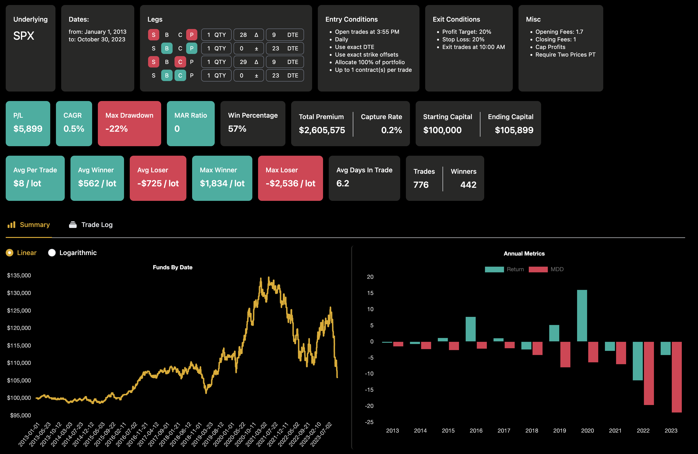

## Table of Contents

## What is Omega in options trading?

Omega in options trading is a measure that helps traders understand how sensitive an option's price is to changes in the underlying asset's price. It's like a more advanced version of the delta, which also measures sensitivity but in a simpler way. Omega gives traders a better idea of how much the option's price will change for every small change in the stock price, making it useful for more precise trading decisions.

Think of Omega as a tool that tells you the percentage change in the option's price for a one percent change in the stock price. If the Omega is 1.5, it means that for every 1% increase in the stock price, the option's price will go up by 1.5%. This can help traders predict how their options will perform as the stock price moves, allowing them to manage their investments more effectively.

## How is Omega calculated in options trading?

Omega is calculated by comparing how much the price of an option changes with how much the price of the stock it's based on changes. It's like figuring out how much the option's price will move if the stock price moves by a little bit. To find Omega, you take the change in the option's price and divide it by the change in the stock's price, then you multiply that by the stock's price and divide by the option's price. It's a way to see the percentage change in the option's price for a one percent change in the stock's price.

For example, if the stock price goes up by 1% and the option price goes up by 1.5%, the Omega would be 1.5. This means the option's price changes 1.5 times as much as the stock price. Traders use Omega to get a better sense of how sensitive their options are to small changes in the stock price, which helps them make more informed decisions about buying or selling options.

## Why is Omega important for options traders?

Omega is important for options traders because it helps them understand how much the price of their option will change when the price of the stock changes. It's like a special tool that tells traders how sensitive their option is to small changes in the stock price. By knowing the Omega, traders can predict if their option will go up or down a lot or just a little when the stock moves. This helps them decide if they should buy or sell the option to make the most money or avoid losing too much.

Using Omega, traders can make smarter choices about their options. For example, if the Omega is high, it means the option's price will change a lot even if the stock price only changes a little. This can be good if the trader thinks the stock will go up, but it can also be risky if the stock goes down. By understanding Omega, traders can better manage their investments and plan their strategies to fit what they think will happen with the stock price.

## How does Omega differ from other Greek metrics like Delta and Gamma?

Omega, Delta, and Gamma are all important measures in options trading, but they tell us different things about how an option's price changes. Delta tells you how much the option's price will change if the stock's price changes by $1. For example, if the Delta is 0.5, the option's price will go up by $0.50 for every $1 increase in the stock price. Gamma, on the other hand, tells you how much the Delta will change if the stock's price changes. It's like a measure of how fast the Delta changes, which helps traders know how sensitive the option's price is to big changes in the stock price.

Omega is different because it tells you the percentage change in the option's price for a one percent change in the stock's price. If the Omega is 1.5, it means the option's price will go up by 1.5% if the stock's price goes up by 1%. This makes Omega very useful for understanding how sensitive the option is to small changes in the stock price. While Delta and Gamma focus more on the dollar amount changes and the rate of change in Delta, Omega gives traders a clearer picture of the percentage impact, helping them make more precise predictions about their options' performance.

## Can Omega be used to predict option price movements?

Omega can help traders predict how much the price of an option will change when the stock price changes. It tells you the percentage change in the option's price for every one percent change in the stock's price. For example, if the Omega is 1.5, it means the option's price will go up by 1.5% if the stock's price goes up by 1%. This can be really useful for traders because it gives them a good idea of how sensitive their option is to small changes in the stock price.

While Omega is a helpful tool for predicting option price movements, it's not perfect. It works best for small changes in the stock price, and it doesn't take into account other things that can affect the option's price, like time until expiration or changes in the stock's volatility. So, while Omega can help traders make better guesses about how their options will perform, they should also use other tools and information to make the best decisions.

## What are the limitations of using Omega in options trading?

Omega is a helpful tool for options traders because it shows how much the option's price will change if the stock's price changes a little bit. But, it has some limits. Omega is best for small changes in the stock price. If the stock price changes a lot, Omega might not be as accurate. It's like trying to use a small ruler to measure a big room; it works, but it's not the best tool for the job.

Another thing to remember is that Omega only looks at the stock price. It doesn't think about other things that can change the option's price, like how much time is left before the option expires or how much the stock's price might swing up and down. So, while Omega can help predict some changes, it's not the whole picture. Traders need to use other tools and information too, to make the best choices about their options.

## How can Omega be applied in different market conditions?

Omega can be a useful tool for options traders in different market conditions. In a stable market where stock prices move slowly and steadily, Omega can help traders predict how much the option's price will change with small movements in the stock's price. For example, if a trader knows the Omega is 1.5, they can expect the option's price to go up by 1.5% if the stock price goes up by 1%. This can help traders make decisions about buying or selling options when they expect the stock price to change gradually.

In a volatile market, where stock prices can jump up and down a lot, Omega might not be as reliable. It's designed for small changes, so big swings in the stock price can make Omega's predictions less accurate. However, traders can still use Omega as part of their overall strategy. By combining Omega with other measures like Delta and Gamma, traders can get a better sense of how their options might react to big changes in the stock price. This can help them adjust their trading plans to fit the ups and downs of a volatile market.

## What strategies can be enhanced by using Omega?

Omega can help traders make better decisions in strategies like delta-neutral trading. In delta-neutral trading, traders try to make a portfolio where the overall delta is zero, so the portfolio's value doesn't change much with small moves in the stock price. By knowing the Omega, traders can see how sensitive their options are to small changes in the stock price. This helps them adjust their positions to keep the portfolio balanced and manage risk better. For example, if the Omega is high, they might need to make more adjustments to stay delta-neutral because the option's price will change a lot even with small moves in the stock price.

Another strategy where Omega can be useful is in directional trading, where traders bet on whether the stock price will go up or down. Omega helps traders understand how much the option's price will change if the stock price moves a little bit. If a trader thinks the stock will go up and sees that the Omega is high, they might feel more confident in buying the option because they know it will go up a lot if the stock price increases even slightly. This can help traders decide when to buy or sell options to make the most money based on their predictions about the stock's future movements.

## How does Omega interact with other Greeks in complex trading scenarios?

In complex trading scenarios, Omega works together with other Greeks like Delta, Gamma, Theta, and Vega to give traders a full picture of how their options might change. Omega tells traders how much the option's price will change if the stock's price changes a little bit. Delta shows how much the option's price will change if the stock's price goes up or down by $1. Gamma tells traders how fast the Delta changes, which is important for understanding how sensitive the option is to big moves in the stock price. By using Omega along with Delta and Gamma, traders can predict how their options will react to small and big changes in the stock price, helping them make better decisions about when to buy or sell.

Theta and Vega also play a part in these complex scenarios. Theta tells traders how much the option's price will change as time goes by, which is important because options lose value as they get closer to expiring. Vega shows how much the option's price will change if the stock's expected volatility changes. In a real trading situation, a trader might use Omega to see how the option's price will change with small moves in the stock price, but they also need to think about Theta to know how time affects their option and Vega to understand how changes in the stock's volatility could impact the option's price. By considering all these Greeks together, traders can create more detailed and effective trading strategies.

## What are some real-world examples where Omega played a crucial role in trading decisions?

In one real-world example, a trader was using a delta-neutral strategy to manage their portfolio. They wanted to keep their portfolio's overall value stable even when the stock price changed a little bit. They used Omega to see how sensitive their options were to small changes in the stock price. Because Omega was high, they knew the option's price would change a lot even with small moves in the stock. This helped them make more adjustments to their positions to keep the portfolio balanced and manage risk better. Without Omega, they might not have made these adjustments, and their portfolio could have been less stable.

Another example happened during a time when the market was a bit unpredictable. A trader was trying to make money by betting on which way the stock price would go. They looked at Omega to understand how much the option's price would change if the stock price moved a little bit. They saw that Omega was really high, which meant the option's price would go up a lot if the stock price increased even slightly. This gave them the confidence to buy the option because they believed the stock would go up. By using Omega, they were able to make a better decision and ended up making a profit when the stock price did go up as they expected.

## How can traders use Omega to manage risk in their options portfolio?

Traders can use Omega to manage risk in their options portfolio by understanding how sensitive their options are to small changes in the stock price. If the Omega is high, it means the option's price will change a lot even if the stock price only moves a little. This can be good if the trader thinks the stock will go up, but it can also be risky if the stock goes down. By knowing the Omega, traders can decide if they need to make adjustments to their portfolio to reduce risk. For example, if they see a high Omega, they might choose to buy or sell options to balance out their positions and protect their investments from big losses.

In another way, Omega helps traders predict how their options will perform in different market conditions. In a stable market, a trader can use Omega to see how their options will react to small, steady changes in the stock price. This helps them plan their trades to take advantage of these small movements while keeping risk low. In a more unpredictable market, Omega can still be useful, but traders need to use it along with other tools like Delta and Gamma. By combining these measures, traders can get a better sense of how their options might behave and adjust their strategies to manage risk more effectively, making sure they're prepared for whatever the market does next.

## What advanced techniques involve Omega for expert options traders?

Expert options traders can use Omega in a special way called dynamic hedging. This is when traders keep changing their options to make sure their portfolio stays balanced even when the stock price moves a little bit. If they see that the Omega is high, they know the option's price will change a lot with small stock price moves. So, they might buy or sell more options to keep everything steady. This helps them manage risk better because they can make quick changes to protect their money from big losses.

Another advanced technique is using Omega to predict how options will act in different market situations. Traders might use computers and special math to figure out what will happen to their options if the stock price changes a little. By knowing the Omega, they can guess how much the option's price will go up or down. This helps them plan their trades better and make the most money while keeping risk low. They can also use Omega along with other measures like Delta and Gamma to get a full picture of how their options might behave and adjust their strategies to fit what they think will happen in the market.

## What is the role of Omega in options trading?

Omega is a unique derivative often overshadowed by more popular metrics like delta and gamma. It represents the leverage ratio of an options position and provides valuable insights into how changes in the underlying asset's price affect the value of the option. Unlike other Greeks that measure sensitivities like price or [volatility](/wiki/volatility-trading-strategies) changes, omega focuses specifically on the percentage change in the option's value resulting from a percentage change in the underlying asset's price. This perspective is particularly beneficial for traders who need to assess the potential impact of price movements in proportionate terms.

The calculation of omega is straightforward, though it is less commonly employed due to its specific focus. Omega can be defined mathematically as:

$$
\Omega = \left( \frac{\Delta \times S}{C} \right)
$$

where:
- $\Delta$ is the option's delta, representing the rate of change in the option's price for a small change in the price of the underlying asset.
- $S$ is the current price of the underlying asset.
- $C$ is the current price of the call or put option.

This formula highlights the sensitivity of the option’s value to changes in the price of the underlying asset, expressed as a percentage. By understanding omega, traders can gain insights into the leverage effect embedded in options, helping them to make more informed decisions when constructing complex trades.

Sophisticated traders consider omega crucial for understanding the risk-reward balance of an options strategy. Its measurement of leverage allows for better assessment in scenarios where large price swings are expected, offering a clearer picture of potential returns relative to the changes in the underlying asset. This metric is particularly relevant in volatile markets, where traders must understand not only the direction of price changes but also their magnitude in relation to the option’s performance.

Integrating omega into trading strategies facilitates refined risk management and positions sizing, allowing traders to align their market outlook more closely with their expected return on investment. Experienced traders often utilize omega to ensure their strategies can withstand various price movement scenarios, optimizing their leverage to enhance profitability while managing exposure.

## What is the process of demystifying Black-Scholes and the Greeks?

The Black-Scholes model is a cornerstone of modern options trading, providing a theoretical estimate for the pricing of European-style options. Developed by Fischer Black, Myron Scholes, and Robert Merton, the model employs differential equations to evaluate option prices based on factors such as the underlying asset's current price, the option's strike price, time to expiration, risk-free [interest rate](/wiki/interest-rate-trading-strategies), and the asset's volatility.

### Black-Scholes Model

The Black-Scholes formula for a European call option is as follows:

$$
C = S_0 N(d_1) - X e^{-rT} N(d_2)
$$

where:
- $C$ is the call option price,
- $S_0$ is the current price of the underlying asset,
- $X$ is the strike price of the option,
- $r$ is the risk-free interest rate,
- $T$ is the time to expiration,
- $N$ is the cumulative distribution function of the standard normal distribution,
- $d_1 = \frac{\ln(S_0 / X) + (r + \sigma^2 / 2) T}{\sigma \sqrt{T}}$,
- $d_2 = d_1 - \sigma \sqrt{T}$,
- $\sigma$ is the volatility of the asset.

The model's assumptions, such as constant volatility and interest rates, contribute to its theoretical nature. However, its accuracy improves when volatility skews and other market anomalies are accounted for in [algorithmic trading](/wiki/algorithmic-trading).

### The Greeks in Options Trading

The 'Greeks' are essential tools used to measure different risks and sensitivities in an options portfolio. They include Delta (Δ), Gamma (Γ), Theta (Θ), Vega (υ), and Rho (ρ). Each of these measures a specific sensitivity:

- **Delta (Δ)**: Represents the rate of change of the option price with respect to changes in the underlying asset price. It assists traders in understanding how the option's value is likely to move for a unit change in the asset’s price.

- **Gamma (Γ)**: Indicates the rate of change of delta over the price of the underlying asset. High gamma values suggest the delta can change significantly, affecting hedging strategies.

- **Theta (Θ)**: Measures the sensitivity of the option price to the passage of time, also known as time decay. An option's value decreases as it approaches expiration, making Theta critical for time-sensitive strategies.

- **Vega (υ)**: Reflects the sensitivity of the option price to changes in the volatility of the underlying asset. Higher volatility generally increases the option’s price, captured by this measure.

- **Rho (ρ)**: Assesses the sensitivity of the option price to changes in interest rates, affecting both profit outcomes and hedging decisions.

### Application in Algorithmic Trading

The precision of algorithmic trading systems is enhanced through integration with models like Black-Scholes and the Greeks. Algorithms automate complex calculations, allowing traders to swiftly assess dynamic market conditions. By incorporating these models, algorithmic strategies optimize trade execution and risk management. Below is a simple Python example demonstrating how to calculate the delta of an option using the Black-Scholes model:

```python
from scipy.stats import norm
import numpy as np

def calculate_delta(S, X, T, r, sigma, option_type='call'):
    d1 = (np.log(S / X) + (r + 0.5 * sigma**2) * T) / (sigma * np.sqrt(T))
    if option_type == 'call':
        delta = norm.cdf(d1)
    elif option_type == 'put':
        delta = norm.cdf(d1) - 1
    return delta

# Example parameters
S = 100  # Current price of the underlying
X = 100  # Strike price
T = 1    # Time to expiration in years
r = 0.05 # Risk-free interest rate
sigma = 0.2 # Volatility

call_delta = calculate_delta(S, X, T, r, sigma, option_type='call')
print(f'Call Delta: {call_delta}')
```

By leveraging these calculations, algorithms can tailor trading strategies that adapt to rapidly shifting conditions, automatically adjusting positions to maintain desired risk profiles. This dynamic application of the Black-Scholes model and the Greeks enables sophisticated, automated trading approaches that enhance decision-making and improve profitability in complex markets.

## References & Further Reading

[1]: Hull, J. C. (2017). ["Options, Futures, and Other Derivatives"](https://www.semanticscholar.org/paper/Options%2C-Futures%2C-and-Other-Derivatives-Hull/89bdee500c8623864fc9eb7a471546aa713acc44). Pearson Education.

[2]: Black, F. & Scholes, M. S. (1973). ["The Pricing of Options and Corporate Liabilities"](https://www.cs.princeton.edu/courses/archive/fall09/cos323/papers/black_scholes73.pdf). Journal of Political Economy, 81(3), 637-654.

[3]: Taleb, N. N. (1997). ["Dynamic Hedging: Managing Vanilla and Exotic Options"](https://archive.org/details/dynamichedgingma0000tale). Wiley.

[4]: Sinclair, E. (2013). ["Option Trading: Pricing and Volatility Strategies and Techniques"](https://www.wiley.com/en-us/Option+Trading%3A+Pricing+and+Volatility+Strategies+and+Techniques+-p-9781119198673). Wiley.

[5]: Kissell, R. (2013). ["The Science of Algorithmic Trading and Portfolio Management"](https://www.sciencedirect.com/book/9780124016897/the-science-of-algorithmic-trading-and-portfolio-management). Academic Press.