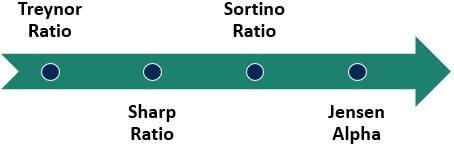

Options trading and algorithmic trading have significantly transformed financial markets by introducing highly advanced methods for trade execution and strategy optimization. These innovations offer traders not only speed and precision but also enhanced capabilities to formulate sophisticated trading strategies. At their confluence, options trading and algorithmic trading leverage financial calculations to produce informed and efficient trading outcomes.

The incorporation of financial metrics—such as the Greeks including delta, gamma, and omega—provides critical insights into the dynamics of options pricing and leverage. Among these, omega stands out for its unique focus on the percentage change in an option's value relative to changes in the price of the underlying asset. This enhances traders' ability to comprehend and exploit leverage in market movements.



Algorithmic trading, operating through complex computational algorithms, expedites the identification of trading opportunities and the execution of trades. By integrating omega and other financial calculations into algorithmic frameworks, traders can navigate volatile markets more effectively, optimizing their strategies for better efficiency and risk management.

This article will explore the significance of these elements—financial calculations within options trading, the function of omega, and the influence of algorithmic trading—highlighting how their synthesis creates powerful strategies that modern traders can utilize for achieving profitability and mitigating risk.

## Table of Contents

## Understanding Financial Calculations in Options Trading

Options trading is characterized by its reliance on various complex financial calculations vital for effective decision-making. Among these calculations, the options 'Greeks' are fundamental in assessing the price and leverage of options contracts. The Greeks are a set of measures that describe the different dimensions of risk involved in taking an options position. Key Greeks include delta, gamma, and omega, each providing crucial insights into market dynamics and helping traders refine their strategies.

Delta measures the rate of change in an option's price concerning a $1 change in the underlying asset’s price. It is a crucial [factor](/wiki/factor-investing) as it helps traders understand how the price of an option is likely to change with movements in the market. Delta values range from 0 to 1 for call options and 0 to -1 for put options, indicating how much the option price is expected to change with the underlying asset's price change.

Gamma complements delta by measuring the rate of change in delta as the underlying asset’s price changes. Essentially, gamma indicates the curvature of the option's value in response to changes in the underlying asset's price. A high gamma suggests that delta is sensitive to changes in the underlying asset price, which is particularly significant for options near expiration or at-the-money, as these are more vulnerable to price swings.

Omega, while less commonly discussed than delta and gamma, offers a powerful gauge for understanding the leverage of options trading. It focuses on the percentage change in an option’s value given a 1% change in the underlying security's price. Omega is particularly useful for traders aiming to evaluate the potential profitability of an options investment, offering insights beyond what delta or gamma alone can provide.

Understanding and effectively applying these calculations can notably enhance a trader’s strategy in the options market. Mastery of the Greeks allows traders to better predict market movements and adjust their strategies accordingly. By aligning trades with the insights provided by delta, gamma, and omega, traders can optimize their positions for various market conditions, potentially improving their success rates and profitability.

For those interested in implementing these calculations through programming, Python offers robust libraries such as NumPy and SciPy for performing detailed financial calculations. Here is a basic example of how delta might be calculated for a call option using the Black-Scholes formula:

```python
from scipy.stats import norm
import numpy as np

def delta_call(S, K, T, r, sigma):
    """
    Calculate the Delta of a European call option based on the Black-Scholes model.

    Parameters:
    S -- current stock price
    K -- strike price
    T -- time to expiration in years
    r -- risk-free interest rate
    sigma -- volatility of the underlying asset

    Returns:
    Delta value of the call option
    """
    d1 = (np.log(S / K) + (r + 0.5 * sigma**2) * T) / (sigma * np.sqrt(T))
    return norm.cdf(d1)

# Example parameters
stock_price = 100
strike_price = 100
time_to_expiration = 1  # 1 year
risk_free_rate = 0.05  # 5%
volatility = 0.2  # 20%

delta = delta_call(stock_price, strike_price, time_to_expiration, risk_free_rate, volatility)
print(f"Delta of the call option: {delta}")
```

By utilizing such mathematical approaches, traders can quantify and mitigate risks effectively, crafting strategies that leverage the nuanced understanding gained from financial calculations like the Greeks.

## Role of Omega in Options Trading

Omega is a unique derivative often overshadowed by more popular metrics like delta and gamma. It represents the leverage ratio of an options position and provides valuable insights into how changes in the underlying asset's price affect the value of the option. Unlike other Greeks that measure sensitivities like price or [volatility](/wiki/volatility-trading-strategies) changes, omega focuses specifically on the percentage change in the option's value resulting from a percentage change in the underlying asset's price. This perspective is particularly beneficial for traders who need to assess the potential impact of price movements in proportionate terms.

The calculation of omega is straightforward, though it is less commonly employed due to its specific focus. Omega can be defined mathematically as:

$$
\Omega = \left( \frac{\Delta \times S}{C} \right)
$$

where:
- $\Delta$ is the option's delta, representing the rate of change in the option's price for a small change in the price of the underlying asset.
- $S$ is the current price of the underlying asset.
- $C$ is the current price of the call or put option.

This formula highlights the sensitivity of the option’s value to changes in the price of the underlying asset, expressed as a percentage. By understanding omega, traders can gain insights into the leverage effect embedded in options, helping them to make more informed decisions when constructing complex trades.

Sophisticated traders consider omega crucial for understanding the risk-reward balance of an options strategy. Its measurement of leverage allows for better assessment in scenarios where large price swings are expected, offering a clearer picture of potential returns relative to the changes in the underlying asset. This metric is particularly relevant in volatile markets, where traders must understand not only the direction of price changes but also their magnitude in relation to the option’s performance.

Integrating omega into trading strategies facilitates refined risk management and positions sizing, allowing traders to align their market outlook more closely with their expected return on investment. Experienced traders often utilize omega to ensure their strategies can withstand various price movement scenarios, optimizing their leverage to enhance profitability while managing exposure.

## The Intersection of Omega and Algorithmic Trading

Algorithmic trading represents a pivotal advancement in the finance sector, utilizing sophisticated technology to identify and exploit trading opportunities with precision and speed. At the core of this innovation is the integration of complex financial metrics such as omega, a Greek metric often overshadowed by its more familiar counterparts like delta or gamma.

Omega redefines how traders comprehend leverage by focusing on the percentage change in an option's value relative to a percentage change in the price of the underlying asset. This unique perspective allows traders to gain insights that are not apparent through traditional Greeks, which primarily address rate of change or sensitivity in linear terms. By using omega, [algorithmic trading](/wiki/algorithmic-trading) strategies can more efficiently adapt to the nuanced movements of the market.

Algorithmic systems, when integrated with omega, can optimize automated trading strategies. This is particularly beneficial in constructing options portfolios where leverage and rapid repositioning are essential. For instance, consider a Python script utilizing omega in a high-frequency trading algorithm:

```python
def calculate_omega(option_value, underlying_value, change_option, change_underlying):
    return (change_option / option_value) / (change_underlying / underlying_value)

# Example calculation
option_value = 5.0
underlying_value = 100.0
change_in_option = 0.5
change_in_underlying = 1.0

omega = calculate_omega(option_value, underlying_value, change_in_option, change_in_underlying)
print(f"The calculated omega is: {omega}")
```

Incorporating omega into such algorithms offers a tangible edge in volatile market conditions. The metric enables real-time leverage recalibration, essential for maintaining optimal risk-reward ratios during rapid price movements. This sophisticated level of adaptation is crucial in algorithms that target short-lived [arbitrage](/wiki/arbitrage) or mean-reversion opportunities, where the traditional lag from slower manual analysis would mean missed opportunities.

Furthermore, omega's emphasis on leverage aligns well with risk management strategies. Algorithms can dynamically adjust leverage, based on the real-time omega, to protect and potentially enhance profitability during adverse market scenarios. Leveraging omega helps craft more resilient strategies, capable of withstanding market stress while capitalizing on favorable conditions.

The strategic incorporation of omega into algorithmic mechanisms represents a forward leap for traders aiming to optimize their performance in fast-paced environments. The union of precise financial calculations with cutting-edge technology paves the way for innovative trading methodologies, ensuring efficiency, and effectiveness.

## Algorithmic Trading: Advancements and Applications

Algorithmic trading leverages computer programs to automate the execution of trading strategies, significantly enhancing efficiency and precision in financial markets. This technology executes trades at speeds and frequencies impractical for human traders, offering significant advantages in speed, efficiency, and risk management within complex options markets.

### Speed and Efficiency

One of the most compelling benefits of algorithmic trading lies in its ability to execute orders instantaneously, reacting to market conditions faster than any human could. This rapid execution is critical in options markets, where the value of an option can fluctuate rapidly based on changes in the underlying asset's price. Algorithms can monitor market conditions, analyze data, and execute trades in milliseconds, capturing favorable pricing opportunities and securing optimal spreads. 

### Risk Management

Algorithmic trading also significantly enhances risk management capabilities. By continuously analyzing market conditions and predefined risk parameters, algorithms can execute sophisticated risk management strategies without emotional bias. For instance, they can automatically adjust positions or stop losses to prevent excessive losses in volatile markets. Furthermore, algorithms can maintain adherence to systematic trading rules, ensuring compliance with risk tolerance levels and trading mandates imposed by regulatory or institutional requirements.

### Multi-leg Options Strategies

In options trading, strategies often involve multiple legs, such as spreads, straddles, or strangles, which require precise and simultaneous execution. Algorithmic trading platforms are adept at managing these multi-leg strategies, ensuring all components of the trade are executed at desired price points. This prevents slippage, a common issue when executing multi-legged trades manually, where execution delays can result in less favorable outcomes. For instance, a Python script using a trading library like `ccxt` could automate the execution of an options spread strategy:

```python
import ccxt
exchange = ccxt.binance({'apiKey': 'YOUR_API_KEY', 'secret': 'YOUR_API_SECRET'})

def execute_spread_strategy():
    # Define legs of the spread
    buy_leg = {'symbol': 'BTC/USDT', 'side': 'buy', 'type': 'limit', 'price': 50000, 'amount': 1}
    sell_leg = {'symbol': 'ETH/USDT', 'side': 'sell', 'type': 'limit', 'price': 3000, 'amount': 10}

    # Execute the spread
    buy_order = exchange.create_limit_buy_order(**buy_leg)
    sell_order = exchange.create_limit_sell_order(**sell_leg)

    return buy_order, sell_order

execute_spread_strategy()
```

### Real-Time Market Monitoring

Algorithms also provide traders with the ability to monitor real-time market shifts, enabling the continuous adjustment of strategies based on market dynamics. This real-time monitoring allows for immediate responses to significant market events, such as unexpected news releases that may cause rapid price shifts. By synthesizing vast amounts of data from multiple sources, free from cognitive overload, algorithms can maintain strategic positioning in constantly evolving environments. 

In summary, by automating trade execution and integrating advanced risk management, algorithmic trading transforms the landscape of options trading. Its ability to handle complex strategies, coupled with real-time monitoring, makes it an indispensable tool for modern traders seeking to optimize their performance in the fast-paced financial markets.

## Developing Algorithmic Strategies for Options Trading

Designing algorithmic strategies for options trading involves a systematic approach that integrates traditional trading techniques with automation to enhance decision-making processes and execution speed. The development of these strategies begins with understanding the necessary financial calculations which form the backbone of options trading. 

One of the first steps in creating an algorithmic strategy is to define the trading objective clearly. This might involve setting a specific goal such as maximizing returns, minimizing risk, or capturing market inefficiencies. Once the objective is clear, the next step is to select the appropriate financial models and metrics that will guide the strategy. This involves identifying key parameters such as volatility, option Greeks, and other market indicators that could impact the decision-making process.

In developing these strategies, it is essential to harness the power of data. Data collection and analysis are critical to identifying patterns and testing hypotheses. This often involves [backtesting](/wiki/backtesting), where historical market data is used to simulate strategy performance. Backtesting helps traders evaluate the viability of a strategy before deploying it in live markets.

Algorithms are then created using programming languages like Python. For example, a simple options trading algorithm could be designed to execute an Iron Condor strategy, which is a popular options trading strategy that exploits price volatility. In Python, the basic structure of an algorithm for executing an Iron Condor might involve defining the conditions for entering a trade (e.g., when implied volatility is high) and specifying the strike prices and expiration dates for the options involved.

```python
import py_vollib.black_scholes_merton as bs
import py_vollib.black_scholes_merton.greeks.analytical as greeks

# Parameters for Iron Condor strategy
stock_price = 100
expiry = 30  # in days
risk_free_rate = 0.01
volatility = 0.2

# Long Put
short_put_strike = 95
long_put_strike = 90

# Long Call
short_call_strike = 105
long_call_strike = 110

# Option pricing
short_put_price = bs.black_scholes_merton('p', stock_price, short_put_strike, expiry, risk_free_rate, volatility, 0)
long_put_price = bs.black_scholes_merton('p', stock_price, long_put_strike, expiry, risk_free_rate, volatility, 0)
short_call_price = bs.black_scholes_merton('c', stock_price, short_call_strike, expiry, risk_free_rate, volatility, 0)
long_call_price = bs.black_scholes_merton('c', stock_price, long_call_strike, expiry, risk_free_rate, volatility, 0)

# Calculating position values
iron_condor_value = (short_put_price - long_put_price) - (short_call_price - long_call_price)
```

This script demonstrates how to compute option prices using the Black-Scholes-Merton model, which serves as a foundational tool for valuing the option legs in the Iron Condor strategy.

Optimization of algorithmic strategies is a critical step and often involves the application of [machine learning](/wiki/machine-learning) models to identify the best parameters for each trade. This might include fine-tuning entry and [exit](/wiki/exit-strategy) points, adjusting position size for risk management, and incorporating dynamic hedging techniques.

Finally, simulation and stress testing are essential to ensure the algorithm can handle unexpected market conditions. Effective risk management mechanisms should be built into the algorithm to adapt to unforeseen market scenarios, employing stop-loss orders and real-time monitoring tools.

Thus, developing algorithmic strategies for options trading requires meticulous integration of financial calculations, data analysis, and technology, facilitating enhanced risk management and improved profitability through automated trading.

## Risk Management in Algorithmic Options Trading

Algorithmic trading in options markets is significantly advanced by robust risk management protocols. In algorithmic trading, risk management is crucial to adapting strategies to market fluctuations and protecting investments from unforeseen events. Algorithms can integrate several risk management tools to achieve optimal outcomes:

1. **Stop-Loss Mechanisms**: Stop-loss orders are integral to algorithms for managing losses. These are automated instructions to sell a security when it reaches a certain price, limiting potential losses. The logic behind a stop-loss mechanism can be defined in a simple programming script, such as Python:

   ```python
   def check_stop_loss(current_price, stop_price):
       if current_price <= stop_price:
           execute_sell_order()
       else:
           continue_trading()

   def execute_sell_order():
       print("Sell order executed to limit losses.")
   ```

2. **Portfolio Diversification**: Diversification reduces risk by allocating investments across various financial instruments, sectors, and other categories. Algorithms can be programmed to monitor and adjust portfolio compositions to maintain an optimal balance of risk and return. For instance, a portfolio optimization algorithm may consider the mean-variance optimization model to achieve diversification aims:

   ```python
   from scipy.optimize import minimize
   import numpy as np

   def portfolio_variance(weights, cov_matrix):
       return np.dot(weights.T, np.dot(cov_matrix, weights))

   def optimize_portfolio(returns, cov_matrix):
       num_assets = len(returns)
       args = (cov_matrix)
       constraints = ({'type': 'eq', 'fun': lambda x: np.sum(x) - 1})
       bounds = tuple((0, 1) for asset in range(num_assets))
       result = minimize(portfolio_variance, num_assets*[1./num_assets,], args=args,
                         method='SLSQP', bounds=bounds, constraints=constraints)
       return result.x
   ```

3. **Real-Time Data Monitoring**: Market conditions can rapidly change, necessitating real-time monitoring. Algorithms configured with real-time data feeds can dynamically adjust strategies and react promptly to new data. Real-time data handling enhances decision-making accuracy and execution speed.

4. **Safeguarding Against Technical Glitches**: To protect against system failures, algorithms include redundant systems and thorough testing. Regular updates and simulations ensure the algorithm remains robust. Algorithms must be designed with fail-safes for unpredictable system failures to preserve integrity during execution.

5. **Regulatory Compliance Optimization**: Financial markets are highly regulated, and non-compliance can result in significant penalties. Algorithms are developed to incorporate features that ensure trades comply with regulations. This involves setting up alerts for compliance breaches and automating necessary actions to align with regulatory requirements. Continuous monitoring and updating of algorithmic parameters are important to align with evolving regulations. 

In summary, effective risk management in algorithmic options trading involves advanced strategies such as the use of stop-loss mechanisms, portfolio diversification, real-time data monitoring, technical safeguards, and stringent adherence to regulatory compliance. These elements collectively fortify trading strategies, optimizing performance and safeguarding against potential losses in dynamic markets.

## Demystifying Black-Scholes and the Greeks

The Black-Scholes model is a cornerstone of modern options trading, providing a theoretical estimate for the pricing of European-style options. Developed by Fischer Black, Myron Scholes, and Robert Merton, the model employs differential equations to evaluate option prices based on factors such as the underlying asset's current price, the option's strike price, time to expiration, risk-free [interest rate](/wiki/interest-rate-trading-strategies), and the asset's volatility.

### Black-Scholes Model

The Black-Scholes formula for a European call option is as follows:

$$
C = S_0 N(d_1) - X e^{-rT} N(d_2)
$$

where:
- $C$ is the call option price,
- $S_0$ is the current price of the underlying asset,
- $X$ is the strike price of the option,
- $r$ is the risk-free interest rate,
- $T$ is the time to expiration,
- $N$ is the cumulative distribution function of the standard normal distribution,
- $d_1 = \frac{\ln(S_0 / X) + (r + \sigma^2 / 2) T}{\sigma \sqrt{T}}$,
- $d_2 = d_1 - \sigma \sqrt{T}$,
- $\sigma$ is the volatility of the asset.

The model's assumptions, such as constant volatility and interest rates, contribute to its theoretical nature. However, its accuracy improves when volatility skews and other market anomalies are accounted for in algorithmic trading.

### The Greeks in Options Trading

The 'Greeks' are essential tools used to measure different risks and sensitivities in an options portfolio. They include Delta (Δ), Gamma (Γ), Theta (Θ), Vega (υ), and Rho (ρ). Each of these measures a specific sensitivity:

- **Delta (Δ)**: Represents the rate of change of the option price with respect to changes in the underlying asset price. It assists traders in understanding how the option's value is likely to move for a unit change in the asset’s price.

- **Gamma (Γ)**: Indicates the rate of change of delta over the price of the underlying asset. High gamma values suggest the delta can change significantly, affecting hedging strategies.

- **Theta (Θ)**: Measures the sensitivity of the option price to the passage of time, also known as time decay. An option's value decreases as it approaches expiration, making Theta critical for time-sensitive strategies.

- **Vega (υ)**: Reflects the sensitivity of the option price to changes in the volatility of the underlying asset. Higher volatility generally increases the option’s price, captured by this measure.

- **Rho (ρ)**: Assesses the sensitivity of the option price to changes in interest rates, affecting both profit outcomes and hedging decisions.

### Application in Algorithmic Trading

The precision of algorithmic trading systems is enhanced through integration with models like Black-Scholes and the Greeks. Algorithms automate complex calculations, allowing traders to swiftly assess dynamic market conditions. By incorporating these models, algorithmic strategies optimize trade execution and risk management. Below is a simple Python example demonstrating how to calculate the delta of an option using the Black-Scholes model:

```python
from scipy.stats import norm
import numpy as np

def calculate_delta(S, X, T, r, sigma, option_type='call'):
    d1 = (np.log(S / X) + (r + 0.5 * sigma**2) * T) / (sigma * np.sqrt(T))
    if option_type == 'call':
        delta = norm.cdf(d1)
    elif option_type == 'put':
        delta = norm.cdf(d1) - 1
    return delta

# Example parameters
S = 100  # Current price of the underlying
X = 100  # Strike price
T = 1    # Time to expiration in years
r = 0.05 # Risk-free interest rate
sigma = 0.2 # Volatility

call_delta = calculate_delta(S, X, T, r, sigma, option_type='call')
print(f'Call Delta: {call_delta}')
```

By leveraging these calculations, algorithms can tailor trading strategies that adapt to rapidly shifting conditions, automatically adjusting positions to maintain desired risk profiles. This dynamic application of the Black-Scholes model and the Greeks enables sophisticated, automated trading approaches that enhance decision-making and improve profitability in complex markets.

## Exploring Algorithmic Options Strategies

Algorithmic options strategies have evolved to address various market conditions and trader preferences, employing both directional and non-directional approaches. These strategies are enhanced by algorithmic execution, ensuring precision and efficiency in trade management.

Directional strategies aim to capitalize on market trends. For instance, algorithms can automate the process of buying call options when indicators suggest an upward trend, or put options in response to expected decline. Utilizing technical analysis metrics such as moving averages or [momentum](/wiki/momentum) indicators, algorithms can swiftly execute trades, minimizing human error and optimizing timing.

Non-directional strategies, like straddles and strangles, focus on market volatility rather than direction. These strategies involve taking positions in both call and put options simultaneously, anticipating significant price movements in either direction. Algorithms assist in dynamically adjusting these positions based on real-time volatility assessments and risk tolerance thresholds.

Volatility trading strategies necessitate precise volatility forecasts to profit from changes in implied volatility. Algorithms take advantage of this by employing complex mathematical models, such as GARCH (Generalized Autoregressive Conditional Heteroskedasticity), to predict and respond to volatility shifts. These models help in refining entry and exit points, enhancing the profitability of volatility-sensitive trades.

Market making, another crucial strategy, involves providing [liquidity](/wiki/liquidity-risk-premium) to markets by continuously offering bid and ask quotes. Algorithmic systems are designed to update these quotations rapidly, adjusting to minute market movements. This strategy requires sophisticated algorithms capable of managing inventory risk, ensuring competitive pricing, and responding to large volumes of transactions without significant delays.

The implementation of algorithmic strategies ensures improved execution and enhanced risk management. Automated systems can incorporate real-time data analysis, back-testing, and machine learning models to refine strategies. This allows for adjustments in trading algorithms based on historical performance and current market dynamics.

Leveraging algorithmic strategies provides several advantages. It allows traders to exploit market inefficiencies and diversify trading outcomes across different market environments. The capacity to handle complex data and execute orders at high speed reduces the emotional influence on trading decisions and offers a competitive edge in achieving consistent profitability. Algorithms also enhance the scalability of trading operations, enabling the simultaneous handling of large volumes across diverse strategies.

Incorporating algorithms in options trading not only improves operational efficiency but also aligns with the increasingly automated nature of modern financial markets, ensuring traders remain competitive and adaptive to market changes.

## Conclusion

The synthesis of financial calculations, options trading, and algorithmic trading creates strategies that are highly effective for modern traders. These interconnected components provide a robust framework, enhancing both the precision and the profitability of trading activities. The integration of advanced financial calculations, such as the Greeks and omega, with algorithmic trading algorithms allows traders to better anticipate market movements and make informed decisions.

Technological advancements have significantly contributed to optimizing trading efficiency and accuracy. Automated systems process vast amounts of data in real time, allowing for swift execution of trades. This reduces the latency between decision-making and action, which is vital in fast-paced markets. By harnessing computational power and advanced algorithms, traders can leverage predictive metrics like omega to fine-tune their strategies, providing a competitive edge.

Furthermore, the intersection of these elements opens new pathways for navigating the complexities of financial markets. It allows traders to construct highly diversified portfolios, manage risk more effectively, and exploit market conditions with greater agility. The combination of rigorous financial analysis and automated trading systems mitigates human error, ensuring consistent execution of strategies. 

By embracing these advancements, traders not only reduce risks associated with human intervention and unforeseen market shifts but also enhance their potential for profitability. This convergence of financial calculations, options trading, and algorithmic systems represents a paradigm shift, offering traders the opportunity to navigate volatile markets with improved outcomes and reduced uncertainty.

## References & Further Reading

[1]: Hull, J. C. (2017). ["Options, Futures, and Other Derivatives"](https://www.semanticscholar.org/paper/Options%2C-Futures%2C-and-Other-Derivatives-Hull/89bdee500c8623864fc9eb7a471546aa713acc44). Pearson Education.

[2]: Black, F. & Scholes, M. S. (1973). ["The Pricing of Options and Corporate Liabilities"](https://www.cs.princeton.edu/courses/archive/fall09/cos323/papers/black_scholes73.pdf). Journal of Political Economy, 81(3), 637-654.

[3]: Taleb, N. N. (1997). ["Dynamic Hedging: Managing Vanilla and Exotic Options"](https://archive.org/details/dynamichedgingma0000tale). Wiley.

[4]: Sinclair, E. (2013). ["Option Trading: Pricing and Volatility Strategies and Techniques"](https://www.wiley.com/en-us/Option+Trading%3A+Pricing+and+Volatility+Strategies+and+Techniques+-p-9781119198673). Wiley.

[5]: Kissell, R. (2013). ["The Science of Algorithmic Trading and Portfolio Management"](https://www.sciencedirect.com/book/9780124016897/the-science-of-algorithmic-trading-and-portfolio-management). Academic Press.