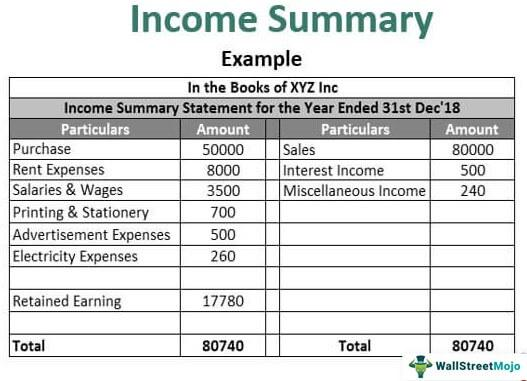

The financial services industry is undergoing significant transformation, particularly in the post-trade processing domain, driven by advancements in technology and the increasing prevalence of algorithmic trading. At the core of this evolution is Omgeo, a subsidiary of the Depository Trust & Clearing Corporation (DTCC), which plays a pivotal role in enhancing the efficiency of post-trade operations. Omgeo provides automated solutions that streamline various aspects of trade processing, such as trade allocation, confirmation, and settlement, thereby reducing time consumption and minimizing errors in trade workflows.

The integration of technological advancements in post-trade processing is profoundly influenced by the rise of algorithmic trading—trading strategies that utilize algorithms to automate trading decisions at speeds and frequencies far surpassing human capabilities. Algorithmic trading's reliance on swift and precise post-trade processes underscores the necessity for robust and efficient systems like those offered by Omgeo. These systems help in managing the complexities and volatilities associated with high-frequency trading, further enhancing market liquidity and operational efficiency.



Efficient post-trade processes are critical in mitigating counterparty and compliance risks. Omgeo's services facilitate timely confirmations and settlements, which are essential in reducing the risk of trade failures and disputes between trading parties. These efficient processes are not only vital for operational risk management but are also crucial in ensuring compliance with stringent financial regulations designed to safeguard market integrity.

In this article, we will explore several key aspects. We will define post-trade processing and its fundamental role in financial markets. The article will investigate Omgeo's contribution in automating and improving post-trade workflows and how these enhancements align with the burgeoning field of algorithmic trading. The analysis will further delve into the benefits and strategic advantages that can be harnessed through the combined application of Omgeo's solutions and algorithmic trading strategies. Finally, we will look into future trends that promise to shape the landscape of post-trade processing, including developments in artificial intelligence and blockchain, which may revolutionize the efficiency and security of financial transactions. Through this exploration, financial industry stakeholders will gain insight into the necessity of integrating advanced post-trade solutions to enhance risk management and operational efficiency in a rapidly evolving market environment.

## Table of Contents

## Understanding Post-Trade Processing

Post-trade processing plays a crucial role in the financial market ecosystem by ensuring that executed trades are accurately recorded, confirmed, and settled. This process involves several sequential steps, each critical to maintaining market stability and mitigating risks. 

The process begins with trade allocation, where the executed trade is divided among the appropriate accounts or portfolios based on predetermined agreements. This step is crucial for investment managers who often handle multiple accounts and need efficient systems to allocate trades correctly. Following allocation, the trade confirmation step occurs, which involves verifying trade details between the buyer and the seller to ensure accuracy and agreement. This step is essential for identifying and rectifying discrepancies promptly, thus preventing potential financial losses or disputes. Lastly, the settlement phase finalizes the trade, involving the transfer of securities and cash between parties. Settlement ensures that ownership of securities is changed and that payment is made, completing the transaction.

Efficient post-trade processing is vital for market stability and risk mitigation. By reducing the time and errors in these processes, financial institutions can lower counterparty risk—the risk that one party in the transaction may default. Additionally, it enhances [liquidity](/wiki/liquidity-risk-premium) and strengthens the reliability of the financial markets by ensuring trades are executed smoothly and accurately.

Traditional post-trade processing methods have often been fraught with operational inefficiencies. These include manual data entry, which is time-consuming and prone to human error, and the reliance on paper-based systems, which can delay the completion of crucial steps like confirmation and settlement. Such inefficiencies can lead to increased operational costs and the potential for settlement failures, adversely impacting financial institutions and the broader market. As the financial industry becomes more complex and the [volume](/wiki/volume-trading-strategy) of trades increases, overcoming these challenges through automation and improved technologies becomes imperative for maintaining a competitive edge and ensuring market integrity.

## Omgeo's Role and Services

Omgeo, founded as a joint venture between the Depository Trust & Clearing Corporation (DTCC) and Thomson Reuters, represents a significant entity in the post-trade processing landscape within the financial services industry. Established to address the growing need for improved efficiency in post-trade workflows, Omgeo emerged as a crucial player in facilitating seamless trade processing from the point of execution through to settlement. Its evolution alongside its parent companies has allowed Omgeo to create a robust suite of services that cater to the dynamic demands of global financial markets.

Omgeo's primary services include trade allocation, confirmation/affirmation, and settlement notification. These services are pivotal in ensuring accurate and timely communication between parties involved in a trade, thereby reducing the likelihood of discrepancies and settlement failures. By standardizing and automating these processes, Omgeo aids investment managers and brokers in achieving optimal operational efficiency. Automation is crucial, as it not only accelerates transaction processing times but also significantly minimizes manual intervention, reducing the potential for human error and operational risk.

Among Omgeo's suite of products, the Omgeo Central Trade Manager (CTM) is a flagship offering. CTM is a global platform for the central matching of cross-border and domestic transactions, facilitating automated trade matching and lifecycle management processes. It serves as a single point of access, enabling participants to input, view, and confirm trade details in near real-time, thereby enhancing the speed and accuracy of trade confirmations.

Another vital tool provided by Omgeo is Omgeo OASYS, a system designed for U.S. domestic trade allocation and acceptance. OASYS streamlines the communication process by enabling brokers and investment managers to transmit allocations and confirmations electronically. This ensures that the details of trades are clearly communicated and agreed upon, paving the way for smoother settlement processes.

ProtoColl is another significant offering from Omgeo, focusing on collateral management. It supports the end-to-end collateral management process, including exposure management and collateral optimization. By offering a comprehensive view of collateral positions and automating manual processes, ProtoColl assists firms in managing collateral-related risks more efficiently.

Omgeo's suite of services and products exemplifies its commitment to enhancing post-trade processing efficiency and accuracy. By providing sophisticated tools that automate and simplify critical processes, Omgeo empowers financial institutions to reduce risk, comply with regulatory requirements, and optimize their post-trade operations in an increasingly complex trading environment.

## Integration with Algorithmic Trading

Algorithmic trading has significantly transformed financial markets by employing complex algorithms to automate trade execution processes. This rise primarily stems from its ability to handle vast volumes of trades at speeds and accuracies far beyond human capabilities. Nonetheless, the efficacy of [algorithmic trading](/wiki/algorithmic-trading) heavily relies on seamless integration with post-trade processes to ensure timely settlement and reduce the risk of errors.

Omgeo's suite of services plays a crucial role in complementing algorithmic trading by offering solutions that streamline post-trade processing. The efficiency of Omgeo's systems, such as the Omgeo Central Trade Manager, allows for expedited allocation, confirmation/affirmation, and settlement notification, which are vital in the high-speed environment of algorithmic trading. These systems mitigate delays and errors that could arise from manual data entry, enhancing the overall reliability of trading operations.

Moreover, Omgeo's integration capabilities with various algorithmic trading platforms ensure that post-trade instructions are automatically generated and communicated, minimizing human intervention. This integration reduces processing times, allowing traders and investment managers to quickly confirm trades and proceed to settlement. This rapid turnaround is crucial as it directly affects the capacity to reinvest funds and capture additional market opportunities.

One illustrative case is the adoption of Omgeo services by a major investment firm that invested heavily in algorithmic trading technologies. By integrating Omgeo Central Trade Manager, the firm experienced a 30% reduction in trade processing times. This improvement not only increased operational efficiency but also enhanced the firm's ability to manage its liquidity more dynamically.

In summary, Omgeo's services are instrumental in maintaining the speed and precision required by algorithmic trading systems. By minimizing errors and reducing processing times, Omgeo enhances trade efficiency and provides a competitive edge to market participants engaged in high-frequency trading activities.

## Benefits and Strategic Advantages

Using Omgeo in conjunction with algorithmic trading provides numerous benefits, including heightened transparency and reduced financial risk. Omgeo's suite of solutions plays a pivotal role in transforming complex post-trade operations into seamless processes that are critically important for the efficiency and reliability of algorithmic trading systems. Enhanced transparency is achieved through Omgeo's ability to automate and expedite the trade confirmation and settlement process. This automation ensures that every trade is tracked, confirmed, and settled with precision, reducing the opportunity for discrepancies and errors. In algorithmic trading, where high-frequency transactions occur continuously, any delay or inaccuracy can lead to significant financial losses. By minimizing these risks, Omgeo's solutions enable algorithmic traders to focus on strategy execution rather than backend operations.

Businesses leveraging automated post-trade solutions, like those offered by Omgeo, gain substantial competitive advantages. Automation reduces the time and resources needed to handle post-trade activities, allowing financial institutions to allocate more resources to strategic business functions. This efficiency not only lowers operational costs but also improves the institution's capacity to scale operations alongside market demands. High levels of accuracy and reduced settlement times provide firms with a superior operational framework that supports faster trade processing and reconciliation, which is essential in a landscape dominated by rapid algorithmic transactions.

Furthermore, Omgeo's services lend critical support in navigating the ever-evolving regulatory environment. Regulatory frameworks impose stringent requirements to ensure market integrity and financial stability. Omgeo's comprehensive solutions come equipped with features that ensure adherence to these norms, thereby offering institutions a built-in compliance advantage. Elements such as automatic record-keeping, audit trails, and real-time reporting are crucial not only for meeting current regulatory obligations but also for adjusting to future changes in financial regulations. By using Omgeo, financial entities can remain agile and compliant, thereby fortifying their market position and protecting their reputational capital. 

In conclusion, the combination of Omgeo's streamlined post-trade solutions and algorithmic trading systems profoundly enhances operational transparency, reduces financial risks, and ensures compliance, providing financial organizations with a robust foundation for long-term success in today's dynamic market landscape.

## Future Trends in Post-Trade Processing

As the financial services industry progresses, the landscape of post-trade processing continues to evolve, driven by technological innovations that aim to increase efficiency, reduce risk, and enhance compliance. Two major technological frontiers shaping the future of post-trade processing are [artificial intelligence](/wiki/ai-artificial-intelligence) (AI) and blockchain technology.

### Developments in Omgeo's Offerings

Omgeo, a leader in providing post-trade processing solutions, is anticipated to integrate advanced technologies, enabling more seamless and efficient processes. An example could be the enhancement of Omgeo's Central Trade Manager (CTM) system with AI capabilities to predict settlement failures and optimize trade matching algorithms. By applying [machine learning](/wiki/machine-learning) models, Omgeo can analyze historical trade data to identify patterns that might lead to discrepancies or errors in confirmations and settlements. This proactive approach allows financial firms to address potential issues before they escalate, minimizing counterparty risks and operational costs.

Another area of development might be incorporating real-time analytics and monitoring tools, providing users with more control and insight into their trading processes. These tools would allow better tracking of trade life cycles and quicker management responses to changing market conditions.

### AI Integration in Post-Trade Processing

Artificial intelligence has the potential to revolutionize post-trade processing by automating complex tasks and improving decision-making processes. AI-driven systems can facilitate natural language processing (NLP) to handle communications and confirmations, allowing more accurate and efficient processing of trade instructions. Moreover, intelligent process automation can help reduce manual intervention, thus decreasing human error and operational time. Advanced AI algorithms can also enhance fraud detection systems by identifying unusual patterns and alerting analysts in real time.

Here is a simple Python script demonstrating how machine learning could predict settlement failures:

```python
from sklearn.ensemble import RandomForestClassifier
from sklearn.model_selection import train_test_split
from sklearn.metrics import accuracy_score

# Sample data
# X: features like trading volume, time, and counterparty reliability
# y: labels indicating settlement success (1) or failure (0)
X = [[10, 5, 8], [7, 9, 5], [6, 7, 5], [10, 6, 10]]
y = [1, 0, 1, 0]

# Train-test split
X_train, X_test, y_train, y_test = train_test_split(X, y, test_size=0.25, random_state=42)

# Model instantiation and training
model = RandomForestClassifier()
model.fit(X_train, y_train)

# Predictions
y_pred = model.predict(X_test)

# Evaluate accuracy
accuracy = accuracy_score(y_test, y_pred)
print(f'Accuracy: {accuracy * 100:.2f}%')
```

### Blockchain Technology in Post-Trade Processing

Blockchain offers robust opportunities for transformation in post-trade processing, primarily through enhanced transparency and security. By creating a distributed ledger of transactions, blockchain can enable real-time settlement and verification processes, reducing settlement cycles significantly. This technology ensures that all transaction stakeholders have simultaneous access to a shared, immutable record, greatly reducing the need for reconciliation and the risk of fraud.

Moreover, smart contracts—self-executing contracts with terms directly written into code—could automate settlement and compliance tasks based on predefined conditions. This automation would facilitate significant reductions in processing times and compliance exposures.

### Conclusion

The integration of AI and blockchain into post-trade processing presents vast potential for increasing operational efficiency, accuracy, and compliance. As Omgeo and other industry leaders harness these technological advancements, the post-trade landscape will witness substantial efficiencies and risk reductions, embodying the future of financial services.

## Conclusion

Omgeo has played a pivotal role in streamlining post-trade processing, which remains a critical component of the financial services industry. By offering automation and efficiency enhancements, Omgeo addresses the evolving demands of the market, where speed, accuracy, and compliance are more important than ever before. The successful integration of Omgeo's solutions with algorithmic trading has demonstrated a strategic advantage, allowing financial entities to execute trades with increased transparency and reduced risk exposure. This integration ensures that post-trade activities keep pace with the rapid execution speeds characteristic of algorithmic trading, thereby minimizing processing times and the likelihood of errors.

For financial industry stakeholders, adopting advanced post-trade solutions like those offered by Omgeo presents an opportunity to improve risk management and operational efficiency. As market participants seek competitive advantages, leveraging such technology allows for enhanced compliance with stringent regulatory requirements, ensuring robustness in the face of geopolitical and market shifts.

Looking forward, the future of post-trade processing in financial services promises to be shaped by advancements in technology, such as artificial intelligence and blockchain. These technologies have the potential to further revolutionize the post-trade landscape, making processes even more resilient and adaptable. Omgeo, as a leading entity in this space, will likely continue to evolve its services, ensuring they remain aligned with industry needs and technological progress. For participants across the financial sector, embracing these innovations will be crucial for maintaining a competitive edge in an increasingly complex and fast-paced market environment.

## References & Further Reading

[1]: Lopez de Prado, M. (2018). ["Advances in Financial Machine Learning"](https://www.amazon.com/Advances-Financial-Machine-Learning-Marcos/dp/1119482089). Wiley.

[2]: Chan, E. P. (2008). ["Quantitative Trading: How to Build Your Own Algorithmic Trading Business"](https://github.com/ftvision/quant_trading_echan_book). Wiley.

[3]: Aronson, D. R. (2006). ["Evidence-Based Technical Analysis: Applying the Scientific Method and Statistical Inference to Trading Signals"](https://www.amazon.com/Evidence-Based-Technical-Analysis-Scientific-Statistical/dp/0470008741). Wiley.

[4]: Bergstra, J., Bardenet, R., Bengio, Y., & Kégl, B. (2011). ["Algorithms for Hyper-Parameter Optimization"](https://dl.acm.org/doi/10.5555/2986459.2986743). Advances in Neural Information Processing Systems 24.

[5]: Jansen, S. (2020). ["Machine Learning for Algorithmic Trading"](https://github.com/stefan-jansen/machine-learning-for-trading). Packt Publishing.