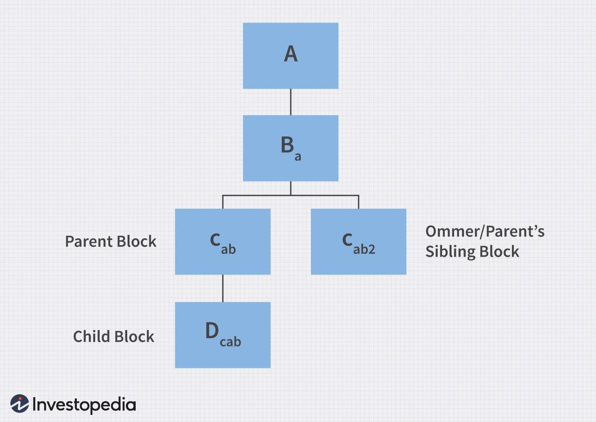

## Table of Contents

## What is an Ommer block in cryptocurrency?

An Ommer block, also known as an uncle block, is a term used in some cryptocurrencies like Ethereum. It refers to a block that was mined at the same time as another block but didn't get added to the main blockchain. This happens because multiple miners can solve the puzzle to create a new block at the same time, but only one block can be added to the chain.

Even though an Ommer block isn't part of the main blockchain, it's still important. In Ethereum, miners who create Ommer blocks can still get a small reward. This helps keep the network secure and encourages more people to mine, even if their block doesn't make it to the main chain.

## How is an Ommer block different from an uncle block?

An Ommer block and an uncle block are actually the same thing, just with different names. In the world of cryptocurrencies like Ethereum, when two miners solve the puzzle to create a new block at the same time, only one block can be added to the main blockchain. The block that doesn't get added is called an Ommer block or an uncle block.

The term "uncle block" was used first, but some people thought it was not inclusive because it used family terms that only included men. So, they came up with "Ommer block" as a more inclusive term. It means the same thing as an uncle block but can refer to any gender. Both terms are used to describe a block that is valid but not part of the main blockchain, and miners can still get a small reward for creating these blocks.

## Why are Ommer blocks important in blockchain networks?

Ommer blocks are important in blockchain networks because they help keep the network fair and secure. When miners work to add new blocks to the blockchain, sometimes two miners finish at the same time. Only one block can be added to the main chain, and the other becomes an Ommer block. By giving a small reward to the miner who created the Ommer block, the network makes sure that miners don't feel discouraged if their block doesn't get added. This encourages more people to keep mining, which makes the network stronger and more secure.

Ommer blocks also help to speed up the blockchain. In networks like Ethereum, if a block is an Ommer block, it can still be used to help confirm transactions faster. This is because the information in the Ommer block can be used by the next blocks in the chain. So, even though an Ommer block isn't part of the main chain, it still plays a role in making the whole system work better and faster.

## How are Ommer blocks created in the Ethereum network?

Ommer blocks happen in the Ethereum network when two miners solve the puzzle to make a new block at the same time. Only one block can be added to the main chain, so the other block becomes an Ommer block. This is like a race where two people finish at the same time, but only one can win the prize. The other person still did a good job, but they don't get the main reward.

Even though an Ommer block doesn't get added to the main chain, it's still important. The miner who made the Ommer block gets a small reward. This keeps miners happy and encourages them to keep working, which makes the Ethereum network stronger and safer. Ommer blocks also help the network work faster because the information in them can be used by the next blocks, even if they're not part of the main chain.

## What role do Ommer blocks play in the security of a blockchain?

Ommer blocks help keep a blockchain safe by making sure miners keep working hard. When two miners finish making a new block at the same time, only one block can be added to the main chain. The other block becomes an Ommer block. Even though it doesn't get added to the main chain, the miner who made the Ommer block still gets a small reward. This keeps miners happy and encourages them to keep mining, which makes the blockchain stronger and safer.

Ommer blocks also help the blockchain work better. They can be used by the next blocks in the chain to help confirm transactions faster. This means that even if an Ommer block isn't part of the main chain, it still helps the whole system run smoothly. By rewarding miners for Ommer blocks, the network stays fair and secure, and everyone keeps working together to keep the blockchain safe.

## How does the inclusion of Ommer blocks affect the mining process?

When miners work to add new blocks to a blockchain like Ethereum, sometimes two miners finish at the same time. Only one block can be added to the main chain, and the other becomes an Ommer block. This means that even if a miner's block doesn't make it to the main chain, they still get a small reward. This keeps miners happy and encourages them to keep working hard. If miners didn't get any reward for their extra work, they might stop mining, which would make the blockchain less safe.

Ommer blocks also help the mining process run more smoothly. Even though an Ommer block isn't part of the main chain, the information in it can be used by the next blocks. This helps the blockchain confirm transactions faster. By including Ommer blocks and giving rewards for them, the whole system works better. Miners feel good about their work, and the blockchain stays strong and secure.

## What are the incentives for miners to include Ommer blocks?

Miners get a small reward for making Ommer blocks. This reward is important because it keeps miners happy even if their block doesn't get added to the main chain. If miners didn't get any reward for their hard work, they might stop mining. This would make the blockchain less safe because fewer people would be working to keep it secure.

Ommer blocks also help the blockchain work better. Even though an Ommer block isn't part of the main chain, the information in it can still be used by the next blocks. This helps the blockchain confirm transactions faster. By giving miners rewards for Ommer blocks, the whole system stays strong and secure, and everyone keeps working together to make the blockchain run smoothly.

## How do Ommer blocks impact the overall transaction throughput of a blockchain?

Ommer blocks help make the blockchain work faster. When a block becomes an Ommer block, it doesn't get added to the main chain, but the information in it can still be used by the next blocks. This means that even though an Ommer block isn't part of the main chain, it helps the blockchain confirm transactions more quickly. By using the information from Ommer blocks, the blockchain can process more transactions in less time.

This faster transaction processing is good for everyone using the blockchain. More transactions can be confirmed in a shorter amount of time, which makes the whole system more efficient. Ommer blocks help keep the network running smoothly and quickly, which is important for keeping users happy and the blockchain working well.

## Can Ommer blocks be used to detect and prevent 51% attacks?

Ommer blocks can help make a blockchain safer, but they don't directly stop 51% attacks. A 51% attack happens when one group controls more than half of the mining power, which lets them control the blockchain. Ommer blocks don't change how much mining power someone has, so they can't stop this kind of attack on their own.

However, Ommer blocks can still help keep the blockchain strong. By giving miners a small reward for making Ommer blocks, more people are encouraged to keep mining. This means more miners are working to keep the blockchain safe, which makes it harder for any one group to take control. So, while Ommer blocks don't directly prevent 51% attacks, they help keep the network fair and secure, which makes these attacks less likely to happen.

## What are the technical challenges associated with managing Ommer blocks?

Managing Ommer blocks can be tricky because they need to be handled carefully to keep the blockchain working well. When two miners finish making a new block at the same time, only one can be added to the main chain. The other becomes an Ommer block. The blockchain needs to keep track of these Ommer blocks and make sure they are used correctly to help speed up transactions. If the system doesn't handle Ommer blocks properly, it could slow down the blockchain or cause problems with confirming transactions.

Another challenge is making sure miners get their rewards for Ommer blocks. The system has to calculate the right amount of reward for these blocks, which is less than what they get for blocks on the main chain. If the rewards aren't given out correctly, miners might feel cheated and stop mining. This would make the blockchain less safe. So, it's important for the blockchain to manage Ommer blocks well to keep miners happy and the whole system running smoothly.

## How have Ommer block policies evolved in different blockchain implementations?

Ommer block policies have changed over time in different blockchains. In Ethereum, Ommer blocks were first called uncle blocks. They were used to help miners who made blocks at the same time as others but didn't get added to the main chain. Ethereum gave miners a small reward for these Ommer blocks to keep them happy and encourage them to keep mining. This helped the network stay strong and safe. As time went on, Ethereum changed the name to Ommer blocks to be more inclusive, but the idea stayed the same.

Other blockchains have their own ways of dealing with Ommer blocks. Some blockchains don't use Ommer blocks at all, while others have different rules for them. For example, some might give bigger or smaller rewards for Ommer blocks, or they might handle them differently to make the blockchain faster or safer. The way Ommer blocks are used can depend on what the blockchain is trying to achieve, like faster transactions or more security. As blockchains keep growing and changing, the policies for Ommer blocks might keep evolving too.

## What future developments might affect the role of Ommer blocks in blockchain technology?

In the future, changes in how blockchains work might change the role of Ommer blocks. As blockchains get better and faster, the way they handle Ommer blocks could change. For example, new ways of making blocks might mean fewer Ommer blocks happen. Or, blockchains might find new ways to use Ommer blocks to make the system even faster and safer. These changes could make Ommer blocks more important or less important, depending on what the blockchain needs.

Also, as more people use blockchains, the rules for Ommer blocks might change. If lots of people are using a blockchain, it might need to be very fast and safe. This could mean new rules for Ommer blocks to help with that. Or, if people start using blockchains in new ways, like for things other than money, the role of Ommer blocks might change to fit those new uses. So, the future of Ommer blocks will depend on how blockchains keep growing and changing.

## References & Further Reading

[1]: ["Mastering Ethereum: Building Smart Contracts and DApps"](https://www.amazon.com/Mastering-Ethereum-Building-Smart-Contracts/dp/1491971940) by Andreas M. Antonopoulos and Gavin Wood

[2]: Lerner, S. D. (2013). "[DagCoin: a cryptocurrency without blocks](https://bitslog.com/2015/09/11/dagcoin/)." Bitslog.

[3]: [Ethereum Whitepaper](https://ethereum.org/en/whitepaper/) by Vitalik Buterin

[4]: Decker, C., & Wattenhofer, R. (2013). ["Information propagation in the Bitcoin network."](https://ieeexplore.ieee.org/document/6688704) IEEE P2P 2013 Proceedings.

[5]: ["The Science of Algorithmic Trading and Portfolio Management"](https://www.sciencedirect.com/book/9780124016897/the-science-of-algorithmic-trading-and-portfolio-management) by Robert Kissell