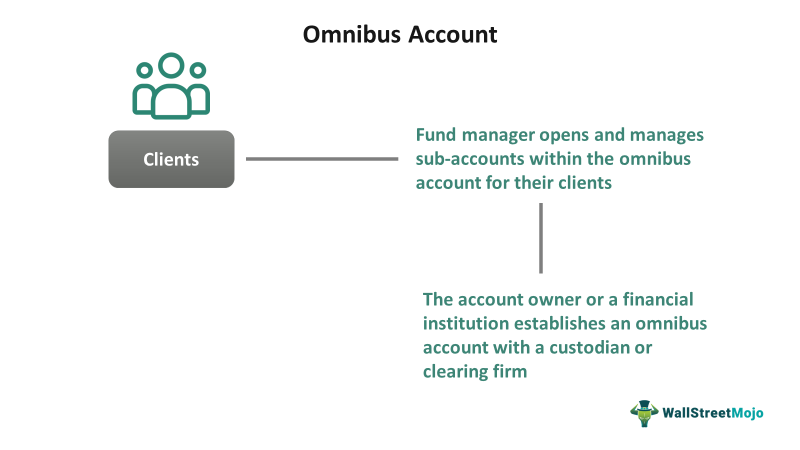

In today's dynamic financial landscape, efficient account management and strategic trading are essential for success. This article investigates how account management, omnibus accounts, financial accounts, and algorithmic trading converge to enhance trading strategies and ensure robust financial management. By exploring these interrelated components, the article aims to provide a comprehensive understanding crucial for navigating modern financial markets effectively. 

Account management is pivotal for overseeing and handling financial portfolios, ensuring assets are optimized to meet financial goals. Omnibus accounts, which pool multiple clients' assets under a single broker, offer anonymity and streamlined operations. Financial accounts, encompassing various types such as checking and investment accounts, record crucial transactions that mirror the financial health of entities. 



Algorithmic trading has revolutionized market dynamics by automating order execution through pre-set rules, offering unparalleled speed and precision. These elements work in tandem, crafting a framework for efficient trading and strategic asset management, essential for operating in today's complex financial environment. 

The accompanying sections will detail the definitions, benefits, challenges, and evolving trends associated with these concepts, equipping financial professionals and investors with the necessary insights to thrive in contemporary markets. Understanding these intricate relationships will be key to recognizing and leveraging emerging opportunities within this ever-evolving sector.

## Table of Contents

## Understanding Account Management

Account management is a critical aspect of financial operations, encompassing the oversight and administration of financial portfolios and transactions for both individuals and organizations. The primary objective of effective account management is to manage assets in a way that aligns with the financial goals of the client or organization. This involves conducting risk assessments to identify potential financial threats and taking measures to mitigate these risks. For instance, a risk manager might evaluate the volatility of certain stocks and suggest a diversified investment strategy to reduce exposure.

Another crucial component of account management is performance monitoring. This involves regularly reviewing the performance of investments to ensure they are meeting expectations and making adjustments as necessary. Performance monitoring can involve quantitative measures, such as calculating the return on investment (ROI) or analyzing the Sharpe ratio to determine the risk-adjusted return. Strategic planning is also integral, requiring financial professionals to develop long-term plans that encompass budgeting, investing, and other financial activities aimed at asset growth and protection.

In trading, account management is essential for maintaining balanced and optimized portfolios. Traders must constantly assess their positions and realign portfolio allocations to respond to market changes proactively. For example, if a particular sector is predicted to grow, a trader might increase exposure to equities within that sector while reducing holdings in areas with dimming prospects. 

Technological advancements have dramatically reshaped traditional account management practices. Automation, powered by algorithms and [artificial intelligence](/wiki/ai-artificial-intelligence), has introduced efficiency by reducing human intervention in routine tasks. Automated systems can conduct real-time risk assessments and portfolio rebalancing, ensuring that decisions are data-driven and timely. Besides improving operational efficiency, automation also enhances accuracy, minimizing errors that typically occur with manual processes.

Python, a popular programming language in finance, is frequently used to implement automation in account management. Through libraries like Pandas and NumPy, financial professionals can automate data analysis processes, while tools like Jupyter Notebooks facilitate the interactive exploration of trading strategies. The following Python code snippet demonstrates a simple automated risk assessment calculation using the [volatility](/wiki/volatility-trading-strategies) of an asset:

```python
import pandas as pd
import numpy as np

# Sample data: daily returns of a portfolio
returns = pd.Series([0.02, -0.01, 0.015, -0.005, 0.01])

# Calculate the volatility as the standard deviation of returns
volatility = np.std(returns)
print(f"Portfolio Volatility: {volatility:.2%}")
```

In summary, account management plays a pivotal role in financial success, marrying strategic oversight with technological innovation to ensure that assets are managed efficiently and effectively. As financial markets continue to evolve, the importance and complexity of account management will only grow, necessitating a blend of traditional financial acumen and modern technological proficiency.

## What Are Omnibus Accounts?

An omnibus account is a type of pooled account wherein the assets and trades of multiple clients are consolidated under a single broker's name. This structure offers several advantages, including enhanced client anonymity and increased trading efficiency. By consolidating transactions, omnibus accounts streamline administrative processes and help reduce transaction costs. They are prominently utilized in futures and securities markets due to these efficiencies and operational advantages.

Omnibus accounts function by aggregating multiple client transactions into larger blocks, facilitating smoother and faster processing. This aggregation minimizes the paperwork and transaction overhead typically associated with handling individual client accounts. As a result, brokers can achieve economies of scale, translating to cost-saving benefits for both the brokers and their clients.

Despite these benefits, omnibus accounts are subject to various regulatory concerns. One significant issue is the potential risk of money laundering, given the anonymity such accounts afford. Regulatory bodies are vigilant in monitoring these accounts to ensure compliance with anti-money laundering (AML) standards. To mitigate these risks, brokers must implement stringent risk assessment procedures and maintain transparent records to satisfy regulatory requirements. 

The operational efficacy of omnibus accounts in facilitating large-scale trades without overwhelming administrative processes makes them a critical tool in modern financial markets. However, balancing the benefits of efficiency and anonymity against the need for regulatory compliance remains a continual challenge. Thus, brokers must carefully manage these accounts to optimize their advantages while adhering to the necessary legal and regulatory frameworks.

## Financial Accounts: Types and Importance

Financial accounts are fundamental components of the financial system, acting as structured records of financial transactions, assets, and liabilities for individuals, corporations, and other entities. These accounts are crucial for different purposes, including daily financial management, investment planning, and regulatory compliance. The primary types of financial accounts include checking accounts, savings accounts, money market accounts, and investment accounts.

1. **Checking Accounts**: These are transactional accounts used for frequent deposits and withdrawals. They provide easy access to funds via checks, ATMs, and electronic debits. Checking accounts are essential for daily financial operations due to their liquidity.

2. **Savings Accounts**: These accounts are designed to hold money not intended for daily use, helping individuals earn interest on their deposits over time. Savings accounts limit transactions to encourage saving, making them less liquid than checking accounts, but more beneficial for accumulating capital.

3. **Money Market Accounts**: Combining features of both checking and savings accounts, money market accounts typically offer higher interest rates in exchange for higher minimum balance requirements. They allow limited check-writing privileges and are used by individuals who wish to earn interest while maintaining liquidity.

4. **Investment Accounts**: These accounts are used to hold various investment instruments such as stocks, bonds, mutual funds, and more. Investment accounts are crucial for wealth building and require strategies aligned with one's risk tolerance and financial goals. They include brokerage accounts, retirement accounts (like IRAs and 401(k)s), and education savings accounts.

Accurate financial account management is integral for maintaining transparency and compliance with financial regulations. It involves careful monitoring and recording of transactions to ensure that financial statements reflect a true and fair view of an entity's financial position. This practice is essential not only for internal decision-making but also for external reporting to investors, regulators, and other stakeholders.

Financial accounts provide valuable insights into the financial health and stability of entities. By analyzing balances and transaction history, individuals and businesses can assess [liquidity](/wiki/liquidity-risk-premium), profitability, and solvency, which are critical for strategic planning and risk management. 

The role of technology in financial account management cannot be overstated. Advancements in software and online platforms have transformed how accounts are managed, allowing for real-time analysis and reporting. Technologies such as mobile banking apps, automated alerts, and detailed financial dashboards enable users to track their finances with unprecedented accuracy and ease. This technological evolution enhances the ability to make informed decisions quickly, adapting to market changes and personal financial needs.

In summary, financial accounts are indispensable tools in the effective management of personal and organizational finances. Understanding the distinct nature and uses of each account type, along with leveraging technology for management and analysis, is key to achieving financial transparency, stability, and compliance.

## Algorithmic Trading: Revolutionizing Financial Markets

Algorithmic trading, often referred to as algo trading, leverages sophisticated computer algorithms to automate the execution of trading orders. These algorithms enable the rapid execution of trades by following pre-programmed rules and conditions, significantly enhancing the precision and speed of trading processes. This technology is particularly adept at managing large volumes of trades, making it indispensable in contemporary financial markets.

The primary advantage of [algorithmic trading](/wiki/algorithmic-trading) lies in its ability to minimize human intervention, thereby reducing errors associated with manual trading. Algorithms can assess a multitude of market variables almost instantaneously and execute trades within fractions of a second, which is crucial in taking advantage of short-lived trading opportunities. This automation not only ensures precise and swift execution but also provides consistency and discipline in trading strategies that might be challenging for human traders to sustain.

Despite its numerous benefits, algorithmic trading also presents certain challenges. One of the major concerns is the potential for technological failures. Errors in programming or unexpected technological glitches can lead to significant financial losses. A notable historical example is the Flash Crash of May 6, 2010, where algorithmic trading contributed to the rapid plunge and recovery of the U.S. stock market within minutes. Additionally, the increased reliance on algo trading can contribute to market volatility, as algorithms react to market signals in a homogenous manner, sometimes intensifying price movements.

The continued evolution of technology plays a pivotal role in shaping algorithmic trading, making it increasingly sophisticated and accessible. Advances in [machine learning](/wiki/machine-learning) and artificial intelligence are enhancing the capabilities of trading algorithms, enabling them to improve their strategies based on market conditions dynamically. Furthermore, the integration of big data analytics allows for more informed decision-making, as algorithms can process and analyze vast datasets to uncover trading patterns and insights.

Overall, while algorithmic trading revolutionizes financial markets by enhancing efficiency and performance, it necessitates robust risk management protocols and continuous technological enhancements to mitigate associated challenges and leverage its full potential.

## Integrating Omnibus Accounts with Algo Trading

The integration of omnibus accounts with algorithmic trading represents a sophisticated approach to optimizing trading operations. By leveraging the centralized structure of omnibus accounts, financial institutions can more efficiently execute algorithmic strategies. This integration provides traders with the advantage of managing numerous client assets under a singular framework, optimizing execution speed, and reducing the complexity of handling individual accounts.

Omnibus accounts, by their nature, offer anonymity for clients, which can be advantageous in executing complex algorithmic trading strategies. This anonymity ensures that sensitive client information is not exposed, reducing potential data security risks while allowing algorithms to focus on executing trades based on aggregated data without bias.

Algorithmic trading, with its roots in predefined rules and rapid execution capabilities, benefits significantly from the pooled resources of omnibus accounts. The resultant synergy allows for bulk processing of trades, helping traders to capitalize on transient market opportunities with precision and agility. Furthermore, the consolidation of trades reduces transaction costs and enhances operational efficiency, making it possible for traders to handle larger volumes without a proportional increase in administrative burdens.

Regulatory compliance remains paramount when integrating omnibus accounts with algorithmic trading systems. To ensure transparency and mitigate risks, financial institutions must adhere to existing regulations and anticipate changes to maintain integrity and trust. This involves implementing robust compliance frameworks that monitor trading activities, ensure proper reporting and auditing, and adhere to anti-money laundering (AML) requirements.

In volatile markets, the combination of omnibus accounts and algorithmic trading can lead to optimized performance. By enabling high-frequency trading strategies and facilitating quick adjustments to market conditions, traders can better manage their exposure to risk and enhance returns. The ability to rapidly analyse and respond to market data allows for improved decision-making and strategic adaptability.

In summary, the integration of omnibus accounts with algorithmic trading forms a cohesive mechanism for harnessing the benefits of both structures. Through efficient execution, preserved anonymity, and reduced transaction costs, this approach not only boosts operational efficacy but also aligns with regulatory demands. As the financial landscape evolves, leveraging these innovations will be essential for maintaining competitive advantage and achieving superior market performance.

## Challenges and Risks

Omnibus accounts and algorithmic trading, while integral to efficient financial operations, are not without their challenges and risks. For omnibus accounts, one of the primary concerns is regulatory scrutiny. These accounts, by nature, consolidate the transactions and assets of multiple clients under a single broker's name, which can obscure the true ownership and nature of financial transactions. This opacity raises concerns about potential misuse, including fraud and money laundering. Regulatory bodies across the globe strive to implement measures that curb these risks, requiring brokers to maintain detailed records that can trace individual transactions back to the original client.

Algorithmic trading, on the other hand, presents a different set of challenges primarily linked to technology. Errors in algorithms or system malfunctions can lead to significant financial losses. For example, a minor bug in code could lead to the execution of trades at incorrect prices or volumes. Moreover, the fast-paced nature of algorithmic trading can exacerbate these issues, as flawed trades can multiply before errors are detected. This necessitates a robust risk management framework that includes regular audits of algorithms, redundancy mechanisms, and fail-safes to avoid significant disruptions.

Both omnibus accounts and algorithmic trading require diligent risk management strategies to safeguard assets and maintain investor trust. These strategies must encompass comprehensive monitoring systems and real-time data analytics that can promptly identify and address operational anomalies. The complexity increases when handling omnibus accounts in global trading, as these accounts must comply with varying regulatory environments across different jurisdictions. This can involve intricate legal and compliance considerations, which necessitate expert knowledge and strategic planning.

To mitigate the risks associated with these financial instruments, continuous monitoring and adaptation to new regulatory standards are essential. This involves staying updated with regulatory changes and integrating technological advancements, such as artificial intelligence (AI) and machine learning, to enhance surveillance and compliance processes. These technologies can provide advanced tools for anomaly detection, pattern recognition, and predictive analytics, thereby strengthening the integrity of financial operations. Achieving these objectives requires a commitment to innovation and regulatory compliance, ensuring that omnibus accounts and algorithmic trading remain viable and secure components of modern finance.

## Future Outlook

As technological advancements continue to reshape the financial landscape, the future of account management, omnibus accounts, and algorithmic trading is marked by innovation and transformation. The application of artificial intelligence (AI) and machine learning in algorithmic trading is expected to bring about unprecedented enhancements in trading strategies. These technologies enable the development of sophisticated models that can handle vast amounts of data, execute trades at optimal times, and adapt to changing market conditions with improved accuracy and speed. Machine learning algorithms can analyze historical data to predict market trends, while AI can assist in dynamic decision-making processes, fostering a more adaptive trading environment.

Omnibus accounts, which consolidate multiple client portfolios, are projected to evolve by adopting stronger regulatory frameworks aimed at boosting transparency and security. Regulators across the globe are pushing for mechanisms that ensure compliance and protect investors. This will likely lead to the integration of regulatory technologies (RegTech), which utilize AI and data analytics to automate compliance processes and detect suspicious activities more effectively.

With the surge in big data analytics, financial markets stand to gain greater insights that drive more informed decision-making. Integration of big data allows for more comprehensive analysis of market dynamics, consumer behavior, and external economic factors, equipping traders and financial managers with the tools necessary for precise strategy formulation. This trend is anticipated to continue, with companies increasingly investing in data infrastructure and analytics capabilities.

Financial account management is heading towards a future characterized by increased automation and tailored investment strategies. Automation reduces manual effort, minimizes errors, and yields significant efficiencies in managing vast data sets and executing transactions. Furthermore, personalized investment strategies are becoming the norm as technology enables the customization of portfolios based on individual investor preferences, risk tolerance, and financial goals. These approaches not only enhance user experience but also improve investment outcomes over time.

Finally, staying abreast of technological trends and regulatory changes is critical for entities within the financial services sector. Rapid innovation presents opportunities, but also necessitates a proactive stance towards learning and adaptation. Institutions that prioritize technology integration, foster agile methodologies, and maintain robust compliance systems will be well-positioned to capitalize on emerging opportunities while mitigating associated risks. This dynamic environment underscores the importance of continuous education and strategic planning in navigating future financial markets successfully.

## Conclusion

Account management, omnibus accounts, financial accounts, and algorithmic trading are integral components within the modern financial landscape, each playing a crucial role in shaping efficient trading frameworks, strategic asset management, and enhanced market operations. Collectively, these elements create a robust infrastructure that allows investors and financial institutions to navigate the fast-paced and often complex dynamics of today's markets.

While these components promise significant benefits, they also bring with them distinct challenges and risks, particularly in terms of regulatory compliance. The use of omnibus accounts, for instance, provides a streamlined approach to handling large volumes of client trades, yet raises concerns about transparency and potential misuse in the absence of stringent oversight. Similarly, algorithmic trading offers unparalleled speed and efficiency, but is susceptible to technological failures and associated market volatilities which necessitate robust risk management practices.

A thorough understanding of these concepts is essential for investors and finance professionals aiming to manage the intricacies of modern financial markets effectively. By grasping the interplay between various financial accounts, the innovative potential of algorithmic strategies, and the pragmatic yet cautious utilization of omnibus accounts, stakeholders can better position themselves amidst the rapidly evolving financial ecosystem.

As technology continues to advance, embracing these innovations will be key to unlocking new opportunities in finance. Developments in artificial intelligence, machine learning, and big data analytics are poised to further refine and enhance these financial tools, offering deeper insights and facilitating more informed decision-making processes. Staying abreast of technological trends and continuously adapting to regulatory updates will be vital for maintaining a competitive edge and ensuring sustainable growth in the financial services industry.

## References & Further Reading

[1]: Grobys, K., & Heinonen, S. (2016). ["The Wealth of Algorithmic Traders - Evidence from a Modern Market Microstructure."](https://onlinelibrary.wiley.com/doi/10.1111/jfir.12205) Research in International Business and Finance, 38, 124-136.

[2]: Hull, J. (2017). ["Risk Management and Financial Institutions."](https://books.google.com/books/about/Risk_Management_and_Financial_Institutio.html?id=1J1QDwAAQBAJ) Wiley.

[3]: Easley, D., Lopez de Prado, M. J., & O'Hara, M. (2012). ["Flow Toxicity and Liquidity in a High-Frequency World."](https://www.semanticscholar.org/paper/Flow-Toxicity-and-Liquidity-in-a-High-Frequency-Easley-Prado/9369430bd005d194f9332ae7cbd5a57ace5e9ab3) The Review of Financial Studies, 25(5), 1457–1493.

[4]: Preuss, D., & Werner, J. (2019). ["The Regulatory Challenge of Omnibus Accounts: A Cross-Country Comparison."](https://files.eric.ed.gov/fulltext/EJ1379102.pdf) SSRN Electronic Journal.

[5]: Aldridge, I. (2013). ["High-Frequency Trading: A Practical Guide to Algorithmic Strategies and Trading Systems."](https://www.amazon.com/High-Frequency-Trading-Practical-Algorithmic-Strategies/dp/1118343506) Wiley Finance.