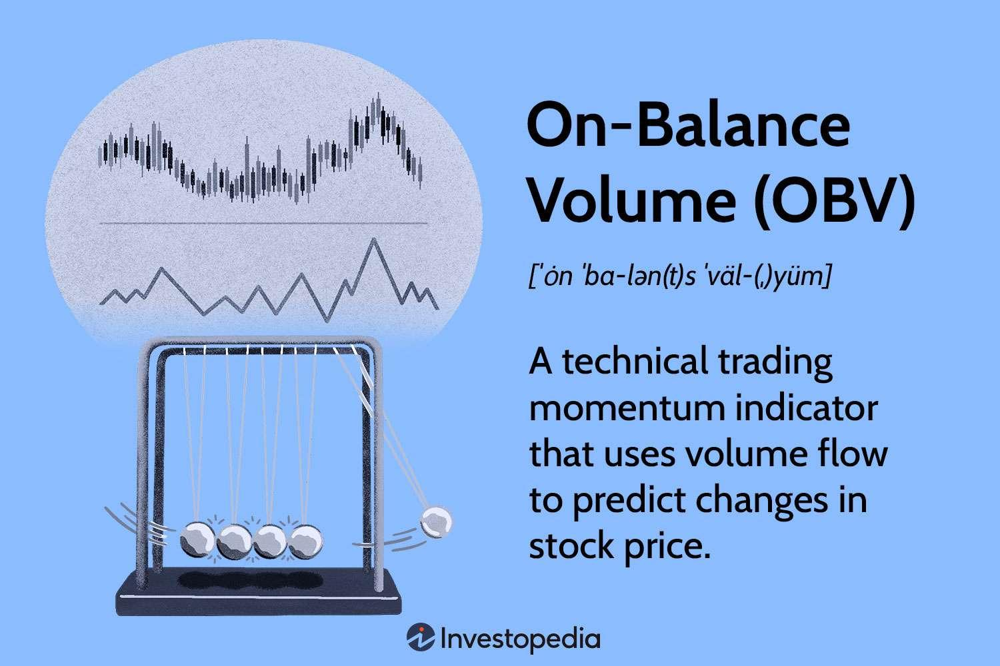

## Table of Contents

## What is On-Balance Volume (OBV)?

On-Balance Volume (OBV) is a technical indicator used in stock trading to predict price movements based on volume changes. It works by adding the volume on days when the price goes up and subtracting the volume on days when the price goes down. The idea behind OBV is that volume changes can signal future price movements. If the OBV line is going up, it means that the buying pressure is increasing, which might lead to higher prices. If the OBV line is going down, it means that the selling pressure is increasing, which might lead to lower prices.

OBV is useful because it helps traders see the flow of volume in and out of a stock. For example, if a stock's price is going up but the OBV is going down, it might mean that the price increase is not supported by strong buying volume and could be a warning sign of a possible price drop. Traders use OBV along with other indicators to make better decisions about when to buy or sell a stock. It's a simple tool but can be very helpful in understanding market trends and making trading decisions.

## Who developed the On-Balance Volume indicator?

The On-Balance Volume (OBV) indicator was created by a man named Joe Granville. He was a well-known stock market analyst and writer. Joe Granville came up with the OBV in the 1960s. He wanted to find a way to use volume to predict how stock prices might move in the future.

Joe Granville believed that volume was very important for understanding what was happening in the stock market. He thought that by looking at whether volume was going up or down along with price changes, traders could get a better idea of whether a stock's price would keep going up or start to go down. His idea was simple but powerful, and the OBV indicator became a popular tool that many traders still use today.

## How does OBV help in understanding market trends?

OBV helps in understanding market trends by showing how volume is moving in and out of a stock. When the OBV line goes up, it means more people are buying the stock, which can be a sign that the price might keep going up. On the other hand, if the OBV line goes down, it means more people are selling, which can be a warning that the price might start to drop. By looking at the OBV, traders can see if the volume is supporting the price movement, which helps them predict what might happen next.

For example, if a stock's price is going up but the OBV is going down, it could mean that the price increase is not strong and might not last. This can help traders decide if they should buy, sell, or hold the stock. By using OBV along with other indicators, traders can get a fuller picture of what's happening in the market and make better decisions. It's like having another piece of the puzzle to help understand where the market might be headed.

## What is the basic formula used to calculate OBV?

The basic formula for calculating On-Balance Volume (OBV) is simple. You start with an initial OBV value, usually set to zero. Then, for each trading day, you look at the closing price of the stock. If the closing price is higher than the previous day's closing price, you add the day's volume to the OBV. If the closing price is lower than the previous day's closing price, you subtract the day's volume from the OBV. If the closing price is the same as the previous day's closing price, the OBV stays the same.

This formula helps track the flow of volume in and out of a stock. By adding volume when the price goes up and subtracting it when the price goes down, the OBV line shows whether buying or selling pressure is stronger. If the OBV line is going up over time, it means more people are buying, which could mean the price might keep going up. If the OBV line is going down, it means more people are selling, which could mean the price might start to drop. This helps traders understand what might happen to the stock price in the future.

## Can you explain the process of updating OBV values with each new price bar?

To update the On-Balance Volume (OBV) values with each new price bar, you start with an initial OBV value, which is usually set to zero. Then, for each new trading day, you look at the closing price of the stock. If the closing price of the new day is higher than the closing price of the previous day, you add the volume of the new day to the current OBV value. If the closing price of the new day is lower than the closing price of the previous day, you subtract the volume of the new day from the current OBV value. If the closing price of the new day is the same as the closing price of the previous day, the OBV value stays the same.

By following this simple rule for each new price bar, you can keep the OBV updated. This helps you see how the volume is moving in and out of the stock. If the OBV line goes up over time, it means more people are buying, which might mean the price could keep going up. If the OBV line goes down, it means more people are selling, which might mean the price could start to drop. This way, the OBV helps you understand what might happen to the stock price in the future.

## How does OBV differ from other volume-based indicators like Accumulation/Distribution?

On-Balance Volume (OBV) and Accumulation/Distribution (A/D) are both volume-based indicators, but they work a bit differently. OBV is pretty simple. It adds the volume of a day to the total if the stock price goes up, and subtracts it if the price goes down. This means OBV looks at the overall flow of volume in and out of a stock. If the OBV line goes up, it means more people are buying, which might push the price up. If it goes down, more people are selling, which might push the price down.

On the other hand, Accumulation/Distribution (A/D) takes a closer look at where the stock price is within its daily range. It uses the closing price compared to the high and low of the day to figure out if the stock is being accumulated (bought) or distributed (sold). If the stock closes near the high of the day, A/D adds more of the day's volume to its total. If it closes near the low, it subtracts more. This makes A/D a bit more sensitive to price movements within the day, while OBV focuses more on the direction of the price from one day to the next. Both can help traders understand market trends, but they do it in slightly different ways.

## What are the common signals traders look for when using OBV?

When traders use On-Balance Volume (OBV), they look for certain signals to help them understand what might happen with a stock's price. One common signal is when the OBV line starts to go up while the stock price is still going down. This is called a bullish divergence. It might mean that even though the price is falling, more people are starting to buy the stock, and the price could start to go up soon.

Another signal traders watch for is when the OBV line starts to go down while the stock price is still going up. This is called a bearish divergence. It might mean that even though the price is rising, more people are starting to sell the stock, and the price could start to go down soon. By looking at these signals, traders can get a better idea of whether the stock's price might keep going in the same direction or start to change.

## How can divergences between OBV and price be interpreted?

When the OBV line starts to go up while the stock price is still going down, it's called a bullish divergence. This means that even though the price is falling, more people are buying the stock. It's like they believe the price will go up soon. So, traders might see this as a sign that the stock's price could start to rise in the future. It's a signal that the downward trend might be losing strength, and a new upward trend could be starting.

On the other hand, when the OBV line starts to go down while the stock price is still going up, it's called a bearish divergence. This means that even though the price is rising, more people are selling the stock. It's like they think the price will go down soon. Traders might see this as a warning that the stock's price could start to fall. It's a signal that the upward trend might be losing strength, and a new downward trend could be starting. By watching these divergences, traders can get a better idea of what might happen next with the stock's price.

## What are the limitations of using OBV in trading?

One of the main limitations of using On-Balance Volume (OBV) in trading is that it can give false signals. Sometimes, the OBV line might go up or down, but the stock price doesn't follow. This can happen because OBV only looks at the closing price and volume, but it doesn't consider other important things like news about the company or what's happening in the whole market. So, traders might think the price will go up or down based on OBV, but then the price does something different.

Another limitation is that OBV can be slow to react to changes. Because it only changes based on the closing price, it might not show what's happening during the day. If a lot of buying or selling happens in the middle of the day but the price closes the same, OBV won't change. This means traders might miss out on important information if they only use OBV. That's why it's a good idea to use OBV along with other indicators and tools to get a better picture of what's happening in the market.

## How can OBV be used in conjunction with other technical indicators?

Traders often use OBV along with other technical indicators to make better decisions. One common way is to use OBV with moving averages. A moving average smooths out price data to show the trend over time. If the OBV line crosses above a moving average, it might mean the buying pressure is getting stronger and the price could go up. If the OBV line crosses below a moving average, it might mean the selling pressure is getting stronger and the price could go down. By using both OBV and moving averages, traders can see if the volume is supporting the price trend.

Another way to use OBV is with the Relative Strength Index (RSI). RSI measures how fast a stock's price is going up or down to see if it's overbought or oversold. If the OBV is going up but the RSI is overbought, it might mean the price has gone up too fast and could drop soon. If the OBV is going down but the RSI is oversold, it might mean the price has gone down too fast and could go up soon. By looking at both OBV and RSI, traders can get a better idea of whether the price movement is likely to continue or reverse.

## Are there any specific market conditions where OBV is more effective?

OBV works best in markets where there's a clear trend happening. When the stock market is going up or down in a steady way, OBV can help traders see if the volume is supporting that trend. If the OBV line is going up along with the price during an uptrend, it means more people are buying and the price might keep going up. If the OBV line is going down along with the price during a downtrend, it means more people are selling and the price might keep going down. So, in a trending market, OBV can be a good tool to help traders understand if the trend will continue.

But, OBV might not be as helpful in markets that are moving sideways or are very choppy. In these situations, the stock price might go up and down a lot without a clear direction. OBV can give confusing signals because it might go up and down with the price without showing a strong trend in volume. Traders need to be careful in these conditions and might want to use other indicators along with OBV to get a better picture of what's happening in the market.

## What advanced techniques can be applied to enhance the use of OBV in algorithmic trading?

In [algorithmic trading](/wiki/algorithmic-trading), one advanced technique to enhance the use of OBV is to combine it with other indicators in a more complex way. For example, traders can use OBV along with the Moving Average Convergence Divergence (MACD) to create a system that looks for both volume and momentum signals. If the OBV line is going up and the MACD line crosses above its signal line, it might be a strong sign that the price will keep going up. This can help the algorithm make better decisions about when to buy or sell a stock. By using multiple indicators together, the algorithm can get a fuller picture of what's happening in the market and make more accurate predictions.

Another technique is to use OBV in a mean reversion strategy. In this approach, the algorithm looks for times when the OBV line moves away from its average value. If the OBV line goes too far above its average, it might mean the stock is overbought and the price could drop soon. If the OBV line goes too far below its average, it might mean the stock is oversold and the price could go up soon. The algorithm can then use this information to buy or sell the stock at the right times. By looking at how OBV moves around its average, the algorithm can find good opportunities to trade based on the idea that prices will eventually return to their normal levels.

## What is On-Balance Volume (OBV) and how does it work?

On-Balance Volume (OBV) is an influential indicator in technical analysis that provides a cumulative total of trading volume, offering insights into changing buying and selling pressures. This tool operates by adding or subtracting the daily total trading volume, depending on whether the price closes higher or lower compared to the previous day. If the closing price is higher than the prior day's, the day's volume is added to the previous OBV total; conversely, if the closing price is lower, the volume is subtracted from the OBV total. The calculation can be represented mathematically as follows:

$$
OBV = 
\begin{cases} 
OBV_{prev} + Volume, & \text{if } Close > Close_{prev} \\
OBV_{prev} - Volume, & \text{if } Close < Close_{prev} \\
OBV_{prev}, & \text{if } Close = Close_{prev} 
\end{cases}
$$

This concept underlines the assumption that [volume](/wiki/volume-trading-strategy) precedes price movement, meaning changes in volume patterns can preempt price changes. An increase in volume is interpreted as an indication of potential upcoming price shifts, making OBV a valuable tool in forecasting price action. 

Traders frequently utilize OBV to detect possible trend reversals or confirmations by analyzing divergences between the OBV line and price movements. When price continues to rise, but OBV begins to fall, it suggests a divergence, hinting at a potential trend change. Similarly, when a stock price decreases but OBV rises, it suggests that the volume might be signaling a strengthening position against the current price trend, indicating a potential reversal.

Identifying these divergences is crucial for traders aiming to anticipate shifts in market trends. By observing OBV alongside price movements, traders gain insight into market sentiment, which can aid in making informed decisions about entering or exiting positions. As such, OBV serves as an essential component of any technical analyst’s toolkit, providing a volume-based perspective on market dynamics.

## How can one calculate and interpret OBV?

The calculation of On-Balance Volume (OBV) is designed to be straightforward, utilizing the relationship between daily volume and closing price movements. To calculate OBV, one starts with an initial value, often zero. The day's volume is added to the OBV figure if the closing price is higher than the previous day's closing price. Conversely, if the closing price is lower, the day’s volume is subtracted from the OBV. If the closing price remains unchanged, the OBV remains the same. The formula can be articulated as follows:

$$

\text{OBV}_t = 
\begin{cases} 
\text{OBV}_{t-1} + V_t, & \text{if } \text{Close}_t > \text{Close}_{t-1} \\
\text{OBV}_{t-1} - V_t, & \text{if } \text{Close}_t < \text{Close}_{t-1} \\
\text{OBV}_{t-1}, & \text{if } \text{Close}_t = \text{Close}_{t-1}
\end{cases}
$$

Where $\text{OBV}_t$ is the OBV on day $t$, $\text{OBV}_{t-1}$ is the OBV on the previous day, and $V_t$ is the volume on day $t$.

Interpreting the OBV involves examining the trend of the OBV line in relation to the price trend. Analysts look for divergences or convergences between OBV and price movements to derive insights. An upward trend in OBV is generally considered indicative of increased buying pressure, suggesting that buyers are more aggressive than sellers, which can be a precursor to rising prices. This suggests accumulation, as traders are buying more aggressively. In contrast, a downward OBV trend signals selling pressure, indicating potential distribution or selling activity that may lead to a price decline.

The insight provided by OBV is particularly valuable when there is a divergence. For example, if prices are climbing but OBV is falling, it might indicate that the upward price trend lacks support from volume and may not be sustainable. This method of analysis helps traders identify potential reversals or affirm existing trends, making OBV a critical tool for technical analysis.

## What is Advanced OBV Analysis?

Advanced OBV analysis enhances the utility of the On-Balance Volume indicator by combining it with other technical indicators such as the Moving Average Convergence Divergence (MACD) and the Relative Strength Index (RSI). This approach provides traders with a more detailed picture of market dynamics and potential price shifts.

Pairing OBV with MACD allows traders to cross-verify the [momentum](/wiki/momentum) and strength of a trend. The MACD, calculated by subtracting the 26-period exponential moving average (EMA) from the 12-period EMA, when combined with OBV, can confirm bullish or bearish divergences. For instance, if the OBV shows an upward trend while the MACD indicates upwards momentum, it reinforces a potential bullish trend continuation. Conversely, when OBV trends downward but the MACD starts showing signs of upward momentum, it could signal a possible reversal.

$$
\text{MACD} = \text{EMA}_{12} - \text{EMA}_{26}
$$

The integration of OBV with the RSI, a momentum oscillator that measures the speed and change of price movements, can also be highly beneficial. RSI levels above 70 typically indicate that a market is overbought, while levels below 30 suggest it is oversold. When OBV trends diverge from the RSI, it can signal a potential upcoming reversal. For example, an overbought RSI combined with a declining OBV might predict a bearish reversal, providing traders with an opportunity to adjust their positions.

OBV [breakout](/wiki/breakout-trading) and breakdown analysis further aids in formulating market entry and [exit](/wiki/exit-strategy) strategies. Breakouts occur when OBV moves above a defined resistance level, signaling increased buying pressure and a potential rise in price. Breakdowns, in contrast, happen when OBV falls below a support level, indicating increasing selling pressure and possibly a decline in price. In volatile markets, recognizing these breakouts and breakdowns is crucial, as they provide early signals ahead of significant price movements.

By combining OBV with other technical indicators, traders can affirm potential market reversals and refine their trading strategies to respond proactively to market signals.

## References & Further Reading

[1]: Granville, J. E. (1963). ["New Key to Stock Market Profits"](https://archive.org/details/newkeytostockmar0000gran). Prentice Hall Press.

[2]: Jansen, S. (2020). ["Machine Learning for Algorithmic Trading"](https://github.com/stefan-jansen/machine-learning-for-trading). Packt Publishing.

[3]: Lopez de Prado, M. (2018). ["Advances in Financial Machine Learning"](https://books.google.com/books/about/Advances_in_Financial_Machine_Learning.html?id=oU9KDwAAQBAJ). Wiley.

[4]: Aronson, D. R. (2007). ["Evidence-Based Technical Analysis: Applying the Scientific Method and Statistical Inference to Trading Signals"](https://www.amazon.com/Evidence-Based-Technical-Analysis-Scientific-Statistical/dp/0470008741). Wiley.

[5]: Chan, E. P. (2008). ["Quantitative Trading: How to Build Your Own Algorithmic Trading Business"](https://github.com/ftvision/quant_trading_echan_book). Wiley.