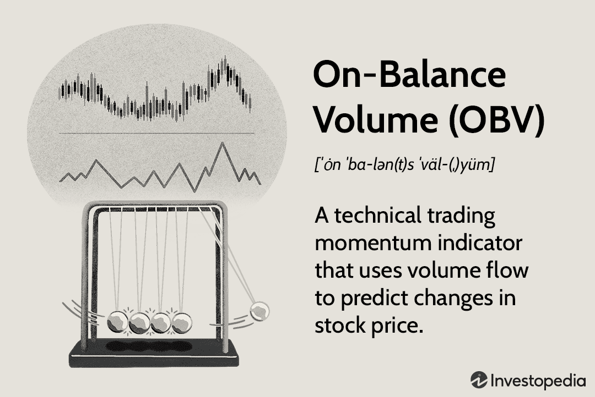

On-Balance Volume (OBV) is a significant momentum indicator utilized in technical analysis to assess buying and selling pressure within market trends. Developed by Joseph Granville in the 1960s, OBV is a pioneering concept that helps traders anticipate price movements by analyzing volume trends. The core idea behind OBV is that volume precedes price movement; thus, changes in trading volume can predict upcoming shifts in price trends. This predictive capability makes OBV a valuable tool for traders seeking to understand market dynamics and make informed decisions.

In the evolving landscape of trading, the advent of algorithmic trading has solidified OBV's role as a crucial component in developing sophisticated trading algorithms. Algorithmic trading involves the use of automated software to execute trades based on pre-defined strategies, and the integration of OBV into these systems can enhance their predictive accuracy. By analyzing OBV trends, algorithmic systems can better interpret market sentiment and adjust their trading strategies accordingly.



This article explores the importance of OBV in algorithmic trading and provides insights into how traders can utilize this momentum indicator to make more informed trading decisions. By understanding the principles and applications of OBV, traders can gain a strategic advantage in diverse market conditions, optimizing their approach to trading and potentially improving financial outcomes.

## Table of Contents

## Understanding On-Balance Volume (OBV)

On-Balance Volume (OBV) is an influential indicator in technical analysis that provides a cumulative total of trading volume, offering insights into changing buying and selling pressures. This tool operates by adding or subtracting the daily total trading volume, depending on whether the price closes higher or lower compared to the previous day. If the closing price is higher than the prior day's, the day's volume is added to the previous OBV total; conversely, if the closing price is lower, the volume is subtracted from the OBV total. The calculation can be represented mathematically as follows:

$$
OBV = 
\begin{cases} 
OBV_{prev} + Volume, & \text{if } Close > Close_{prev} \\
OBV_{prev} - Volume, & \text{if } Close < Close_{prev} \\
OBV_{prev}, & \text{if } Close = Close_{prev} 
\end{cases}
$$

This concept underlines the assumption that [volume](/wiki/volume-trading-strategy) precedes price movement, meaning changes in volume patterns can preempt price changes. An increase in volume is interpreted as an indication of potential upcoming price shifts, making OBV a valuable tool in forecasting price action. 

Traders frequently utilize OBV to detect possible trend reversals or confirmations by analyzing divergences between the OBV line and price movements. When price continues to rise, but OBV begins to fall, it suggests a divergence, hinting at a potential trend change. Similarly, when a stock price decreases but OBV rises, it suggests that the volume might be signaling a strengthening position against the current price trend, indicating a potential reversal.

Identifying these divergences is crucial for traders aiming to anticipate shifts in market trends. By observing OBV alongside price movements, traders gain insight into market sentiment, which can aid in making informed decisions about entering or exiting positions. As such, OBV serves as an essential component of any technical analyst’s toolkit, providing a volume-based perspective on market dynamics.

## Calculating and Interpreting OBV

The calculation of On-Balance Volume (OBV) is designed to be straightforward, utilizing the relationship between daily volume and closing price movements. To calculate OBV, one starts with an initial value, often zero. The day's volume is added to the OBV figure if the closing price is higher than the previous day's closing price. Conversely, if the closing price is lower, the day’s volume is subtracted from the OBV. If the closing price remains unchanged, the OBV remains the same. The formula can be articulated as follows:

$$

\text{OBV}_t = 
\begin{cases} 
\text{OBV}_{t-1} + V_t, & \text{if } \text{Close}_t > \text{Close}_{t-1} \\
\text{OBV}_{t-1} - V_t, & \text{if } \text{Close}_t < \text{Close}_{t-1} \\
\text{OBV}_{t-1}, & \text{if } \text{Close}_t = \text{Close}_{t-1}
\end{cases}
$$

Where $\text{OBV}_t$ is the OBV on day $t$, $\text{OBV}_{t-1}$ is the OBV on the previous day, and $V_t$ is the volume on day $t$.

Interpreting the OBV involves examining the trend of the OBV line in relation to the price trend. Analysts look for divergences or convergences between OBV and price movements to derive insights. An upward trend in OBV is generally considered indicative of increased buying pressure, suggesting that buyers are more aggressive than sellers, which can be a precursor to rising prices. This suggests accumulation, as traders are buying more aggressively. In contrast, a downward OBV trend signals selling pressure, indicating potential distribution or selling activity that may lead to a price decline.

The insight provided by OBV is particularly valuable when there is a divergence. For example, if prices are climbing but OBV is falling, it might indicate that the upward price trend lacks support from volume and may not be sustainable. This method of analysis helps traders identify potential reversals or affirm existing trends, making OBV a critical tool for technical analysis.

## OBV in Algorithmic Trading

Algo traders integrate On-Balance Volume (OBV) to enhance predictive accuracy in automated systems by utilizing its ability to reveal underlying market dynamics through volume trends. OBV's core premise hinges on the belief that volume precedes price movement, allowing algorithms to capitalize on shifts in market sentiment which may not be immediately evident through price action alone.

An essential function of OBV in [algorithmic trading](/wiki/algorithmic-trading) is its role in identifying changes in market sentiment, helping algorithms adjust their strategies accordingly. For instance, a rising OBV line suggests that buying pressure is accumulating, indicating potential bullish movements which algorithms can exploit by entering long positions. Conversely, a declining OBV line signals increasing selling pressure, which algorithms might interpret as a trigger to initiate short positions or [exit](/wiki/exit-strategy) long positions to mitigate losses.

The practical implementation of OBV in algorithmic trading systems often involves [backtesting](/wiki/backtesting), which helps optimize entry and exit points. Backtesting is the process of evaluating a trading strategy using historical data to ascertain its effectiveness before deploying it in live market conditions. In Python, traders can leverage libraries such as `pandas`, `numpy`, and `talib` to compute OBV and test its impact on historical data. A basic snippet for OBV calculation and backtesting in Python might look like this:

```python
import pandas as pd
import talib as ta

# Load historical market data into a DataFrame
df = pd.read_csv('historical_data.csv')

# Calculate OBV
df['OBV'] = ta.OBV(df['Close'], df['Volume'])

# Strategy: Generate signals
df['Signal'] = 0
df.loc[df['OBV'] > df['OBV'].shift(1), 'Signal'] = 1  # Buy signal
df.loc[df['OBV'] < df['OBV'].shift(1), 'Signal'] = -1 # Sell signal

# Backtesting
df['Strategy_Return'] = df['Signal'].shift(1) * df['Close'].pct_change()

# Evaluate performance
cumulative_return = (df['Strategy_Return'] + 1).cumprod()
print("Cumulative Strategy Return:", cumulative_return.iloc[-1])
```

This code snippet demonstrates a simplistic approach to generating buy and sell signals based on OBV trends and evaluating their performance through backtesting. By continuously refining such strategies with OBV, algorithmic traders can potentially identify optimal entry and exit points, maximizing returns while mitigating risks.

However, while OBV can provide significant insights, it is most effective when used in conjunction with other technical analysis tools. This multi-faceted approach helps traders gain a more comprehensive understanding of the market landscape, ensuring OBV’s limitations are addressed effectively.

## Advanced OBV Analysis

Advanced OBV analysis enhances the utility of the On-Balance Volume indicator by combining it with other technical indicators such as the Moving Average Convergence Divergence (MACD) and the Relative Strength Index (RSI). This approach provides traders with a more detailed picture of market dynamics and potential price shifts.

Pairing OBV with MACD allows traders to cross-verify the [momentum](/wiki/momentum) and strength of a trend. The MACD, calculated by subtracting the 26-period exponential moving average (EMA) from the 12-period EMA, when combined with OBV, can confirm bullish or bearish divergences. For instance, if the OBV shows an upward trend while the MACD indicates upwards momentum, it reinforces a potential bullish trend continuation. Conversely, when OBV trends downward but the MACD starts showing signs of upward momentum, it could signal a possible reversal.

$$
\text{MACD} = \text{EMA}_{12} - \text{EMA}_{26}
$$

The integration of OBV with the RSI, a momentum oscillator that measures the speed and change of price movements, can also be highly beneficial. RSI levels above 70 typically indicate that a market is overbought, while levels below 30 suggest it is oversold. When OBV trends diverge from the RSI, it can signal a potential upcoming reversal. For example, an overbought RSI combined with a declining OBV might predict a bearish reversal, providing traders with an opportunity to adjust their positions.

OBV [breakout](/wiki/breakout-trading) and breakdown analysis further aids in formulating market entry and exit strategies. Breakouts occur when OBV moves above a defined resistance level, signaling increased buying pressure and a potential rise in price. Breakdowns, in contrast, happen when OBV falls below a support level, indicating increasing selling pressure and possibly a decline in price. In volatile markets, recognizing these breakouts and breakdowns is crucial, as they provide early signals ahead of significant price movements.

By combining OBV with other technical indicators, traders can affirm potential market reversals and refine their trading strategies to respond proactively to market signals.

## Case Studies and Examples

On-Balance Volume (OBV) has proven its utility in predicting price movements during various significant market events. This capability can be illustrated through case studies where OBV has provided early signals of market direction, particularly when traditional indicators may lag.

One notable case involved the financial crisis of 2008, where OBV provided early warning signals before major price declines occurred in equity markets. As institutional investors began to offload large volumes of stock, OBV showed a noticeable decline, indicating selling pressure that precedes price drops. This pattern allowed traders utilizing OBV to reposition their portfolios ahead of the downturn.

Similarly, OBV has been applied effectively in the context of stock market rallies. For instance, in the recovery phase following the COVID-19 market crash in March 2020, OBV indicated increasing buying pressure as institutional investors re-entered the market, providing a precursor to the subsequent price rise. Traders who monitored these OBV changes could capitalize on the upward momentum present in many equity sectors.

OBV can also be instrumental in historical data analysis to uncover patterns for predicting future trends. In commodity markets, for example, OBV trends can reveal buying or selling activities that may not yet be reflected in the price, giving traders the opportunity to act on potential reversals or continuations. The tool's capacity to capture volume trends is invaluable for recognizing accumulation or distribution phases, which often precede significant price shifts.

Institutional activities heavily influence OBV movements. For instance, during periods when hedge funds or mutual funds are rebalancing portfolios or engaging in window dressing, OBV can show substantial movements reflecting these large-volume trades. Traders who understand these institutional-driven OBV movements can gain a strategic advantage by aligning their strategies with these forces and anticipating subsequent price actions.

In conclusion, OBV's application to real-world market events highlights its role as a reliable indicator for anticipating price movements. By analyzing historical data and focusing on institutional activity composites within OBV trends, traders can enhance their market forecasts and trading strategies.

## Limitations and Considerations

On-Balance Volume (OBV), while a valuable tool in technical analysis, should not be used in isolation. One primary limitation of OBV is its potential to produce false signals during periods of market consolidation. In such phases, price and volume movements tend to be sideways, leading to OBV fluctuations without significant directional trends. This can cause traders to misinterpret signals as bullish or bearish when the market lacks a clear direction.

To mitigate these limitations, it is essential to combine OBV with other analysis tools and consider broader market contexts. Technical indicators such as the Moving Average Convergence Divergence (MACD) or the Relative Strength Index (RSI) can complement OBV by providing additional momentum insights. For instance, when both OBV and MACD signal an impending trend, the likelihood of accurate prediction increases, reducing the reliance on OBV alone.

Another crucial consideration is OBV's limitations in predicting rapid market changes, particularly those that occur without significant volume shifts. Sudden news events or geopolitical developments can cause price movements that may not initially reflect in volume changes. As a result, OBV might lag in capturing these swift market dynamics, potentially leading to missed opportunities or misinterpretations.

Traders must remain cognizant of OBV's limitations and continuously evaluate it alongside other indicators and market factors. By acknowledging these constraints, traders can develop more robust trading strategies that optimize OBV analysis within algorithmic frameworks.

## Conclusion

On-Balance Volume (OBV) remains a crucial tool for technical analysts, providing valuable insights into market momentum and potential price movements. By analyzing cumulative volume patterns, OBV helps to anticipate shifts in buying and selling pressures, thereby offering a precursor to price changes. Its application is particularly significant in the development of algorithmic trading strategies, where precise market predictions are vital. By integrating OBV into algorithms, traders can enhance predictive accuracy, thus refining their entry and exit strategies.

The adaptability of OBV in various trading scenarios highlights its potential for expansion in diverse market conditions. While its effectiveness is evident, traders should remain diligent, continually exploring new applications and synergizing OBV with other analytical tools for comprehensive market analysis. Such explorations not only bolster predictive reliability but also ensure robust trading strategies adaptable to evolving market dynamics. As traders cultivate a deeper understanding of OBV, they can leverage its full potential for optimal trading outcomes.

## References & Further Reading

[1]: Granville, J. E. (1963). ["New Key to Stock Market Profits"](https://archive.org/details/newkeytostockmar0000gran). Prentice Hall Press.

[2]: Jansen, S. (2020). ["Machine Learning for Algorithmic Trading"](https://github.com/stefan-jansen/machine-learning-for-trading). Packt Publishing.

[3]: Lopez de Prado, M. (2018). ["Advances in Financial Machine Learning"](https://books.google.com/books/about/Advances_in_Financial_Machine_Learning.html?id=oU9KDwAAQBAJ). Wiley.

[4]: Aronson, D. R. (2007). ["Evidence-Based Technical Analysis: Applying the Scientific Method and Statistical Inference to Trading Signals"](https://www.amazon.com/Evidence-Based-Technical-Analysis-Scientific-Statistical/dp/0470008741). Wiley.

[5]: Chan, E. P. (2008). ["Quantitative Trading: How to Build Your Own Algorithmic Trading Business"](https://github.com/ftvision/quant_trading_echan_book). Wiley.